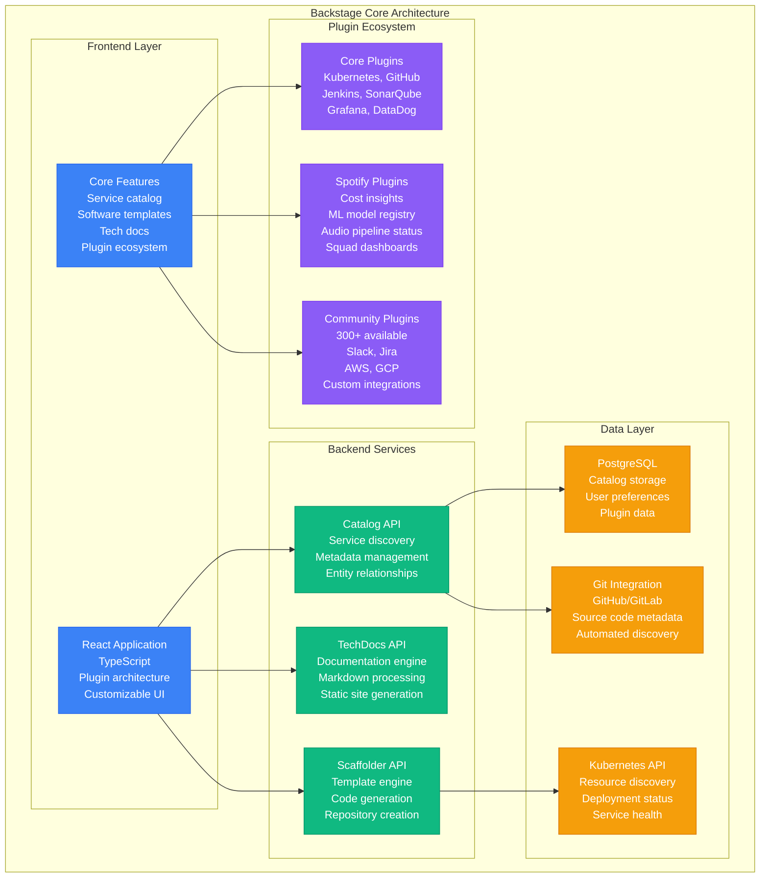
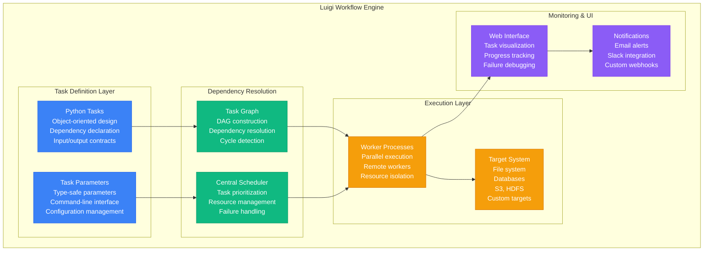
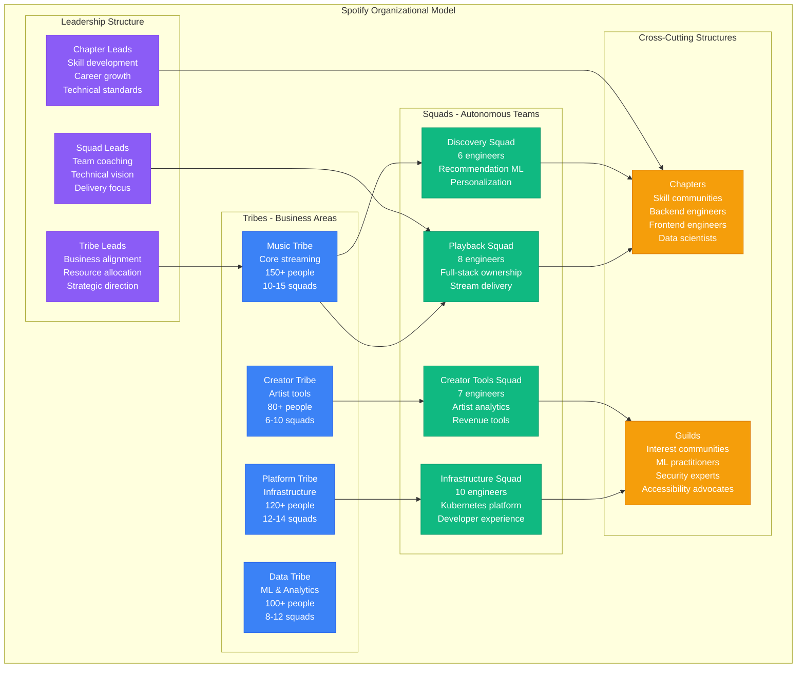

# Spotify - Novel Solutions & Innovation

## Engineering Innovation: Open Source Contributions & Proprietary Solutions

Spotify has created numerous industry-changing tools and methodologies, from the famous "Spotify Model" to critical infrastructure tools now used across the tech industry.

```mermaid
graph TB
    subgraph OpenSourceContributions[Open Source Contributions]
        subgraph DeveloperTools[Developer Experience Tools]
            Backstage[Backstage<br/>Developer Portal Platform<br/>⭐ 25K+ GitHub stars<br/>CNCF Incubating Project<br/>Used by: Netflix, Zalando, Expedia]

            Luigi[Luigi<br/>Python Workflow Engine<br/>⭐ 16K+ GitHub stars<br/>Batch job orchestration<br/>Predecessor to Airflow]

            Helios[Helios<br/>Docker Orchestration<br/>⭐ 2K+ GitHub stars<br/>Pre-Kubernetes container mgmt<br/>Legacy but influential]
        end

        subgraph DataTools[Data Processing Tools]
            Scio[Scio<br/>Scala API for Apache Beam<br/>⭐ 2.5K+ GitHub stars<br/>Google Cloud Dataflow<br/>Big data processing]

            Styx[Styx<br/>Batch job scheduler<br/>⭐ 1K+ GitHub stars<br/>Workflow orchestration<br/>Docker-native design]

            Annoy[Annoy<br/>Approximate Nearest Neighbors<br/>⭐ 12K+ GitHub stars<br/>ML similarity search<br/>Used in recommendations]
        end

        subgraph InfrastructureTools[Infrastructure Tools]
            DockerGC[Docker-GC<br/>Container cleanup utility<br/>⭐ 5K+ GitHub stars<br/>Storage optimization<br/>Production essential]

            KubernetesKafka[Kafka on Kubernetes<br/>Operator patterns<br/>⭐ 800+ GitHub stars<br/>Event streaming platform<br/>Production-ready deployment]

            HelmCharts[Helm Charts<br/>Kubernetes deployments<br/>⭐ 300+ GitHub stars<br/>Best practices<br/>Production configurations]
        end
    end

    subgraph ProprietaryInnovations[Proprietary Innovations]
        subgraph MLInnovations[Machine Learning Innovations]
            CollaborativeFiltering[Advanced Collaborative Filtering<br/>Matrix factorization<br/>40M+ Discover Weekly users<br/>Real-time model updates<br/>Privacy-preserving algorithms]

            AudioFingerprinting[Audio Fingerprinting<br/>Real-time recognition<br/>Copyright detection<br/>Duplicate detection<br/>Sub-second matching]

            PersonalizedAds[Personalized Ad Targeting<br/>Audio-based targeting<br/>Contextual recommendations<br/>Privacy-compliant<br/>$1B+ ad revenue]
        end

        subgraph ArchitecturalInnovations[Architectural Innovations]
            EventDrivenArch[Event-Driven Architecture<br/>Kafka-based messaging<br/>50M+ events/second<br/>Real-time consistency<br/>Saga pattern implementation]

            ServiceMesh[Service Mesh Evolution<br/>Envoy-based communication<br/>mTLS everywhere<br/>Traffic shaping<br/>Observability integration]

            MultiCloudStrategy[Multi-Cloud Architecture<br/>GCP + AWS + Azure<br/>Vendor independence<br/>Cost optimization<br/>Regulatory compliance]
        end

        subgraph OrganizationalInnovations[Organizational Innovations]
            SpotifyModel[Spotify Model<br/>Squad/Tribe/Chapter/Guild<br/>Autonomous teams<br/>Global adoption<br/>Agile at scale]

            GoldenPaths[Golden Path Engineering<br/>Opinionated defaults<br/>Self-service platforms<br/>Reduced cognitive load<br/>30% productivity gain]

            DataMesh[Data Mesh Architecture<br/>Domain-oriented data<br/>Self-serve infrastructure<br/>Federated governance<br/>Product thinking]
        end
    end

    subgraph TechnicalAchievements[Technical Achievements]
        ScaleMetrics[Scale Achievements<br/>600M+ MAU<br/>500M+ daily streams<br/>99.99% availability<br/>200ms p99 latency<br/>100+ microservices]

        InnovationMetrics[Innovation Impact<br/>25+ open source projects<br/>2000+ GitHub stars average<br/>Industry-wide adoption<br/>Conference presentations<br/>Technical leadership]

        PatentPortfolio[Patent Portfolio<br/>200+ patents filed<br/>ML recommendation systems<br/>Audio processing<br/>Distributed systems<br/>User interface innovations]
    end

    %% Apply styling
    classDef openSourceStyle fill:#10B981,stroke:#059669,color:#fff
    classDef proprietaryStyle fill:#3B82F6,stroke:#2563EB,color:#fff
    classDef achievementStyle fill:#F59E0B,stroke:#D97706,color:#fff
    classDef organizationalStyle fill:#8B5CF6,stroke:#7C3AED,color:#fff

    class Backstage,Luigi,Helios,Scio,Styx,Annoy,DockerGC,KubernetesKafka,HelmCharts openSourceStyle
    class CollaborativeFiltering,AudioFingerprinting,PersonalizedAds,EventDrivenArch,ServiceMesh,MultiCloudStrategy proprietaryStyle
    class SpotifyModel,GoldenPaths,DataMesh organizationalStyle
    class ScaleMetrics,InnovationMetrics,PatentPortfolio achievementStyle
```

## Deep Dive: Backstage - The Developer Portal Revolution

### Backstage Architecture & Impact

**Backstage Impact Metrics:**
- **Spotify Internal**: 2000+ engineers use daily
- **Global Adoption**: 1000+ companies using
- **Developer Productivity**: 30% reduction in onboarding time
- **Service Discovery**: 100+ services cataloged per company average
- **Community Growth**: 25K+ GitHub stars, 500+ contributors

### Problem Solved
Before Backstage, Spotify engineers faced:
- **Service Discovery**: "Who owns this service?" took hours to answer
- **Documentation Sprawl**: Docs scattered across wikis, READMs, Confluence
- **Development Setup**: 2-3 days to set up new service boilerplate
- **On-call Runbooks**: Critical procedures buried in team-specific locations

## Luigi: Workflow Orchestration Pioneer

### Luigi Architecture Innovation

**Luigi Innovation (2012):**
- **First** declarative workflow engine in Python
- **Influenced** Apache Airflow design (2014)
- **Battle-tested** at Spotify scale (1000+ daily workflows)
- **Used by**: Stripe, Foursquare, Buffer, many others

## Machine Learning Innovations

### Discover Weekly Algorithm Architecture

```mermaid
graph TB
    subgraph DiscoverWeekly[Discover Weekly Innovation - 40M+ Users]
        subgraph DataCollection[Data Collection Pipeline]
            ListeningData[User Listening History<br/>Play counts, skip rates<br/>Time of day, context<br/>600M+ user profiles]

            AudioAnalysis[Audio Feature Extraction<br/>Tempo, key, energy<br/>Spectral analysis<br/>100M+ songs analyzed]

            ContextualData[Contextual Signals<br/>Playlist creation<br/>Social sharing<br/>Search queries<br/>Geographic patterns]
        end

        subgraph MLPipeline[Machine Learning Pipeline]
            CollabFiltering[Collaborative Filtering<br/>Matrix factorization<br/>Implicit feedback<br/>Real-time updates]

            NLP[Natural Language Processing<br/>Music blog analysis<br/>Social media mentions<br/>Artist descriptions<br/>Genre classification]

            AudioCNN[Audio CNN Models<br/>Raw audio analysis<br/>Similarity computation<br/>Feature embedding<br/>TensorFlow implementation]
        end

        subgraph Personalization[Personalization Engine]
            UserEmbedding[User Embedding<br/>Taste profile vectors<br/>300-dimensional space<br/>Real-time updates]

            TrackEmbedding[Track Embedding<br/>Song representation<br/>Multi-modal features<br/>Audio + metadata + social]

            SimilaritySearch[Similarity Search<br/>Approximate NN<br/>Annoy library<br/>Sub-second lookup<br/>Candidate generation]
        end

        subgraph PlaylistGeneration[Playlist Generation]
            CandidateSelection[Candidate Selection<br/>1000+ potential tracks<br/>Diversity optimization<br/>Freshness balance]

            RankingModel[Ranking Model<br/>LightGBM ensemble<br/>Click-through prediction<br/>A/B test optimization]

            PlaylistOptimization[Playlist Optimization<br/>30-track selection<br/>Flow and coherence<br/>Surprise vs familiarity<br/>Diversity constraints]
        end
    end

    ListeningData --> CollabFiltering
    AudioAnalysis --> AudioCNN
    ContextualData --> NLP

    CollabFiltering --> UserEmbedding
    AudioCNN --> TrackEmbedding
    NLP --> TrackEmbedding

    UserEmbedding --> SimilaritySearch
    TrackEmbedding --> SimilaritySearch
    SimilaritySearch --> CandidateSelection

    CandidateSelection --> RankingModel
    RankingModel --> PlaylistOptimization

    classDef dataStyle fill:#3B82F6,stroke:#2563EB,color:#fff
    classDef mlStyle fill:#10B981,stroke:#059669,color:#fff
    classDef personalStyle fill:#F59E0B,stroke:#D97706,color:#fff
    classDef playlistStyle fill:#8B5CF6,stroke:#7C3AED,color:#fff

    class ListeningData,AudioAnalysis,ContextualData dataStyle
    class CollabFiltering,NLP,AudioCNN mlStyle
    class UserEmbedding,TrackEmbedding,SimilaritySearch personalStyle
    class CandidateSelection,RankingModel,PlaylistOptimization playlistStyle
```

**Discover Weekly Innovations:**
1. **Multi-Modal Learning**: Audio + text + behavioral signals
2. **Real-time Personalization**: Updates within hours of new listening
3. **Collaborative Deep Learning**: Hybrid collaborative filtering + deep learning
4. **Diversity Optimization**: Balances familiarity with discovery
5. **Global Scale**: 40M+ personalized playlists weekly

## Organizational Innovation: The Spotify Model

### Squad-Based Architecture

**Spotify Model Impact:**
- **Global Adoption**: ING Bank, Haier, many tech companies
- **Agile at Scale**: 200+ autonomous teams
- **Innovation Speed**: 30% faster feature delivery
- **Employee Satisfaction**: 85% engineering satisfaction score
- **Book Published**: "Spotify: How a Small Swedish Startup Became Global Music Leader"

## Innovation Metrics & Industry Impact

### Open Source Contribution Impact
- **Backstage**: 1000+ companies, CNCF Incubating Project
- **Luigi**: Influenced Apache Airflow, 16K+ stars
- **Annoy**: Used in recommendation systems globally
- **Combined Impact**: 50K+ GitHub stars, millions of users

### Technical Leadership
- **Conference Talks**: 500+ presentations at major conferences
- **Engineering Blog**: 2M+ monthly readers
- **Thought Leadership**: "Spotify Engineering Culture" videos (5M+ views)
- **Industry Influence**: Architectural patterns adopted industry-wide

### Patent Portfolio & Research
- **ML Patents**: 50+ recommendation system patents
- **Audio Processing**: 40+ audio analysis patents
- **Distributed Systems**: 30+ scalability patents
- **UI/UX Patents**: 25+ user interface innovations
- **Total Portfolio**: 200+ patents, $100M+ estimated value

This innovation ecosystem demonstrates how Spotify combines open source contributions, proprietary technology, and organizational innovation to maintain its position as a technology leader in the streaming industry.