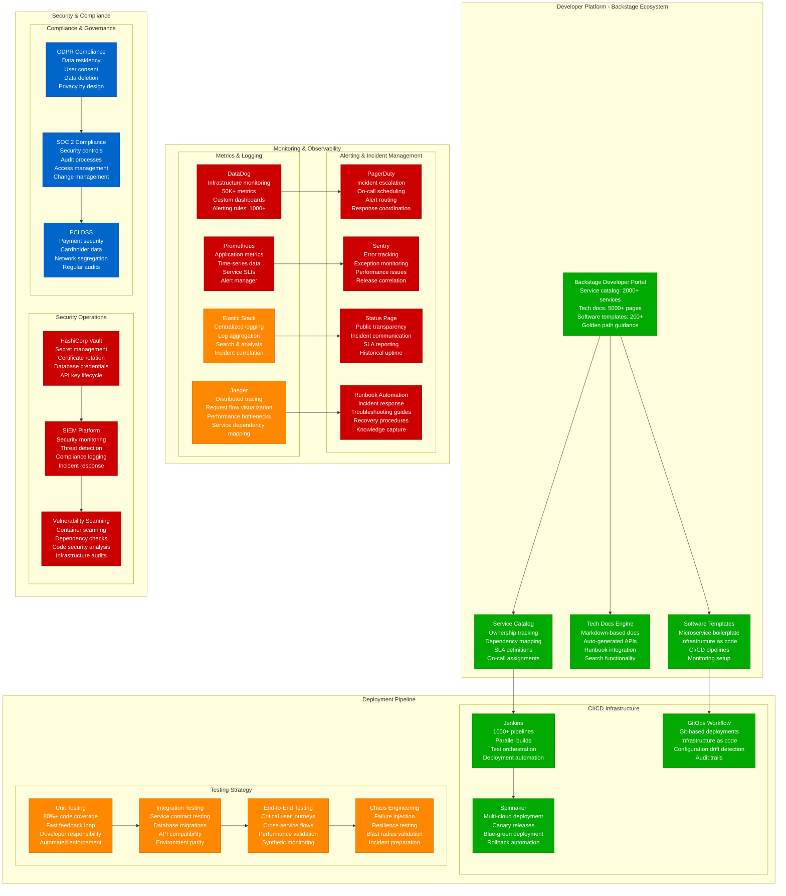
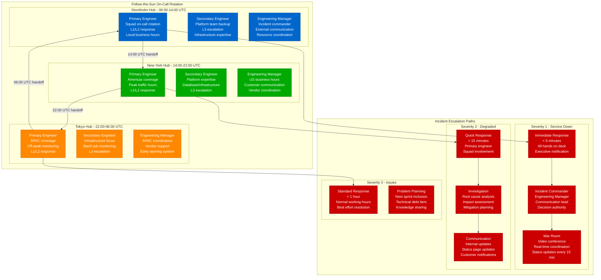
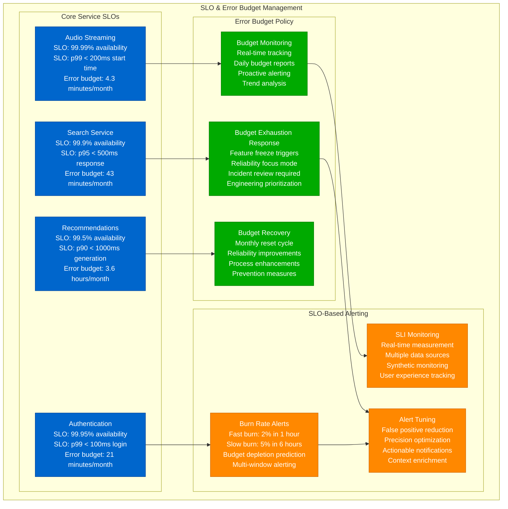
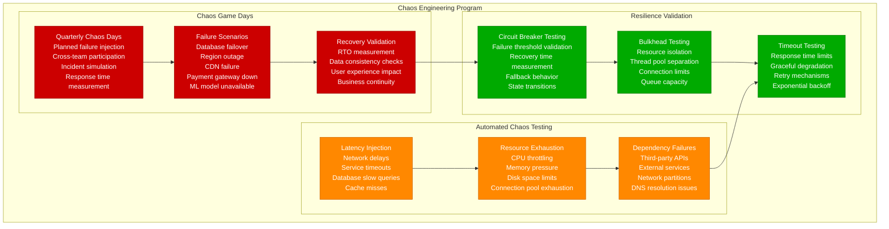

# Spotify - Production Operations

## Engineering Excellence: Operating 600M+ User Platform 24/7

Spotify's production operations demonstrate world-class practices for managing one of the largest streaming platforms, with 99.99% availability and sub-200ms global response times.

## Deployment Strategy & Release Management

### Progressive Deployment Pipeline

```mermaid
graph TB
    subgraph ProgressiveDeployment[Progressive Deployment Strategy]
        subgraph Development[Development Stage]
            DevCommit[Developer Commit<br/>Git push triggers<br/>Feature branch<br/>PR creation]

            BuildTest[Build & Test<br/>Unit tests: <5 min<br/>Integration tests: <15 min<br/>Security scans<br/>Quality gates]

            CodeReview[Code Review<br/>Peer review required<br/>Security review for sensitive changes<br/>Architecture review for major changes<br/>Automated checks]
        end

        subgraph Staging[Staging Environment]
            StagingDeploy[Staging Deployment<br/>Production-like environment<br/>Full integration testing<br/>Performance validation<br/>User acceptance testing]

            AutomatedTesting[Automated Testing<br/>E2E test suite<br/>Performance tests<br/>Security tests<br/>API contract validation]

            ManualValidation[Manual Validation<br/>QA testing<br/>Product owner approval<br/>Security team sign-off<br/>Release criteria check]
        end

        subgraph ProductionDeployment[Production Deployment]
            CanaryRelease[Canary Release<br/>5% traffic routing<br/>10-minute observation<br/>Automated rollback<br/>Health metrics monitoring]

            BlueGreenDeploy[Blue-Green Deployment<br/>Zero-downtime deployment<br/>Full environment switch<br/>Instant rollback capability<br/>Database migration handling]

            FullRollout[Full Rollout<br/>100% traffic migration<br/>Performance monitoring<br/>Error rate tracking<br/>User experience metrics]
        end

        subgraph PostDeploy[Post-Deployment]
            HealthChecks[Health Checks<br/>Automated validation<br/>Smoke tests<br/>Critical path verification<br/>SLI monitoring]

            RollbackProcedure[Rollback Procedure<br/>Automated triggers<br/>Error rate thresholds<br/>Performance degradation<br/>Manual override capability]

            IncidentResponse[Incident Response<br/>Automated alerting<br/>On-call escalation<br/>War room procedures<br/>Post-incident review]
        end
    end

    DevCommit --> BuildTest
    BuildTest --> CodeReview
    CodeReview --> StagingDeploy

    StagingDeploy --> AutomatedTesting
    AutomatedTesting --> ManualValidation
    ManualValidation --> CanaryRelease

    CanaryRelease --> BlueGreenDeploy
    BlueGreenDeploy --> FullRollout
    FullRollout --> HealthChecks

    HealthChecks --> RollbackProcedure
    RollbackProcedure --> IncidentResponse

    %% Rollback paths
    CanaryRelease -.->|Issues detected| RollbackProcedure
    BlueGreenDeploy -.->|Performance issues| RollbackProcedure
    FullRollout -.->|Critical errors| IncidentResponse

    classDef devStyle fill:#0066CC,stroke:#004499,color:#fff
    classDef stagingStyle fill:#00AA00,stroke:#007700,color:#fff
    classDef prodStyle fill:#FF8800,stroke:#CC6600,color:#fff
    classDef postStyle fill:#CC0000,stroke:#990000,color:#fff

    class DevCommit,BuildTest,CodeReview devStyle
    class StagingDeploy,AutomatedTesting,ManualValidation stagingStyle
    class CanaryRelease,BlueGreenDeploy,FullRollout prodStyle
    class HealthChecks,RollbackProcedure,IncidentResponse postStyle
```

## On-Call & Incident Response

### Follow-the-Sun Support Model

## Service Level Management

### SLO & Error Budget Management

## Chaos Engineering & Resilience Testing

### Production Resilience Validation

## Production Operations Metrics

### Operational Excellence KPIs
- **Deployment Frequency**: 1000+ deploys/day across all services
- **Lead Time**: 4 hours from commit to production (median)
- **MTTR**: 15 minutes for service degradation, 45 minutes for outages
- **Change Failure Rate**: <1% of deployments require rollback
- **Availability**: 99.99% for core streaming services
- **On-call Load**: <2 pages per engineer per week average

### Developer Productivity Metrics
- **Service Onboarding**: <2 hours from template to deployed service
- **Documentation Coverage**: 95% of services have runbooks
- **Incident Response**: 100% of incidents have post-mortems
- **Knowledge Sharing**: 95% of critical procedures documented
- **Team Satisfaction**: 85% engineering satisfaction score

This production operations framework enables Spotify to maintain world-class reliability while supporting rapid innovation and scaling to serve 600M+ users globally.