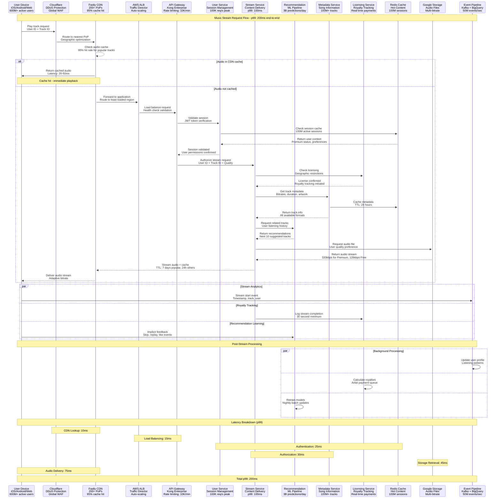
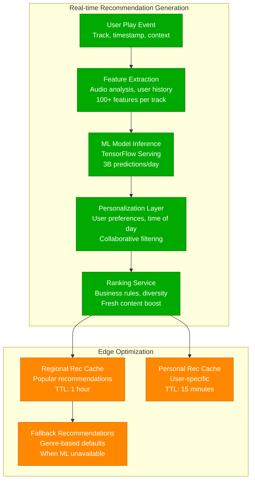

# Spotify - Request Flow Architecture

## The Golden Path: From User Tap to Audio Stream in <200ms

This diagram shows how Spotify delivers music with sub-200ms latency to 600M+ users while generating real-time recommendations and tracking royalties.

## Stream Request Performance Metrics

### Response Time Breakdown (99th Percentile)
- **CDN Cache Hit**: 20-50ms (95% of requests)
- **Authentication**: 25ms (JWT validation + session lookup)
- **Authorization**: 30ms (licensing + geographic checks)
- **Metadata Retrieval**: 15ms (cached metadata lookup)
- **Audio File Access**: 45ms (Google Cloud Storage)
- **Total End-to-End**: <200ms (p99 SLA)

### Request Volume & Scale
- **Peak Concurrent Streams**: 100M+ users
- **Daily Stream Requests**: 500M+ globally
- **API Gateway Throughput**: 100K requests/second
- **Cache Hit Rates**: 95% (audio), 99% (metadata)
- **Geographic Distribution**: 180+ markets

## Recommendation Flow Deep-Dive

## Critical Performance Optimizations

### CDN Strategy
- **Popular Content Pre-positioning**: Top 1% tracks cached globally
- **Regional Popularity Caching**: Local hits cached regionally
- **User Pattern Prediction**: Cache based on user listening patterns
- **Adaptive Bitrate**: Stream quality adjusts to connection speed

### Session Management
- **Persistent Connections**: WebSocket for real-time updates
- **Session Stickiness**: Route users to same backend region
- **Graceful Degradation**: Offline mode with downloaded content
- **Background Prefetch**: Next 3 tracks pre-loaded

### Quality of Service
- **Premium User Priority**: Dedicated processing lanes
- **Peak Hour Scaling**: Auto-scale during evening hours (6-10 PM)
- **Regional Failover**: Automatic region switching on failures
- **Circuit Breakers**: Fail fast on downstream service issues

This request flow architecture ensures Spotify can deliver instant music streaming to hundreds of millions of users while maintaining real-time recommendations and accurate royalty tracking.