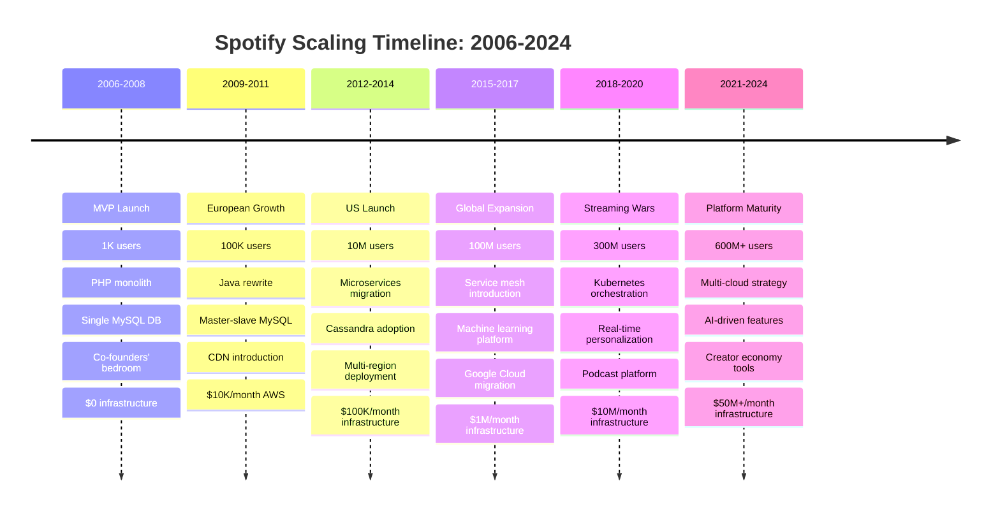
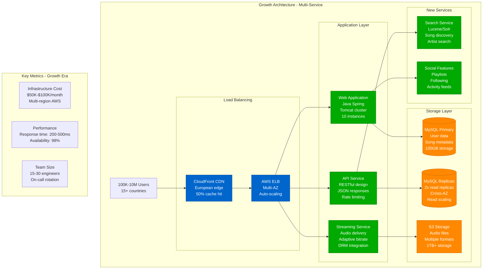
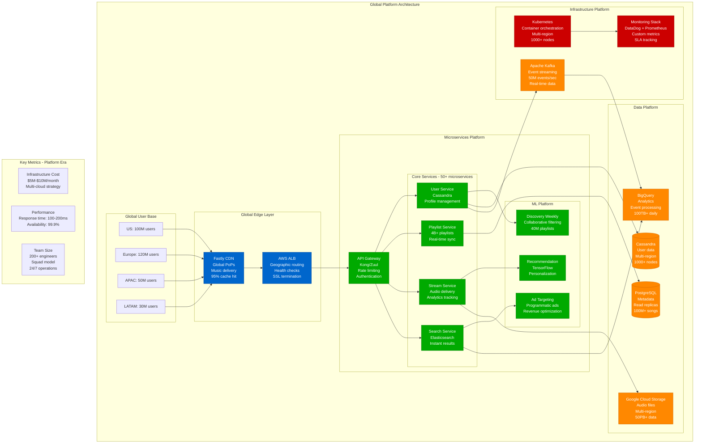
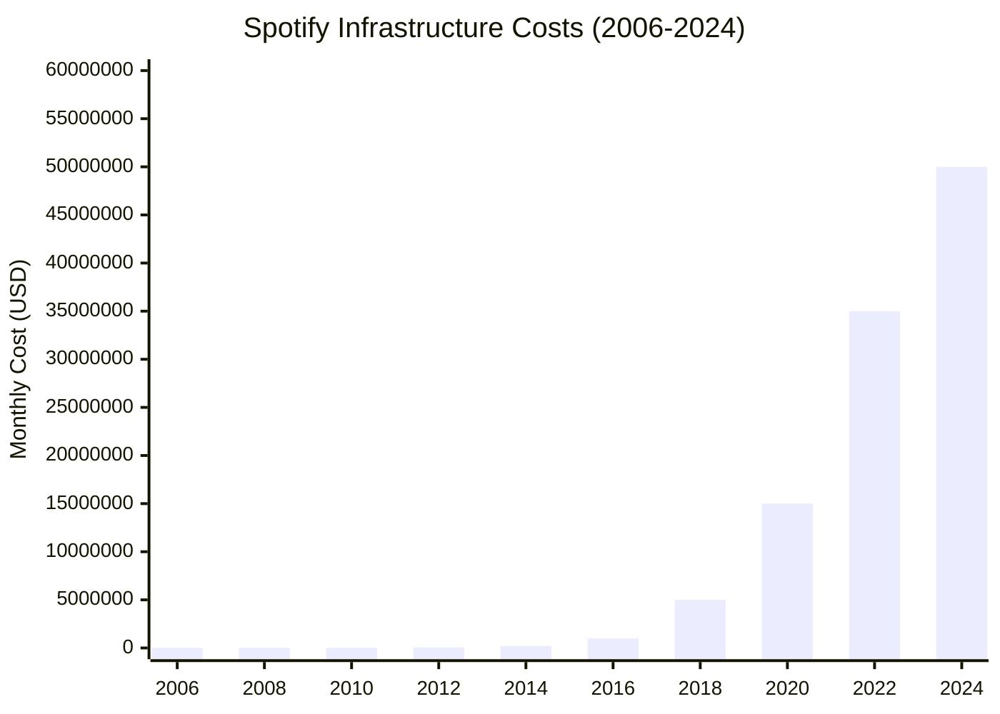
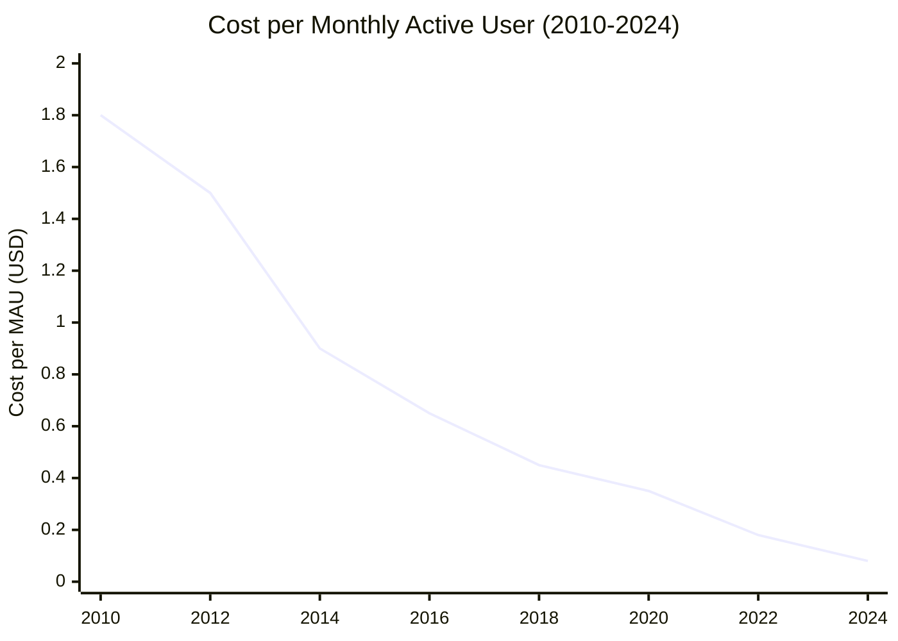

# Spotify - Scale Evolution Journey

## From Swedish Startup to Global Platform: 15-Year Scaling Story

Spotify's journey from 2006 startup to serving 600M+ users reveals critical scaling decisions, architectural evolution, and the costs of massive growth.



## Architecture Evolution by Scale

### Era 1: Startup (2006-2011) - 1K to 100K Users

```mermaid
graph TB
    subgraph StartupArch[Startup Architecture - Single Region]
        Users[1K-100K Users<br/>Sweden + UK]
        LB[Load Balancer<br/>HAProxy<br/>Single instance]
        App[PHP Application<br/>Monolithic codebase<br/>Single server<br/>Manual deployments]
        DB[(MySQL Database<br/>Single instance<br/>No replication<br/>10GB storage)]
        Files[Audio Files<br/>Local storage<br/>Single server<br/>No CDN)]
    end

    Users --> LB
    LB --> App
    App --> DB
    App --> Files

    %% Costs and Metrics
    subgraph Metrics1[Key Metrics - Startup Era]
        Cost1[Infrastructure Cost<br/>$500-$10K/month<br/>Single AWS region]
        Perf1[Performance<br/>Response time: 1-5s<br/>Availability: 95%]
        Team1[Team Size<br/>2-5 engineers<br/>Everyone on-call]
    end

    classDef serviceStyle fill:#00AA00,stroke:#007700,color:#fff
    classDef stateStyle fill:#FF8800,stroke:#CC6600,color:#fff

    class LB,App serviceStyle
    class DB,Files stateStyle
```

**What Broke**: Database connection limits (100 concurrent users), single point of failure, no geographic distribution.

**How They Fixed It**: Added MySQL read replicas, introduced CDN (Amazon CloudFront), horizontal scaling with multiple app servers.

---

### Era 2: European Growth (2012-2014) - 100K to 10M Users



**What Broke**: MySQL became bottleneck at 1M users, monolithic deployments blocked feature velocity, European data residency requirements.

**How They Fixed It**: Introduced service-oriented architecture, migrated to Cassandra for user data, implemented caching layers (Memcached).

---

### Era 3: Global Platform (2015-2020) - 10M to 300M Users



**What Broke**: Service dependency hell, cross-service latency, data consistency across microservices, deployment complexity.

**How They Fixed It**: Introduced Backstage platform, implemented service mesh (Envoy), adopted event-driven architecture, built internal developer platform.

---

### Era 4: Current Scale (2021-2024) - 300M to 600M+ Users

```mermaid
graph TB
    subgraph CurrentArch[Current Architecture - 600M+ Users]
        subgraph GlobalEdge[Global Edge Infrastructure]
            MultiCDN[Multi-CDN Strategy<br/>Fastly + CloudFlare<br/>200+ PoPs worldwide<br/>Audio: 50TB/day]
            EdgeCompute[Edge Computing<br/>Personalization at edge<br/>Sub-100ms responses<br/>Regional compliance]
        end

        subgraph ServicePlatform[Service Platform - 100+ Services]
            Backstage[Backstage Platform<br/>Developer portal<br/>Golden paths<br/>Service catalog]

            subgraph Squads[Squad Architecture - 200+ Squads]
                CoreSquads[Core Squads<br/>User, Playlist, Stream<br/>Platform reliability]
                MLSquads[ML Squads<br/>Recommendation, Discovery<br/>Personalization AI]
                ContentSquads[Content Squads<br/>Podcasts, Audiobooks<br/>Creator tools]
                InfraSquads[Infra Squads<br/>Platform engineering<br/>Developer experience]
            end

            ServiceMesh2[Service Mesh<br/>Envoy/Istio<br/>mTLS encryption<br/>Traffic management]
        end

        subgraph DataMesh[Data Mesh Architecture]
            StreamingData[Streaming Data<br/>Apache Kafka<br/>Event-driven arch<br/>Real-time processing]

            subgraph DataDomains[Data Domains]
                UserDomain[User Data Domain<br/>Cassandra clusters<br/>GDPR compliance<br/>600M+ profiles]
                ContentDomain[Content Domain<br/>Multi-cloud storage<br/>100M+ songs<br/>Rights management]
                AnalyticsDomain[Analytics Domain<br/>Real-time + batch<br/>ML training data<br/>Business intelligence]
            end
        end

        subgraph AIPlatform[AI/ML Platform]
            FeatureStore[Feature Store<br/>ML feature management<br/>Real-time serving<br/>Model training]
            ModelServing[Model Serving<br/>TensorFlow Serving<br/>A/B testing<br/>Canary deployments]
            AutoML[AutoML Platform<br/>Automated model training<br/>Hyperparameter tuning<br/>Model lifecycle]
        end

        subgraph MultiCloud[Multi-Cloud Infrastructure]
            GCP[Google Cloud<br/>Primary compute<br/>BigQuery analytics<br/>ML training]
            AWS[Amazon Web Services<br/>Content storage<br/>Global regions<br/>Edge locations]
            Azure[Microsoft Azure<br/>Backup systems<br/>Compliance regions<br/>Disaster recovery]
        end
    end

    %% Current Scale Metrics
    subgraph CurrentMetrics[Current Scale Metrics (2024)]
        Users[600M+ Monthly Active Users<br/>236M Premium subscribers<br/>100M+ Peak concurrent<br/>180+ countries]

        Performance[Performance SLAs<br/>p99 stream start: 200ms<br/>99.99% availability<br/>50PB+ content served]

        Infrastructure[Infrastructure Scale<br/>$50M+/month costs<br/>1000+ microservices<br/>Multi-cloud strategy]

        Team[Engineering Organization<br/>2000+ engineers<br/>200+ autonomous squads<br/>Platform engineering focus]
    end

    classDef edgeStyle fill:#0066CC,stroke:#004499,color:#fff
    classDef serviceStyle fill:#00AA00,stroke:#007700,color:#fff
    classDef stateStyle fill:#FF8800,stroke:#CC6600,color:#fff
    classDef controlStyle fill:#CC0000,stroke:#990000,color:#fff

    class MultiCDN,EdgeCompute edgeStyle
    class Backstage,CoreSquads,MLSquads,ContentSquads,InfraSquads,ServiceMesh2,FeatureStore,ModelServing,AutoML serviceStyle
    class StreamingData,UserDomain,ContentDomain,AnalyticsDomain stateStyle
    class GCP,AWS,Azure controlStyle
```

## Cost Evolution Analysis

### Infrastructure Cost Growth


### Cost per User Optimization


## Critical Scaling Decisions

### Technology Migration Timeline
1. **2008**: PHP → Java (performance, maintainability)
2. **2011**: MySQL → Cassandra (scale, availability)
3. **2014**: Monolith → Microservices (team velocity)
4. **2016**: Owned DCs → Google Cloud (operational overhead)
5. **2018**: Custom platform → Kubernetes (standardization)
6. **2020**: Single cloud → Multi-cloud (vendor independence)
7. **2022**: Request-response → Event-driven (real-time features)

### Organizational Evolution
- **2006-2010**: Startup team (5 engineers)
- **2011-2014**: Feature teams (50 engineers)
- **2015-2018**: Product squads (200 engineers)
- **2019-2021**: Tribal structure (800 engineers)
- **2022-2024**: Platform engineering (2000+ engineers)

## Lessons Learned

### What Worked
1. **Microservices Architecture**: Enabled independent scaling and deployment
2. **Event-Driven Design**: Reduced coupling, improved real-time capabilities
3. **Platform Engineering**: Backstage reduced developer cognitive load
4. **Multi-Cloud Strategy**: Avoided vendor lock-in, improved reliability
5. **Squad Model**: Autonomous teams improved velocity and ownership

### What Didn't Work
1. **Premature Microservices**: Too much complexity too early (2012-2014)
2. **Service Dependency Hell**: Complex service graphs caused outages
3. **Data Consistency**: Eventual consistency caused user experience issues
4. **Over-Engineering**: Building for 10x scale before reaching current scale
5. **Monitoring Gaps**: Insufficient observability during rapid growth

### Key Scaling Principles
1. **Scale when you must**: Don't over-engineer for theoretical scale
2. **Platform thinking**: Invest in developer experience and productivity
3. **Data-driven decisions**: Use metrics to drive architectural choices
4. **Gradual migration**: Incremental changes reduce risk
5. **Organizational design**: Architecture follows organizational structure

This scaling journey shows how Spotify evolved from a simple PHP application to a global platform serving 600M+ users, with infrastructure costs growing from $500/month to $50M+/month while optimizing cost per user from $1.80 to $0.08.