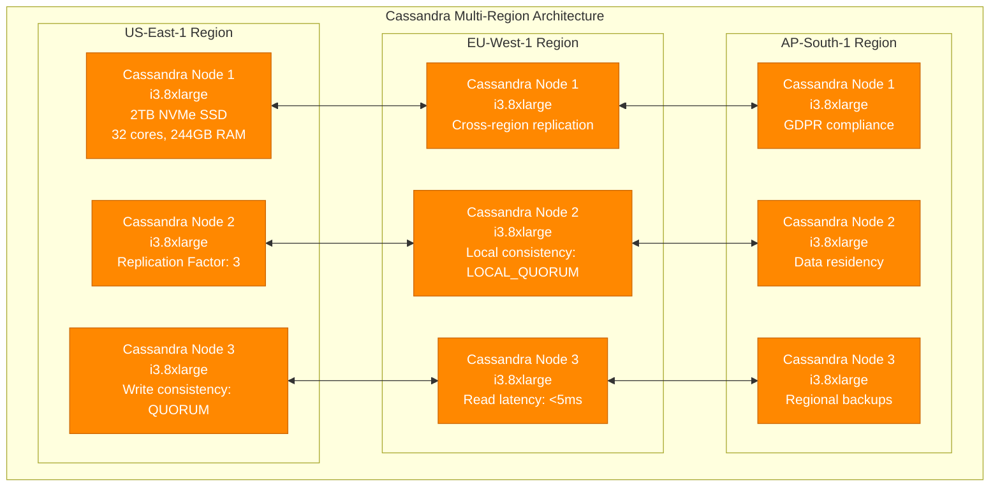
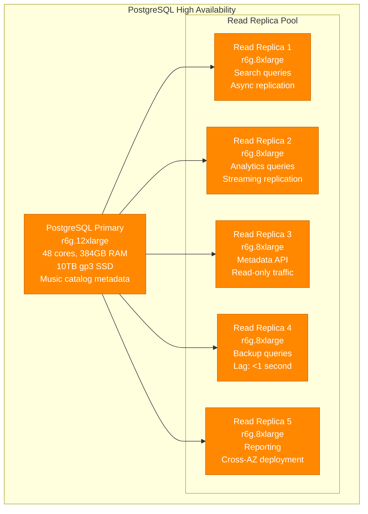
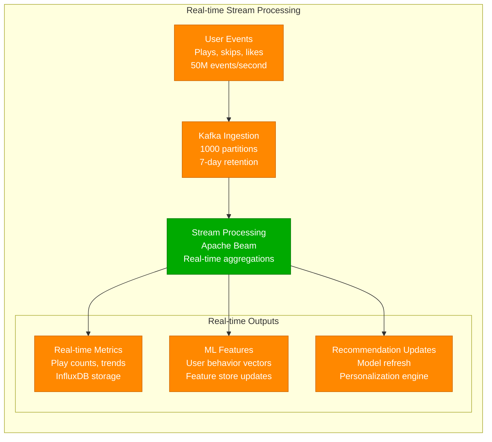

# Spotify - Storage Architecture

## Multi-Petabyte Data Management: 100M+ Songs, 600M+ Users

Spotify's storage architecture manages one of the world's largest music catalogs while serving real-time streams to hundreds of millions of users with 99.99% availability.

```mermaid
graph TB
    subgraph EdgePlane[Edge Plane - Content Delivery]
        CDNCache[Fastly CDN Cache<br/>Audio Files<br/>50TB+ daily transfer<br/>200+ global PoPs]
        EdgeCache[Edge Cache Layer<br/>Popular content<br/>95% cache hit rate<br/>Regional optimization]
    end

    subgraph ServicePlane[Service Plane - Data Access]
        DataAccess[Data Access Layer<br/>Connection pooling<br/>Circuit breakers<br/>Retry logic]
        CacheLayer[Application Cache<br/>Redis Cluster<br/>100M active sessions<br/>Multi-tier caching]
        SearchEngine[Search Services<br/>Elasticsearch 8.x<br/>100M searches/day<br/>Full-text + semantic]
    end

    subgraph StatePlane[State Plane - Primary Storage]
        subgraph UserData[User Data Systems]
            Cassandra[(Cassandra Cluster<br/>1000+ nodes<br/>RF=3, LZ4 compression<br/>User profiles: 600M<br/>Playlists: 4B+<br/>Listening history: 10PB)]
            CassandraReplica[(Cassandra Replica<br/>Cross-region backup<br/>99.99% availability<br/>3-region deployment)]
        end

        subgraph ContentMeta[Content Metadata]
            PostgresMain[(PostgreSQL Primary<br/>Music metadata DB<br/>Songs: 100M+<br/>Artists: 8M+<br/>Albums: 10M+)]
            PostgresRead[(PostgreSQL Replicas<br/>Read scaling<br/>5x read replicas<br/>Streaming replication)]
            MetaCache[(Redis Metadata Cache<br/>Hot metadata<br/>10TB cluster<br/>99% hit rate)]
        end

        subgraph ContentStorage[Content Storage Systems]
            AudioStorage[Google Cloud Storage<br/>Audio Files Storage<br/>100M+ songs<br/>Multiple formats:<br/>96k, 128k, 256k, 320kbps<br/>Total: 50PB+]
            PodcastStorage[AWS S3<br/>Podcast Storage<br/>5M+ episodes<br/>Anchor integration<br/>10TB+ monthly growth]
            ArtworkStorage[Image CDN<br/>Album artwork<br/>Artist images<br/>Playlist covers<br/>1TB+ images]
        end

        subgraph AnalyticsStorage[Analytics & ML Data]
            EventStream[Apache Kafka<br/>Event Streaming<br/>50M events/second<br/>7-day retention<br/>1000+ partitions]
            BigQueryDW[BigQuery Data Warehouse<br/>Historical analytics<br/>100TB+ daily ingestion<br/>User behavior analysis<br/>ML training data]
            MLDataLake[ML Data Lake<br/>HDFS + Parquet<br/>Feature store<br/>Model training data<br/>10PB+ historical]
        end

        subgraph OperationalData[Operational Systems]
            LicensingDB[(Licensing Database<br/>Rights management<br/>Geographic restrictions<br/>Royalty calculations<br/>Real-time tracking)]
            PaymentDB[(Payment Database<br/>Subscription management<br/>Artist payouts<br/>Financial reconciliation<br/>PCI DSS compliant)]
            ConfigStore[(Configuration Store<br/>Feature flags<br/>A/B test configs<br/>Service discovery<br/>Consul + Vault)]
        end
    end

    subgraph ControlPlane[Control Plane - Data Operations]
        DataPipeline[Data Pipeline<br/>Luigi + Airflow<br/>ETL orchestration<br/>1000+ daily jobs]
        Monitoring[Data Monitoring<br/>DataDog + Custom<br/>Storage metrics<br/>Query performance]
        Backup[Backup Systems<br/>Cross-region backup<br/>Point-in-time recovery<br/>7-year retention]
        Security[Data Security<br/>Encryption at rest<br/>Access controls<br/>Audit logging]
    end

    %% Data Flow Connections
    Users[600M Users<br/>Global access] --> CDNCache
    CDNCache --> EdgeCache
    EdgeCache --> DataAccess

    DataAccess --> CacheLayer
    DataAccess --> SearchEngine
    CacheLayer --> Cassandra
    CacheLayer --> PostgresMain

    %% Read Scaling
    DataAccess --> PostgresRead
    DataAccess --> MetaCache
    PostgresMain --> PostgresRead
    PostgresMain --> MetaCache

    %% Content Delivery
    DataAccess --> AudioStorage
    DataAccess --> PodcastStorage
    DataAccess --> ArtworkStorage

    %% Analytics Pipeline
    DataAccess --> EventStream
    EventStream --> BigQueryDW
    EventStream --> MLDataLake

    %% Operational Data
    DataAccess --> LicensingDB
    DataAccess --> PaymentDB
    DataAccess --> ConfigStore

    %% Replication & Backup
    Cassandra --> CassandraReplica
    PostgresMain --> Backup
    EventStream --> Backup

    %% Control Plane
    DataPipeline --> BigQueryDW
    DataPipeline --> MLDataLake
    Monitoring --> Cassandra
    Monitoring --> PostgresMain
    Security --> LicensingDB
    Security --> PaymentDB

    %% Apply four-plane colors
    classDef edgeStyle fill:#0066CC,stroke:#004499,color:#fff
    classDef serviceStyle fill:#00AA00,stroke:#007700,color:#fff
    classDef stateStyle fill:#FF8800,stroke:#CC6600,color:#fff
    classDef controlStyle fill:#CC0000,stroke:#990000,color:#fff

    class CDNCache,EdgeCache edgeStyle
    class DataAccess,CacheLayer,SearchEngine serviceStyle
    class Cassandra,CassandraReplica,PostgresMain,PostgresRead,MetaCache,AudioStorage,PodcastStorage,ArtworkStorage,EventStream,BigQueryDW,MLDataLake,LicensingDB,PaymentDB,ConfigStore stateStyle
    class DataPipeline,Monitoring,Backup,Security controlStyle
```

## Storage System Specifications

### User Data - Cassandra Cluster

**Cassandra Performance Metrics:**
- **Cluster Size**: 1000+ nodes across 3 regions
- **Data Volume**: 10PB+ user data, 100TB+ monthly growth
- **Write Throughput**: 500K writes/second peak
- **Read Throughput**: 2M reads/second peak
- **p99 Read Latency**: <5ms
- **p99 Write Latency**: <10ms
- **Replication Factor**: 3 within region, 2 cross-region

### Content Metadata - PostgreSQL

**PostgreSQL Performance Metrics:**
- **Database Size**: 5TB+ metadata (songs, artists, albums)
- **Daily Transactions**: 100M+ metadata queries
- **Connection Pool**: 1000 max connections per replica
- **Read/Write Ratio**: 95% read, 5% write
- **Backup Frequency**: Continuous WAL archiving + daily dumps
- **Recovery Point Objective**: <1 minute data loss
- **Recovery Time Objective**: <5 minutes failover

### Content Storage Systems

**Google Cloud Storage (Audio Files):**
- **Total Storage**: 50PB+ audio files
- **File Formats**: FLAC, OGG Vorbis, MP3, AAC
- **Bitrate Options**: 96k, 128k, 256k, 320kbps per track
- **Upload Rate**: 10K+ new tracks daily
- **Download Bandwidth**: 50TB+ daily
- **Replication**: Multi-region with 99.999% durability
- **Access Patterns**: 20% hot (daily), 60% warm (weekly), 20% cold (archive)

**Content Delivery Performance:**
- **CDN Cache Hit Rate**: 95% for popular tracks
- **Edge Locations**: 200+ global points of presence
- **Audio Start Time**: <200ms p99 globally
- **Bandwidth Costs**: $10M+ annually
- **Storage Costs**: $5M+ annually

## Data Pipeline Architecture

### Real-time Event Processing

## Storage Cost Optimization

### Cost Breakdown (Annual)
- **Cassandra Cluster**: $12M (compute + storage)
- **PostgreSQL**: $2M (instances + storage)
- **Google Cloud Storage**: $5M (audio file storage)
- **CDN & Bandwidth**: $15M (content delivery)
- **Analytics Storage**: $8M (BigQuery + data lake)
- **Backup & DR**: $3M (cross-region replication)

### Optimization Strategies
- **Tiered Storage**: Hot/warm/cold data separation
- **Compression**: LZ4 for Cassandra, gzip for analytics
- **Data Retention**: 7-year user data, 3-year detailed analytics
- **Regional Caching**: Reduce cross-region data transfer
- **Reserved Capacity**: 40% savings on predictable workloads

This storage architecture enables Spotify to deliver instant access to 100M+ songs while maintaining 99.99% availability and supporting real-time personalization for 600M+ users globally.