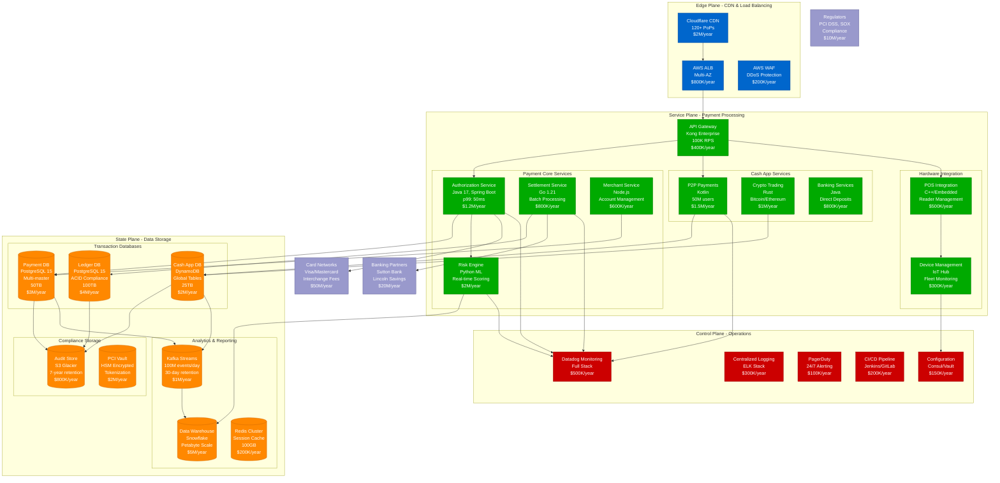

# Square Complete Architecture - Payment Platform for Millions of Merchants

## The Money Shot: Full Stack Payment Infrastructure

Square operates one of the largest integrated payment platforms globally, processing $200B+ annually across hardware, software, and financial services.

## Production Architecture Metrics

### Scale & Performance
- **Payment Volume**: $200B+ annually processed
- **Transaction Rate**: 50,000 TPS peak (Black Friday)
- **Merchants**: 4M+ active merchants globally
- **Cash App Users**: 50M+ monthly active users
- **Hardware Devices**: 3M+ Square Readers deployed
- **API Requests**: 2B+ daily across all services

### Infrastructure Costs (Annual)
- **Total Infrastructure**: $28M/year
- **Compute (AWS EC2)**: $15M/year
- **Storage & Data**: $8M/year
- **Networking & CDN**: $3M/year
- **Monitoring & Tools**: $2M/year

### Reliability Metrics
- **Payment Uptime**: 99.95% (21.9 minutes downtime/year)
- **Cash App Uptime**: 99.9% (8.76 hours downtime/year)
- **Mean Time to Recovery**: 12 minutes
- **P99 Authorization Latency**: 50ms
- **P99 Settlement Time**: 2 business days

## Critical Production Components

### Payment Authorization Flow
1. **Card Swipe/Dip**: Hardware reader encrypts card data
2. **Risk Scoring**: Real-time ML fraud detection (15ms)
3. **Network Routing**: Visa/Mastercard authorization (200ms)
4. **Merchant Notification**: Real-time update to POS (50ms)
5. **Settlement Initiation**: Batch processing every 4 hours

### Cash App Integration
- **P2P Payments**: Instant transfers between users
- **Cryptocurrency**: Real-time Bitcoin/Ethereum trading
- **Banking Services**: Direct deposit, savings accounts
- **Debit Card**: Square Cash Card with instant funding

### Hardware Ecosystem
- **Square Reader**: Magnetic stripe, chip, contactless
- **Square Terminal**: All-in-one payment device
- **Square Register**: iPad-based POS system
- **Square Stand**: Card reader + receipt printer

## Compliance & Security Architecture

### PCI DSS Level 1 Compliance
- **Tokenization**: Card data never stored in plaintext
- **HSM Integration**: Hardware security modules for key management
- **Network Segmentation**: Isolated cardholder data environment
- **Vulnerability Scanning**: Continuous security monitoring

### Financial Regulations
- **SOX Compliance**: Financial reporting controls
- **AML/KYC**: Anti-money laundering monitoring
- **FFIEC Guidelines**: Banking regulation compliance
- **State Licensing**: Money transmitter licenses in all 50 states

## Disaster Recovery & Business Continuity

### Multi-Region Deployment
- **Primary**: US East (N. Virginia)
- **Secondary**: US West (Oregon)
- **Failover Time**: 15 minutes RTO
- **Data Replication**: Synchronous for payment data

### Backup Strategy
- **Transaction Data**: Real-time replication + hourly snapshots
- **Configuration**: Version-controlled infrastructure as code
- **Disaster Recovery Testing**: Monthly drills
- **Business Continuity**: 4-hour RPO maximum

This architecture processes over $200 billion in payments annually while maintaining 99.95% uptime and strict financial compliance requirements.