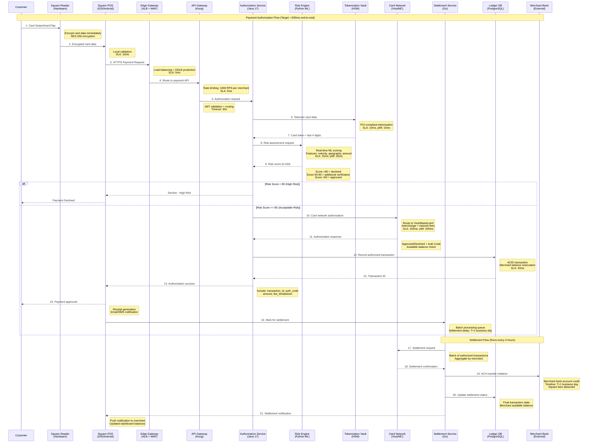
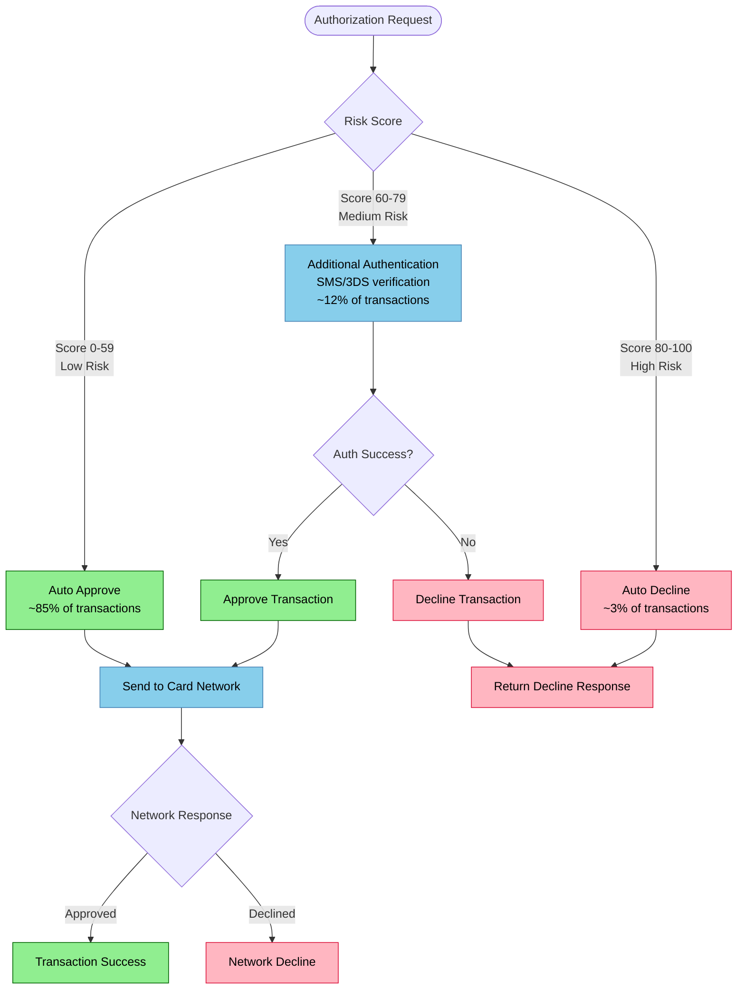

# Square Request Flow - Payment Authorization to Settlement

## The Golden Path: From Card Swipe to Bank Settlement

This diagram shows the complete journey of a payment transaction through Square's infrastructure, from the moment a customer swipes their card to final settlement in the merchant's bank account.

## Performance Metrics & SLAs

### End-to-End Latency Targets
- **Authorization Response**: <200ms (p95)
- **Risk Assessment**: <15ms (p99: 25ms)
- **Tokenization**: <10ms (p99: 15ms)
- **Database Write**: <20ms (p99: 35ms)
- **Network Authorization**: <150ms (p99: 200ms)

### Throughput Specifications
- **Peak TPS**: 50,000 transactions/second (Black Friday)
- **Average TPS**: 15,000 transactions/second
- **API Rate Limits**: 1,000 RPS per merchant
- **Concurrent Authorizations**: 100,000 in-flight
- **Settlement Batch Size**: 1M transactions per batch

## Critical Decision Points

### Risk Engine Decision Matrix

### Settlement Timeline

```mermaid
gantt
    title Payment Settlement Timeline
    dateFormat X
    axisFormat %H:%M

    section Authorization
    Card Swipe           :milestone, swipe, 0, 0
    Risk Assessment      :risk, 0, 15
    Network Auth         :network, after risk, 150
    Response to Merchant :response, after network, 35

    section Settlement Batch
    Batch Collection     :batch, 240, 480
    Network Settlement   :settle, after batch, 120
    ACH Initiation      :ach, after settle, 60

    section Bank Transfer
    ACH Processing      :processing, after ach, 1440
    Funds Available     :milestone, available, after processing, 0
```

## Error Handling & Fallback Strategies

### Payment Declination Flow
1. **Network Timeout** (>300ms): Retry once, then decline
2. **Risk Engine Unavailable**: Default to network-only authorization
3. **Tokenization Failure**: Store encrypted PAN temporarily, retry tokenization
4. **Database Unavailable**: Cache authorization, async write on recovery
5. **Settlement Failure**: Automatic retry with exponential backoff

### Offline Payment Support
- **Square Reader**: Store up to 100 offline transactions
- **Offline Limit**: $25 per transaction maximum
- **Sync Window**: 24 hours to reconnect and sync
- **Risk Mitigation**: Enhanced post-authorization review

## Real-World Performance Data

### Black Friday 2023 Metrics
- **Peak TPS**: 47,000 transactions/second
- **Authorization Success Rate**: 97.2%
- **Average Response Time**: 185ms
- **Risk Engine Accuracy**: 99.1% (false positive rate: 0.9%)
- **Settlement Success Rate**: 99.98%

### Geographic Latency (P95)
- **US East Coast**: 45ms
- **US West Coast**: 78ms
- **Canada**: 92ms
- **UK**: 120ms
- **Australia**: 180ms

### Cost Per Transaction
- **Infrastructure Cost**: $0.0012 per transaction
- **Network Fees**: $0.15-0.35 (interchange dependent)
- **Square Processing Fee**: 2.6% + $0.10
- **Risk Assessment**: $0.001 per transaction
- **Settlement Cost**: $0.0008 per transaction

This request flow handles millions of transactions daily while maintaining sub-200ms response times and 99.95% uptime across the global payment infrastructure.