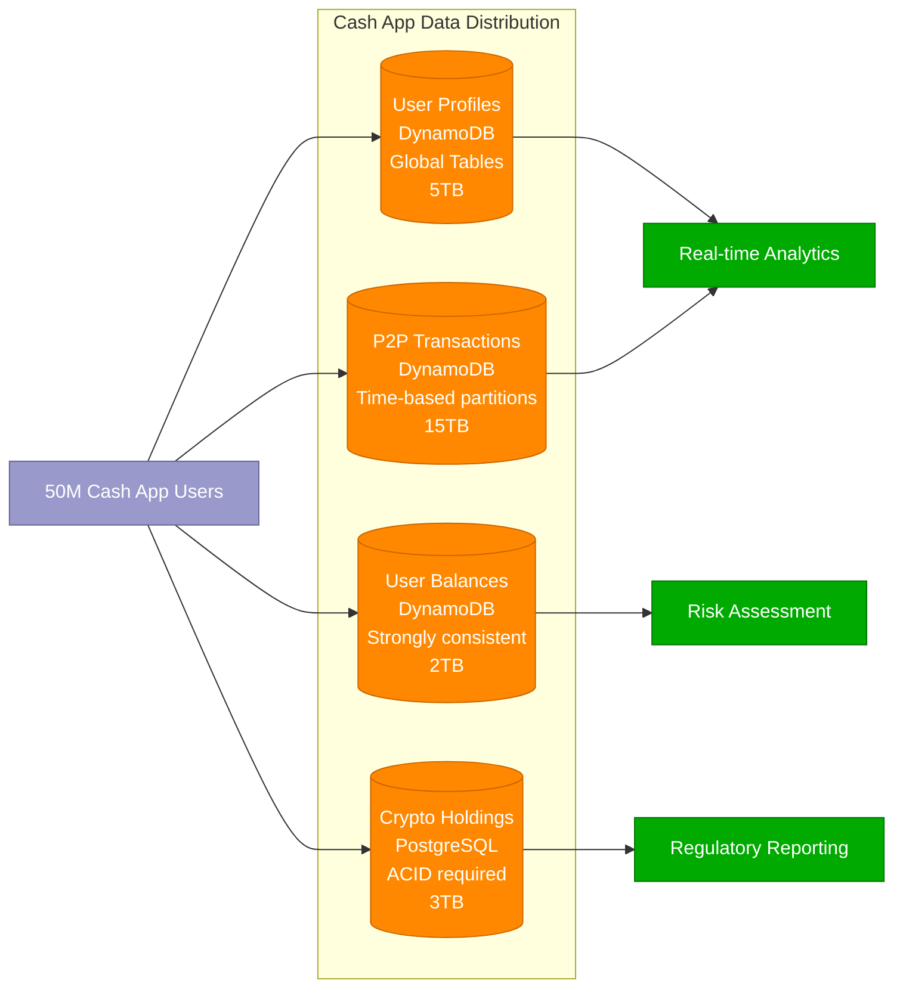
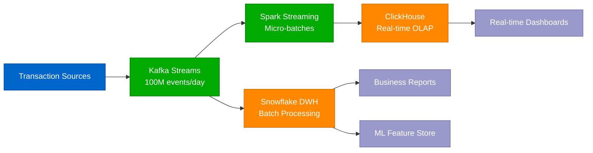
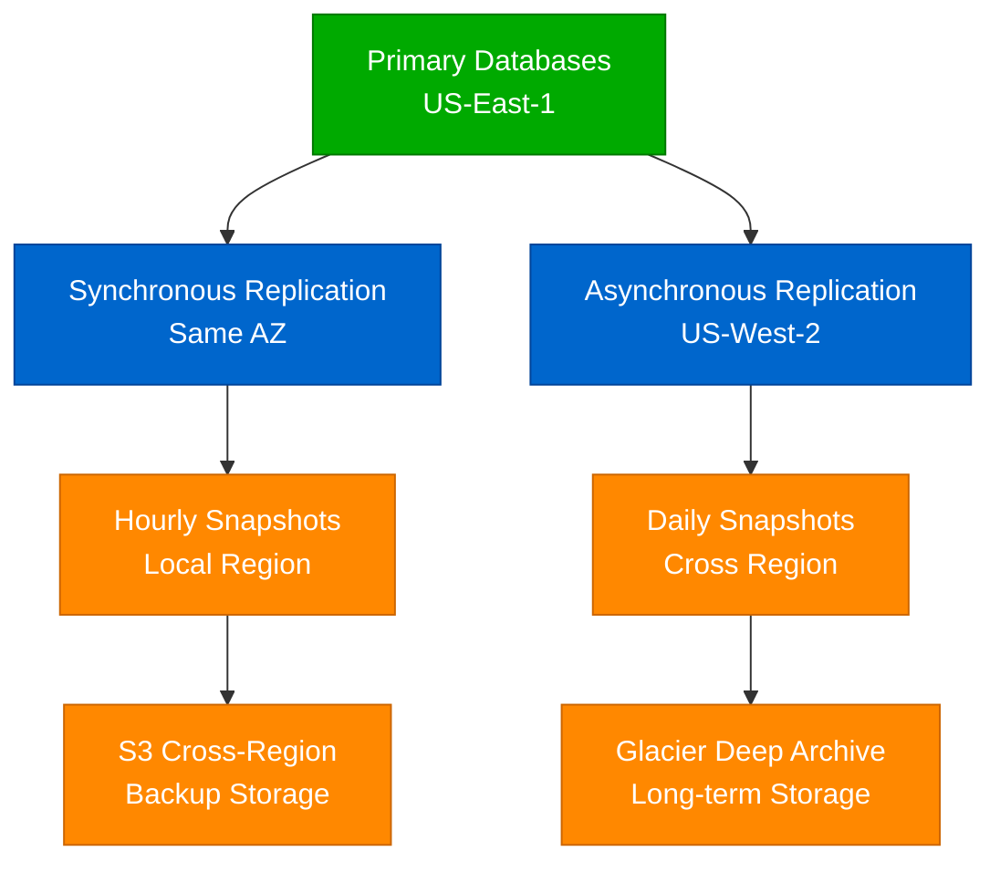

# Square Storage Architecture - Transaction Data & Merchant Accounts

## The Data Journey: Financial Data Storage at Scale

Square's storage architecture handles $200B+ in annual payment volume with strict ACID compliance, PCI DSS requirements, and real-time analytics across multiple data stores.

```mermaid
graph TB
    subgraph EdgePlane[Edge Plane - Data Ingestion]
        API[API Gateway<br/>Kong Enterprise<br/>100K RPS]
        STREAM[Kafka Streams<br/>100M events/day<br/>3 brokers<br/>$1M/year]
        CDC[Change Data Capture<br/>Debezium<br/>Real-time sync]
    end

    subgraph ServicePlane[Service Plane - Data Processing]
        TXNPROC[Transaction Processor<br/>Java 17<br/>Stateless<br/>Auto-scaling]
        BATCHPROC[Batch Processor<br/>Apache Spark<br/>ETL Pipeline<br/>$500K/year]
        RISKPROC[Risk Processor<br/>Python ML<br/>Feature Store<br/>$800K/year]
    end

    subgraph StatePlane[State Plane - Data Storage]
        subgraph TransactionalSystems[Transactional Systems - ACID Compliance]
            PAYMENTDB[(Payment Database<br/>PostgreSQL 15<br/>Master-Slave<br/>50TB<br/>$3M/year)]
            LEDGERDB[(Ledger Database<br/>PostgreSQL 15<br/>Multi-master<br/>100TB<br/>$4M/year)]
            MERCHANTDB[(Merchant Database<br/>PostgreSQL 14<br/>Sharded by merchant_id<br/>25TB<br/>$2M/year)]
        end

        subgraph CashAppStorage[Cash App Storage]
            CASHDB[(Cash App Database<br/>DynamoDB Global Tables<br/>Eventually Consistent<br/>25TB<br/>$2M/year)]
            CRYPTODB[(Crypto Ledger<br/>PostgreSQL 15<br/>Strict Consistency<br/>5TB<br/>$800K/year)]
            WALLETDB[(Wallet Database<br/>DynamoDB<br/>User Balances<br/>10TB<br/>$1.2M/year)]
        end

        subgraph CacheLayer[Cache Layer - Performance]
            REDIS[(Redis Cluster<br/>6 nodes<br/>Session Cache<br/>100GB<br/>$200K/year)]
            MEMCACHED[(Memcached<br/>Merchant Cache<br/>50GB<br/>$100K/year)]
            ELASTICSEARCH[(Elasticsearch<br/>Search Index<br/>Transaction Search<br/>$600K/year)]
        end

        subgraph AnalyticsStorage[Analytics Storage]
            WAREHOUSE[(Data Warehouse<br/>Snowflake<br/>Petabyte Scale<br/>$5M/year)]
            TIMESERIES[(Time Series DB<br/>InfluxDB<br/>Metrics Storage<br/>$300K/year)]
            CLICKHOUSE[(ClickHouse<br/>Real-time Analytics<br/>Event Processing<br/>$800K/year)]
        end

        subgraph ComplianceStorage[Compliance & Audit Storage]
            AUDITSTORE[(Audit Store<br/>PostgreSQL 15<br/>Immutable Logs<br/>200TB<br/>$6M/year)]
            ARCHIVAL[(Archival Storage<br/>S3 Glacier Deep Archive<br/>7-year retention<br/>500TB<br/>$800K/year)]
            PCIVAULT[(PCI Vault<br/>HSM + PostgreSQL<br/>Tokenization<br/>$2M/year)]
        end

        subgraph BackupSystems[Backup & Recovery]
            BACKUP[(Backup Storage<br/>S3 Cross-Region<br/>Point-in-time Recovery<br/>$1.5M/year)]
            REPLICA[(Read Replicas<br/>PostgreSQL<br/>5 regions<br/>$2M/year)]
        end
    end

    subgraph ControlPlane[Control Plane - Data Management]
        DATAMON[Data Monitoring<br/>DataDog + Custom<br/>$300K/year]
        BACKUP_SCHEDULER[Backup Scheduler<br/>Velero + Custom<br/>$100K/year]
        RETENTION[Retention Manager<br/>Automated Cleanup<br/>$50K/year]
        ENCRYPTION[Encryption Manager<br/>HashiCorp Vault<br/>$200K/year]
    end

    %% Data Flow Connections
    API --> STREAM
    STREAM --> TXNPROC
    TXNPROC --> PAYMENTDB
    TXNPROC --> LEDGERDB
    TXNPROC --> MERCHANTDB

    %% Cash App flows
    API --> CASHDB
    API --> WALLETDB
    CASHDB --> CRYPTODB

    %% CDC and real-time sync
    PAYMENTDB --> CDC
    LEDGERDB --> CDC
    MERCHANTDB --> CDC
    CASHDB --> CDC
    CDC --> STREAM

    %% Cache population
    PAYMENTDB --> REDIS
    MERCHANTDB --> MEMCACHED
    PAYMENTDB --> ELASTICSEARCH

    %% Analytics pipeline
    STREAM --> BATCHPROC
    BATCHPROC --> WAREHOUSE
    STREAM --> CLICKHOUSE
    PAYMENTDB --> WAREHOUSE
    LEDGERDB --> WAREHOUSE

    %% Risk and ML
    STREAM --> RISKPROC
    RISKPROC --> WAREHOUSE
    WAREHOUSE --> RISKPROC

    %% Monitoring and metrics
    PAYMENTDB --> TIMESERIES
    LEDGERDB --> TIMESERIES
    CASHDB --> TIMESERIES

    %% Compliance and audit
    PAYMENTDB --> AUDITSTORE
    LEDGERDB --> AUDITSTORE
    CASHDB --> AUDITSTORE
    AUDITSTORE --> ARCHIVAL

    %% PCI compliance
    PAYMENTDB --> PCIVAULT
    PCIVAULT --> PAYMENTDB

    %% Backup flows
    PAYMENTDB --> BACKUP
    LEDGERDB --> BACKUP
    MERCHANTDB --> BACKUP
    PAYMENTDB --> REPLICA
    LEDGERDB --> REPLICA

    %% Control plane connections
    DATAMON -.-> PAYMENTDB
    DATAMON -.-> LEDGERDB
    DATAMON -.-> WAREHOUSE
    BACKUP_SCHEDULER -.-> BACKUP
    RETENTION -.-> ARCHIVAL
    ENCRYPTION -.-> PCIVAULT

    %% Apply four-plane colors
    classDef edgeStyle fill:#0066CC,stroke:#004499,color:#fff
    classDef serviceStyle fill:#00AA00,stroke:#007700,color:#fff
    classDef stateStyle fill:#FF8800,stroke:#CC6600,color:#fff
    classDef controlStyle fill:#CC0000,stroke:#990000,color:#fff

    class API,STREAM,CDC edgeStyle
    class TXNPROC,BATCHPROC,RISKPROC serviceStyle
    class PAYMENTDB,LEDGERDB,MERCHANTDB,CASHDB,CRYPTODB,WALLETDB,REDIS,MEMCACHED,ELASTICSEARCH,WAREHOUSE,TIMESERIES,CLICKHOUSE,AUDITSTORE,ARCHIVAL,PCIVAULT,BACKUP,REPLICA stateStyle
    class DATAMON,BACKUP_SCHEDULER,RETENTION,ENCRYPTION controlStyle
```

## Data Storage Strategy & Specifications

### Transactional Databases (ACID Compliance)

#### Payment Database (Primary Transaction Store)
- **Technology**: PostgreSQL 15 with streaming replication
- **Capacity**: 50TB with 99.99% availability SLA
- **Throughput**: 100K writes/sec, 500K reads/sec
- **Consistency**: Strong consistency with synchronous replication
- **Sharding**: By transaction timestamp (monthly partitions)
- **Backup**: Continuous WAL archiving + daily full backups

#### Ledger Database (Financial Record System)
- **Technology**: PostgreSQL 15 multi-master setup
- **Capacity**: 100TB with immutable transaction records
- **Throughput**: 50K writes/sec, 200K reads/sec
- **Consistency**: ACID compliance with double-entry bookkeeping
- **Retention**: Permanent retention (regulatory requirement)
- **Audit**: Every change logged with cryptographic signatures

#### Merchant Database (Account Management)
- **Technology**: PostgreSQL 14 sharded by merchant_id
- **Capacity**: 25TB across 16 shards
- **Throughput**: 75K writes/sec, 300K reads/sec
- **Sharding Strategy**: Consistent hashing on merchant_id
- **Read Replicas**: 3 replicas per shard for load distribution

### Cash App Storage Architecture

#### User Data Storage

### Cache Architecture & Performance

#### Multi-Layer Caching Strategy
- **L1 Cache**: Application-level (Redis) - 10ms avg latency
- **L2 Cache**: Regional cache (Memcached) - 25ms avg latency
- **L3 Cache**: Database query cache - 50ms avg latency

#### Cache Hit Rates & Performance
- **Payment Data Cache**: 95% hit rate, 1ms avg response
- **Merchant Data Cache**: 92% hit rate, 2ms avg response
- **User Session Cache**: 98% hit rate, 0.5ms avg response
- **Search Index Cache**: 88% hit rate, 5ms avg response

### Analytics & Data Warehouse

#### Real-Time Analytics Pipeline

#### Data Warehouse Specifications
- **Storage Capacity**: 2.5 petabytes (compressed)
- **Daily Ingestion**: 50TB of new data
- **Query Performance**: 95% of queries <10 seconds
- **Concurrent Users**: 1,000+ analysts and data scientists
- **Retention**: 7 years for compliance, 2 years hot storage

### Compliance & Security Storage

#### PCI DSS Compliance Architecture
- **Tokenization Vault**: HSM-backed token generation
- **Card Data Encryption**: AES-256 with key rotation
- **Network Segmentation**: Isolated cardholder data environment
- **Access Logging**: Every data access logged and monitored

#### Audit Trail System
- **Immutable Logs**: Blockchain-style hash chaining
- **Retention Period**: 7 years (SOX/PCI requirement)
- **Access Control**: Role-based with multi-factor authentication
- **Tamper Detection**: Cryptographic integrity verification

## Disaster Recovery & Backup Strategy

### Backup Architecture

### Recovery Time Objectives (RTO)
- **Payment Database**: 15 minutes RTO, 1 minute RPO
- **Ledger Database**: 30 minutes RTO, 5 minutes RPO
- **Merchant Database**: 20 minutes RTO, 5 minutes RPO
- **Cash App Database**: 10 minutes RTO, 30 seconds RPO

### Business Continuity Testing
- **Monthly**: Automated failover testing
- **Quarterly**: Full disaster recovery drill
- **Annually**: Complete data center failover simulation
- **Success Rate**: 99.7% successful automated recoveries

## Performance Metrics & Optimization

### Database Performance (Production Metrics)
- **Payment DB**: 50TB, 100K QPS, 15ms avg query time
- **Ledger DB**: 100TB, 75K QPS, 25ms avg query time
- **Merchant DB**: 25TB, 200K QPS, 8ms avg query time
- **Cash App DB**: 25TB, 300K QPS, 5ms avg query time

### Storage Costs (Annual)
- **Primary Storage**: $18M/year
- **Backup & Replication**: $3.5M/year
- **Analytics Storage**: $6.3M/year
- **Compliance Storage**: $2.8M/year
- **Total Storage Cost**: $30.6M/year

### Data Growth Projections
- **Transaction Volume Growth**: 25% YoY
- **Cash App User Growth**: 35% YoY
- **Storage Growth**: 40% YoY
- **Analytics Data Growth**: 60% YoY

This storage architecture supports Square's massive scale while maintaining ACID compliance, PCI DSS security, and providing real-time analytics across all business lines.