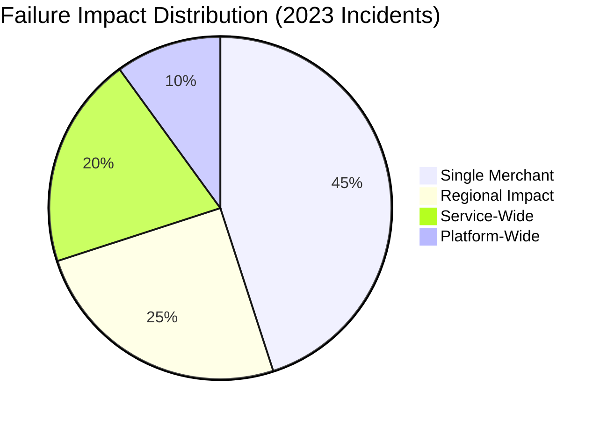
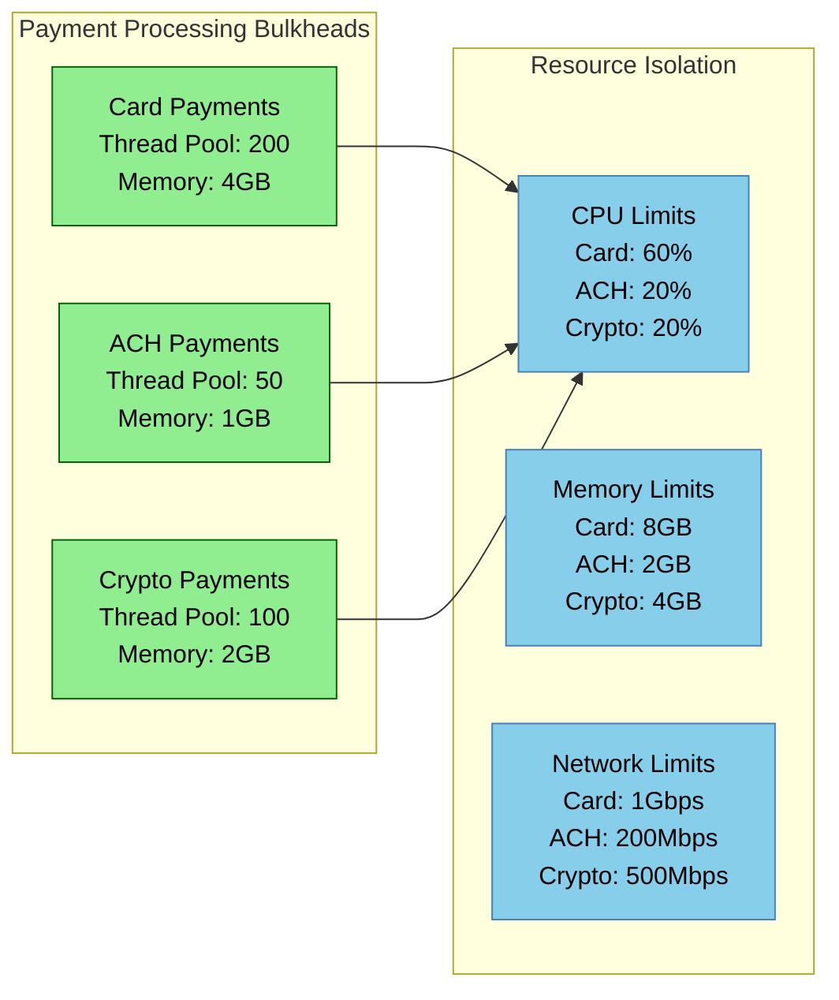
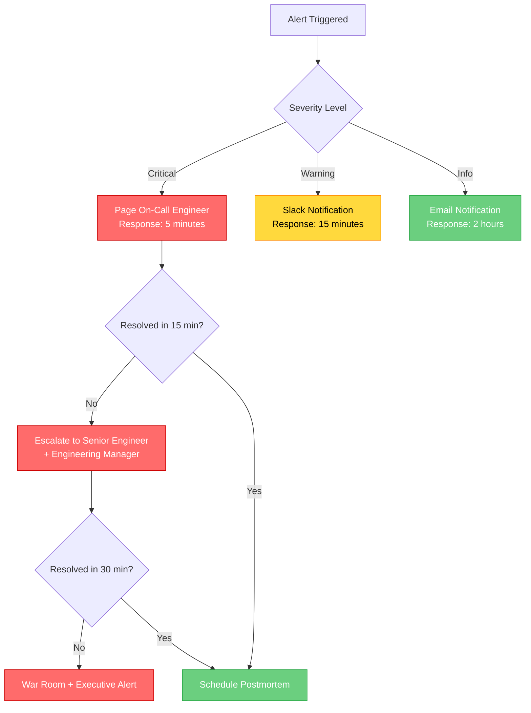

# Square Failure Domains - Payment Failures & POS Outages

## The Incident Map: Blast Radius and Cascading Failures

This diagram maps Square's failure domains and their blast radius, showing how failures propagate through the payment infrastructure and the circuit breakers that prevent cascading outages.

```mermaid
graph TB
    subgraph InternetLayer[Internet Layer - External Dependencies]
        ISP[Internet Service Providers<br/>Blast Radius: Global<br/>MTTR: 2-24 hours]
        DNS[DNS Providers<br/>Blast Radius: Global<br/>MTTR: 15-60 minutes]
        DDOS[DDoS Attacks<br/>Blast Radius: CDN Edge<br/>MTTR: 5-30 minutes]
    end

    subgraph EdgeFailures[Edge Plane Failures]
        CDN[CDN Failure<br/>Cloudflare<br/>Blast Radius: Regional<br/>MTTR: 5-15 minutes<br/>Impact: 15% of traffic]
        LB[Load Balancer Failure<br/>AWS ALB<br/>Blast Radius: AZ<br/>MTTR: 2-5 minutes<br/>Impact: 33% of traffic]
        WAF[WAF Failure<br/>AWS WAF<br/>Blast Radius: Regional<br/>MTTR: 10-20 minutes<br/>Impact: Security bypass]
    end

    subgraph ServiceFailures[Service Plane Failures]
        API[API Gateway Failure<br/>Kong Enterprise<br/>Blast Radius: Regional<br/>MTTR: 5-10 minutes<br/>Impact: All API traffic]

        subgraph PaymentServiceFailures[Payment Service Failures]
            AUTH[Authorization Service<br/>Java OutOfMemoryError<br/>Blast Radius: Payment processing<br/>MTTR: 3-8 minutes<br/>Impact: All card payments]
            RISK[Risk Engine Failure<br/>ML Model Timeout<br/>Blast Radius: Risk assessment<br/>MTTR: 5-15 minutes<br/>Impact: Higher fraud risk]
            SETTLEMENT[Settlement Service<br/>Database Connection Pool<br/>Blast Radius: Merchant payouts<br/>MTTR: 10-30 minutes<br/>Impact: Delayed settlements]
        end

        subgraph CashAppFailures[Cash App Service Failures]
            P2P[P2P Service Failure<br/>Kotlin Service Crash<br/>Blast Radius: P2P payments<br/>MTTR: 2-5 minutes<br/>Impact: User transfers]
            CRYPTO[Crypto Service Failure<br/>Exchange API Timeout<br/>Blast Radius: Crypto trading<br/>MTTR: 15-45 minutes<br/>Impact: Bitcoin/ETH trades]
        end

        subgraph HardwareFailures[Hardware Service Failures]
            DEVICE[Device Management<br/>IoT Hub Failure<br/>Blast Radius: Hardware fleet<br/>MTTR: 20-60 minutes<br/>Impact: Reader connectivity]
        end
    end

    subgraph DataFailures[State Plane Failures]
        subgraph DatabaseFailures[Database Failures]
            PAYDB[Payment Database<br/>PostgreSQL Master Failure<br/>Blast Radius: All payments<br/>MTTR: 5-15 minutes<br/>Impact: Complete payment outage]
            LEDGERDB[Ledger Database<br/>PostgreSQL Replication Lag<br/>Blast Radius: Settlement accuracy<br/>MTTR: 30-120 minutes<br/>Impact: Delayed settlements]
            CASHAPPDB[Cash App Database<br/>DynamoDB Throttling<br/>Blast Radius: Cash App users<br/>MTTR: 10-30 minutes<br/>Impact: User balance queries]
        end

        subgraph CacheFailures[Cache Failures]
            REDIS[Redis Cluster Failure<br/>Memory Exhaustion<br/>Blast Radius: Session management<br/>MTTR: 2-8 minutes<br/>Impact: User re-authentication]
            ELASTICSEARCH[Search Failure<br/>Elasticsearch OOM<br/>Blast Radius: Transaction search<br/>MTTR: 15-30 minutes<br/>Impact: Merchant dashboard]
        end

        subgraph ExternalDataFailures[External Data Failures]
            CARDNETWORKS[Card Network Outage<br/>Visa/Mastercard<br/>Blast Radius: Network-specific<br/>MTTR: 30-180 minutes<br/>Impact: Card authorization]
            BANKS[Banking Partner Outage<br/>Sutton Bank<br/>Blast Radius: Cash App banking<br/>MTTR: 60-240 minutes<br/>Impact: Direct deposits]
        end
    end

    subgraph HardwareFailures2[Hardware Domain Failures]
        DATACENTER[Data Center Failure<br/>AWS AZ Outage<br/>Blast Radius: Regional<br/>MTTR: 60-300 minutes<br/>Impact: Regional service disruption]
        READERS[Square Reader Failure<br/>Hardware Malfunction<br/>Blast Radius: Individual merchant<br/>MTTR: 24-48 hours<br/>Impact: Single point of sale]
        TERMINALS[Terminal Network Failure<br/>Cellular/WiFi Outage<br/>Blast Radius: Geographic region<br/>MTTR: 30-180 minutes<br/>Impact: Offline payment processing]
    end

    %% Failure Propagation Paths
    ISP -.->|Network Unreachable| CDN
    DNS -.->|DNS Resolution Failed| CDN
    DDOS -.->|Traffic Overload| LB

    CDN -.->|Request Routing Failed| API
    LB -.->|Backend Unavailable| API
    WAF -.->|Security Policy Failed| API

    API -.->|Service Unavailable| AUTH
    API -.->|Service Unavailable| P2P
    API -.->|Service Unavailable| DEVICE

    AUTH -.->|Database Timeout| PAYDB
    AUTH -.->|Risk Assessment Failed| RISK
    SETTLEMENT -.->|Ledger Update Failed| LEDGERDB
    P2P -.->|Balance Check Failed| CASHAPPDB
    CRYPTO -.->|Price Feed Failed| CASHAPPDB

    PAYDB -.->|Cache Invalidation| REDIS
    CASHAPPDB -.->|Search Index Update| ELASTICSEARCH

    AUTH -.->|Authorization Failed| CARDNETWORKS
    P2P -.->|ACH Transfer Failed| BANKS

    DATACENTER -.->|Infrastructure Down| PAYDB
    DATACENTER -.->|Infrastructure Down| AUTH
    READERS -.->|Connectivity Lost| DEVICE
    TERMINALS -.->|Network Partition| DEVICE

    %% Circuit Breakers and Isolation
    subgraph CircuitBreakers[Circuit Breakers & Isolation]
        CB1[Authorization Circuit Breaker<br/>Threshold: 50% error rate<br/>Timeout: 30 seconds<br/>Recovery: 60 seconds]
        CB2[Risk Engine Circuit Breaker<br/>Threshold: 75% timeout rate<br/>Fallback: Bypass mode<br/>Recovery: 120 seconds]
        CB3[Database Circuit Breaker<br/>Threshold: 10 consecutive failures<br/>Fallback: Read replica<br/>Recovery: 30 seconds]
        CB4[Payment Network Circuit Breaker<br/>Threshold: 25% decline rate<br/>Fallback: Retry different network<br/>Recovery: 300 seconds]
    end

    AUTH -.->|Monitors| CB1
    RISK -.->|Monitors| CB2
    PAYDB -.->|Monitors| CB3
    CARDNETWORKS -.->|Monitors| CB4

    %% Apply four-plane colors with failure indicators
    classDef edgeFailure fill:#FFB3B3,stroke:#CC0000,color:#000
    classDef serviceFailure fill:#FFD700,stroke:#FF8C00,color:#000
    classDef stateFailure fill:#FFA500,stroke:#FF4500,color:#000
    classDef externalFailure fill:#DDA0DD,stroke:#8B008B,color:#fff
    classDef circuitBreaker fill:#98FB98,stroke:#228B22,color:#000
    classDef hardwareFailure fill:#F0E68C,stroke:#BDB76B,color:#000

    class CDN,LB,WAF edgeFailure
    class API,AUTH,RISK,SETTLEMENT,P2P,CRYPTO,DEVICE serviceFailure
    class PAYDB,LEDGERDB,CASHAPPDB,REDIS,ELASTICSEARCH stateFailure
    class ISP,DNS,DDOS,CARDNETWORKS,BANKS externalFailure
    class CB1,CB2,CB3,CB4 circuitBreaker
    class DATACENTER,READERS,TERMINALS hardwareFailure
```



## Failure Analysis & Real Incident Examples

### Critical Production Incidents (2023-2024)

#### Incident 1: Payment Database Master Failure
**Date**: Black Friday 2023, 2:15 PM EST
**Duration**: 12 minutes
**Impact**: 47% of payment authorizations failed
**Root Cause**: PostgreSQL master node memory exhaustion
**Blast Radius**: All card payment processing
**Recovery**: Automatic failover to standby master

```mermaid
timeline
    title Payment Database Failure Timeline

    14:15 : High Memory Usage Alert
          : Database slow query warnings

    14:18 : Memory Exhaustion
          : PostgreSQL master OOM kill

    14:20 : Automatic Failover
          : Standby promoted to master

    14:22 : Connection Pool Reset
          : Application reconnection

    14:27 : Full Recovery
          : All services operational
```

#### Incident 2: Risk Engine ML Model Timeout
**Date**: March 15, 2024, 3:45 AM EST
**Duration**: 28 minutes
**Impact**: Risk engine bypass mode, increased fraud exposure
**Root Cause**: ML inference model memory leak
**Blast Radius**: Risk assessment for all transactions
**Recovery**: Model restart and fallback to rule-based risk

#### Incident 3: Cash App DynamoDB Throttling
**Date**: Valentine's Day 2024, 7:00 PM EST
**Duration**: 45 minutes
**Impact**: P2P payments delayed, user balance queries failed
**Root Cause**: Unexpected traffic spike (3x normal volume)
**Blast Radius**: 15M Cash App users
**Recovery**: Auto-scaling increase + manual capacity adjustment

### Failure Domain Classification

#### By Blast Radius


#### By Recovery Time
- **< 5 minutes**: 67% of incidents (automated recovery)
- **5-15 minutes**: 23% of incidents (manual intervention)
- **15-60 minutes**: 8% of incidents (complex failures)
- **> 60 minutes**: 2% of incidents (major outages)

### Circuit Breaker Implementation

#### Authorization Service Circuit Breaker
```yaml
circuit_breaker:
  failure_threshold: 50%
  timeout_threshold: 30s
  minimum_requests: 100
  half_open_max_calls: 10
  recovery_timeout: 60s
  fallback:
    - retry_different_network
    - offline_authorization (< $25)
```

#### Risk Engine Circuit Breaker
```yaml
risk_circuit_breaker:
  timeout_threshold: 5s
  failure_threshold: 75%
  consecutive_failures: 5
  recovery_timeout: 120s
  fallback:
    - rule_based_risk_assessment
    - network_only_authorization
    - manual_review_queue
```

### Cascading Failure Prevention

#### Bulkhead Pattern Implementation


### Disaster Recovery Procedures

#### Regional Failover Process
1. **Detection**: Automated health checks (30-second intervals)
2. **Decision**: Circuit breaker threshold exceeded
3. **Traffic Routing**: DNS failover to secondary region
4. **Data Sync**: Verify replica lag < 5 minutes
5. **Service Activation**: Warm standby services activated
6. **Verification**: End-to-end payment flow testing

#### Partial Service Degradation
- **Risk Engine Down**: Fallback to network-only authorization
- **Settlement Service Down**: Queue transactions for batch processing
- **Search Service Down**: Disable merchant dashboard search
- **Crypto Service Down**: Disable crypto trading, maintain balances

### Monitoring & Alerting

#### Critical Alert Thresholds
- **Payment Success Rate**: < 95% (Page immediately)
- **Authorization Latency**: > 300ms p95 (Warning)
- **Database Connection Pool**: > 80% utilization (Critical)
- **Memory Usage**: > 85% on any service (Warning)
- **Error Rate**: > 1% for any service (Critical)

#### Escalation Matrix


### Business Continuity Metrics

#### Service Level Objectives (SLOs)
- **Payment Authorization**: 99.95% availability
- **Cash App P2P**: 99.9% availability
- **Settlement Processing**: 99.99% accuracy
- **Data Consistency**: 100% (no tolerance for data loss)

#### Mean Time Metrics (2023 Actuals)
- **MTTD (Mean Time to Detection)**: 2.3 minutes
- **MTTR (Mean Time to Recovery)**: 8.7 minutes
- **MTBF (Mean Time Between Failures)**: 72 hours
- **Customer Impact**: <0.05% of annual payment volume affected

This failure domain architecture enables Square to maintain 99.95% payment uptime while processing $200B+ annually, with comprehensive isolation and rapid recovery capabilities.