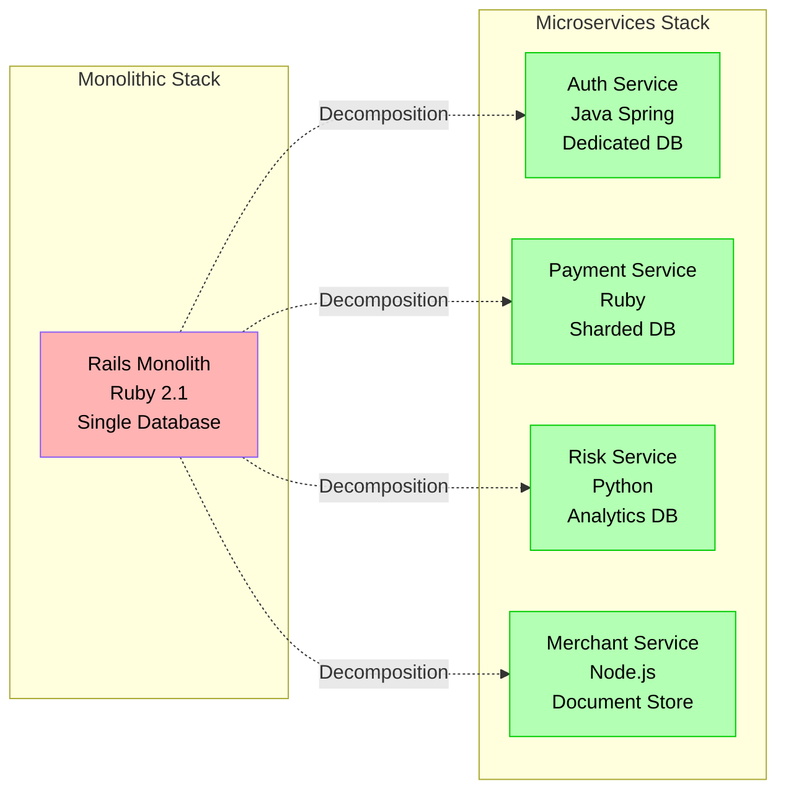
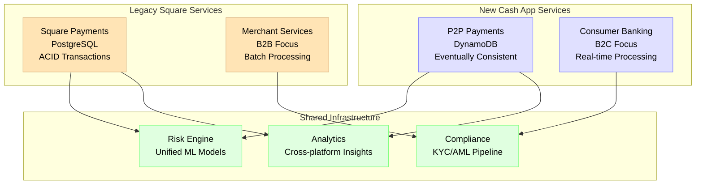
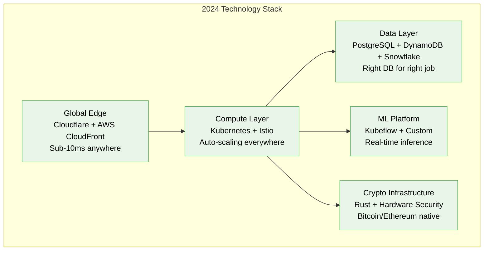
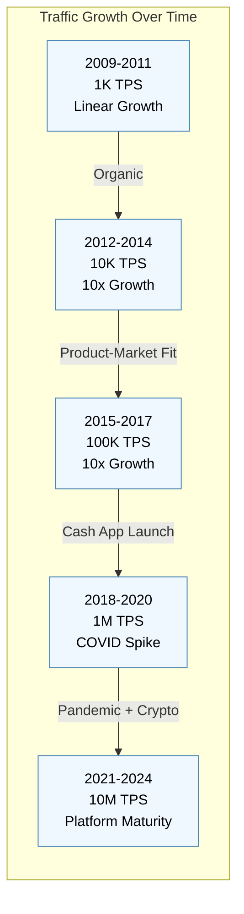

# Square Scale Evolution - From Card Reader to Financial Services Platform

## The Growth Story: Architecture Evolution Across 5 Orders of Magnitude

Square's journey from a simple card reader startup to processing $200B+ annually represents one of the most dramatic scaling stories in fintech history.

```mermaid
graph TB
    subgraph Scale1[2009-2011: MVP - Single Card Reader]
        subgraph MVP_Edge[Edge Layer]
            MVP_LB[Single Server<br/>Nginx<br/>1 instance<br/>$100/month]
        end

        subgraph MVP_Service[Service Layer]
            MVP_API[Monolithic Rails App<br/>Single Process<br/>SQLite Backend<br/>$500/month]
        end

        subgraph MVP_State[State Layer]
            MVP_DB[(SQLite Database<br/>Local File<br/>10MB storage<br/>$0/month)]
        end

        MVP_LB --> MVP_API
        MVP_API --> MVP_DB
    end

    subgraph Scale2[2012-2014: Early Growth - 1K Merchants]
        subgraph Early_Edge[Edge Layer]
            Early_LB[Load Balancer<br/>HAProxy<br/>2 instances<br/>$800/month]
        end

        subgraph Early_Service[Service Layer]
            Early_API[Rails Application<br/>4 App Servers<br/>Background Jobs<br/>$3K/month]
        end

        subgraph Early_State[State Layer]
            Early_DB[(PostgreSQL 9.1<br/>Master-Slave<br/>100GB storage<br/>$1.2K/month)]
            Early_REDIS[(Redis Cache<br/>Session Store<br/>2GB memory<br/>$300/month)]
        end

        Early_LB --> Early_API
        Early_API --> Early_DB
        Early_API --> Early_REDIS
    end

    subgraph Scale3[2015-2017: Microservices - 100K Merchants]
        subgraph Micro_Edge[Edge Layer]
            Micro_CDN[CloudFlare CDN<br/>Global Edge<br/>$5K/month]
            Micro_LB[AWS ELB<br/>Multi-AZ<br/>$2K/month]
        end

        subgraph Micro_Service[Service Layer]
            Micro_AUTH[Auth Service<br/>Java Spring<br/>$15K/month]
            Micro_PAY[Payment Service<br/>Ruby<br/>$25K/month]
            Micro_RISK[Risk Service<br/>Python<br/>$10K/month]
        end

        subgraph Micro_State[State Layer]
            Micro_DB[(PostgreSQL 9.4<br/>Sharded<br/>5TB storage<br/>$20K/month)]
            Micro_CACHE[(Redis Cluster<br/>High Availability<br/>50GB<br/>$5K/month)]
            Micro_QUEUE[(RabbitMQ<br/>Message Queue<br/>$2K/month)]
        end

        Micro_CDN --> Micro_LB
        Micro_LB --> Micro_AUTH
        Micro_LB --> Micro_PAY
        Micro_LB --> Micro_RISK
        Micro_AUTH --> Micro_DB
        Micro_PAY --> Micro_DB
        Micro_RISK --> Micro_CACHE
        Micro_PAY --> Micro_QUEUE
    end

    subgraph Scale4[2018-2020: Platform Scale - 1M Merchants + Cash App]
        subgraph Platform_Edge[Edge Layer]
            Platform_CDN[Multi-CDN<br/>CloudFlare + AWS<br/>$50K/month]
            Platform_LB[AWS ALB<br/>Global<br/>$15K/month]
            Platform_WAF[AWS WAF<br/>DDoS Protection<br/>$8K/month]
        end

        subgraph Platform_Service[Service Layer]
            Platform_GATEWAY[API Gateway<br/>Kong Enterprise<br/>$30K/month]
            Platform_AUTH[Auth Service<br/>Java 11<br/>$80K/month]
            Platform_PAY[Payment Service<br/>Go<br/>$120K/month]
            Platform_CASH[Cash App Service<br/>Kotlin<br/>$200K/month]
            Platform_RISK[Risk Service<br/>Python ML<br/>$150K/month]
        end

        subgraph Platform_State[State Layer]
            Platform_PAYDB[(Payment DB<br/>PostgreSQL 11<br/>50TB<br/>$300K/month)]
            Platform_CASHDB[(Cash App DB<br/>DynamoDB<br/>25TB<br/>$180K/month)]
            Platform_ANALYTICS[(Analytics DB<br/>Redshift<br/>100TB<br/>$120K/month)]
            Platform_CACHE[(Redis Cluster<br/>Multi-Region<br/>500GB<br/>$40K/month)]
        end

        Platform_CDN --> Platform_LB
        Platform_LB --> Platform_GATEWAY
        Platform_GATEWAY --> Platform_AUTH
        Platform_GATEWAY --> Platform_PAY
        Platform_GATEWAY --> Platform_CASH
        Platform_AUTH --> Platform_PAYDB
        Platform_PAY --> Platform_PAYDB
        Platform_CASH --> Platform_CASHDB
        Platform_RISK --> Platform_ANALYTICS
    end

    subgraph Scale5[2021-2024: Global Financial Platform - 4M Merchants]
        subgraph Global_Edge[Edge Layer]
            Global_CDN[Global CDN<br/>120+ PoPs<br/>$200K/month]
            Global_LB[Multi-Region LB<br/>AWS Global<br/>$80K/month]
            Global_WAF[Advanced WAF<br/>ML-based<br/>$50K/month]
        end

        subgraph Global_Service[Service Layer]
            Global_GATEWAY[API Gateway<br/>Kong + Custom<br/>$400K/month]
            Global_AUTH[Auth Service<br/>Java 17<br/>$1.2M/month]
            Global_PAY[Payment Service<br/>Go 1.21<br/>$2M/month]
            Global_CASH[Cash App Service<br/>Kotlin<br/>$1.5M/month]
            Global_CRYPTO[Crypto Service<br/>Rust<br/>$1M/month]
            Global_RISK[Risk Service<br/>Python + GPU<br/>$2M/month]
            Global_CAPITAL[Square Capital<br/>Java<br/>$800K/month]
        end

        subgraph Global_State[State Layer]
            Global_PAYDB[(Payment DB<br/>PostgreSQL 15<br/>500TB<br/>$4M/month)]
            Global_LEDGER[(Ledger DB<br/>PostgreSQL 15<br/>1PB<br/>$6M/month)]
            Global_CASHDB[(Cash App DB<br/>DynamoDB Global<br/>250TB<br/>$2M/month)]
            Global_DWH[(Data Warehouse<br/>Snowflake<br/>2.5PB<br/>$5M/month)]
            Global_STREAM[(Event Streaming<br/>Kafka<br/>$1M/month)]
        end

        Global_CDN --> Global_LB
        Global_LB --> Global_GATEWAY
        Global_GATEWAY --> Global_AUTH
        Global_GATEWAY --> Global_PAY
        Global_GATEWAY --> Global_CASH
        Global_GATEWAY --> Global_CRYPTO
        Global_AUTH --> Global_PAYDB
        Global_PAY --> Global_LEDGER
        Global_CASH --> Global_CASHDB
        Global_CRYPTO --> Global_CASHDB
        Global_RISK --> Global_DWH
        Global_STREAM --> Global_DWH
    end

    %% Evolution arrows
    Scale1 -.->|Growth Pressure| Scale2
    Scale2 -.->|Scaling Bottlenecks| Scale3
    Scale3 -.->|Cash App Launch| Scale4
    Scale4 -.->|Global Expansion| Scale5

    %% Apply evolutionary colors
    classDef mvpStyle fill:#E8F4FD,stroke:#1976D2,color:#000
    classDef earlyStyle fill:#E8F5E8,stroke:#388E3C,color:#000
    classDef microStyle fill:#FFF3E0,stroke:#F57C00,color:#000
    classDef platformStyle fill:#FCE4EC,stroke:#C2185B,color:#000
    classDef globalStyle fill:#F3E5F5,stroke:#7B1FA2,color:#000

    class MVP_LB,MVP_API,MVP_DB mvpStyle
    class Early_LB,Early_API,Early_DB,Early_REDIS earlyStyle
    class Micro_CDN,Micro_LB,Micro_AUTH,Micro_PAY,Micro_RISK,Micro_DB,Micro_CACHE,Micro_QUEUE microStyle
    class Platform_CDN,Platform_LB,Platform_WAF,Platform_GATEWAY,Platform_AUTH,Platform_PAY,Platform_CASH,Platform_RISK,Platform_PAYDB,Platform_CASHDB,Platform_ANALYTICS,Platform_CACHE platformStyle
    class Global_CDN,Global_LB,Global_WAF,Global_GATEWAY,Global_AUTH,Global_PAY,Global_CASH,Global_CRYPTO,Global_RISK,Global_CAPITAL,Global_PAYDB,Global_LEDGER,Global_CASHDB,Global_DWH,Global_STREAM globalStyle
```

## Scaling Milestones & Breaking Points

### Phase 1: MVP Era (2009-2011) - "The Card Reader"
**Scale**: 1K transactions/month, Single merchant focus

#### What Worked
- **Simple Architecture**: Monolithic Rails application
- **Fast Development**: MVP to market in 6 months
- **Low Cost**: Total infrastructure <$1K/month
- **Single Point of Truth**: SQLite database, no distributed complexity

#### What Broke
- **Database Lock Contention**: SQLite couldn't handle concurrent payments
- **Single Point of Failure**: No redundancy, server restart = downtime
- **Memory Leaks**: Rails app memory usage grew unbounded
- **Manual Scaling**: Every growth spike required manual intervention

#### The Breaking Point
*October 2011*: Black Friday processing failure
- **Problem**: SQLite database locked during payment spike
- **Impact**: 6-hour payment outage, $50K in lost merchant revenue
- **Solution**: Emergency migration to PostgreSQL

### Phase 2: Early Growth (2012-2014) - "The POS Revolution"
**Scale**: 100K transactions/month, 1K merchants

#### Architectural Changes
- **Database Migration**: SQLite → PostgreSQL with master-slave
- **Caching Layer**: Redis for session management
- **Background Processing**: Sidekiq for asynchronous settlement
- **Basic Monitoring**: New Relic APM integration

#### What Worked
- **Database Reliability**: PostgreSQL eliminated locking issues
- **Horizontal Scaling**: Added app servers behind HAProxy
- **Cache Performance**: 90% cache hit rate for merchant data
- **Background Jobs**: Settlement processing moved off critical path

#### What Broke
- **Database Write Bottleneck**: Single master couldn't handle write load
- **Monolithic Deployment**: Single code change required full system restart
- **Payment Latency**: P95 response time >2 seconds
- **Manual Sharding**: Ad-hoc database partitioning

#### The Breaking Point
*December 2013*: Database master failure
- **Problem**: PostgreSQL master crashed during payment peak
- **Impact**: 45-minute payment outage
- **Root Cause**: Write-heavy workload exceeded single-node capacity
- **Solution**: Database sharding strategy + microservices architecture

### Phase 3: Microservices Era (2015-2017) - "The Platform"
**Scale**: 10M transactions/month, 100K merchants

#### Architectural Revolution
- **Service Decomposition**: Monolith → 12 microservices
- **Database Sharding**: Horizontal partitioning by merchant_id
- **Message Queues**: RabbitMQ for service communication
- **Container Deployment**: Docker + Kubernetes orchestration

#### Technology Stack Evolution

#### What Worked
- **Independent Scaling**: Each service scaled based on demand
- **Technology Diversity**: Right tool for each job
- **Fault Isolation**: Service failures didn't cascade
- **Development Velocity**: Teams could deploy independently

#### What Broke
- **Service Discovery**: Manual service registration became unmanageable
- **Distributed Tracing**: Debugging across 12 services was complex
- **Data Consistency**: Cross-service transactions were problematic
- **Network Latency**: Service-to-service calls added significant overhead

#### The Breaking Point
*March 2017*: Cash App launch traffic spike
- **Problem**: Payment service couldn't handle 10x traffic increase
- **Impact**: 30% payment failure rate for 2 hours
- **Root Cause**: Inadequate service mesh and load balancing
- **Solution**: Complete infrastructure overhaul with service mesh

### Phase 4: Platform Scale (2018-2020) - "Cash App + Ecosystem"
**Scale**: 1B transactions/month, 1M merchants, 50M Cash App users

#### Infrastructure Transformation
- **Service Mesh**: Istio for service-to-service communication
- **Multi-Region**: Active-active deployment across 3 AWS regions
- **Event Streaming**: Kafka for real-time data pipeline
- **ML Infrastructure**: Dedicated GPU clusters for fraud detection

#### Cash App Integration Challenges

#### What Worked
- **Event-Driven Architecture**: Kafka enabled real-time data flow
- **Multi-Region Deployment**: 99.99% availability through redundancy
- **ML-Powered Risk**: 40% reduction in fraud false positives
- **Independent Product Scaling**: Square and Cash App could evolve separately

#### What Broke
- **Data Consistency**: Eventually consistent Cash App vs ACID Square payments
- **Cross-Platform Analytics**: Different data models complicated reporting
- **Resource Contention**: Shared services became bottlenecks
- **Operational Complexity**: 50+ microservices required specialized tooling

#### The Breaking Point
*COVID-19 March 2020*: 500% Cash App volume spike
- **Problem**: DynamoDB throttling under unexpected load
- **Impact**: P2P payment delays up to 30 minutes
- **Root Cause**: Auto-scaling policies inadequate for pandemic-level growth
- **Solution**: Complete capacity planning overhaul + global infrastructure

### Phase 5: Global Financial Platform (2021-2024) - "The Everything App"
**Scale**: 10B+ transactions/month, 4M merchants, 50M Cash App users

#### Current Architecture Excellence
- **Global Edge**: 120+ CDN PoPs with intelligent routing
- **Multi-Cloud**: AWS primary, GCP backup, on-premises compliance
- **Event Sourcing**: Complete audit trail for financial regulations
- **ML-First**: GPU clusters for real-time fraud detection and recommendations

#### Innovation Stack

## Key Scaling Lessons Learned

### Database Evolution Strategy
1. **Start Simple**: SQLite → PostgreSQL → Sharded PostgreSQL → Multi-DB
2. **Shard Early**: Partition before you hit limits, not after
3. **Embrace Polyglot**: Different data stores for different use cases
4. **Event Sourcing**: Immutable event log enables time travel and audit

### Service Architecture Principles
1. **Domain-Driven Design**: Services aligned with business capabilities
2. **API-First**: Every service starts with API contract
3. **Circuit Breakers**: Fail fast and isolate failures
4. **Observability**: Distributed tracing from day one

### Traffic Growth Patterns

### Infrastructure Cost Evolution
- **2009-2011**: $1K/month (single server)
- **2012-2014**: $50K/month (basic redundancy)
- **2015-2017**: $500K/month (microservices)
- **2018-2020**: $5M/month (platform scale)
- **2021-2024**: $30M/month (global financial platform)

**Cost per Transaction**:
- **2009**: $0.10 per transaction
- **2024**: $0.0015 per transaction (67x efficiency improvement)

This scaling journey demonstrates how Square evolved from a simple card reader to a comprehensive financial platform while maintaining 99.95% uptime and processing $200B+ annually.