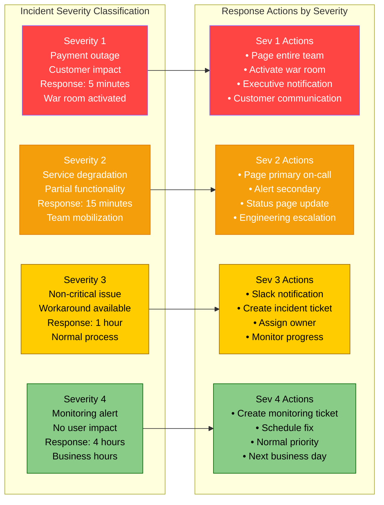
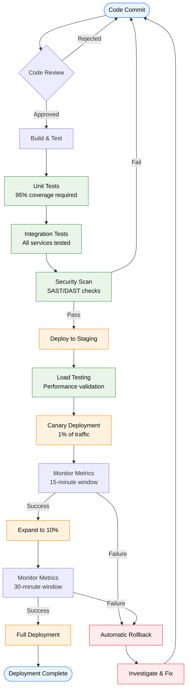
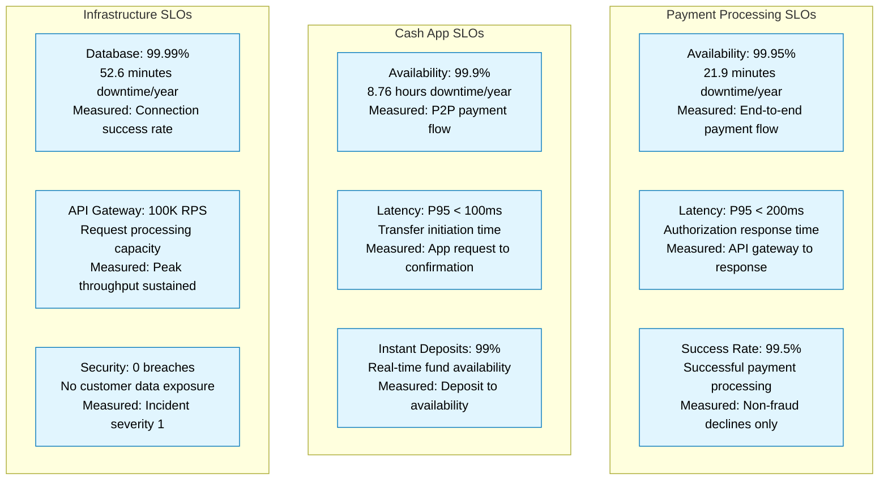
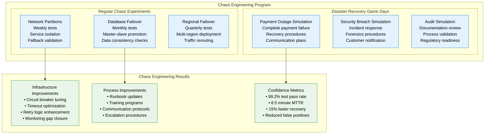
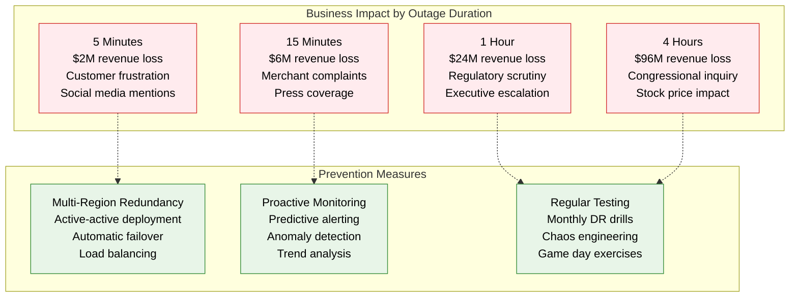

# Square Production Operations - 24/7 Payment Operations

## The Ops View: Operating $200B+ Annual Payment Volume

Square's production operations represent one of the most sophisticated 24/7 financial operations in the world, maintaining 99.95% uptime while processing millions of transactions daily across payments, Cash App, and cryptocurrency trading.

```mermaid
graph TB
    subgraph MonitoringStack[Monitoring & Observability - 24/7 Visibility]
        subgraph MetricsLayer[Metrics & KPIs]
            DATADOG[DataDog Platform<br/>Full-stack monitoring<br/>Custom dashboards<br/>$500K/year]
            PROMETHEUS[Prometheus<br/>Time-series metrics<br/>Alert rules<br/>$200K/year]
            GRAFANA[Grafana<br/>Visualization<br/>Executive dashboards<br/>$100K/year]
        end

        subgraph LoggingPlatform[Centralized Logging]
            ELK[ELK Stack<br/>Elasticsearch + Logstash + Kibana<br/>1TB/day ingestion<br/>$300K/year]
            FLUENTD[Fluentd<br/>Log aggregation<br/>Multi-region collection<br/>$150K/year]
            SPLUNK[Splunk Enterprise<br/>Security monitoring<br/>Compliance logging<br/>$400K/year]
        end

        subgraph TracingSystem[Distributed Tracing]
            JAEGER[Jaeger<br/>Request tracing<br/>Performance analysis<br/>$100K/year]
            ZIPKIN[Zipkin<br/>Microservice tracing<br/>Latency debugging<br/>$50K/year]
            OPENCENSUS[OpenCensus<br/>Trace aggregation<br/>Cross-service visibility<br/>Open source]
        end
    end

    subgraph AlertingSystem[Alerting & Incident Response]
        subgraph AlertChannels[Alert Channels]
            PAGERDUTY[PagerDuty<br/>24/7 escalation<br/>On-call rotations<br/>$100K/year]
            SLACK[Slack Integrations<br/>Team notifications<br/>Bot automation<br/>$50K/year]
            EMAIL[Email Alerts<br/>Executive summaries<br/>Weekly reports<br/>$20K/year]
        end

        subgraph IncidentResponse[Incident Management]
            WARROOM[War Room Procedures<br/>Critical incident response<br/>Executive escalation<br/>Command center]
            POSTMORTEM[Postmortem Process<br/>Blameless culture<br/>Learning documentation<br/>Action items]
            COMMS[Communication Plan<br/>Status page updates<br/>Customer notifications<br/>Stakeholder alerts]
        end
    end

    subgraph DeploymentPipeline[CI/CD & Deployment]
        subgraph SourceControl[Source Control & CI]
            GITHUB[GitHub Enterprise<br/>Source code management<br/>Code review process<br/>$200K/year]
            JENKINS[Jenkins<br/>Build automation<br/>Test execution<br/>$150K/year]
            SONAR[SonarQube<br/>Code quality gates<br/>Security scanning<br/>$100K/year]
        end

        subgraph DeploymentStrategy[Deployment Strategy]
            CANARY[Canary Deployments<br/>1% → 10% → 100%<br/>Automated rollback<br/>Risk mitigation]
            BLUEGREEN[Blue-Green Deployment<br/>Zero-downtime deploys<br/>Database migrations<br/>Instant rollback]
            FEATURE[Feature Flags<br/>Gradual rollout<br/>A/B testing<br/>Kill switches]
        end

        subgraph InfraAsCode[Infrastructure as Code]
            TERRAFORM[Terraform<br/>Infrastructure provisioning<br/>Multi-cloud deployment<br/>$80K/year]
            ANSIBLE[Ansible<br/>Configuration management<br/>Automated patching<br/>$60K/year]
            KUBERNETES[Kubernetes<br/>Container orchestration<br/>Auto-scaling<br/>$300K/year]
        end
    end

    subgraph SecurityOperations[Security Operations Center]
        subgraph ThreatDetection[Threat Detection]
            SIEM[SIEM Platform<br/>Security event correlation<br/>Threat intelligence<br/>$800K/year]
            CROWDSTRIKE[CrowdStrike<br/>Endpoint protection<br/>Threat hunting<br/>$400K/year]
            VULNERABILITY[Vulnerability Management<br/>Continuous scanning<br/>Risk assessment<br/>$200K/year]
        end

        subgraph ComplianceOps[Compliance Operations]
            PCISCAN[PCI Scanning<br/>Quarterly assessments<br/>Vulnerability remediation<br/>$300K/year]
            PENETRATION[Penetration Testing<br/>Third-party assessments<br/>Red team exercises<br/>$500K/year]
            AUDITPREP[Audit Preparation<br/>SOX compliance<br/>Documentation<br/>$400K/year]
        end
    end

    subgraph CapacityManagement[Capacity Planning & Scaling]
        subgraph AutoScaling[Auto-Scaling Systems]
            HPA[Horizontal Pod Autoscaler<br/>CPU/Memory scaling<br/>Custom metrics<br/>Kubernetes native]
            VPA[Vertical Pod Autoscaler<br/>Resource optimization<br/>Right-sizing<br/>Cost optimization]
            CLUSTER[Cluster Autoscaler<br/>Node provisioning<br/>Multi-AZ scaling<br/>Spot instance integration]
        end

        subgraph CapacityPlanning[Capacity Planning]
            FORECAST[Traffic Forecasting<br/>ML-based predictions<br/>Seasonal adjustments<br/>Black Friday prep]
            LOADTEST[Load Testing<br/>Performance validation<br/>Stress testing<br/>Chaos engineering]
            OPTIMIZATION[Resource Optimization<br/>Cost analysis<br/>Performance tuning<br/>Right-sizing]
        end
    end

    %% Operational Flow Connections
    DATADOG --> PAGERDUTY
    PROMETHEUS --> SLACK
    ELK --> WARROOM

    GITHUB --> JENKINS
    JENKINS --> CANARY
    CANARY --> BLUEGREEN

    TERRAFORM --> KUBERNETES
    ANSIBLE --> KUBERNETES

    SIEM --> CROWDSTRIKE
    PCISCAN --> AUDITPREP

    HPA --> FORECAST
    LOADTEST --> OPTIMIZATION

    %% Apply four-plane colors for operations
    classDef monitoringStyle fill:#3B82F6,stroke:#2563EB,color:#fff
    classDef alertingStyle fill:#8B5CF6,stroke:#7C3AED,color:#fff
    classDef deploymentStyle fill:#10B981,stroke:#059669,color:#fff
    classDef securityStyle fill:#F59E0B,stroke:#D97706,color:#fff

    class DATADOG,PROMETHEUS,GRAFANA,ELK,FLUENTD,SPLUNK,JAEGER,ZIPKIN,OPENCENSUS monitoringStyle
    class PAGERDUTY,SLACK,EMAIL,WARROOM,POSTMORTEM,COMMS alertingStyle
    class GITHUB,JENKINS,SONAR,CANARY,BLUEGREEN,FEATURE,TERRAFORM,ANSIBLE,KUBERNETES deploymentStyle
    class SIEM,CROWDSTRIKE,VULNERABILITY,PCISCAN,PENETRATION,AUDITPREP,HPA,VPA,CLUSTER,FORECAST,LOADTEST,OPTIMIZATION securityStyle
```



## 24/7 Operations Team Structure

### On-Call Engineering Organization
```mermaid
graph TB
    subgraph OnCallStructure[24/7 On-Call Structure]
        subgraph PrimaryOnCall[Primary On-Call (24/7)]
            PAYMENTS[Payments Engineer<br/>Payment flow expertise<br/>Database management<br/>Network troubleshooting]
            CASHAPP[Cash App Engineer<br/>P2P payments<br/>Mobile app issues<br/>User experience]
            PLATFORM[Platform Engineer<br/>Infrastructure issues<br/>Kubernetes clusters<br/>Service mesh]
        end

        subgraph SecondaryOnCall[Secondary On-Call (24/7)]
            SENIOR[Senior Engineer<br/>Escalation point<br/>Complex debugging<br/>Architecture decisions]
            SRE[SRE Lead<br/>Infrastructure automation<br/>Capacity planning<br/>Performance optimization]
            SECURITY[Security Engineer<br/>Incident response<br/>Threat analysis<br/>Compliance issues]
        end

        subgraph ExecutiveEscalation[Executive Escalation]
            ENGMGR[Engineering Manager<br/>Team coordination<br/>Resource allocation<br/>Stakeholder communication]
            CTO[CTO Office<br/>Critical incidents<br/>Business impact<br/>External communication]
        end
    end

    PAYMENTS --> SENIOR
    CASHAPP --> SRE
    PLATFORM --> SECURITY

    SENIOR --> ENGMGR
    SRE --> ENGMGR
    SECURITY --> ENGMGR

    ENGMGR --> CTO

    classDef primaryStyle fill:#90EE90,stroke:#006400,color:#000
    classDef secondaryStyle fill:#FFD700,stroke:#FF8C00,color:#000
    classDef executiveStyle fill:#FF6B6B,stroke:#DC143C,color:#fff

    class PAYMENTS,CASHAPP,PLATFORM primaryStyle
    class SENIOR,SRE,SECURITY secondaryStyle
    class ENGMGR,CTO executiveStyle
```

### Incident Response Procedures

#### Severity Levels & Response Times


## Deployment Operations

### Release Management Process


### Production Deployment Windows

#### Deployment Schedule
- **Standard Deployments**: Tuesday/Thursday 10 AM PST
- **Hotfix Deployments**: Any time with proper approval
- **Major Releases**: Sunday 2 AM PST (low traffic)
- **Emergency Deployments**: War room approval required

#### Rollback Procedures
```yaml
rollback_procedures:
  automatic_triggers:
    - error_rate > 5%
    - latency_p95 > 500ms
    - payment_success_rate < 99%
    - database_connection_failures > 10%

  manual_triggers:
    - customer_complaints > 50/hour
    - business_metric_degradation
    - security_incident_detected
    - executive_decision

  rollback_time:
    - database_changes: 15 minutes
    - application_code: 5 minutes
    - configuration_changes: 2 minutes
    - infrastructure_changes: 30 minutes
```

## Performance Monitoring & SLOs

### Service Level Objectives (SLOs)


### Error Budget Management
```mermaid
graph LR
    subgraph ErrorBudgets[Monthly Error Budget Tracking]
        BUDGET[Error Budget: 0.05%<br/>21.9 minutes/month<br/>Payment downtime allowance]

        SPENT[Budget Spent<br/>Real-time tracking<br/>Incident duration<br/>Remaining budget]

        ACTIONS[Budget Actions<br/>< 50%: Normal operations<br/>50-80%: Increased caution<br/>> 80%: Feature freeze]
    end

    subgraph BudgetMetrics[Error Budget Metrics (Q4 2024)]
        JAN[January: 85% spent<br/>Feature freeze activated<br/>Focus on reliability<br/>Infrastructure improvements]

        FEB[February: 45% spent<br/>Normal operations<br/>New feature releases<br/>Performance optimizations]

        MAR[March: 92% spent<br/>Critical reliability focus<br/>No new deployments<br/>Incident prevention only]
    end

    BUDGET --> SPENT
    SPENT --> ACTIONS

    ACTIONS -.-> JAN
    ACTIONS -.-> FEB
    ACTIONS -.-> MAR

    classDef budgetStyle fill:#FFF3E0,stroke:#EF6C00,color:#000
    classDef normalStyle fill:#E8F5E8,stroke:#388E3C,color:#000
    classDef cautionStyle fill:#FFF8E1,stroke:#F57F17,color:#000
    classDef freezeStyle fill:#FFEBEE,stroke:#D32F2F,color:#000

    class BUDGET,SPENT,ACTIONS budgetStyle
    class FEB normalStyle
    class JAN cautionStyle
    class MAR freezeStyle
```

## Chaos Engineering & Resilience Testing

### Chaos Engineering Program


## Business Continuity & Disaster Recovery

### Disaster Recovery Metrics (2024 Actuals)
- **RTO (Recovery Time Objective)**: 15 minutes
- **RPO (Recovery Point Objective)**: 1 minute
- **MTTR (Mean Time to Recovery)**: 8.7 minutes
- **Disaster Recovery Success Rate**: 99.7%
- **Data Loss Incidents**: 0 (zero tolerance)

### Business Impact Analysis


This production operations framework enables Square to maintain 99.95% uptime while processing $200B+ annually, with comprehensive monitoring, automated recovery, and battle-tested incident response procedures that keep payments flowing 24/7/365.