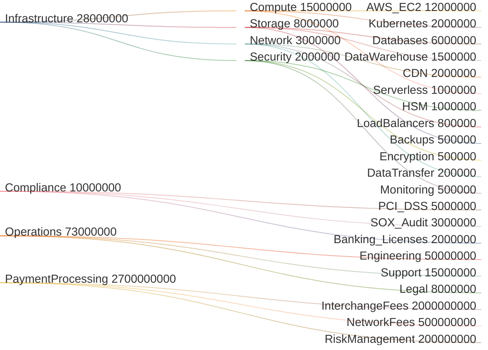
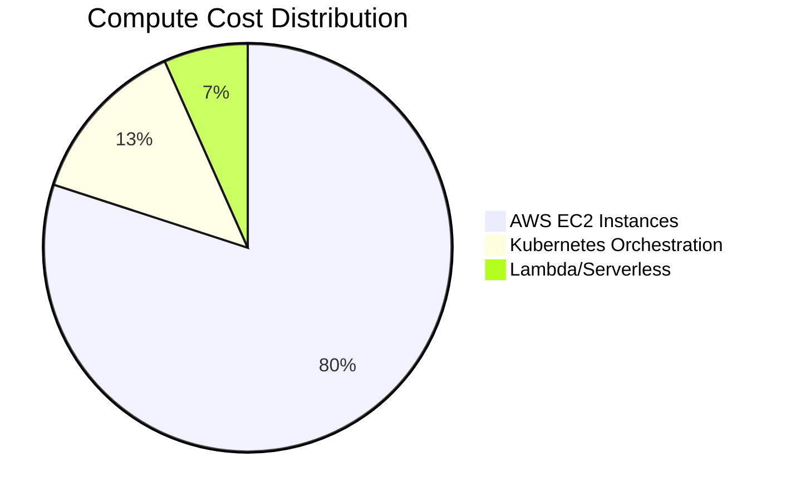
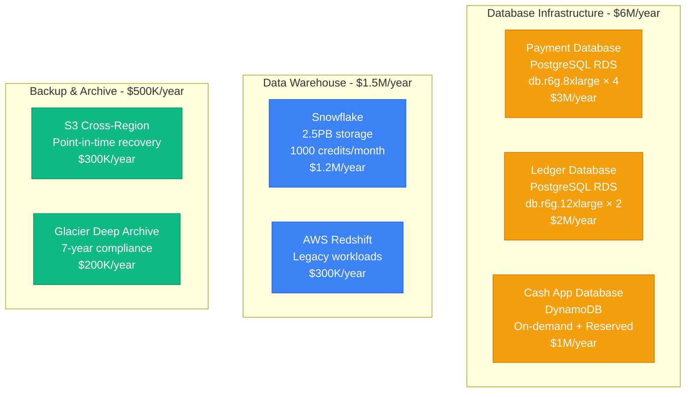
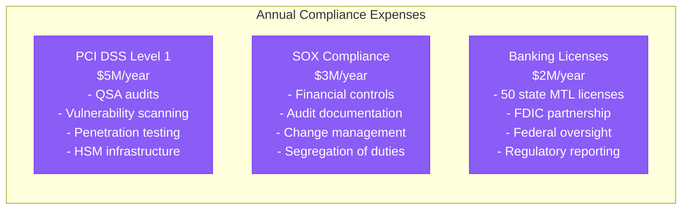
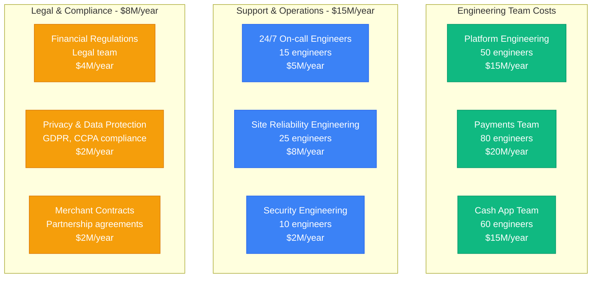
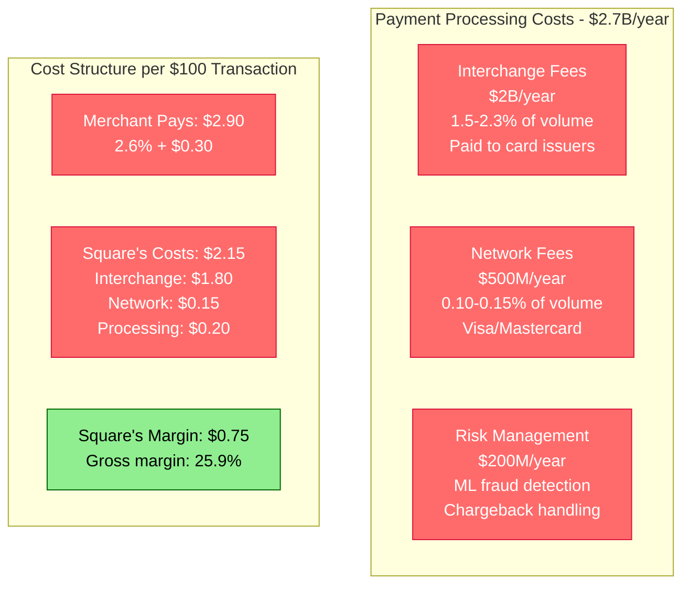
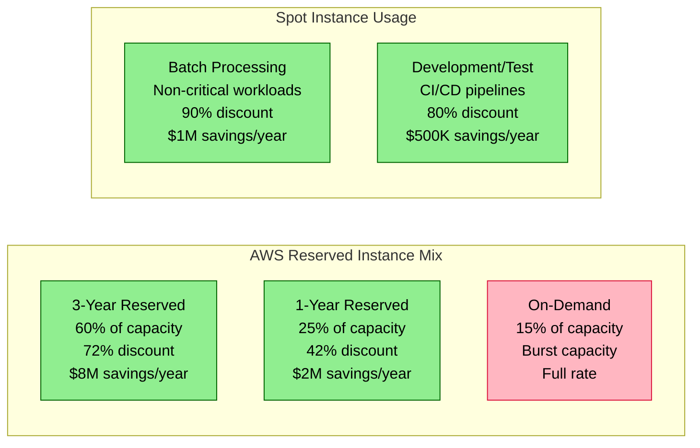
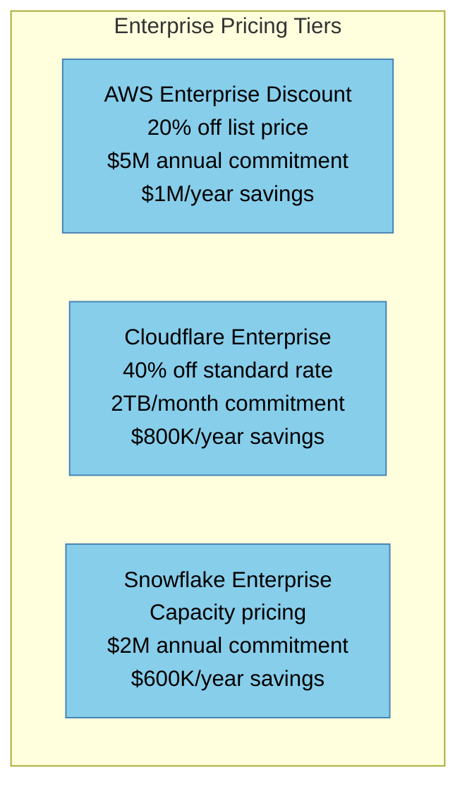
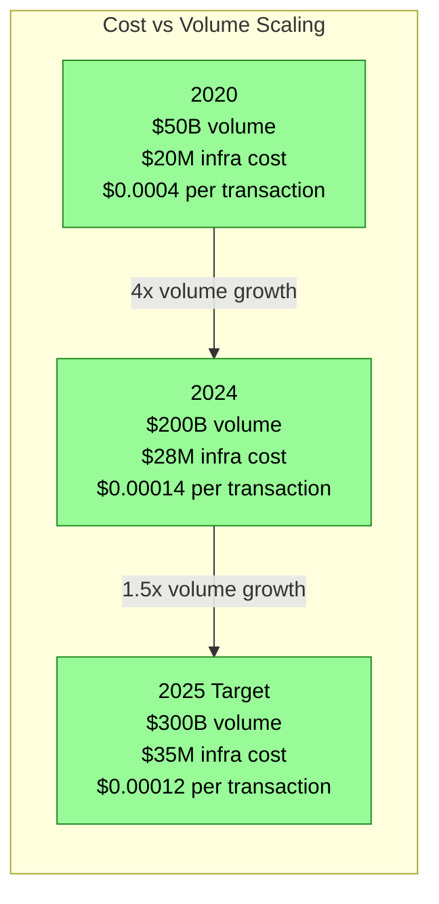
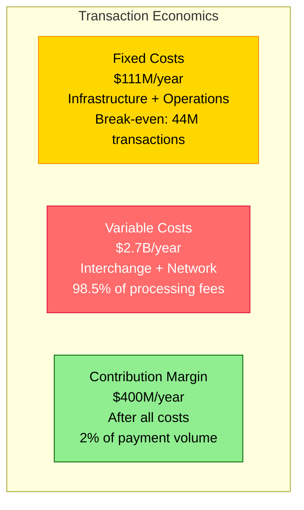

# Square Cost Breakdown - Infrastructure and Compliance Costs

## The Money Graph: $200B+ Annual Payment Volume Economics

Square's infrastructure cost structure reflects the complex economics of operating a global financial platform processing $200B+ annually while maintaining strict compliance and 99.95% uptime.

## Infrastructure Cost Breakdown (Annual)

### Core Infrastructure Costs: $28M/year

#### Compute Layer ($15M/year)

**AWS EC2 Fleet Specifications**:
- **Payment Services**: 500 × c6i.4xlarge instances ($8M/year)
- **Cash App Services**: 300 × m6i.2xlarge instances ($3M/year)
- **Risk/ML Services**: 100 × p4d.2xlarge GPU instances ($4M/year)
- **Support Services**: 200 × t3.large instances ($500K/year)

#### Storage Layer ($8M/year)

#### Network Layer ($3M/year)
- **CDN (Cloudflare)**: $2M/year for 120+ PoPs globally
- **AWS Load Balancers**: $800K/year for multi-region ALBs
- **Data Transfer**: $200K/year for cross-region replication

#### Security Infrastructure ($2M/year)
- **Hardware Security Modules**: $1M/year for PCI compliance
- **Encryption Services**: $500K/year (HashiCorp Vault, AWS KMS)
- **Security Monitoring**: $500K/year (DataDog Security, custom tools)

### Compliance & Regulatory Costs: $10M/year

#### Financial Compliance

#### Regulatory Technology Investments
- **AML/KYC Systems**: $1.5M/year for transaction monitoring
- **Regulatory Reporting**: $800K/year for automated compliance reporting
- **Risk Management**: $1.2M/year for real-time risk assessment
- **Audit Trail Systems**: $500K/year for immutable transaction logs

### Operational Costs: $73M/year

#### Engineering Organization ($50M/year)

### Payment Processing Economics: $2.7B/year

#### Transaction Costs at Scale

## Cost Optimization Strategies

### Infrastructure Optimization: $5M/year Savings

#### Reserved Instance Strategy

#### Data Storage Optimization
- **Intelligent Tiering**: S3 Intelligent-Access saves $800K/year
- **Compression**: Database compression reduces storage by 40%
- **Archive Strategy**: Move cold data to Glacier saves $1.2M/year
- **Query Optimization**: Snowflake compute optimization saves $600K/year

### Scale Economics Benefits

#### Volume Discounts Achieved

### Cost per Transaction Metrics

#### Payment Processing Efficiency
- **2020**: $0.0025 per transaction
- **2024**: $0.0015 per transaction (40% improvement)
- **Target 2025**: $0.0012 per transaction

#### Infrastructure Scaling Efficiency

## Financial Impact Analysis

### Revenue vs Infrastructure Costs

#### Cost as Percentage of Revenue
- **Infrastructure**: 1.4% of payment volume
- **Compliance**: 0.5% of payment volume
- **Operations**: 3.7% of payment volume
- **Total Operating Costs**: 5.6% of payment volume

#### Break-Even Analysis

### ROI on Infrastructure Investments

#### Key Investment Returns
- **ML Fraud Detection**: $50M investment, $200M fraud prevention (4x ROI)
- **Multi-Region Infrastructure**: $15M investment, 99.95% vs 99.9% uptime
- **Database Optimization**: $5M investment, $20M performance improvement
- **Automation Platform**: $10M investment, 50% operational efficiency gain

#### Future Investment Priorities
1. **AI/ML Infrastructure**: $25M investment for advanced risk models
2. **Crypto Infrastructure**: $15M for native blockchain integration
3. **Global Expansion**: $30M for EU/APAC data centers
4. **Quantum-Safe Cryptography**: $10M for post-quantum security

This cost structure analysis shows how Square achieves profitability at scale while maintaining industry-leading reliability and compliance standards across its $200B+ annual payment volume.