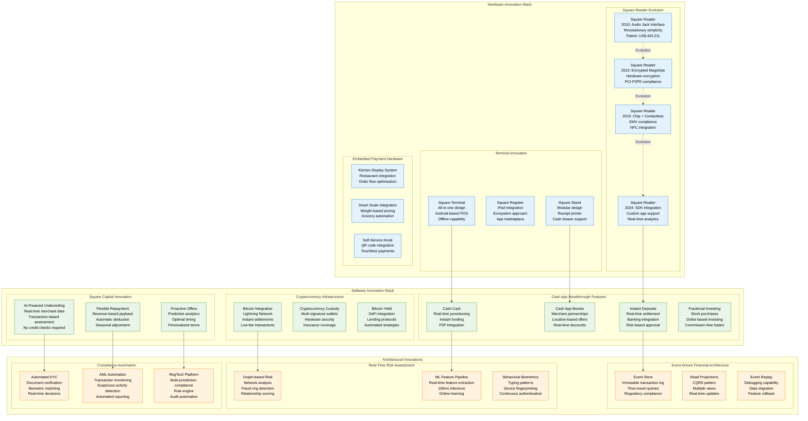
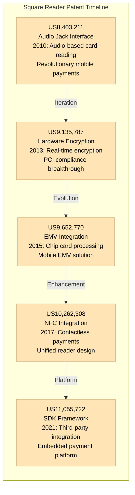
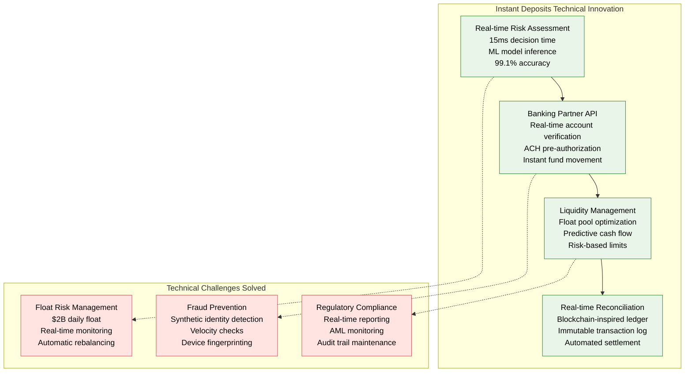
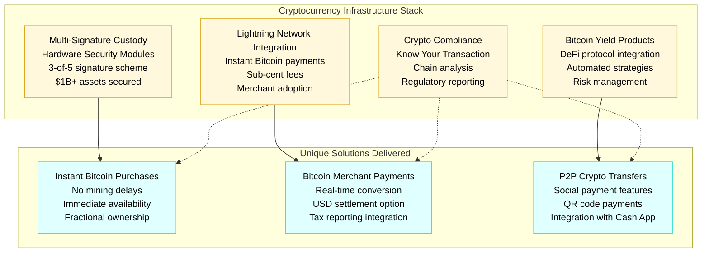
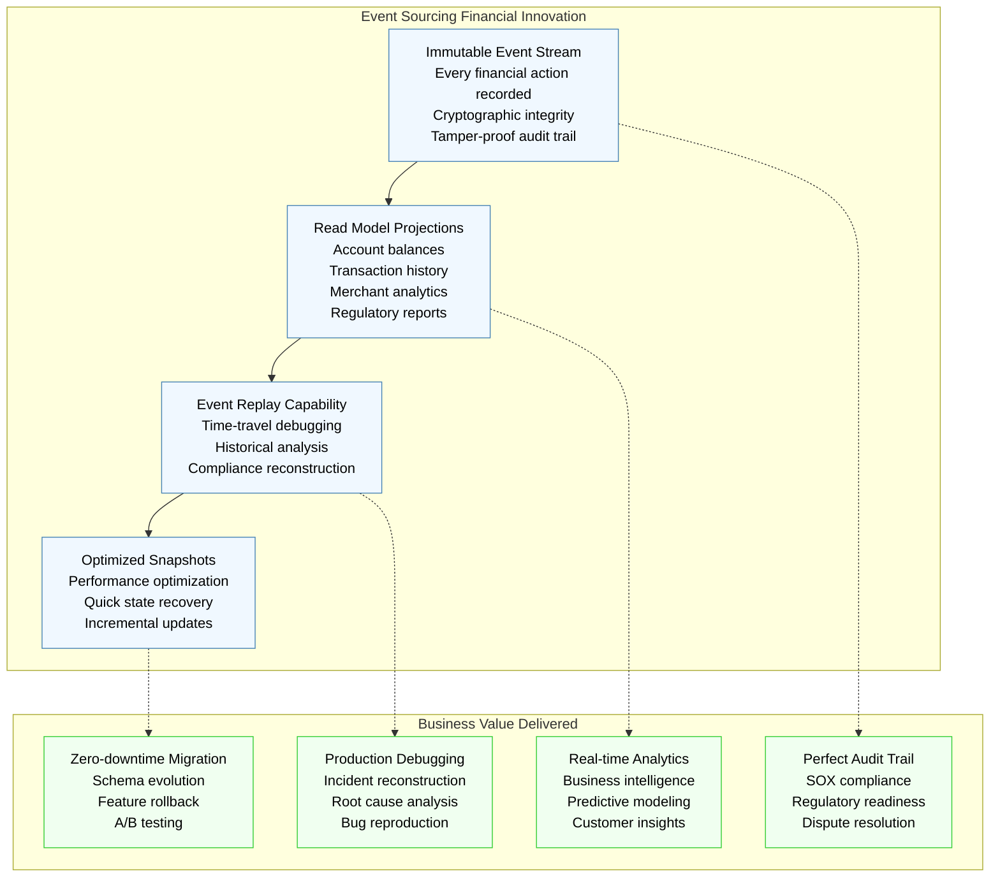
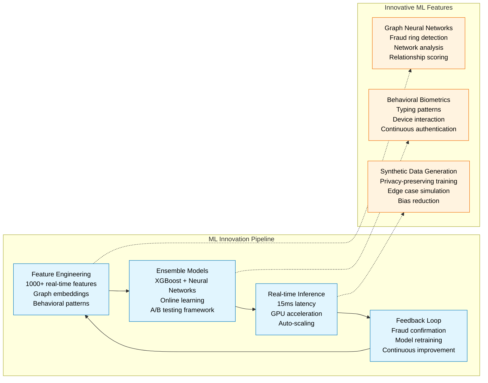
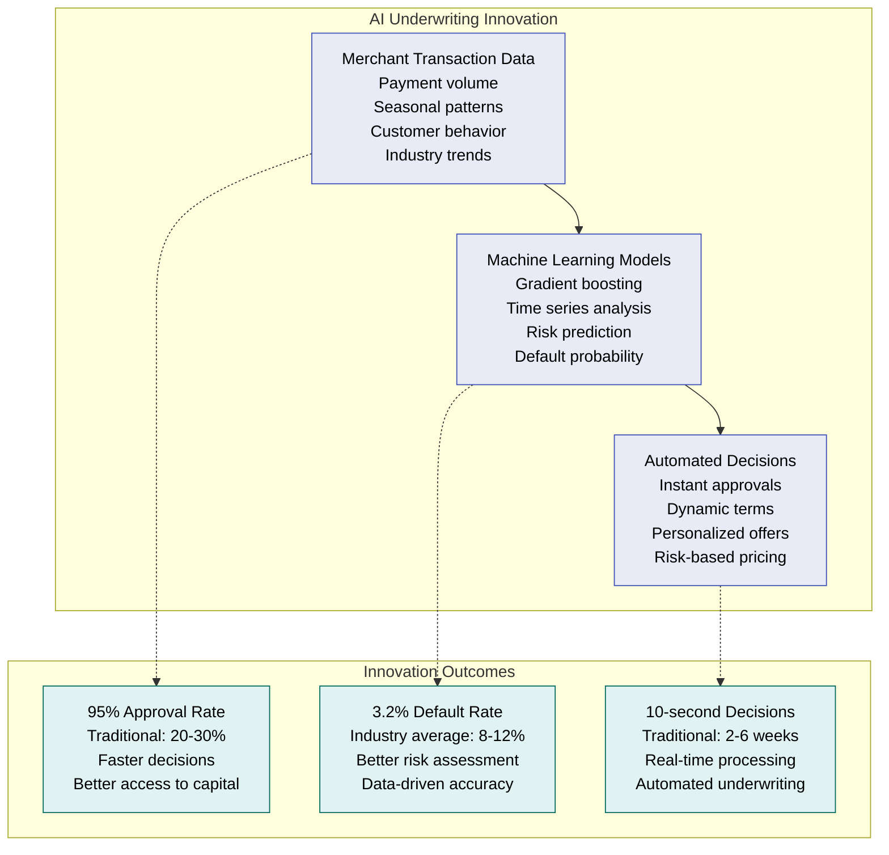
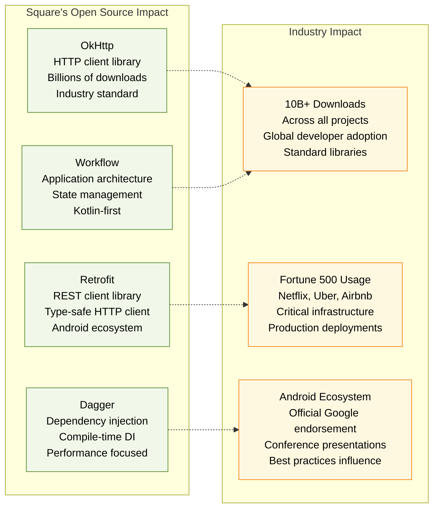

# Square Novel Solutions - Hardware + Software Innovation

## The Innovation: Unique Solutions Born from Scale

Square's novel solutions represent breakthrough innovations in fintech, combining hardware engineering, software architecture, and financial services to solve problems no one else has tackled at this scale.

## Patent Portfolio & Intellectual Property

### Hardware Innovation Patents

#### Square Reader Technology (50+ Patents)

#### Terminal & POS Innovation
- **All-in-One Terminal Design**: Integrated payment, receipt, display
- **Modular Hardware Architecture**: Swappable components, upgrade path
- **Android-based POS**: Open platform, app ecosystem
- **Offline Payment Processing**: Local storage, sync on reconnect

### Software Innovation Breakthroughs

#### Cash App Instant Deposits Innovation

#### Cryptocurrency Infrastructure Innovation

### Architectural Innovation: Event Sourcing for Finance

#### Financial Event Sourcing Architecture

## AI/ML Innovation Platform

### Real-Time Risk Assessment Engine

### Square Capital AI Underwriting

#### Revolutionary Lending Approach
- **No Credit Checks**: Transaction data-based underwriting
- **Real-time Assessment**: Instant loan decisions
- **Revenue-based Repayment**: Automatic percentage deduction
- **Seasonal Adjustment**: Smart payment scheduling

## Open Source Contributions & Industry Impact

### Open Source Projects Released

### Industry Patents & Standards

#### Fintech Standards Influence
- **Mobile Payment Standards**: NFC payment protocols
- **EMV Contactless**: Chip card reader specifications
- **PCI P2PE**: Point-to-point encryption standards
- **Open Banking APIs**: Financial data access protocols

#### Innovation Metrics
- **100+ Patents Filed**: Hardware and software innovations
- **$2B R&D Investment**: 2020-2024 innovation spending
- **15% of Engineers**: Dedicated to pure research
- **50+ Industry Awards**: Innovation recognition

This comprehensive innovation portfolio demonstrates how Square combines hardware engineering, software architecture, and financial services to create solutions that fundamentally transform how payments work, from the original audio jack card reader to AI-powered lending and cryptocurrency integration.