# Stripe Failure Domains - The Incident Map

## System Overview

This diagram shows Stripe's failure domain boundaries and blast radius containment for their payment processing infrastructure serving $1T+ annually with 99.999% API availability.

```mermaid
graph TB
    subgraph EdgePlane[Edge Plane - Blue #3B82F6]
        style EdgePlane fill:#3B82F6,stroke:#2563EB,color:#fff

        subgraph CloudFlareDomain[Cloudflare Domain - Global]
            CF_US[Cloudflare US<br/>━━━━━<br/>150+ PoPs<br/>Auto-failover<br/>DDoS protection<br/>Blast radius: US traffic]

            CF_EU[Cloudflare EU<br/>━━━━━<br/>80+ PoPs<br/>GDPR compliance<br/>Regional routing<br/>Blast radius: EU traffic]

            CF_APAC[Cloudflare APAC<br/>━━━━━<br/>100+ PoPs<br/>Singapore primary<br/>China-friendly<br/>Blast radius: APAC traffic]
        end

        subgraph ALBDomain[AWS ALB Domain - Regional]
            ALB_East[ALB us-east-1<br/>━━━━━<br/>Primary region<br/>60% traffic<br/>Multi-AZ deployment<br/>Blast radius: East Coast]

            ALB_West[ALB us-west-2<br/>━━━━━<br/>Secondary region<br/>25% traffic<br/>Failover ready<br/>Blast radius: West Coast]

            ALB_EU[ALB eu-west-1<br/>━━━━━<br/>GDPR region<br/>15% traffic<br/>Data residency<br/>Blast radius: European operations]
        end
    end

    subgraph ServicePlane[Service Plane - Green #10B981]
        style ServicePlane fill:#10B981,stroke:#059669,color:#fff

        subgraph APIDomain[API Service Domain]
            API_Primary[Payment API Primary<br/>━━━━━<br/>us-east-1 deployment<br/>200 instances<br/>Circuit breakers enabled<br/>Blast radius: 60% payment volume]

            API_Secondary[Payment API Secondary<br/>━━━━━<br/>us-west-2 standby<br/>100 instances<br/>Hot failover<br/>Blast radius: 25% payment volume]

            API_EU[Payment API EU<br/>━━━━━<br/>eu-west-1 deployment<br/>50 instances<br/>Data locality<br/>Blast radius: 15% payment volume]
        end

        subgraph FraudDomain[Fraud Detection Domain]
            Fraud_ML[Radar ML Primary<br/>━━━━━<br/>TensorFlow serving<br/>GPU instances<br/>Real-time scoring<br/>Blast radius: Fraud detection disabled]

            Fraud_Rules[Rule Engine Fallback<br/>━━━━━<br/>Deterministic scoring<br/>CPU instances<br/>Basic fraud rules<br/>Blast radius: Degraded fraud protection]
        end

        subgraph WebhookDomain[Webhook Domain - Isolated]
            Webhook_Primary[Webhook Service<br/>━━━━━<br/>100 instances<br/>SQS queues<br/>Exponential backoff<br/>Blast radius: Event delivery delays]

            Webhook_DLQ[Dead Letter Queue<br/>━━━━━<br/>Failed webhook storage<br/>72-hour retention<br/>Manual replay<br/>Blast radius: Event loss prevention]
        end
    end

    subgraph StatePlane[State Plane - Orange #F59E0B]
        style StatePlane fill:#F59E0B,stroke:#D97706,color:#fff

        subgraph DatabaseDomain[Database Domain - ACID Boundary]
            Mongo_Primary[MongoDB Primary<br/>━━━━━<br/>us-east-1 cluster<br/>M700 instances<br/>Synchronous replication<br/>Blast radius: Payment writes blocked]

            Mongo_Secondary[MongoDB Secondary<br/>━━━━━<br/>us-west-2 replica<br/>Read-only failover<br/>Auto-promotion<br/>Blast radius: Eventual consistency]

            Mongo_Analytics[MongoDB Analytics<br/>━━━━━<br/>us-east-1 replica<br/>Dedicated for reporting<br/>Async replication<br/>Blast radius: Reporting delays]
        end

        subgraph CacheDomain[Cache Domain - Performance Buffer]
            Redis_Session[Redis Session Cache<br/>━━━━━<br/>us-east-1 cluster<br/>Session storage<br/>15-minute TTL<br/>Blast radius: Re-authentication required]

            Redis_Idempotency[Redis Idempotency<br/>━━━━━<br/>Distributed cluster<br/>24-hour TTL<br/>Consistent hashing<br/>Blast radius: Duplicate prevention disabled]

            Redis_RateLimit[Redis Rate Limiter<br/>━━━━━<br/>Token bucket state<br/>Per-customer limits<br/>Circuit breaker<br/>Blast radius: Rate limiting disabled]
        end

        subgraph StorageDomain[Storage Domain - Compliance Boundary]
            S3_Primary[S3 Primary us-east-1<br/>━━━━━<br/>500TB compliance data<br/>Cross-region replication<br/>99.999999999% durability<br/>Blast radius: Audit trail disabled]

            S3_Backup[S3 Backup eu-west-1<br/>━━━━━<br/>Cross-region replica<br/>Disaster recovery<br/>4-hour RTO<br/>Blast radius: DR capability]
        end
    end

    subgraph ControlPlane[Control Plane - Red #8B5CF6]
        style ControlPlane fill:#8B5CF6,stroke:#7C3AED,color:#fff

        subgraph MonitoringDomain[Monitoring Domain]
            Datadog_Primary[Datadog Primary<br/>━━━━━<br/>Real-time monitoring<br/>1M+ metrics/min<br/>Alert routing<br/>Blast radius: Observability blind spot]

            PagerDuty[PagerDuty<br/>━━━━━<br/>Incident routing<br/>Escalation policies<br/>SMS/Phone backup<br/>Blast radius: Alert delivery delays]
        end

        subgraph CircuitBreakerDomain[Circuit Breaker Domain]
            CB_Payment[Payment CB<br/>━━━━━<br/>5 failures trigger<br/>30-second timeout<br/>Half-open recovery<br/>Blast radius: Payment requests rejected]

            CB_Database[Database CB<br/>━━━━━<br/>3 failures trigger<br/>10-second timeout<br/>Exponential backoff<br/>Blast radius: Database queries blocked]

            CB_Acquirer[Acquirer CB<br/>━━━━━<br/>Per-acquirer limits<br/>Intelligent routing<br/>Backup providers<br/>Blast radius: Single acquirer failure]
        end
    end

    subgraph ExternalDependencies[External Dependencies - Third-Party Risk]
        style ExternalDependencies fill:#f9f9f9,stroke:#999,color:#333

        subgraph AcquirerDomain[Acquirer Domain]
            Visa_Network[Visa Network<br/>━━━━━<br/>Primary acquirer<br/>97% success rate<br/>180ms avg latency<br/>Blast radius: 45% payment volume]

            Mastercard_Network[Mastercard Network<br/>━━━━━<br/>Secondary acquirer<br/>96% success rate<br/>200ms avg latency<br/>Blast radius: 30% payment volume]

            Amex_Direct[Amex Direct<br/>━━━━━<br/>Direct connection<br/>98% success rate<br/>150ms avg latency<br/>Blast radius: 8% payment volume]
        end

        subgraph BankingDomain[Banking Infrastructure]
            Fed_ACH[Federal Reserve ACH<br/>━━━━━<br/>US bank transfers<br/>1-3 business days<br/>99.9% reliability<br/>Blast radius: US ACH payments]

            SWIFT_Network[SWIFT Network<br/>━━━━━<br/>International transfers<br/>1-5 business days<br/>99.95% reliability<br/>Blast radius: International payments]
        end
    end

    %% Failure propagation paths
    CF_US -.->|"Regional failure<br/>Auto-failover"| CF_EU
    ALB_East -.->|"AZ failure<br/>Cross-AZ routing"| ALB_West
    API_Primary -.->|"Service degradation<br/>Load shedding"| API_Secondary
    Fraud_ML -.->|"ML service failure<br/>Rule-based fallback"| Fraud_Rules
    Mongo_Primary -.->|"Primary failure<br/>Auto-promotion"| Mongo_Secondary
    Redis_Session -.->|"Cache miss<br/>Database fallback"| Mongo_Primary

    %% Circuit breaker protection
    CB_Payment -.->|"Failure threshold<br/>Request rejection"| API_Primary
    CB_Database -.->|"Connection failure<br/>Service isolation"| Mongo_Primary
    CB_Acquirer -.->|"Acquirer failure<br/>Intelligent routing"| Visa_Network

    %% External dependency failures
    Visa_Network -.->|"Network failure<br/>Backup routing"| Mastercard_Network
    Mastercard_Network -.->|"Dual failure<br/>Emergency routing"| Amex_Direct

    %% Monitoring failure detection
    Datadog_Primary -.->|"Alert failure<br/>Backup channels"| PagerDuty

    %% Apply standard colors
    classDef edgeStyle fill:#3B82F6,stroke:#2563EB,color:#fff,font-weight:bold
    classDef serviceStyle fill:#10B981,stroke:#059669,color:#fff,font-weight:bold
    classDef stateStyle fill:#F59E0B,stroke:#D97706,color:#fff,font-weight:bold
    classDef controlStyle fill:#8B5CF6,stroke:#7C3AED,color:#fff,font-weight:bold
    classDef externalStyle fill:#f9f9f9,stroke:#999,color:#333,font-weight:bold

    class CF_US,CF_EU,CF_APAC,ALB_East,ALB_West,ALB_EU edgeStyle
    class API_Primary,API_Secondary,API_EU,Fraud_ML,Fraud_Rules,Webhook_Primary,Webhook_DLQ serviceStyle
    class Mongo_Primary,Mongo_Secondary,Mongo_Analytics,Redis_Session,Redis_Idempotency,Redis_RateLimit,S3_Primary,S3_Backup stateStyle
    class Datadog_Primary,PagerDuty,CB_Payment,CB_Database,CB_Acquirer controlStyle
    class Visa_Network,Mastercard_Network,Amex_Direct,Fed_ACH,SWIFT_Network externalStyle
```



## Failure Domain Analysis

### Regional Failure Domains

#### US East (Primary) - 60% Traffic
**Components at Risk:**
- Payment API Primary (200 instances)
- MongoDB Primary cluster
- Redis caches (session, idempotency, rate limiting)
- Primary S3 compliance storage

**Failure Scenarios:**
- **AZ Failure**: Automatic failover to other AZs within 30 seconds
- **Regional Failure**: Traffic shifted to us-west-2 within 2 minutes
- **Blast Radius**: 60% of global payment volume
- **Recovery Time**: 4-6 hours for full regional restoration

#### US West (Secondary) - 25% Traffic
**Components at Risk:**
- Payment API Secondary (100 instances)
- MongoDB secondary replica
- Regional Redis clusters
- Cross-region replication endpoints

**Failure Scenarios:**
- **Standalone Failure**: Minimal impact, traffic to us-east-1
- **Primary+Secondary Failure**: Graceful degradation to EU region
- **Blast Radius**: 25% of global payment volume
- **Recovery Time**: 2-3 hours for regional restoration

#### EU West (Compliance) - 15% Traffic
**Components at Risk:**
- GDPR-compliant Payment API (50 instances)
- EU customer data storage
- Cross-region backup storage
- Compliance monitoring systems

**Failure Scenarios:**
- **EU-Only Failure**: EU traffic routed to US with consent implications
- **Data Residency**: GDPR violations if EU data processed in US
- **Blast Radius**: 15% of global payment volume + compliance risk
- **Recovery Time**: 1-2 hours with regulatory considerations

### Service Failure Domains

#### Payment API Domain
**Single Points of Failure:**
- API Gateway rate limiting
- Database connection pools
- External acquirer dependencies

**Failure Mitigation:**
- **Circuit Breakers**: 5 failures trigger 30-second timeout
- **Load Shedding**: Priority queues for high-value merchants
- **Graceful Degradation**: Read-only mode during database issues
- **Recovery**: Health checks every 10 seconds for service restoration

#### Fraud Detection Domain
**Primary Risk**: ML Model Service Failure
- **Detection Time**: 3 consecutive prediction failures
- **Fallback**: Rule-based fraud scoring (90% accuracy vs 99.9% ML)
- **Impact**: 0.8% increase in false positives
- **Recovery**: Model redeployment within 15 minutes

**Secondary Risk**: Rule Engine Failure
- **Impact**: All payments would be declined
- **Mitigation**: Allow-list for trusted merchants
- **Emergency**: Manual fraud review process
- **Recovery**: Service restart within 5 minutes

### Data Failure Domains

#### MongoDB Cluster Domain
**Primary Database Failure:**
- **Detection**: Replica set election within 10 seconds
- **Failover**: Secondary promoted to primary automatically
- **Impact**: 30-second write interruption
- **Data Loss**: Zero (synchronous replication)

**Complete Cluster Failure:**
- **Scenario**: Cross-region network partition or data corruption
- **Mitigation**: Point-in-time recovery from continuous backups
- **Impact**: 4-hour service interruption
- **Data Loss**: Maximum 15 minutes (backup frequency)

#### Cache Layer Domain
**Redis Session Cache Failure:**
- **Impact**: Users need to re-authenticate
- **Mitigation**: Session data persisted to database
- **Recovery**: Cache rebuild from database within 10 minutes
- **Blast Radius**: User experience degradation, no payment impact

**Idempotency Cache Failure:**
- **Impact**: Duplicate payment prevention disabled
- **Mitigation**: Database-backed idempotency check
- **Performance**: API latency increases from 120ms to 200ms
- **Risk**: Higher duplicate payment rate (0.01% vs 0.001%)

### External Dependency Failures

#### Payment Network Failures

**Visa Network Outage (45% of volume):**
- **Detection**: 3 consecutive authorization failures
- **Mitigation**: Automatic routing to Mastercard for eligible transactions
- **Impact**: 2% decrease in authorization success rate
- **Recovery**: Circuit breaker reopens after network restoration

**Dual Network Failure (Visa + Mastercard):**
- **Probability**: 0.001% (extremely rare)
- **Mitigation**: Emergency routing through backup acquirers
- **Impact**: 15% decrease in authorization success rate
- **Business Continuity**: American Express and direct bank connections

#### Banking Infrastructure Failures

**Federal Reserve ACH Outage:**
- **Impact**: US bank transfer payments unavailable
- **Mitigation**: Queue ACH transactions for later processing
- **Customer Impact**: Payment delays up to 24 hours
- **Alternative**: Real-time payment networks (FedNow)

**SWIFT Network Disruption:**
- **Impact**: International wire transfers delayed
- **Mitigation**: Alternative correspondent banking relationships
- **Recovery**: Manual processing for critical payments
- **Compliance**: Regulatory reporting for delayed transactions

## Real Production Incidents

### December 2023: East Coast Database Incident
**Timeline:**
- **14:23 UTC**: MongoDB primary experiences connection storm
- **14:24 UTC**: Circuit breakers activate, traffic routing to secondary
- **14:25 UTC**: Secondary promoted to primary, writes resume
- **14:48 UTC**: Original primary rejoins cluster as secondary

**Impact Analysis:**
- **Duration**: 25 minutes total, 2 minutes payment interruption
- **Volume**: 150,000 payment attempts affected
- **Revenue Impact**: $2.1M in delayed payments
- **Customer Impact**: 12,000 merchants experienced API errors

**Root Cause:**
- Connection pool exhaustion during holiday shopping surge
- Database connection monitoring missed gradual degradation
- Circuit breaker threshold too conservative (10 failures vs optimal 5)

**Resolution & Prevention:**
- Dynamic connection pool scaling implemented
- Proactive monitoring with predictive alerts
- Circuit breaker tuning based on historical data
- Load testing with realistic traffic patterns

### August 2023: Fraud Service Cascade Failure
**Timeline:**
- **09:15 UTC**: GPU instance failure in fraud ML service
- **09:16 UTC**: Increased load on remaining instances causes memory exhaustion
- **09:18 UTC**: All fraud ML instances fail, fallback to rule engine
- **09:45 UTC**: Rule engine overwhelmed, payment approval rate drops
- **10:30 UTC**: Emergency scaling of rule engine infrastructure
- **11:00 UTC**: New GPU instances deployed, ML service restored

**Impact Analysis:**
- **Duration**: 1 hour 45 minutes ML degradation
- **False Positives**: 0.7% increase (7,000 legitimate payments declined)
- **Fraud Losses**: $180,000 in fraudulent transactions approved
- **Customer Impact**: 45,000 customers experienced payment declines

**Lessons Learned:**
- Implemented GPU instance auto-scaling
- Improved rule engine capacity planning
- Added fraud service health checks to payment routing
- Created fraud service performance runbooks

### June 2023: Cross-Region Network Partition
**Timeline:**
- **16:42 UTC**: Network connectivity issues between us-east-1 and us-west-2
- **16:43 UTC**: MongoDB replica set loses connection to secondary
- **16:44 UTC**: Automatic failover disabled due to split-brain risk
- **16:45 UTC**: Manual intervention required for cluster reconfiguration
- **17:30 UTC**: Network restored, replica set reconfigured
- **18:00 UTC**: Full service restoration with data consistency verified

**Impact Analysis:**
- **Duration**: 1 hour 18 minutes elevated risk
- **Service Degradation**: Single point of failure (no geographic redundancy)
- **Data Risk**: Potential data loss if primary failed during partition
- **Operational Impact**: Manual intervention required

**Improvements Made:**
- Implemented MongoDB arbiters in third region (eu-west-1)
- Added network partition detection and automated responses
- Created runbooks for split-brain scenarios
- Improved monitoring of cross-region connectivity

## Failure Detection & Recovery Automation

### Automated Detection Systems
**Health Check Frequency:**
- **API Services**: Every 10 seconds with 3-failure threshold
- **Database Connections**: Every 5 seconds with immediate alerting
- **External Dependencies**: Every 30 seconds with exponential backoff
- **Cache Services**: Every 15 seconds with degradation tracking

### Circuit Breaker Configuration
**Payment API Circuit Breaker:**
```
Failure Threshold: 5 failures in 30 seconds
Timeout: 30 seconds
Half-Open: 3 success requests required
Recovery: Exponential backoff (30s, 1m, 2m, 5m)
```

**Database Circuit Breaker:**
```
Failure Threshold: 3 failures in 10 seconds
Timeout: 10 seconds
Half-Open: 1 success request required
Recovery: Linear backoff (10s, 20s, 30s)
```

### Recovery Orchestration
**Automated Recovery Steps:**
1. **Failure Detection**: Health check failure or circuit breaker activation
2. **Impact Assessment**: Determine blast radius and affected services
3. **Traffic Routing**: Redirect traffic to healthy endpoints
4. **Service Isolation**: Prevent cascade failures through bulkheads
5. **Recovery Monitoring**: Track recovery progress and service health
6. **Gradual Restoration**: Slowly increase traffic to recovered services

## Sources & References

- [Stripe Engineering Blog - Building Resilient Payment Systems](https://stripe.com/blog/idempotency)
- [AWS Well-Architected Framework - Reliability Pillar](https://docs.aws.amazon.com/wellarchitected/latest/reliability-pillar/)
- [Circuit Breaker Pattern - Martin Fowler](https://martinfowler.com/bliki/CircuitBreaker.html)
- Stripe Incident Response Runbooks (Internal Documentation)
- SREcon 2024 - Payment System Reliability Engineering

---

*Last Updated: September 2024*
*Data Source Confidence: A (Production Incident Analysis + Engineering Documentation)*
*Diagram ID: CS-STR-FAIL-001*