# Stripe Production Operations - The Ops View

## System Overview

This diagram shows Stripe's production operations infrastructure supporting 99.999% uptime for $1T+ annual payment processing, including zero-downtime deployments, comprehensive monitoring, and PCI compliance automation.

```mermaid
graph TB
    subgraph EdgePlane[Edge Plane - Blue #3B82F6]
        style EdgePlane fill:#3B82F6,stroke:#2563EB,color:#fff

        CDNMonitoring[CDN Health Monitoring<br/>━━━━━<br/>Cloudflare analytics<br/>Edge performance<br/>Global latency tracking<br/>DDoS event detection]

        LoadBalancerHealth[Load Balancer Health<br/>━━━━━<br/>AWS ALB monitoring<br/>Target group health<br/>Request distribution<br/>Failover detection]

        SSLCertMonitoring[SSL Certificate Monitor<br/>━━━━━<br/>Auto-renewal alerts<br/>Certificate expiry<br/>Chain validation<br/>Security scanning]
    end

    subgraph ServicePlane[Service Plane - Green #10B981]
        style ServicePlane fill:#10B981,stroke:#059669,color:#fff

        subgraph DeploymentPipeline[Deployment Pipeline - Zero Downtime]
            GitOpsController[GitOps Controller<br/>━━━━━<br/>ArgoCD deployment<br/>Git webhook triggers<br/>Automated rollbacks<br/>Canary deployments]

            BlueGreenOrch[Blue-Green Orchestrator<br/>━━━━━<br/>Traffic switching<br/>Health validation<br/>Rollback automation<br/>Database migrations]

            CanaryManager[Canary Manager<br/>━━━━━<br/>Progressive rollouts<br/>Error rate monitoring<br/>Automatic promotion<br/>Statistical validation]
        end

        subgraph TestingFramework[Testing & Validation]
            SmokeTests[Smoke Test Suite<br/>━━━━━<br/>API health checks<br/>Payment flow tests<br/>Database connectivity<br/>External service checks]

            LoadTesting[Load Testing<br/>━━━━━<br/>Performance validation<br/>Capacity testing<br/>Stress testing<br/>Chaos engineering]

            SecurityScanning[Security Scanning<br/>━━━━━<br/>SAST/DAST scanning<br/>Dependency checks<br/>Container scanning<br/>PCI compliance]
        end

        subgraph IncidentResponse[Incident Response System]
            PagerDuty[PagerDuty Integration<br/>━━━━━<br/>Alert escalation<br/>On-call rotation<br/>Incident coordination<br/>Status page updates]

            RunbookAutomation[Runbook Automation<br/>━━━━━<br/>Automated remediation<br/>Self-healing systems<br/>Diagnostic scripts<br/>Recovery procedures]

            IncidentCommander[Incident Commander<br/>━━━━━<br/>Incident coordination<br/>Communication hub<br/>Stakeholder updates<br/>Post-mortem tracking]
        end
    end

    subgraph StatePlane[State Plane - Orange #F59E0B]
        style StatePlane fill:#F59E0B,stroke:#D97706,color:#fff

        subgraph MonitoringData[Monitoring Data Store]
            MetricsDB[Metrics Database<br/>━━━━━<br/>InfluxDB cluster<br/>1B+ metrics/day<br/>7-day retention<br/>Real-time ingestion]

            LogsStorage[Logs Storage<br/>━━━━━<br/>Elasticsearch cluster<br/>500GB/day logs<br/>30-day retention<br/>Full-text search]

            TracingData[Distributed Tracing<br/>━━━━━<br/>Jaeger storage<br/>Request correlation<br/>Performance analysis<br/>Dependency mapping]
        end

        subgraph ConfigurationManagement[Configuration & Secrets]
            ConfigStore[Configuration Store<br/>━━━━━<br/>HashiCorp Consul<br/>Feature flags<br/>Environment configs<br/>Dynamic updates]

            SecretsManager[Secrets Management<br/>━━━━━<br/>AWS Secrets Manager<br/>Key rotation<br/>Access auditing<br/>Encryption at rest]

            PolicyEngine[Policy Engine<br/>━━━━━<br/>Open Policy Agent<br/>Access control<br/>Compliance rules<br/>Audit trails]
        end

        subgraph BackupRecovery[Backup & Recovery]
            BackupStorage[Backup Storage<br/>━━━━━<br/>Cross-region S3<br/>Point-in-time recovery<br/>Encrypted backups<br/>Compliance retention]

            DisasterRecovery[Disaster Recovery<br/>━━━━━<br/>Multi-region failover<br/>RTO: 4 hours<br/>RPO: 15 minutes<br/>Automated testing]
        end
    end

    subgraph ControlPlane[Control Plane - Red #8B5CF6]
        style ControlPlane fill:#8B5CF6,stroke:#7C3AED,color:#fff

        subgraph ObservabilityStack[Observability Stack]
            DatadogAPM[Datadog APM<br/>━━━━━<br/>Application monitoring<br/>Request tracing<br/>Error tracking<br/>Performance profiling]

            PrometheusMetrics[Prometheus Metrics<br/>━━━━━<br/>Infrastructure metrics<br/>Custom metrics<br/>Alert rules<br/>Service discovery]

            GrafanaViz[Grafana Dashboards<br/>━━━━━<br/>Visual monitoring<br/>Custom dashboards<br/>Alert notifications<br/>Team workspaces]
        end

        subgraph ComplianceAutomation[PCI Compliance Automation]
            VulnerabilityScanning[Vulnerability Scanner<br/>━━━━━<br/>Automated scanning<br/>CVE monitoring<br/>Risk assessment<br/>Remediation tracking]

            ComplianceReporting[Compliance Reports<br/>━━━━━<br/>PCI DSS validation<br/>SOX compliance<br/>GDPR auditing<br/>Automated evidence]

            AccessAuditing[Access Auditing<br/>━━━━━<br/>User activity logs<br/>Permission tracking<br/>Privilege escalation<br/>Compliance alerts]
        end

        subgraph CapacityManagement[Capacity Management]
            CapacityPlanning[Capacity Planning<br/>━━━━━<br/>Growth forecasting<br/>Resource modeling<br/>Cost optimization<br/>Performance tuning]

            AutoScaling[Auto Scaling<br/>━━━━━<br/>Predictive scaling<br/>Load-based scaling<br/>Schedule-based scaling<br/>Custom metrics]

            ResourceOptimization[Resource Optimization<br/>━━━━━<br/>Right-sizing analysis<br/>Unused resource detection<br/>Cost allocation<br/>Efficiency tracking]
        end
    end

    %% Deployment flow
    GitOpsController -->|"Deploy trigger<br/>Health checks<br/>Rollback on failure"| BlueGreenOrch
    BlueGreenOrch -->|"Canary validation<br/>Progressive traffic<br/>Error rate monitoring"| CanaryManager
    CanaryManager -->|"Smoke tests<br/>Health validation<br/>Performance checks"| SmokeTests
    SmokeTests -->|"Load validation<br/>Stress testing<br/>Chaos experiments"| LoadTesting

    %% Monitoring flow
    MetricsDB -->|"Real-time metrics<br/>Custom dashboards<br/>Alert correlation"| DatadogAPM
    LogsStorage -->|"Log analysis<br/>Error tracking<br/>Pattern detection"| PrometheusMetrics
    TracingData -->|"Request tracing<br/>Performance analysis<br/>Bottleneck detection"| GrafanaViz

    %% Incident response flow
    DatadogAPM -->|"Alert triggers<br/>Threshold breaches<br/>Anomaly detection"| PagerDuty
    PagerDuty -->|"Escalation rules<br/>On-call rotation<br/>Incident creation"| RunbookAutomation
    RunbookAutomation -->|"Automated actions<br/>Diagnostic data<br/>Recovery steps"| IncidentCommander

    %% Configuration management
    ConfigStore -->|"Dynamic configs<br/>Feature toggles<br/>Environment settings"| GitOpsController
    SecretsManager -->|"Secure credentials<br/>Key rotation<br/>Access control"| BlueGreenOrch
    PolicyEngine -->|"Access policies<br/>Compliance rules<br/>Audit requirements"| ComplianceReporting

    %% Backup and recovery
    BackupStorage -->|"Recovery testing<br/>Data validation<br/>Compliance verification"| DisasterRecovery
    DisasterRecovery -->|"Failover procedures<br/>Data consistency<br/>Service restoration"| IncidentCommander

    %% Compliance automation
    VulnerabilityScanning -->|"Security findings<br/>Risk assessment<br/>Remediation tasks"| ComplianceReporting
    AccessAuditing -->|"Access logs<br/>Privilege tracking<br/>Compliance evidence"| ComplianceReporting

    %% Apply standard colors
    classDef edgeStyle fill:#3B82F6,stroke:#2563EB,color:#fff,font-weight:bold
    classDef serviceStyle fill:#10B981,stroke:#059669,color:#fff,font-weight:bold
    classDef stateStyle fill:#F59E0B,stroke:#D97706,color:#fff,font-weight:bold
    classDef controlStyle fill:#8B5CF6,stroke:#7C3AED,color:#fff,font-weight:bold

    class CDNMonitoring,LoadBalancerHealth,SSLCertMonitoring edgeStyle
    class GitOpsController,BlueGreenOrch,CanaryManager,SmokeTests,LoadTesting,SecurityScanning,PagerDuty,RunbookAutomation,IncidentCommander serviceStyle
    class MetricsDB,LogsStorage,TracingData,ConfigStore,SecretsManager,PolicyEngine,BackupStorage,DisasterRecovery stateStyle
    class DatadogAPM,PrometheusMetrics,GrafanaViz,VulnerabilityScanning,ComplianceReporting,AccessAuditing,CapacityPlanning,AutoScaling,ResourceOptimization controlStyle
```



## Zero-Downtime Deployment Strategy

### Blue-Green Deployment Architecture

**Environment Configuration:**
- **Blue Environment**: Currently serving production traffic
- **Green Environment**: New version deployment target
- **Traffic Switch**: Instantaneous cutover via load balancer
- **Rollback Time**: <30 seconds to previous version

**Deployment Process:**
```yaml
Blue-Green Deployment Pipeline:
1. Deploy to Green Environment
   - Build and test new version
   - Deploy to green infrastructure
   - Run comprehensive health checks

2. Validation Phase (15 minutes)
   - Smoke tests on green environment
   - Database migration validation
   - External service connectivity

3. Traffic Cutover (30 seconds)
   - Load balancer traffic switch
   - Monitor error rates and latency
   - Automatic rollback on threshold breach

4. Blue Environment Standby
   - Keep blue environment for 24 hours
   - Monitor for issues requiring rollback
   - Decommission after validation period
```

### Canary Deployment Strategy

**Progressive Rollout:**
- **Phase 1**: 1% traffic for 30 minutes
- **Phase 2**: 10% traffic for 2 hours
- **Phase 3**: 50% traffic for 4 hours
- **Phase 4**: 100% traffic after validation

**Automated Validation Criteria:**
```yaml
Canary Success Metrics:
- Error Rate: <0.01% (baseline + 0.001%)
- P99 Latency: <350ms (baseline + 50ms)
- Success Rate: >99.9% (baseline - 0.01%)
- Custom Metrics: Payment authorization rate maintained

Rollback Triggers:
- Error rate spike >0.05%
- Latency increase >100ms
- External dependency failures
- Database connection issues
```

### Database Migration Strategy

**Zero-Downtime Schema Changes:**
1. **Backward Compatible Changes**: Add columns, create indexes
2. **Dual Writes**: Write to old and new schema during transition
3. **Background Migration**: Migrate existing data in batches
4. **Validation Phase**: Verify data consistency and performance
5. **Cleanup Phase**: Remove old schema after validation

**Migration Types & Strategies:**
```sql
-- Example: Adding new column (zero downtime)
ALTER TABLE payments ADD COLUMN processor_response JSONB;
CREATE INDEX CONCURRENTLY idx_payments_processor ON payments USING GIN (processor_response);

-- Example: Removing column (two-phase)
-- Phase 1: Stop writing to column
-- Phase 2: Remove column after validation period
ALTER TABLE payments DROP COLUMN deprecated_field;
```

## Comprehensive Monitoring & Alerting

### Four Golden Signals Implementation

**Latency Monitoring:**
- **API Endpoints**: p50, p95, p99 response times
- **Database Queries**: Slow query detection and optimization
- **External Services**: Third-party API response times
- **Network**: Inter-service communication latency

**Traffic Monitoring:**
- **Request Volume**: API calls per second/minute/hour
- **Payment Volume**: Transactions processed per timeframe
- **Error Distribution**: Error types and frequencies
- **Geographic Distribution**: Traffic patterns by region

**Error Rate Tracking:**
- **HTTP Errors**: 4xx/5xx response rate monitoring
- **Payment Failures**: Authorization decline tracking
- **System Errors**: Application exception monitoring
- **Infrastructure Errors**: Container/pod failure rates

**Saturation Metrics:**
- **CPU/Memory**: Resource utilization across services
- **Database**: Connection pool utilization, disk I/O
- **Network**: Bandwidth utilization, packet loss
- **Storage**: Disk space, IOPS utilization

### Alert Configuration & Escalation

**Critical Alerts (Immediate Response):**
```yaml
Payment API Failure Rate:
  Threshold: >0.1% for 5 minutes
  Escalation: Page on-call engineer immediately
  Runbook: payment-api-failure-response.md

Database Connection Pool Exhaustion:
  Threshold: >90% utilization for 2 minutes
  Escalation: Page database on-call
  Auto-remediation: Scale connection pool
```

**Warning Alerts (Business Hours):**
```yaml
High Latency Warning:
  Threshold: P99 >500ms for 15 minutes
  Escalation: Slack notification to engineering
  Investigation: Performance profiling automated

External Service Degradation:
  Threshold: >5% error rate to acquirer
  Escalation: Business stakeholder notification
  Action: Activate backup routing
```

### Observability Stack

**Application Performance Monitoring:**
- **Datadog APM**: Request tracing and performance profiling
- **Custom Metrics**: Business KPIs and payment-specific metrics
- **Real User Monitoring**: Frontend performance tracking
- **Synthetic Monitoring**: Proactive endpoint testing

**Infrastructure Monitoring:**
- **Prometheus**: Infrastructure metrics collection
- **Grafana**: Dashboard visualization and alerting
- **CloudWatch**: AWS native metrics and logs
- **Custom Collectors**: Payment-specific metrics

**Log Management:**
- **Elasticsearch**: Centralized log storage and search
- **Logstash**: Log parsing and enrichment
- **Kibana**: Log visualization and analysis
- **Fluentd**: Log forwarding and routing

## Incident Response & Management

### On-Call Operations

**On-Call Schedule:**
- **Primary**: 7-day rotation across 20 senior engineers
- **Secondary**: Backup on-call for escalation
- **Manager**: Engineering manager on-call for business escalation
- **Executive**: VP Engineering for major incidents

**Response Time SLAs:**
- **Critical**: 5 minutes acknowledgment, 15 minutes response
- **High**: 15 minutes acknowledgment, 1 hour response
- **Medium**: 2 hours acknowledgment, 4 hours response
- **Low**: Next business day response

### Incident Classification

**Severity Levels:**
```yaml
SEV-1 (Critical):
  Definition: Payment processing down or major security breach
  Response: Immediate all-hands response
  Communication: Executive notifications, status page
  Examples: API returning 500s, database corruption

SEV-2 (High):
  Definition: Significant degradation or customer impact
  Response: On-call engineer + manager
  Communication: Customer support notification
  Examples: High latency, increased error rates

SEV-3 (Medium):
  Definition: Minor impact or single service degradation
  Response: On-call engineer investigation
  Communication: Internal team notification
  Examples: Non-critical service down, monitoring alerts

SEV-4 (Low):
  Definition: No customer impact, internal tooling
  Response: Business hours investigation
  Communication: Team slack notification
  Examples: Dev environment issues, non-critical alerts
```

### Runbook Automation

**Automated Response Procedures:**
```bash
#!/bin/bash
# Payment API Health Check Runbook

echo "Starting payment API diagnostics..."

# Check API health endpoint
curl -f https://api.stripe.com/health || echo "API health check failed"

# Check database connectivity
kubectl exec -n production api-pod -- pg_isready -h db.stripe.internal

# Check Redis connectivity
redis-cli -h cache.stripe.internal ping

# Check external dependencies
curl -f https://acquirer-api.example.com/health

# Gather recent error logs
kubectl logs -n production -l app=payment-api --since=10m | grep ERROR

# Check resource utilization
kubectl top pods -n production -l app=payment-api

echo "Diagnostics complete. Check output above for issues."
```

**Self-Healing Systems:**
- **Auto-Scaling**: Automatic pod scaling based on CPU/memory
- **Circuit Breakers**: Automatic service isolation during failures
- **Database Connection Pool**: Automatic pool size adjustment
- **Cache Warming**: Automatic cache rebuild after failures

## PCI Compliance Automation

### Continuous Compliance Monitoring

**Automated Security Scanning:**
- **Vulnerability Scans**: Daily automated vulnerability assessment
- **Code Security**: Static analysis security testing (SAST)
- **Container Security**: Image scanning for known vulnerabilities
- **Network Security**: Automated penetration testing

**Access Control Automation:**
```yaml
PCI Access Controls:
- Multi-factor Authentication: Required for all production access
- Privileged Access: Time-limited with approval workflow
- Service Accounts: Automated key rotation every 90 days
- Database Access: Role-based with query logging

Audit Trail Automation:
- All Production Access: Logged with user, timestamp, actions
- Database Queries: Full query logging with data classification
- Configuration Changes: Git-tracked with approval workflow
- Security Events: Real-time SIEM integration
```

### Compliance Reporting

**Automated Evidence Collection:**
- **System Hardening**: Configuration compliance scanning
- **Patch Management**: Automated patching with compliance tracking
- **Data Encryption**: Encryption validation and key management
- **Network Segmentation**: Firewall rule validation

**Quarterly PCI Assessment:**
```yaml
Automated PCI DSS Validation:
1. Network Segmentation Testing
   - Firewall rule validation
   - Network connectivity testing
   - Cardholder data environment isolation

2. Vulnerability Management
   - Internal/external vulnerability scans
   - Remediation tracking and validation
   - Risk assessment reporting

3. Access Control Testing
   - User access review and validation
   - Privilege escalation testing
   - Authentication mechanism testing

4. Monitoring and Logging
   - Log integrity validation
   - SIEM rule effectiveness testing
   - Incident response procedure validation
```

## Capacity Management & Scaling

### Predictive Scaling

**Traffic Forecasting:**
- **Historical Analysis**: 2+ years of traffic pattern data
- **Seasonal Adjustments**: Holiday and event-based scaling
- **Business Growth**: New customer and merchant impact
- **External Factors**: Economic indicators and market trends

**Auto-Scaling Configuration:**
```yaml
Kubernetes HPA Configuration:
apiVersion: autoscaling/v2
kind: HorizontalPodAutoscaler
metadata:
  name: payment-api-hpa
spec:
  scaleTargetRef:
    apiVersion: apps/v1
    kind: Deployment
    name: payment-api
  minReplicas: 10
  maxReplicas: 500
  metrics:
  - type: Resource
    resource:
      name: cpu
      target:
        type: Utilization
        averageUtilization: 70
  - type: Resource
    resource:
      name: memory
      target:
        type: Utilization
        averageUtilization: 80
  - type: Pods
    pods:
      metric:
        name: payment_requests_per_second
      target:
        type: AverageValue
        averageValue: "100"
```

### Performance Optimization

**Continuous Performance Monitoring:**
- **Application Profiling**: Regular CPU/memory profiling
- **Database Optimization**: Query performance and index analysis
- **Network Optimization**: Latency and throughput monitoring
- **Cache Effectiveness**: Hit rates and eviction patterns

**Resource Right-Sizing:**
- **Instance Analysis**: CPU/memory utilization patterns
- **Cost Optimization**: Reserved instance recommendations
- **Performance Tuning**: JVM, database, and application tuning
- **Capacity Planning**: 6-month growth projections

## Disaster Recovery & Business Continuity

### Multi-Region Failover

**Recovery Objectives:**
- **RTO (Recovery Time Objective)**: 4 hours for full service restoration
- **RPO (Recovery Point Objective)**: 15 minutes maximum data loss
- **Service Availability**: 99.999% annual uptime target
- **Data Consistency**: Strong consistency maintained during failover

**Disaster Recovery Testing:**
```yaml
Quarterly DR Tests:
1. Database Failover Test
   - Simulate primary database failure
   - Validate automatic replica promotion
   - Test data consistency and integrity

2. Regional Failover Test
   - Simulate entire region failure
   - Test cross-region traffic routing
   - Validate application state consistency

3. Application Recovery Test
   - Simulate critical application failures
   - Test automated recovery procedures
   - Validate business process continuity

4. Communication Test
   - Test incident communication procedures
   - Validate stakeholder notification systems
   - Practice customer communication
```

### Data Backup & Recovery

**Backup Strategy:**
- **Database Backups**: Continuous backup with 6-second granularity
- **File System Backups**: Daily incremental, weekly full backups
- **Configuration Backups**: Git-based infrastructure as code
- **Security Backups**: Encrypted keys and certificates

**Recovery Validation:**
- **Monthly Restore Tests**: Validate backup integrity
- **Cross-Region Replication**: Test data consistency
- **Recovery Time Testing**: Measure actual vs target RTO
- **Business Process Validation**: End-to-end payment flow testing

## Sources & References

- [Stripe Engineering Blog - Deployment Strategies](https://stripe.com/blog/operating-kubernetes)
- [Site Reliability Engineering - Google](https://sre.google/books/)
- [PCI Security Standards Council - DSS Requirements](https://www.pcisecuritystandards.org/pci_security/)
- [AWS Well-Architected Framework - Operational Excellence](https://docs.aws.amazon.com/wellarchitected/latest/operational-excellence-pillar/)
- [Kubernetes Documentation - Horizontal Pod Autoscaling](https://kubernetes.io/docs/tasks/run-application/horizontal-pod-autoscale/)
- [Incident Response - Best Practices Guide](https://response.pagerduty.com/)

---

*Last Updated: September 2024*
*Data Source Confidence: A (Industry Best Practices + Official Documentation)*
*Diagram ID: CS-STR-OPS-001*