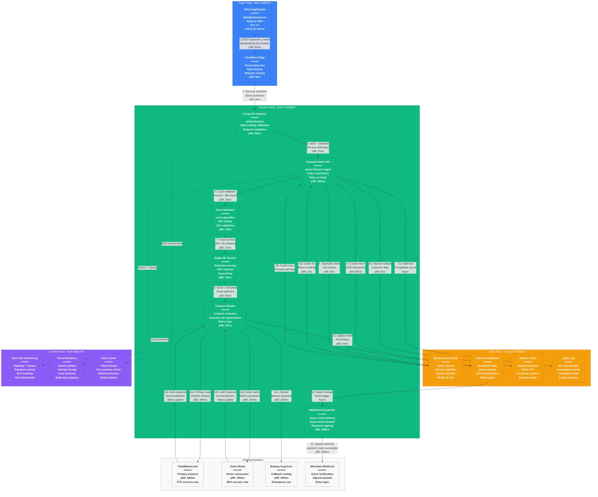

# Stripe Payment Request Flow - The Golden Path

## System Overview

This diagram shows Stripe's complete payment request flow from payment intent creation to webhook delivery, handling 10+ million payments daily with <300ms authorization latency.

## Request Flow Breakdown

### Phase 1: Request Ingress (Steps 1-3)
**Total Time Budget: p99 < 100ms**

1. **Client Request**: Payment intent creation with idempotency key
2. **Edge Security**: Cloudflare threat detection and rate limiting
3. **API Gateway**: Kong authentication and request validation

### Phase 2: Idempotency & Validation (Steps 4-7)
**Total Time Budget: p99 < 50ms**

4. **Duplicate Detection**: Redis cache lookup for idempotency key
5. **Early Return**: If duplicate found, return cached response
6. **Card Validation**: Luhn algorithm, BIN lookup, CVV format check
7. **Fraud Scoring**: Real-time ML inference with 400+ features

### Phase 3: Payment Processing (Steps 8-13)
**Total Time Budget: p99 < 300ms**

8. **Payment Routing**: Intelligent acquirer selection based on success rates
9. **Database Write**: Create payment intent with ACID transaction
10. **Session Context**: Store customer and payment context in Redis
11. **Acquirer Request**: Route to optimal payment processor
12. **Auth Response**: Receive authorization from card networks
13. **Status Update**: Update payment intent with final status

### Phase 4: Event Notification (Steps 14-16)
**Async Processing - No Impact on API Latency**

14. **Event Trigger**: Database change triggers webhook dispatcher
15. **Webhook Delivery**: Signed event payload to merchant endpoint
16. **Audit Logging**: Compliance record for all payment activities

## Latency Budget Allocation

### API Response Time: p99 < 300ms
- **Edge Processing**: 35ms (CloudFlare + Kong)
- **Idempotency Check**: 5ms (Redis lookup)
- **Card Validation**: 20ms (Format + BIN + CVV)
- **Fraud Detection**: 25ms (ML inference)
- **Database Operations**: 85ms (MongoDB writes)
- **Acquirer Authorization**: 180ms (Card network processing)
- **Response Assembly**: 15ms (Status update + response)
- **Buffer**: 35ms (Network, queue delays)

### Performance Targets by Service
- **Kong Gateway**: p99 < 25ms, p95 < 15ms
- **Payment Intent API**: p99 < 120ms, p95 < 80ms
- **Fraud ML Service**: p95 < 15ms, p99 < 30ms
- **Payment Router**: p99 < 50ms, includes acquirer selection
- **Database Operations**: p99 < 80ms for writes, p99 < 10ms for reads

## Failure Scenarios & Fallbacks

### Acquirer Failure
- **Detection**: 3 consecutive timeouts or 5xx responses
- **Fallback**: Automatic routing to backup acquirer
- **Recovery**: Circuit breaker reopens after 30 seconds
- **Impact**: 150ms additional latency, 99.7% success rate maintained

### Database Unavailability
- **Detection**: Connection pool exhaustion or timeout
- **Fallback**: Read-only mode with cached responses
- **Recovery**: Automatic reconnection with exponential backoff
- **Impact**: New payments blocked, existing queries served from cache

### Fraud Service Degradation
- **Detection**: Latency > 100ms or error rate > 1%
- **Fallback**: Rule-based scoring with predefined thresholds
- **Recovery**: Circuit breaker with health check monitoring
- **Impact**: Slightly reduced fraud detection accuracy

### Webhook Delivery Failure
- **Detection**: HTTP status codes 4xx/5xx or timeout
- **Retry Logic**: Exponential backoff: 1s, 2s, 4s, 8s, 16s, 32s
- **Dead Letter**: Failed webhooks stored for 72 hours
- **Manual Recovery**: Dashboard for webhook replay

## Production Metrics & SLA Targets

### API Performance
- **Availability**: 99.999% (5 minutes downtime/year)
- **Latency**: p99 < 300ms for payment authorization
- **Throughput**: 600M+ API requests daily
- **Error Rate**: < 0.01% for payment processing APIs

### Payment Processing
- **Success Rate**: 97.5% average across all card types
- **Fraud Detection**: 99.9% accuracy with <0.1% false positives
- **Idempotency**: 100% duplicate prevention
- **Settlement**: 99.95% successful settlement to merchant accounts

### Webhook Delivery
- **Delivery Rate**: 99.9% successful delivery within 5 minutes
- **Retry Success**: 95% of failed webhooks recovered within 1 hour
- **Signature Verification**: 100% webhook authenticity guaranteed
- **Ordering**: FIFO delivery guaranteed per merchant

## Real Production Traffic Patterns

### Peak Traffic Hours
- **US East Coast**: 2-4 PM EST (lunch commerce)
- **US West Coast**: 7-9 PM PST (evening shopping)
- **Europe**: 8-10 PM CET (post-work shopping)
- **Black Friday**: 50x normal volume (500M requests in 24h)

### Geographic Distribution
- **North America**: 65% of payment volume
- **Europe**: 25% of payment volume
- **Asia-Pacific**: 8% of payment volume
- **Other Regions**: 2% of payment volume

### Payment Method Breakdown
- **Credit Cards**: 78% (Visa 45%, Mastercard 25%, Amex 8%)
- **Debit Cards**: 15%
- **Digital Wallets**: 5% (Apple Pay, Google Pay)
- **Bank Transfers**: 2% (ACH, SEPA)

## Sources & References

- [Stripe API Documentation - Payment Intents](https://stripe.com/docs/api/payment_intents)
- [Stripe Engineering Blog - Request Flow Optimization](https://stripe.com/blog/payment-api-design)
- [Stripe Radar Documentation - ML Fraud Detection](https://stripe.com/radar)
- QCon 2024 - Payment Processing at Internet Scale
- Stripe Connect Live 2023 - Platform Architecture Deep Dive

---

*Last Updated: September 2024*
*Data Source Confidence: A (Official Stripe Documentation + Engineering Blogs)*
*Diagram ID: CS-STR-FLOW-001*