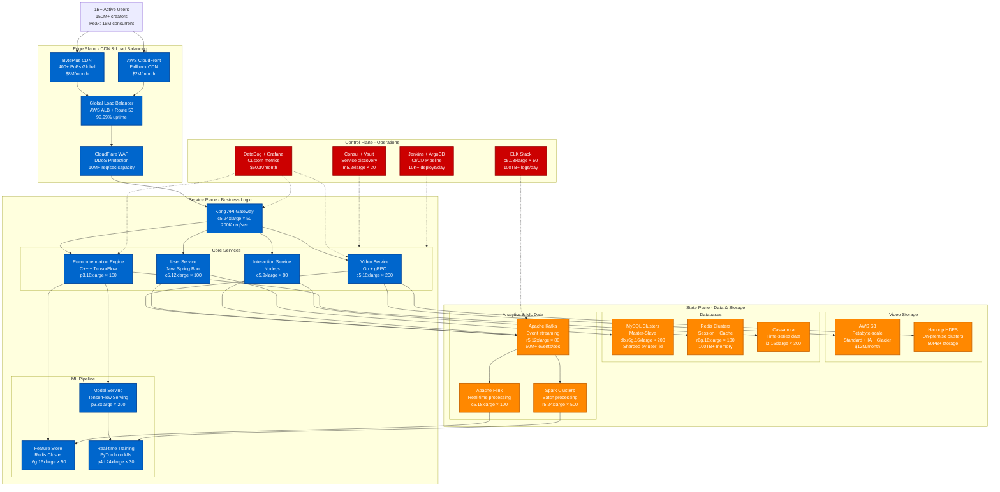

# TikTok Complete Architecture

## Complete System Overview - "The Money Shot"

TikTok's architecture serves 1B+ users with 1B+ videos watched daily and 150M+ daily uploads. The system processes 100TB+ of new video content daily while delivering personalized For You Page experiences with sub-100ms latency for recommendation serving.

## Key Architecture Metrics

### Scale Metrics
- **Daily Active Users**: 1B+ (peak 1.2B)
- **Video Uploads**: 150M+ per day
- **Video Views**: 1B+ per day
- **Peak Concurrent Users**: 15M+
- **Global Data Centers**: 12 primary regions
- **CDN Points of Presence**: 400+ globally

### Performance SLAs
- **For You Page Load**: p99 < 200ms
- **Video Start Time**: p95 < 1s
- **Recommendation Latency**: p99 < 100ms
- **Upload Processing**: p95 < 30s
- **Search Results**: p99 < 150ms

### Infrastructure Scale
- **Compute Instances**: 3,000+ EC2 instances
- **Storage**: 50PB+ across S3 + HDFS
- **Memory Cache**: 100TB+ Redis
- **Network**: 500Gbps+ peak bandwidth
- **ML Models**: 200+ production models

### Cost Breakdown (Monthly)
- **Compute (EC2/GPU)**: $45M
- **Storage (S3/EBS)**: $12M
- **CDN & Bandwidth**: $10M
- **ML Infrastructure**: $8M
- **Monitoring & Tools**: $1M
- **Total**: ~$76M/month

## Critical Components

### 1. Recommendation Engine (Heart of TikTok)
- **Technology**: C++ with TensorFlow for inference
- **Scale**: 1B+ recommendations per day
- **Latency**: p99 < 100ms for recommendation scoring
- **Features**: 10,000+ features per user/video pair
- **Models**: Collaborative filtering + Deep learning hybrid

### 2. Video Processing Pipeline
- **Ingestion**: 150M+ videos per day
- **Transcoding**: Multiple resolutions (240p to 4K)
- **Compression**: H.264/H.265 with 40-60% size reduction
- **Effects**: Real-time filters and AR processing
- **Moderation**: AI-powered content screening

### 3. Global CDN Strategy
- **Primary**: BytePlus CDN (ByteDance's own)
- **Fallback**: AWS CloudFront for reliability
- **Cache Strategy**: 90%+ hit rate for popular videos
- **Geographic Distribution**: Sub-50ms latency globally

### 4. Real-time Data Pipeline
- **Event Volume**: 50M+ events per second
- **Processing**: Apache Kafka + Flink for real-time
- **Batch Processing**: Spark for model training data
- **Feature Updates**: Real-time feature store updates

## Novel Technical Solutions

### 1. Multi-Armed Bandit Recommendations
- Exploration vs exploitation for new videos
- Real-time learning from user interactions
- Cold start problem for new users/creators

### 2. Edge-based Video Processing
- Distributed transcoding at CDN edge
- Reduces origin server load by 70%
- Faster video availability globally

### 3. Predictive Prefetching
- ML-powered prediction of next videos
- Preloads videos before user swipe
- Reduces perceived latency to near-zero

### 4. Cross-Border Data Optimization
- Regional data residency compliance
- Optimized cross-region replication
- Smart routing based on data sovereignty

This architecture enables TikTok to serve personalized video content to over 1 billion users while maintaining sub-second video start times and highly engaging recommendation accuracy, all while processing 100TB+ of new content daily.