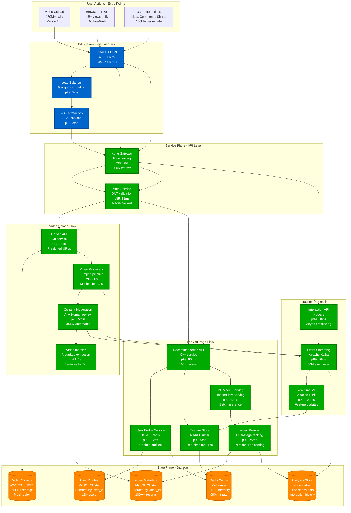

# TikTok Request Flow

## Request Flow - "The Golden Path"

This diagram shows the complete journey from video upload to For You Page delivery, including the critical recommendation pipeline that drives TikTok's engagement.

## Request Flow Analysis

### 1. Video Upload Flow (150M+ uploads/day)

**Timeline: Upload to Live (p95: 5 minutes)**

1. **Upload Initiation (0-100ms)**
   - Mobile app requests presigned S3 URL
   - Auth validation through Kong Gateway
   - Geographic routing to nearest upload endpoint

2. **File Transfer (1-30s)**
   - Direct upload to S3 via presigned URL
   - Progress tracking via WebSocket connection
   - Chunked upload for large files (>100MB)

3. **Processing Pipeline (10s-2min)**
   - Video transcoding to multiple formats
   - Thumbnail generation (5 thumbnails per video)
   - Audio extraction and normalization
   - Metadata extraction (duration, resolution, etc.)

4. **Content Moderation (30s-5min)**
   - Automated AI screening (99.5% pass rate)
   - Human review for flagged content
   - Community guidelines compliance check
   - Copyright detection via audio fingerprinting

5. **Indexing & Publishing (5-30s)**
   - Feature extraction for recommendation engine
   - Database updates across sharded MySQL
   - Cache warming for creator's followers
   - Event publication to Kafka for analytics

### 2. For You Page Flow (1B+ views/day)

**Timeline: Request to Video Display (p99: 200ms)**

1. **Request Authentication (0-20ms)**
   - JWT token validation via Redis cache
   - User context retrieval from cached profile
   - Rate limiting check (1000 req/min per user)

2. **User Profile Enrichment (5-30ms)**
   - Recent interaction history (last 7 days)
   - Device capabilities and preferences
   - Geographic and temporal context
   - Creator following status

3. **Candidate Generation (10-50ms)**
   - Collaborative filtering: users with similar preferences
   - Content-based filtering: similar video features
   - Trending video injection: 10-20% of feed
   - Creator diversity: max 2 videos per creator in 10

4. **Feature Computation (5-15ms)**
   - Real-time features from Redis (user activity)
   - Historical features from Cassandra (long-term patterns)
   - Video features (engagement rates, recency)
   - Cross-features (user-video interaction probability)

5. **ML Model Scoring (15-60ms)**
   - Multi-stage ranking pipeline
   - Stage 1: Lightweight model (10K candidates → 500)
   - Stage 2: Deep learning model (500 → 50)
   - Stage 3: Fine-tuned personalization (50 → 10)

6. **Final Ranking & Assembly (10-30ms)**
   - Business logic application (ad insertion)
   - Diversity and fairness constraints
   - Video metadata assembly from cache
   - CDN URL generation for optimal delivery

### 3. User Interaction Flow (100M+ interactions/minute)

**Timeline: Action to System Update (p99: 100ms)**

1. **Interaction Capture (0-10ms)**
   - Like, comment, share, or view completion
   - Immediate acknowledgment to user
   - Async event queuing to Kafka

2. **Real-time Processing (5-50ms)**
   - Event enrichment with context
   - Real-time feature store updates
   - Creator notification triggers
   - Engagement metrics updates

3. **Analytics Pipeline (10-100ms)**
   - Stream processing via Apache Flink
   - Aggregation for trending calculations
   - Model training data preparation
   - Business intelligence updates

## Critical Performance Optimizations

### 1. Recommendation Caching Strategy
- **L1 Cache**: User's recent recommendations (Redis, 1min TTL)
- **L2 Cache**: Pre-computed candidate pools (Redis, 15min TTL)
- **L3 Cache**: Popular video metadata (CDN, 1hr TTL)
- **Cache Hit Rate**: 95%+ for active users

### 2. Video Delivery Optimization
- **Adaptive Bitrate**: 240p to 4K based on network
- **Predictive Prefetching**: Next 3 videos based on scroll pattern
- **Edge Transcoding**: Dynamic format conversion at CDN
- **Smart Preloading**: Audio-first, then video for smooth start

### 3. Database Sharding Strategy
- **User Data**: Sharded by user_id hash (consistent hashing)
- **Video Data**: Sharded by video_id hash
- **Interaction Data**: Time-based partitioning + user_id
- **Cross-shard Queries**: Denormalized aggregation tables

## Latency Budget Breakdown

### For You Page Request (p99: 200ms total)
- CDN/Load Balancer: 20ms
- API Gateway + Auth: 20ms
- User Profile Service: 30ms
- Recommendation Engine: 80ms
- Video Metadata Assembly: 30ms
- Response Assembly: 20ms

### Video Upload (p95: 5min total)
- Upload to S3: 30s
- Transcoding Pipeline: 2min
- Content Moderation: 2min
- Indexing & Publishing: 30s

## Failure Scenarios & Recovery

### 1. Recommendation Engine Failure
- **Fallback**: Trending videos + creator-based recommendations
- **Recovery Time**: 30s (automatic failover)
- **Impact**: Reduced personalization, 15% engagement drop

### 2. CDN Failure
- **Fallback**: Secondary CDN (AWS CloudFront)
- **Recovery Time**: 10s (DNS failover)
- **Impact**: Increased latency, 2-5% user impact

### 3. Database Shard Failure
- **Fallback**: Read replicas, write buffering
- **Recovery Time**: 2-5min (automated failover)
- **Impact**: Degraded experience for affected users

This request flow handles TikTok's massive scale while maintaining the responsive, personalized experience that drives user engagement and creator success.