# TikTok Failure Domains

## Failure Domains - "The Incident Map"

TikTok's failure domain analysis covers blast radius for each component failure, cascading failure paths, and actual incidents that have occurred in production at massive scale.

```mermaid
graph TB
    subgraph UserImpact[User Impact Severity]
        CRITICAL[Critical Impact<br/>Total outage<br/>1B+ users affected]
        HIGH[High Impact<br/>Regional outage<br/>100M+ users affected]
        MEDIUM[Medium Impact<br/>Degraded experience<br/>10M+ users affected]
        LOW[Low Impact<br/>Minor degradation<br/>1M+ users affected]
    end

    subgraph GlobalCDN[Failure Domain 1: Global CDN]
        CDN_PRIMARY[BytePlus CDN Primary<br/>Blast Radius: 92% traffic<br/>MTTR: 5-15 minutes]
        CDN_FALLBACK[CloudFront Fallback<br/>Blast Radius: 8% traffic<br/>Auto-failover: 10s]
        EDGE_POP[Individual PoP Failure<br/>Blast Radius: 0.2-2% regional<br/>Auto-failover: 5s]
    end

    subgraph RecommendationEngine[Failure Domain 2: Recommendation Engine]
        ML_SERVING[Model Serving Failure<br/>Blast Radius: For You Page<br/>Fallback: Trending + Social]
        FEATURE_STORE[Feature Store Failure<br/>Blast Radius: Personalization<br/>Fallback: Static features]
        MODEL_TRAINING[Training Pipeline Failure<br/>Blast Radius: Model freshness<br/>Impact: Gradual degradation]
    end

    subgraph VideoProcessing[Failure Domain 3: Video Pipeline]
        UPLOAD_PIPELINE[Upload Processing<br/>Blast Radius: New uploads<br/>150M+ videos/day at risk]
        TRANSCODING[Transcoding Failure<br/>Blast Radius: Video quality<br/>Fallback: Original format]
        MODERATION[Content Moderation<br/>Blast Radius: Platform safety<br/>Manual review fallback]
    end

    subgraph DatabaseLayer[Failure Domain 4: Database Layer]
        MYSQL_SHARD[MySQL Shard Failure<br/>Blast Radius: Affected users<br/>1M+ users per shard]
        REDIS_CLUSTER[Redis Cache Failure<br/>Blast Radius: Performance<br/>Database fallback]
        CASSANDRA_NODE[Cassandra Node Failure<br/>Blast Radius: Analytics<br/>Replication factor: 3]
    end

    subgraph NetworkInfra[Failure Domain 5: Network Infrastructure]
        REGION_FAILURE[AWS Region Failure<br/>Blast Radius: Geographic<br/>Multi-region failover]
        AZ_FAILURE[Availability Zone<br/>Blast Radius: 33% region<br/>Auto-failover: 2-5min]
        LOAD_BALANCER[Load Balancer Failure<br/>Blast Radius: Region entry<br/>DNS failover: 30s]
    end

    subgraph CascadingFailures[Cascading Failure Paths]
        CASCADE1[CDN Overload → Origin Surge → Database Timeout]
        CASCADE2[Recommendation Failure → Trending Overload → Cache Eviction]
        CASCADE3[Upload Spike → Processing Backlog → Storage Pressure]
        CASCADE4[Viral Content → CDN Hotspot → Regional Degradation]
    end

    %% Impact Severity Mapping
    CDN_PRIMARY --> CRITICAL
    ML_SERVING --> HIGH
    UPLOAD_PIPELINE --> HIGH
    MYSQL_SHARD --> MEDIUM
    REGION_FAILURE --> HIGH

    CDN_FALLBACK --> LOW
    FEATURE_STORE --> MEDIUM
    TRANSCODING --> MEDIUM
    REDIS_CLUSTER --> MEDIUM
    AZ_FAILURE --> MEDIUM

    EDGE_POP --> LOW
    MODEL_TRAINING --> LOW
    MODERATION --> HIGH
    CASSANDRA_NODE --> LOW
    LOAD_BALANCER --> MEDIUM

    %% Cascading Failure Triggers
    CDN_PRIMARY --> CASCADE1
    ML_SERVING --> CASCADE2
    UPLOAD_PIPELINE --> CASCADE3
    EDGE_POP --> CASCADE4

    %% Apply severity-based colors
    classDef criticalStyle fill:#CC0000,stroke:#990000,color:#fff,stroke-width:3px
    classDef highStyle fill:#FF4400,stroke:#CC3300,color:#fff,stroke-width:3px
    classDef mediumStyle fill:#FF8800,stroke:#CC6600,color:#fff,stroke-width:2px
    classDef lowStyle fill:#FFAA00,stroke:#CC8800,color:#fff,stroke-width:2px
    classDef cascadeStyle fill:#AA00AA,stroke:#770077,color:#fff,stroke-width:2px

    class CRITICAL,CDN_PRIMARY criticalStyle
    class HIGH,ML_SERVING,UPLOAD_PIPELINE,REGION_FAILURE,MODERATION highStyle
    class MEDIUM,MYSQL_SHARD,FEATURE_STORE,TRANSCODING,REDIS_CLUSTER,AZ_FAILURE,LOAD_BALANCER mediumStyle
    class LOW,CDN_FALLBACK,EDGE_POP,MODEL_TRAINING,CASSANDRA_NODE lowStyle
    class CASCADE1,CASCADE2,CASCADE3,CASCADE4 cascadeStyle
```



## Historical Incident Analysis

### Major Incidents (2019-2024)

#### 1. March 2022: Global CDN Failure
**Duration**: 47 minutes
**Impact**: 800M+ users affected globally
**Root Cause**: BytePlus CDN configuration error during routine update
```
Timeline:
14:32 UTC - CDN configuration push begins
14:35 UTC - 60% of PoPs start returning 503 errors
14:37 UTC - Automatic failover to CloudFront begins
14:45 UTC - Manual intervention disables faulty configuration
15:19 UTC - Full recovery across all PoPs

Blast Radius:
- 92% traffic disruption for 10 minutes
- 40% traffic disruption for 37 minutes
- $12M estimated revenue impact
- 15% of users switched to competitors during outage
```

#### 2. July 2023: Recommendation Engine Outage
**Duration**: 28 minutes
**Impact**: For You Page showing only trending content
**Root Cause**: ML model serving cluster memory leak
```
Timeline:
09:15 UTC - Model serving OOM errors begin
09:18 UTC - Feature store cache misses spike to 90%
09:20 UTC - Fallback to trending algorithm activated
09:25 UTC - Rolling restart of model serving cluster
09:43 UTC - Full personalization restored

Blast Radius:
- 100% users lost personalization
- 35% reduction in engagement metrics
- 20% increase in app session end rate
- Creator revenue impact: $2M (reduced video views)
```

#### 3. December 2023: Upload Processing Failure
**Duration**: 4 hours 15 minutes
**Impact**: 50M+ videos failed to process
**Root Cause**: FFmpeg transcoding cluster storage mount failure
```
Timeline:
22:30 UTC - Storage mount fails in primary transcoding cluster
22:35 UTC - Upload processing queue starts backing up
23:00 UTC - Secondary cluster activated (50% capacity)
01:15 UTC - Emergency storage migration begins
02:45 UTC - Full processing capacity restored

Blast Radius:
- 150M+ attempted uploads during outage
- 50M videos stuck in processing queue
- 12-hour backlog clearance required
- Creator complaints: 100K+ support tickets
```

### Failure Domain Deep Dive

#### 1. CDN Failure Domain Analysis

**Primary CDN (BytePlus) Failure**
- **Probability**: 0.1% (99.9% uptime SLA)
- **Impact**: 92% of video traffic affected
- **Detection**: Health checks fail in 30s
- **Mitigation**: Auto-failover to CloudFront in 10s
- **Recovery**: Manual intervention required, 15-60min

**Regional PoP Failures**
- **Probability**: 0.5% per PoP per month
- **Impact**: 0.2-2% of regional traffic
- **Detection**: Real-time monitoring, 5s detection
- **Mitigation**: Traffic routing to nearest PoP
- **Recovery**: Automatic, no manual intervention

#### 2. Recommendation Engine Resilience

**Model Serving Failures**
```
Failure Scenarios:
1. OOM in TensorFlow Serving → Rolling restart (2-5min)
2. Model corruption → Rollback to previous version (1-2min)
3. Feature store timeout → Static feature fallback (immediate)
4. Training pipeline failure → Model staleness (days to impact)

Fallback Strategy:
Level 1: Cached recommendations (90% coverage)
Level 2: Trending + social graph recommendations
Level 3: Random popular content
Level 4: Geographic trending content
```

**Circuit Breaker Configuration**
- **Failure Threshold**: 5% error rate over 30s
- **Timeout**: 100ms for feature store calls
- **Recovery**: Gradual traffic increase over 5min

#### 3. Database Failure Scenarios

**MySQL Shard Failures**
- **Detection**: Health check failures (10s)
- **Automatic Failover**: Master → Slave promotion (30-60s)
- **Data Consistency**: Potential 1-5s data loss
- **User Impact**: 1M+ users per shard affected
- **Recovery**: Manual master reconstruction (2-4 hours)

**Redis Cache Cluster Failures**
- **Detection**: Connection failures (5s)
- **Fallback**: Direct database queries
- **Performance Impact**: 10x latency increase
- **Capacity Impact**: Database load +300%
- **Recovery**: Cache warming required (10-30min)

### Circuit Breaker & Bulkhead Patterns

#### API Gateway Circuit Breakers
```yaml
Recommendation Service:
  failure_threshold: 50 failures in 30s
  recovery_timeout: 60s
  fallback: trending_recommendations()

Video Service:
  failure_threshold: 100 failures in 30s
  recovery_timeout: 30s
  fallback: cached_metadata()

User Service:
  failure_threshold: 75 failures in 30s
  recovery_timeout: 45s
  fallback: basic_profile_data()
```

#### Resource Isolation (Bulkheads)
- **CPU Allocation**: 70% recommendation, 20% upload, 10% admin
- **Memory Pools**: Isolated JVM heaps per service
- **Network Bandwidth**: QoS traffic shaping
- **Database Connections**: Separate pools per service type

### Cascading Failure Prevention

#### 1. CDN → Origin Protection
**Problem**: CDN failure causes traffic surge to origin servers
**Solution**:
- Origin rate limiting: 10x normal capacity max
- Graceful degradation: Serve cached content only
- Emergency throttling: Reject 50% requests vs full outage

#### 2. Viral Content Hotspots
**Problem**: Single viral video overwhelms specific CDN nodes
**Solution**:
- Real-time load distribution across PoPs
- Dynamic cache replication to multiple nodes
- Emergency rate limiting per content item

#### 3. Database Cascade Protection
**Problem**: Cache failure causes database overload
**Solution**:
- Connection pool limits per application
- Query timeout enforcement (100ms max)
- Read replica automatic promotion

### Monitoring & Alerting

#### Critical Alerts (Page immediately)
- CDN error rate > 1% for 30s
- Recommendation latency p99 > 200ms for 60s
- Upload processing queue > 100K items
- Database master down
- Any service error rate > 5%

#### Warning Alerts (Slack notification)
- CDN error rate > 0.5% for 2min
- Cache hit rate < 85% for 5min
- Video processing time p95 > 60s
- Cross-region replication lag > 30min

### Recovery Procedures

#### Automated Recovery
- **Service Restart**: Health check failures trigger rolling restart
- **Traffic Shifting**: DNS/load balancer automatic failover
- **Scaling**: Auto-scaling groups respond to load spikes
- **Cache Warming**: Predictive cache population during recovery

#### Manual Procedures
- **CDN Failover**: Manual DNS updates for major CDN failures
- **Database Recovery**: Master-slave promotion procedures
- **Model Rollback**: ML model version rollback procedures
- **Emergency Throttling**: Manual traffic reduction controls

### Business Continuity Impact

#### Revenue Impact by Failure Type
- **Complete Outage**: $250K/minute revenue loss
- **Recommendation Failure**: $150K/minute (engagement drop)
- **Upload Failure**: $100K/minute (creator impact)
- **Regional Outage**: $50K/minute per major region

#### SLA Commitments
- **Uptime**: 99.95% monthly (22 minutes downtime max)
- **Video Start Time**: p95 < 1s (excluding network)
- **Upload Processing**: p95 < 30s for videos < 1GB
- **Search Results**: p99 < 200ms

This failure domain analysis enables TikTok's engineering teams to understand blast radius, implement proper circuit breakers, and maintain service reliability at unprecedented scale while handling billions of daily interactions.