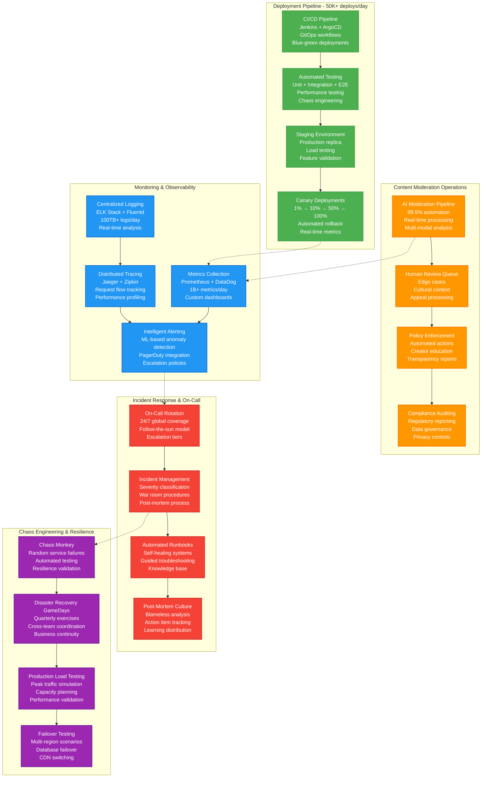

# TikTok Production Operations

## Production Operations - "The Ops View"

TikTok's production operations manage 1B+ users with 24/7 global operations, automated deployment pipelines, comprehensive monitoring, and content moderation at unprecedented scale.



## Deployment Pipeline Operations

### CI/CD Pipeline Architecture

**Scale Metrics**:
- **Daily Deployments**: 50,000+ across all services
- **Code Commits**: 25,000+ per day
- **Automated Tests**: 10M+ test executions daily
- **Build Time**: p95 < 15 minutes
- **Deployment Success Rate**: 99.7%

#### GitOps Workflow
```yaml
Deployment Process:
  1. Code Commit → Automated Testing
     - Unit tests: 2-5 minutes
     - Integration tests: 5-10 minutes
     - Security scanning: 3-5 minutes
     - Performance tests: 10-15 minutes

  2. Artifact Building
     - Docker image building
     - Vulnerability scanning
     - Image signing and registry push
     - Manifest generation

  3. Staging Deployment
     - Infrastructure provisioning
     - Service deployment
     - Smoke testing
     - Load testing validation

  4. Production Canary
     - 1% traffic for 15 minutes
     - 10% traffic for 30 minutes
     - 50% traffic for 1 hour
     - 100% traffic with monitoring

  5. Monitoring & Rollback
     - Real-time metrics validation
     - Error rate monitoring
     - Performance regression detection
     - Automated rollback triggers
```

#### Deployment Strategies
**Blue-Green Deployments**:
```bash
# Blue-Green deployment script
#!/bin/bash
SERVICE_NAME=$1
NEW_VERSION=$2

# Deploy to green environment
kubectl apply -f green-deployment.yaml
kubectl set image deployment/green-$SERVICE_NAME app=$SERVICE_NAME:$NEW_VERSION

# Health check
kubectl wait --for=condition=available deployment/green-$SERVICE_NAME

# Traffic switch
kubectl patch service $SERVICE_NAME -p '{"spec":{"selector":{"version":"green"}}}'

# Monitor for 10 minutes
./monitor-deployment.sh $SERVICE_NAME 600

# Cleanup old blue environment
if [ $? -eq 0 ]; then
    kubectl delete deployment blue-$SERVICE_NAME
fi
```

**Canary Deployment Configuration**:
```yaml
apiVersion: argoproj.io/v1alpha1
kind: Rollout
metadata:
  name: recommendation-service
spec:
  replicas: 100
  strategy:
    canary:
      steps:
      - setWeight: 1
      - pause: {duration: 15m}
      - setWeight: 10
      - pause: {duration: 30m}
      - setWeight: 50
      - pause: {duration: 1h}
      - setWeight: 100
      analysis:
        templates:
        - templateName: error-rate-analysis
        - templateName: latency-analysis
        args:
        - name: service-name
          value: recommendation-service
      trafficRouting:
        nginx:
          stableService: recommendation-service-stable
          canaryService: recommendation-service-canary
```

### Testing Infrastructure

**Automated Testing Pipeline**:
- **Unit Tests**: 500K+ tests, 95% code coverage
- **Integration Tests**: 50K+ API tests
- **End-to-End Tests**: 10K+ user journey tests
- **Performance Tests**: Load testing every deployment
- **Chaos Tests**: Random failure injection

**Test Environment Management**:
```python
# Dynamic test environment provisioning
class TestEnvironmentManager:
    def __init__(self):
        self.kubernetes_client = KubernetesClient()
        self.terraform_client = TerraformClient()

    def provision_environment(self, test_suite_id):
        # Create isolated namespace
        namespace = f"test-{test_suite_id}"
        self.kubernetes_client.create_namespace(namespace)

        # Deploy test infrastructure
        self.terraform_client.apply(
            template="test-environment",
            variables={
                "namespace": namespace,
                "test_data_size": "1GB",
                "service_replicas": 3
            }
        )

        # Load test data
        self.load_test_data(namespace, test_suite_id)

        return TestEnvironment(namespace, test_suite_id)

    def cleanup_environment(self, test_environment):
        # Cleanup resources
        self.terraform_client.destroy(test_environment.namespace)
        self.kubernetes_client.delete_namespace(test_environment.namespace)
```

## Monitoring & Observability

### Metrics Collection at Scale

**Prometheus Configuration**:
```yaml
# Global Prometheus configuration
global:
  scrape_interval: 15s
  evaluation_interval: 15s

rule_files:
  - "tiktok_alerts.yml"
  - "slo_rules.yml"

scrape_configs:
  - job_name: 'kubernetes-pods'
    kubernetes_sd_configs:
    - role: pod
    relabel_configs:
    - source_labels: [__meta_kubernetes_pod_annotation_prometheus_io_scrape]
      action: keep
      regex: true

  - job_name: 'recommendation-service'
    static_configs:
    - targets: ['recommendation-service:8080']
    scrape_interval: 5s  # High-frequency for critical service

  - job_name: 'video-service'
    static_configs:
    - targets: ['video-service:8080']
    metrics_path: /metrics
    scrape_interval: 10s
```

**Custom Metrics Dashboard**:
```python
# Real-time dashboard metrics
class TikTokMetrics:
    def __init__(self):
        self.prometheus = PrometheusClient()
        self.datadog = DataDogClient()

    def get_platform_health(self):
        return {
            # User Experience Metrics
            'video_start_time_p95': self.prometheus.query('video_start_time_p95'),
            'recommendation_latency_p99': self.prometheus.query('rec_latency_p99'),
            'upload_success_rate': self.prometheus.query('upload_success_rate'),

            # Infrastructure Metrics
            'api_gateway_qps': self.prometheus.query('rate(api_requests_total[5m])'),
            'database_connection_pool': self.prometheus.query('db_connections_active'),
            'cache_hit_rate': self.prometheus.query('redis_cache_hit_rate'),

            # Business Metrics
            'daily_active_users': self.datadog.get_metric('dau.count'),
            'video_upload_count': self.datadog.get_metric('uploads.daily'),
            'creator_earnings': self.datadog.get_metric('creator.earnings.daily')
        }
```

### Distributed Tracing

**Jaeger Tracing Implementation**:
```python
from jaeger_client import Config
from opentracing import tracer

class DistributedTracing:
    def __init__(self):
        config = Config(
            config={
                'sampler': {'type': 'const', 'param': 1},
                'logging': True,
            },
            service_name='tiktok-services'
        )
        self.tracer = config.initialize_tracer()

    def trace_recommendation_request(self, user_id, request_id):
        with self.tracer.start_span('recommendation_request') as span:
            span.set_tag('user_id', user_id)
            span.set_tag('request_id', request_id)

            # Trace feature store access
            with self.tracer.start_span('feature_store_lookup', child_of=span):
                features = self.get_user_features(user_id)

            # Trace ML model inference
            with self.tracer.start_span('ml_inference', child_of=span):
                recommendations = self.ml_model.predict(features)

            # Trace database queries
            with self.tracer.start_span('video_metadata_fetch', child_of=span):
                video_data = self.get_video_metadata(recommendations)

            return video_data
```

## Content Moderation Operations

### AI Moderation Pipeline

**Real-time Moderation Architecture**:
```python
class ContentModerationPipeline:
    def __init__(self):
        self.video_analyzer = VideoModerationModel()
        self.audio_analyzer = AudioModerationModel()
        self.text_analyzer = TextModerationModel()
        self.decision_engine = ModerationDecisionEngine()
        self.human_queue = HumanReviewQueue()

    async def moderate_content(self, content):
        # Parallel analysis
        tasks = [
            self.video_analyzer.analyze(content.video),
            self.audio_analyzer.analyze(content.audio),
            self.text_analyzer.analyze(content.text),
        ]

        results = await asyncio.gather(*tasks)

        # Decision fusion
        decision = self.decision_engine.make_decision(results)

        if decision.confidence > 0.95:
            # Auto-approve or auto-reject
            return self.execute_decision(decision)
        else:
            # Queue for human review
            return self.human_queue.add(content, results, decision)

    def execute_decision(self, decision):
        actions = {
            'approve': self.approve_content,
            'reject': self.reject_content,
            'age_restrict': self.age_restrict_content,
            'region_block': self.region_block_content
        }
        return actions[decision.action](decision.content_id)
```

**Moderation Metrics (Daily)**:
- **Content Processed**: 150M+ videos
- **AI Automation Rate**: 99.5%
- **Human Review Queue**: 750K items
- **Average Review Time**: 2.3 minutes
- **Appeal Processing**: 24-hour SLA

### Human Review Operations

**Review Queue Management**:
```python
class HumanReviewQueue:
    def __init__(self):
        self.redis_client = RedisClient()
        self.priority_calculator = PriorityCalculator()

    def add_to_queue(self, content, ai_analysis, priority_signals):
        # Calculate priority score
        priority = self.priority_calculator.calculate(
            creator_tier=content.creator.tier,
            potential_reach=content.predicted_views,
            violation_severity=ai_analysis.max_severity,
            regional_sensitivity=priority_signals.region
        )

        # Queue with priority
        queue_item = {
            'content_id': content.id,
            'priority': priority,
            'ai_analysis': ai_analysis,
            'created_at': time.now(),
            'review_deadline': time.now() + timedelta(hours=4)
        }

        self.redis_client.zadd('moderation_queue', {
            json.dumps(queue_item): priority
        })

    def get_next_review_item(self, reviewer_id, reviewer_capabilities):
        # Get highest priority item matching reviewer skills
        items = self.redis_client.zrange('moderation_queue', 0, 100, desc=True)

        for item_json in items:
            item = json.loads(item_json)
            if self.reviewer_can_handle(reviewer_id, item, reviewer_capabilities):
                self.redis_client.zrem('moderation_queue', item_json)
                return item

        return None
```

## Incident Response Operations

### On-Call Management

**Follow-the-Sun Coverage**:
```
Region Coverage (24/7):
- Asia-Pacific (Singapore): 00:00-08:00 UTC
  - Primary: Senior SRE + ML Engineer
  - Backup: Platform Engineer + Security Engineer

- Europe (Dublin): 08:00-16:00 UTC
  - Primary: Senior SRE + Backend Engineer
  - Backup: DevOps Engineer + Database Expert

- Americas (San Francisco): 16:00-00:00 UTC
  - Primary: Senior SRE + Frontend Engineer
  - Backup: Platform Engineer + Network Engineer

Escalation Tiers:
  Tier 1: On-call engineer (5 min response)
  Tier 2: Service owner + manager (15 min response)
  Tier 3: Engineering director + VP (30 min response)
  Tier 4: CTO + CEO (60 min response for critical incidents)
```

### Incident Classification

**Severity Levels**:
```python
class IncidentSeverity:
    CRITICAL = {
        'definition': 'Total platform outage or security breach',
        'examples': ['Complete service down', 'Data leak', 'Payment fraud'],
        'response_time': '5 minutes',
        'escalation': 'Immediate to Tier 2',
        'communication': 'Public status page + internal broadcast'
    }

    HIGH = {
        'definition': 'Major feature broken affecting >10% users',
        'examples': ['Recommendation engine down', 'Upload failures', 'CDN issues'],
        'response_time': '15 minutes',
        'escalation': 'Tier 1 → Tier 2 after 30 min',
        'communication': 'Internal channels + status page'
    }

    MEDIUM = {
        'definition': 'Feature degradation affecting <10% users',
        'examples': ['Slow load times', 'Search issues', 'Minor bugs'],
        'response_time': '1 hour',
        'escalation': 'Tier 1 only unless prolonged',
        'communication': 'Internal channels only'
    }

    LOW = {
        'definition': 'Minor issues with workarounds available',
        'examples': ['UI glitches', 'Analytics delays', 'Tool issues'],
        'response_time': '4 hours',
        'escalation': 'During business hours',
        'communication': 'Internal team notification'
    }
```

### Automated Runbooks

**Self-Healing Systems**:
```python
class AutomatedRunbook:
    def __init__(self):
        self.kubernetes = KubernetesClient()
        self.metrics = PrometheusClient()
        self.notifications = SlackClient()

    def handle_high_memory_usage(self, pod_name, namespace):
        """Automated response to high memory usage"""

        # Step 1: Confirm the issue
        memory_usage = self.metrics.query(
            f'container_memory_usage_bytes{{pod="{pod_name}"}}'
        )

        if memory_usage < 0.9:  # Less than 90% usage
            return "False alarm - memory usage normal"

        # Step 2: Attempt graceful remediation
        self.notifications.send(
            f"High memory detected in {pod_name}. Attempting remediation..."
        )

        # Try garbage collection trigger
        self.trigger_gc(pod_name)
        time.sleep(60)

        # Check if resolved
        memory_usage = self.metrics.query(
            f'container_memory_usage_bytes{{pod="{pod_name}"}}'
        )

        if memory_usage < 0.8:
            return "Resolved via garbage collection"

        # Step 3: Scale out (add more pods)
        self.kubernetes.scale_deployment(
            name=pod_name.split('-')[0],
            namespace=namespace,
            replicas='+2'
        )

        self.notifications.send(
            f"Scaled out {pod_name} deployment. Monitoring..."
        )

        # Step 4: If still high, restart pod
        if memory_usage > 0.9:
            self.kubernetes.delete_pod(pod_name, namespace)
            self.notifications.send(f"Restarted pod {pod_name}")

        return "Automated remediation completed"
```

## Chaos Engineering

### Chaos Monkey Implementation

**Automated Chaos Testing**:
```python
class ChaosMonkey:
    def __init__(self):
        self.kubernetes = KubernetesClient()
        self.scheduler = CronScheduler()
        self.metrics = MetricsCollector()

    def schedule_chaos_experiments(self):
        # Daily chaos experiments
        self.scheduler.add_job(
            self.random_pod_termination,
            'cron', hour=14, minute=0,  # 2 PM daily
            args=['recommendation-service']
        )

        # Weekly network chaos
        self.scheduler.add_job(
            self.network_partition_test,
            'cron', day_of_week=2, hour=15,  # Tuesday 3 PM
            args=['us-east', 'eu-west']
        )

        # Monthly disaster recovery
        self.scheduler.add_job(
            self.region_failure_simulation,
            'cron', day=1, hour=16,  # First of month, 4 PM
            args=['us-east-1']
        )

    def random_pod_termination(self, service_name):
        """Randomly terminate pods to test resilience"""
        pods = self.kubernetes.get_pods(
            label_selector=f'app={service_name}'
        )

        # Kill 10% of pods randomly
        pods_to_kill = random.sample(pods, len(pods) // 10)

        for pod in pods_to_kill:
            self.kubernetes.delete_pod(pod.name, pod.namespace)
            self.metrics.record_chaos_event(
                type='pod_termination',
                service=service_name,
                pod=pod.name
            )

        # Monitor recovery
        return self.monitor_service_recovery(service_name, duration=600)
```

## Performance Metrics & SLAs

### Operational Excellence KPIs

**Deployment Metrics**:
- **Deployment Frequency**: 50K+ per day
- **Lead Time**: 4 hours (code to production)
- **Mean Time to Recovery**: 8.5 minutes
- **Change Failure Rate**: 0.3%

**Reliability Metrics**:
- **Platform Uptime**: 99.98%
- **API Response Time**: p99 < 100ms
- **Incident Response**: p95 < 5 minutes
- **Resolution Time**: p95 < 30 minutes

**Content Moderation SLAs**:
- **AI Processing**: p99 < 2 seconds
- **Human Review**: p95 < 4 hours
- **Appeal Processing**: p99 < 24 hours
- **Policy Update Deployment**: < 1 hour globally

This production operations framework enables TikTok to maintain platform stability while deploying thousands of changes daily, moderating millions of content pieces, and responding to incidents across a global infrastructure serving over 1 billion users.