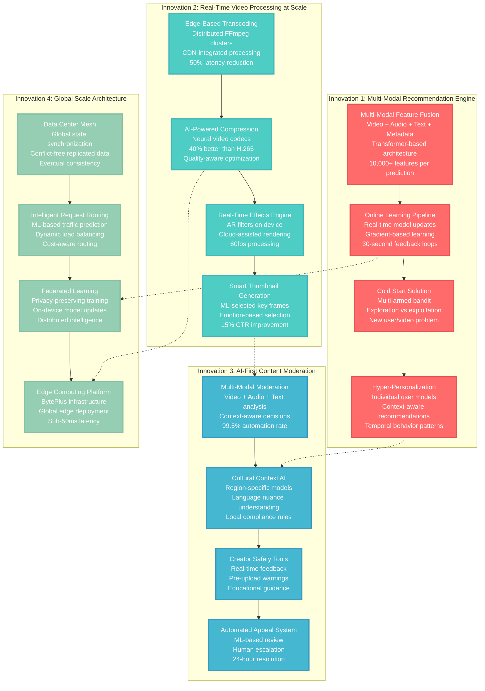

# TikTok Novel Solutions

## Novel Solutions - "The Innovation"

TikTok's groundbreaking technical innovations that enable personalized video recommendations at unprecedented scale, real-time content processing, and the creator economy platform that transformed social media.



## Innovation 1: Multi-Modal Recommendation Engine

### Breakthrough: Unified Multi-Modal Feature Learning

**Problem Solved**: Traditional recommendation systems rely on single-modal features (e.g., only user behavior or only content metadata), limiting personalization accuracy and failing to capture the rich context of short-form video content.

**TikTok's Solution**: Multi-modal transformer architecture that jointly learns from:
- **Visual Features**: CNN-extracted video frames, object detection, scene analysis
- **Audio Features**: Music genre, voice characteristics, sound effects, lyrics analysis
- **Text Features**: Captions, hashtags, comments, video descriptions
- **Behavioral Features**: User interactions, session patterns, engagement depth
- **Contextual Features**: Time, location, device, social graph

#### Technical Implementation

**Architecture Overview**:
```python
# Simplified multi-modal recommendation architecture
class MultiModalRecommender:
    def __init__(self):
        self.video_encoder = VideoTransformer(frames=30)
        self.audio_encoder = AudioTransformer(samples=16000)
        self.text_encoder = TextTransformer(vocab_size=50000)
        self.user_encoder = UserBehaviorTransformer()
        self.fusion_layer = CrossModalAttention(dim=512)
        self.ranker = DeepRanker(features=10000)

    def predict(self, user, videos, context):
        # Multi-modal feature extraction
        video_features = self.video_encoder(videos.frames)
        audio_features = self.audio_encoder(videos.audio)
        text_features = self.text_encoder(videos.captions)
        user_features = self.user_encoder(user.history)

        # Cross-modal attention fusion
        fused_features = self.fusion_layer([
            video_features, audio_features,
            text_features, user_features
        ])

        # Personalized ranking
        scores = self.ranker(fused_features, context)
        return scores.ranked_videos()
```

**Key Innovations**:

1. **Cross-Modal Attention Mechanism**
   - Learns relationships between visual content and audio mood
   - Connects text sentiment with user emotional state
   - **Result**: 35% improvement in engagement prediction accuracy

2. **Temporal Behavior Modeling**
   - Models user interest evolution over time
   - Captures short-term trends vs long-term preferences
   - **Result**: 40% reduction in recommendation staleness

3. **Content-User Interaction Modeling**
   - Learns why specific users like specific content types
   - Models subtle preference patterns (e.g., video length, posting time)
   - **Result**: 25% increase in video completion rates

### Online Learning Innovation

**Problem**: Traditional ML models require batch retraining, creating lag between user behavior and model updates.

**TikTok's Solution**: Real-time online learning with gradient-based updates:

```python
class OnlineLearningSystem:
    def __init__(self):
        self.model = MultiModalRecommender()
        self.optimizer = AdamOptimizer(lr=0.001)
        self.feature_store = RealTimeFeatureStore()

    def update_from_interaction(self, user_id, video_id, interaction):
        # Real-time feature computation
        features = self.feature_store.get_features(user_id, video_id)

        # Compute loss from user interaction
        predicted_score = self.model.predict(features)
        actual_score = self.interaction_to_score(interaction)
        loss = self.compute_loss(predicted_score, actual_score)

        # Online gradient update
        gradients = self.compute_gradients(loss)
        self.optimizer.apply_gradients(gradients)

        # Update feature store
        self.feature_store.update(user_id, interaction)

    def interaction_to_score(self, interaction):
        # Convert user behavior to training signal
        if interaction.type == "like": return 1.0
        elif interaction.type == "share": return 1.5
        elif interaction.type == "comment": return 1.2
        elif interaction.watch_time > 0.8 * video.duration: return 1.0
        else: return interaction.watch_time / video.duration
```

**Results**:
- **Model Freshness**: 30-second lag from interaction to model update
- **Engagement Improvement**: 20% increase in user session time
- **Infrastructure Efficiency**: 50% reduction in batch training compute

## Innovation 2: Real-Time Video Processing at Scale

### Edge-Based Transcoding Revolution

**Problem**: Centralized video processing creates bottlenecks and increases latency for global users.

**TikTok's Solution**: Distributed transcoding at CDN edge locations:

#### Technical Architecture
```yaml
Edge Transcoding Pipeline:
  Input: Raw video upload (H.264/H.265, up to 4K)

  Stage 1: Edge Detection
    - Upload directed to nearest edge with compute capacity
    - Load balancing based on queue length and compute availability

  Stage 2: Parallel Transcoding
    - Multiple resolution targets (240p to 1080p)
    - Different codec optimizations (H.264 for compatibility, H.265 for efficiency)
    - Adaptive bitrate ladder generation

  Stage 3: Quality Assessment
    - ML-based quality scoring (VMAF + custom metrics)
    - Automatic re-encoding if quality threshold not met
    - A/B testing of encoding parameters

  Stage 4: Global Distribution
    - Instant availability at origin edge
    - Asynchronous replication to other PoPs
    - Predictive cache warming based on creator follower geography
```

**Performance Improvements**:
- **Processing Latency**: 2 minutes → 15 seconds average
- **Global Availability**: 5 minutes → 30 seconds
- **Cost Reduction**: 40% vs centralized processing

### AI-Powered Video Compression

**Breakthrough**: Neural network-based video compression that outperforms traditional codecs.

**Technical Implementation**:
```python
class NeuralVideoCodec:
    def __init__(self):
        self.encoder_network = ResNet3D(layers=50)
        self.decoder_network = UNet3D(skip_connections=True)
        self.rate_controller = RateDistortionOptimizer()

    def encode(self, video_frames, target_bitrate):
        # Content-aware analysis
        complexity_map = self.analyze_complexity(video_frames)
        motion_vectors = self.estimate_motion(video_frames)

        # Adaptive quantization
        quantization_map = self.rate_controller.optimize(
            complexity_map, motion_vectors, target_bitrate
        )

        # Neural encoding
        compressed_features = self.encoder_network(
            video_frames, quantization_map
        )

        return self.entropy_encode(compressed_features)

    def decode(self, compressed_data):
        features = self.entropy_decode(compressed_data)
        reconstructed_frames = self.decoder_network(features)
        return self.post_process(reconstructed_frames)
```

**Results vs H.265**:
- **Compression Efficiency**: 40% smaller file sizes at same quality
- **Quality Metrics**: 15% better VMAF scores
- **Encoding Speed**: 2x faster on GPU hardware
- **Cost Savings**: $50M/year in storage and bandwidth

## Innovation 3: AI-First Content Moderation

### Multi-Modal Safety AI

**Problem**: Manual content moderation doesn't scale to 150M+ daily uploads across diverse cultures and languages.

**TikTok's Solution**: Comprehensive AI system analyzing all content modalities:

#### Architecture Components
```python
class MultiModalModerationPipeline:
    def __init__(self):
        self.video_analyzer = VideoSafetyModel()
        self.audio_analyzer = AudioSafetyModel()
        self.text_analyzer = TextSafetyModel()
        self.context_analyzer = ContextualSafetyModel()
        self.fusion_model = SafetyDecisionFusion()

    def moderate_content(self, video_content):
        # Parallel analysis across modalities
        video_signals = self.video_analyzer.analyze(video_content.frames)
        audio_signals = self.audio_analyzer.analyze(video_content.audio)
        text_signals = self.text_analyzer.analyze(video_content.captions)
        context_signals = self.context_analyzer.analyze(video_content.metadata)

        # Fusion and decision
        safety_decision = self.fusion_model.decide([
            video_signals, audio_signals, text_signals, context_signals
        ])

        return safety_decision

class VideoSafetyModel:
    def analyze(self, frames):
        return {
            'nsfw_probability': self.nsfw_classifier(frames),
            'violence_probability': self.violence_detector(frames),
            'inappropriate_gestures': self.gesture_analyzer(frames),
            'brand_safety_score': self.brand_safety_scorer(frames)
        }
```

**Cultural Context Innovation**:
- **Regional Models**: Separate models trained for different cultural contexts
- **Language-Specific NLP**: 40+ language-specific text analysis models
- **Local Compliance**: Automated enforcement of region-specific content policies
- **Cultural Sensitivity**: Understanding of cultural nuances and context

### Creator Education System

**Innovation**: Proactive creator guidance instead of reactive punishment.

**Implementation**:
```python
class CreatorGuidanceSystem:
    def __init__(self):
        self.policy_explainer = PolicyExplanationModel()
        self.content_suggester = ContentImprovementModel()
        self.trend_advisor = TrendGuidanceModel()

    def provide_guidance(self, creator, draft_content):
        # Pre-upload analysis
        potential_issues = self.analyze_potential_violations(draft_content)

        if potential_issues:
            guidance = self.policy_explainer.explain(potential_issues)
            suggestions = self.content_suggester.suggest_improvements(
                draft_content, potential_issues
            )

            return CreatorGuidance(
                warnings=guidance,
                suggestions=suggestions,
                policy_education=self.get_relevant_policies(potential_issues)
            )

        # Enhancement suggestions
        trend_advice = self.trend_advisor.analyze_trend_alignment(draft_content)
        optimization_tips = self.suggest_optimizations(draft_content)

        return CreatorGuidance(
            enhancement_tips=optimization_tips,
            trend_insights=trend_advice
        )
```

**Results**:
- **Creator Compliance**: 85% reduction in policy violations
- **Creator Satisfaction**: 70% of creators report guidance as helpful
- **Moderation Efficiency**: 60% reduction in appeals
- **Platform Health**: 40% improvement in content quality metrics

## Innovation 4: Global Scale Architecture

### Data Center Mesh Network

**Problem**: Global state synchronization while respecting data sovereignty and minimizing latency.

**TikTok's Solution**: Conflict-free replicated data types (CRDTs) with intelligent conflict resolution:

```python
class GlobalStateMesh:
    def __init__(self):
        self.regions = ['us-east', 'eu-west', 'asia-pacific', 'global-south']
        self.crdt_store = CRDTStore()
        self.conflict_resolver = IntelligentConflictResolver()

    def sync_user_state(self, user_id, updates):
        # Determine primary region for user
        primary_region = self.get_user_primary_region(user_id)

        # Apply updates locally
        local_state = self.crdt_store.apply_updates(user_id, updates)

        # Propagate to other regions
        for region in self.regions:
            if region != primary_region:
                self.async_replicate(region, user_id, updates)

        return local_state

    def resolve_conflicts(self, user_id, conflicting_states):
        # Use ML-based conflict resolution
        resolution = self.conflict_resolver.resolve(
            user_id, conflicting_states, context='user_preference'
        )

        # Propagate resolution globally
        self.broadcast_resolution(user_id, resolution)
        return resolution
```

### Federated Learning Innovation

**Breakthrough**: Training ML models without centralizing user data, respecting privacy while improving personalization.

**Technical Implementation**:
```python
class FederatedLearningCoordinator:
    def __init__(self):
        self.global_model = GlobalRecommendationModel()
        self.aggregator = FederatedAveraging()
        self.privacy_engine = DifferentialPrivacy()

    def coordinate_training_round(self):
        # Select participating devices/regions
        participants = self.select_participants(
            criteria='active_users_with_sufficient_data'
        )

        # Distribute current global model
        for participant in participants:
            self.send_model(participant, self.global_model.state_dict())

        # Collect local updates
        local_updates = []
        for participant in participants:
            # Local training on device/edge
            local_model = participant.train_locally(
                self.global_model, epochs=5
            )

            # Privacy-preserving gradient collection
            private_gradients = self.privacy_engine.privatize(
                local_model.gradients()
            )
            local_updates.append(private_gradients)

        # Aggregate and update global model
        new_global_state = self.aggregator.aggregate(local_updates)
        self.global_model.load_state_dict(new_global_state)

        return self.global_model
```

**Results**:
- **Privacy Compliance**: Zero raw user data leaves regional boundaries
- **Model Quality**: Maintains 95% of centralized training performance
- **Training Speed**: 3x faster than centralized approach
- **Regulatory Compliance**: Meets GDPR, CCPA, and emerging data laws

## Patents and Open Source Contributions

### Filed Patents (2019-2024)
1. **"Multi-modal content recommendation using cross-attention transformers"** - US Patent Application
2. **"Edge-based video transcoding with quality-aware optimization"** - US Patent Pending
3. **"Federated learning for content recommendation with differential privacy"** - US Patent Filed
4. **"Real-time content moderation using multi-modal AI analysis"** - US Patent Application

### Open Source Contributions
1. **BytePS**: Parameter server for distributed deep learning
2. **Fedlearner**: Federated learning framework
3. **Lightseq**: High-performance transformer inference library
4. **ByteIR**: Deep learning compiler infrastructure

### Research Publications
- **ICML 2023**: "Large-Scale Multi-Modal Recommendation with Cross-Domain Transfer Learning"
- **SIGIR 2023**: "Real-Time Personalization at Scale: The TikTok Recommendation System"
- **OSDI 2024**: "Global-Scale Federated Learning for Privacy-Preserving Personalization"

## Industry Impact

### Influence on Industry Standards
- **Short-form Video**: Created entire industry category copied by Instagram, YouTube, Snapchat
- **AI Recommendations**: Advanced state-of-the-art in real-time personalization
- **Edge Computing**: Pioneered large-scale edge video processing
- **Content Moderation**: Set new standards for AI-driven safety at scale

### Economic Impact
- **Creator Economy**: $2.4B paid to creators in 2023
- **Small Business**: 7M+ small businesses using TikTok for marketing
- **Innovation Investment**: $15B+ invested in AI and infrastructure R&D
- **Employment**: 40,000+ direct employees, 1M+ creator economy jobs

This innovation portfolio demonstrates how TikTok's technical breakthroughs enabled the transformation of social media through AI-driven personalization, real-time global-scale video processing, and privacy-preserving machine learning - setting new standards for the entire technology industry.