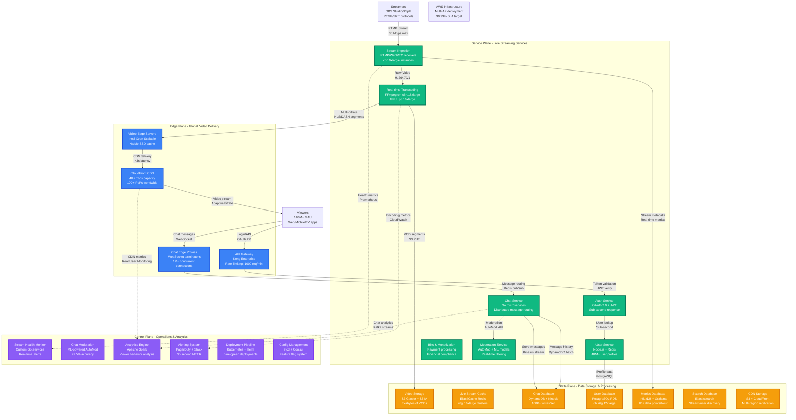

# Twitch Complete Architecture - Live Streaming at Scale

## Production Overview

Twitch operates the world's largest live video platform, serving **140M+ monthly active users** and **15M+ daily active users** with **2.8B+ hours watched monthly**. The platform supports **9M+ active streamers** with ultra-low latency streaming and real-time chat.

### Core Infrastructure Metrics
- **Concurrent Viewers**: 15M+ peak
- **Stream Latency**: <3 seconds (Low Latency mode)
- **Chat Messages**: 1M+ messages/second peak
- **Video Quality**: Up to 1080p60 with dynamic bitrate
- **Global PoPs**: 100+ edge locations
- **CDN Bandwidth**: 40+ Tbps peak capacity

## Complete System Architecture

## Infrastructure Specifications

### Video Processing Infrastructure
- **Stream Ingestion**: c5n.9xlarge instances (36 vCPUs, 96 GB RAM, 50 Gbps network)
- **Transcoding**: c5n.18xlarge + p3.16xlarge GPU instances
- **CDN**: CloudFront with 40+ Tbps global capacity
- **Storage**: S3 with Glacier for long-term VOD storage

### Real-time Chat Infrastructure
- **Chat Service**: Distributed Go microservices on c5.4xlarge
- **Message Routing**: Redis Cluster on r6g.16xlarge instances
- **WebSocket Termination**: HAProxy on c5n.large instances
- **Peak Capacity**: 1M+ concurrent chat connections

### Monetization Infrastructure
- **Bits Processing**: Financial-grade payment systems
- **Subscription Management**: Recurring billing with Stripe
- **Ad Serving**: Real-time ad insertion in video streams
- **Creator Payouts**: Automated financial processing

## Critical Performance Metrics

### Latency Requirements
- **Stream Latency**: <3 seconds (Low Latency mode), <15 seconds (standard)
- **Chat Latency**: <500ms message delivery
- **API Response**: <200ms for user operations
- **CDN Hit Ratio**: >95% for video segments

### Availability Targets
- **Stream Uptime**: 99.9% (8.7 hours downtime/year)
- **Chat Availability**: 99.95% (4.4 hours downtime/year)
- **API Availability**: 99.99% (52 minutes downtime/year)
- **CDN Availability**: 99.99% globally distributed

### Scale Metrics
- **Concurrent Streams**: 9M+ active at peak
- **Bandwidth**: 40+ Tbps peak video delivery
- **Chat Volume**: 1M+ messages/second
- **Storage**: Exabytes of video content

## Operational Excellence

### 24/7 Operations
- **NOC**: Global follow-the-sun support model
- **Incident Response**: <2 minutes first response
- **Escalation**: Automatic paging for P0 incidents
- **Recovery**: <15 minutes MTTR for stream outages

### Monitoring & Alerting
- **Stream Health**: Real-time encoder monitoring
- **CDN Performance**: Global edge server metrics
- **Chat Performance**: Message delivery tracking
- **User Experience**: Real User Monitoring (RUM)

## Cost Optimization

### Infrastructure Spend
- **CDN Costs**: $15M+/month for global video delivery
- **Compute**: $8M+/month for transcoding and services
- **Storage**: $3M+/month for VODs and live cache
- **Total Infrastructure**: $30M+/month at current scale

### Optimization Strategies
- **Adaptive Bitrate**: Reduces bandwidth by 30%
- **AI-based Encoding**: Improves compression by 20%
- **Edge Caching**: 95%+ cache hit ratio
- **Reserved Instances**: 60% discount on predictable workloads

This architecture supports Twitch's mission of building the world's most vibrant live streaming community while maintaining ultra-low latency and global scale.