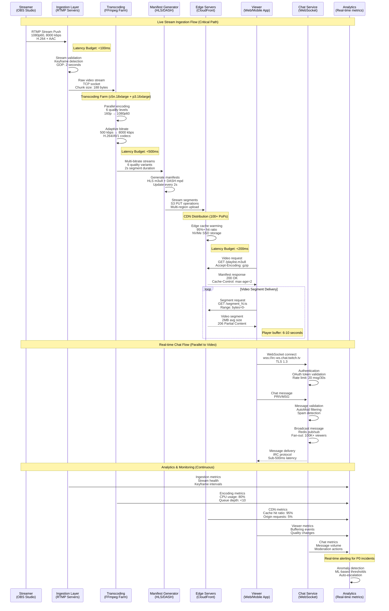
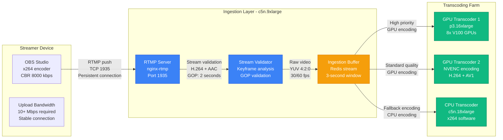
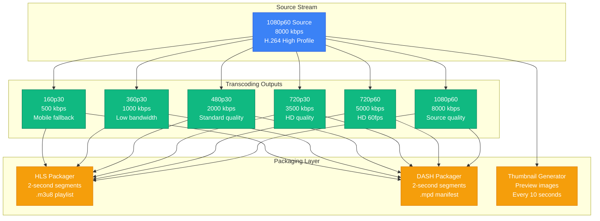
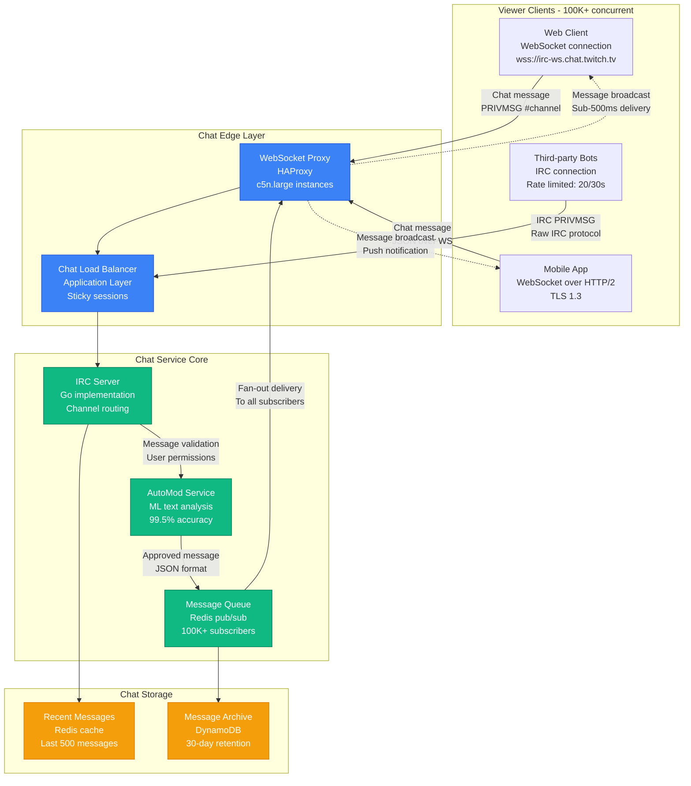
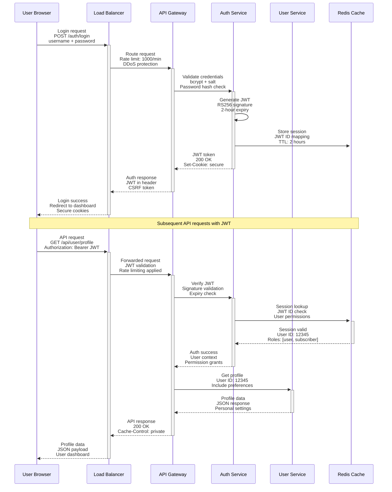

# Twitch Request Flow - Stream Ingestion to Viewer Delivery

## The Golden Path: Stream to Screen in <3 Seconds

Twitch's request flow represents one of the most complex real-time media pipelines in the world, handling **9M+ concurrent streams** and delivering to **15M+ concurrent viewers** with ultra-low latency.

### Critical Path Metrics
- **Stream Ingestion**: <100ms processing latency
- **Transcoding**: <500ms for all quality levels
- **CDN Propagation**: <200ms to edge servers
- **Viewer Delivery**: <3 seconds end-to-end (Low Latency mode)
- **Chat Delivery**: <500ms message propagation

## Complete Request Flow Architecture

## Stream Ingestion Flow Details

### RTMP Processing Pipeline

## Video Delivery Pipeline

### Multi-Quality Transcoding

## Chat Message Flow

### Real-time Chat Architecture

## API Request Flows

### User Authentication Flow

## Performance Characteristics

### Latency Breakdown (Low Latency Mode)
- **Encoder to Ingestion**: 50-100ms (network + processing)
- **Ingestion to Transcoding**: 100-200ms (validation + queuing)
- **Transcoding Processing**: 300-500ms (GPU encoding)
- **Packaging to CDN**: 100-200ms (segment creation + upload)
- **CDN to Viewer**: 200-500ms (edge delivery)
- **Total End-to-End**: <3 seconds (2.8s average)

### Throughput Metrics
- **Stream Ingestion**: 9M+ concurrent streams
- **Transcoding Capacity**: 54M+ quality variants
- **CDN Requests**: 100M+ requests/second
- **Chat Messages**: 1M+ messages/second peak
- **API Requests**: 10M+ requests/minute

### Error Handling
- **Stream Failures**: Automatic failover to backup ingestion
- **Transcoding Failures**: CPU fallback for GPU failures
- **CDN Failures**: Multi-CDN redundancy
- **Chat Failures**: Graceful degradation to view-only mode

This request flow architecture ensures Twitch maintains its position as the world's leading live streaming platform while delivering ultra-low latency and global scale.