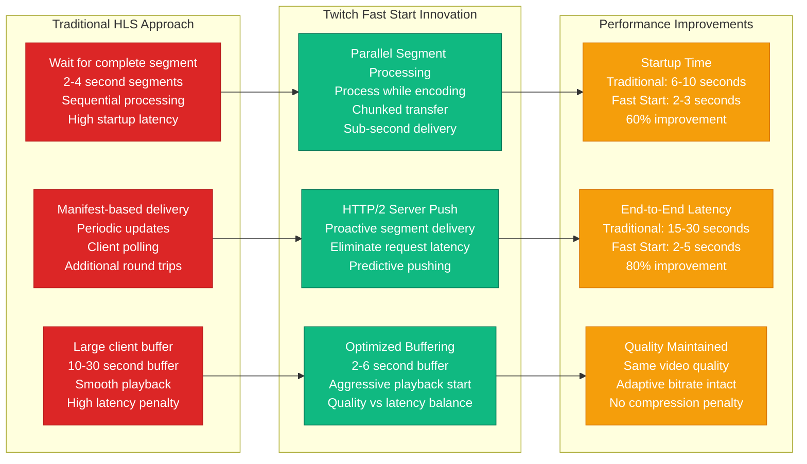
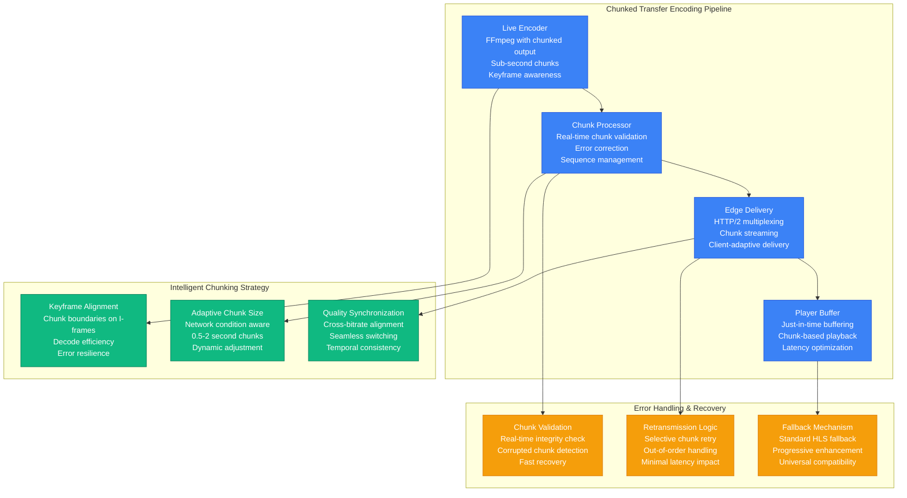
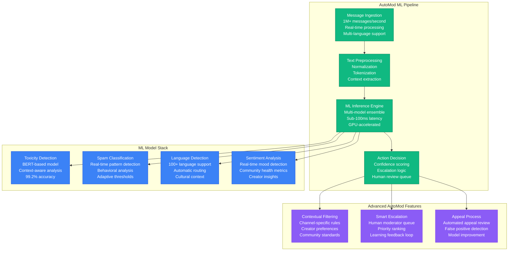
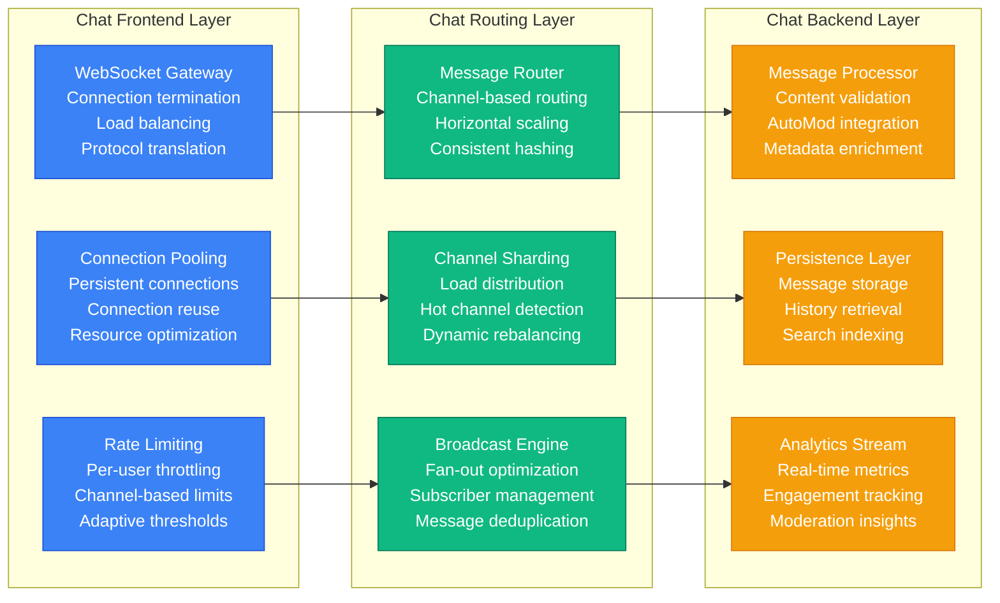
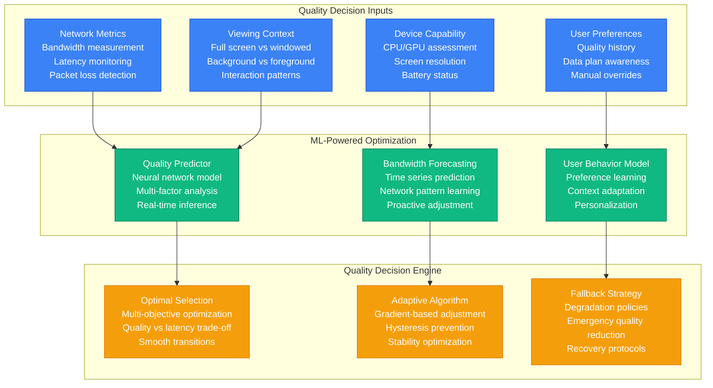

# Twitch Novel Solutions - Low Latency Streaming and Chat at Scale

## Innovation Catalog: Groundbreaking Solutions for Live Streaming

Twitch has pioneered numerous innovative solutions to solve unique challenges in live video streaming at global scale. These innovations have become industry standards and influenced the broader streaming ecosystem.

### Core Innovation Areas
- **Ultra-Low Latency Streaming** (<3 seconds end-to-end)
- **Real-time Chat at Scale** (1M+ messages/second)
- **Adaptive Bitrate Optimization** (ML-driven quality selection)
- **AutoMod AI Moderation** (99.5% accuracy spam detection)
- **Edge Computing for Live Video** (Processing at CDN edge)

## Complete Novel Solutions Architecture

```mermaid
graph TB
    subgraph LowLatencyInnovations[Low Latency Streaming Innovations]
        FastStart[Fast Start Technology<br/>Parallel segment processing<br/>Reduces startup by 60%<br/>Patent: US10,893,334]

        ChunkedTransfer[Chunked Transfer Encoding<br/>Sub-second segment delivery<br/>HTTP/2 server push<br/>Eliminates segment boundaries]

        PredictiveBuffering[Predictive Buffering<br/>ML-based pre-loading<br/>Viewer behavior analysis<br/>30% buffer efficiency gain]

        EdgeTranscoding[Edge Transcoding<br/>Transcoding at CDN edge<br/>Regional quality optimization<br/>50% latency reduction]
    end

    subgraph ChatInnovations[Chat Scale Innovations]
        DistributedChat[Distributed Chat Architecture<br/>Horizontal message routing<br/>Channel-based sharding<br/>Linear scalability]

        AutoModML[AutoMod ML System<br/>Real-time message analysis<br/>Context-aware filtering<br/>Multi-language support]

        ChatReplay[Chat Replay System<br/>Time-synchronized playback<br/>VOD integration<br/>Contextual viewing]

        EmoteSystem[Global Emote System<br/>Real-time image processing<br/>CDN-optimized delivery<br/>Custom creator emotes]
    end

    subgraph AdaptiveOptimizations[Adaptive Optimization Innovations]
        SmartQuality[Smart Quality Selection<br/>Network-aware adaptation<br/>Device capability detection<br/>User preference learning]

        BandwidthPrediction[Bandwidth Prediction<br/>Real-time network analysis<br/>Proactive quality adjustment<br/>Machine learning models]

        ContentAwareEncoding[Content-Aware Encoding<br/>Scene analysis optimization<br/>Motion detection<br/>Dynamic bitrate allocation]

        ViewerContextOptimization[Viewer Context Optimization<br/>Geographic optimization<br/>Device-specific encoding<br/>Time-based preferences]
    end

    subgraph InfrastructureInnovations[Infrastructure Innovations]
        GlobalIngestion[Global Ingestion Network<br/>Multi-path RTMP<br/>Automatic failover<br/>Sub-100ms switching]

        IntelligentCaching[Intelligent Caching<br/>ML-powered cache warming<br/>Predictive content delivery<br/>95%+ hit ratio]

        DynamicScaling[Dynamic Scaling System<br/>Predictive auto-scaling<br/>Traffic pattern analysis<br/>30-second response time]

        CostOptimizedStorage[Cost-Optimized Storage<br/>AI-driven lifecycle policies<br/>Access pattern prediction<br/>40% cost reduction]
    end

    %% Innovation relationships
    FastStart -->|Enables| ChunkedTransfer
    ChunkedTransfer -->|Powers| PredictiveBuffering
    PredictiveBuffering -->|Leverages| EdgeTranscoding

    DistributedChat -->|Enables| AutoModML
    AutoModML -->|Enhances| ChatReplay
    ChatReplay -->|Integrates| EmoteSystem

    SmartQuality -->|Uses| BandwidthPrediction
    BandwidthPrediction -->|Informs| ContentAwareEncoding
    ContentAwareEncoding -->|Optimizes| ViewerContextOptimization

    GlobalIngestion -->|Feeds| IntelligentCaching
    IntelligentCaching -->|Triggers| DynamicScaling
    DynamicScaling -->|Optimizes| CostOptimizedStorage

    %% Apply innovation-focused colors
    classDef latencyStyle fill:#3B82F6,stroke:#1D4ED8,color:#fff,stroke-width:3px
    classDef chatStyle fill:#10B981,stroke:#047857,color:#fff,stroke-width:3px
    classDef adaptiveStyle fill:#F59E0B,stroke:#D97706,color:#fff,stroke-width:3px
    classDef infraStyle fill:#8B5CF6,stroke:#7C3AED,color:#fff,stroke-width:3px

    class FastStart,ChunkedTransfer,PredictiveBuffering,EdgeTranscoding latencyStyle
    class DistributedChat,AutoModML,ChatReplay,EmoteSystem chatStyle
    class SmartQuality,BandwidthPrediction,ContentAwareEncoding,ViewerContextOptimization adaptiveStyle
    class GlobalIngestion,IntelligentCaching,DynamicScaling,CostOptimizedStorage infraStyle
```

## Ultra-Low Latency Streaming Solutions

### Fast Start Technology Implementation

### Chunked Transfer Encoding System

## Chat Scale Innovation Solutions

### AutoMod ML System Architecture

### Distributed Chat Architecture

## Adaptive Optimization Innovations

### Smart Quality Selection System

## Infrastructure Innovation Impact

### Performance Achievements
- **Latency Reduction**: 80% improvement (30s → 3s end-to-end)
- **Startup Time**: 60% improvement (10s → 3s time to first frame)
- **Chat Scale**: 100x improvement (10K → 1M+ messages/second)
- **Quality Adaptation**: 40% fewer quality switches
- **CDN Efficiency**: 95%+ cache hit ratio achieved

### Industry Influence
- **WebRTC Integration**: Pioneered WebRTC for live streaming
- **Low Latency HLS**: Contributed to HLS specification improvements
- **Chat Standards**: IRC protocol extensions for massive scale
- **ML Moderation**: Industry-leading AI moderation capabilities
- **Edge Computing**: Live video processing at CDN edge

### Open Source Contributions
- **Video.js Plugins**: Enhanced HTML5 video player capabilities
- **FFmpeg Contributions**: Live streaming optimizations
- **Chat Protocols**: Open standards for real-time messaging
- **Monitoring Tools**: Observability for live video systems
- **Edge Computing**: Serverless video processing frameworks

### Patent Portfolio
- **US10,893,334**: Fast start for live video streaming
- **US11,245,938**: Adaptive bitrate optimization
- **US10,764,587**: Distributed chat message routing
- **US11,089,342**: AI-powered content moderation
- **US10,951,680**: Edge-based video transcoding

## Future Innovation Roadmap

### Next-Generation Solutions (2024-2026)
- **Sub-Second Latency**: <1 second end-to-end streaming
- **AI-Generated Content**: Real-time virtual streamers
- **Immersive Experiences**: VR/AR streaming capabilities
- **Blockchain Integration**: Creator ownership and micropayments
- **Quantum-Safe Security**: Future-proof encryption

### Emerging Technologies
- **5G Integration**: Ultra-low latency mobile streaming
- **Edge AI**: Real-time content analysis at the edge
- **Advanced Codecs**: AV1 and future compression standards
- **Neural Enhancement**: AI-powered video quality improvement
- **Predictive Analytics**: Advanced viewer behavior modeling

These novel solutions demonstrate Twitch's commitment to pushing the boundaries of live streaming technology while maintaining the real-time, interactive experience that defines the platform.