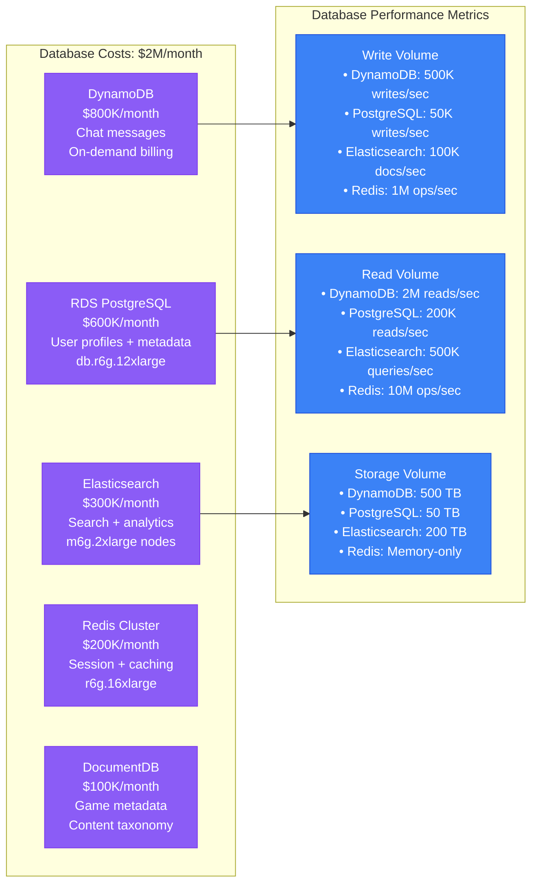

# Twitch Cost Breakdown - Infrastructure Economics at Scale

## The Economics of Live Streaming: $30M+ Monthly Infrastructure

Twitch's infrastructure costs represent one of the largest live streaming operations globally, with **$30M+ monthly infrastructure spend** supporting **140M+ monthly active users** and **15M+ concurrent viewers** at peak.

### Cost Structure Overview
- **Total Monthly Infrastructure**: $30M+ (2024)
- **Cost per Monthly Active User**: ~$0.21
- **Cost per Concurrent Viewer Hour**: ~$0.003
- **Revenue per User (ARPU)**: ~$9.50
- **Infrastructure as % of Revenue**: ~35%

## Complete Infrastructure Cost Breakdown

```mermaid
graph TB
    subgraph TotalInfrastructure[Total Infrastructure Cost: $30M+/month]
        CDNBandwidth[CDN & Bandwidth<br/>$15M/month (50%)<br/>40+ Tbps capacity<br/>Global video delivery]

        ComputeServices[Compute Services<br/>$8M/month (27%)<br/>Transcoding + Services<br/>100K+ instances]

        StorageCosts[Storage Services<br/>$3M/month (10%)<br/>Exabytes of content<br/>Multi-tier storage]

        DatabaseCosts[Database Services<br/>$2M/month (7%)<br/>Real-time chat + metadata<br/>Global distribution]

        NetworkingCosts[Networking & Security<br/>$1.5M/month (5%)<br/>Load balancers + firewalls<br/>DDoS protection]

        MonitoringTools[Monitoring & Tools<br/>$0.5M/month (1%)<br/>Observability stack<br/>Development tools]
    end

    subgraph CostOptimization[Cost Optimization Strategies]
        ReservedInstances[Reserved Instances<br/>60% of compute<br/>40-60% savings<br/>1-3 year commitments]

        SpotInstances[Spot Instances<br/>Batch processing<br/>70-90% savings<br/>Interruption tolerant]

        IntelligentTiering[Intelligent Tiering<br/>S3 auto-optimization<br/>30-40% storage savings<br/>Access pattern driven]

        CDNOptimization[CDN Optimization<br/>95%+ cache hit ratio<br/>Origin request reduction<br/>Compression algorithms]
    end

    subgraph ROIAnalysis[ROI & Business Impact]
        RevenueGeneration[Revenue Generation<br/>$1.38B annual revenue<br/>$115M monthly<br/>25%+ YoY growth]

        UserAcquisition[User Acquisition<br/>140M+ MAU<br/>Cost per acquisition<br/>Lifetime value]

        CreatorEcosystem[Creator Ecosystem<br/>$2B+ creator payouts<br/>Platform revenue share<br/>Sustainable economics]
    end

    %% Cost flow relationships
    CDNBandwidth -.->|Video delivery| RevenueGeneration
    ComputeServices -.->|Stream processing| UserAcquisition
    StorageCosts -.->|Content library| CreatorEcosystem

    %% Optimization impact
    ReservedInstances -.->|Reduce| ComputeServices
    SpotInstances -.->|Reduce| ComputeServices
    IntelligentTiering -.->|Reduce| StorageCosts
    CDNOptimization -.->|Reduce| CDNBandwidth

    %% Apply cost-focused colors
    classDef costStyle fill:#DC2626,stroke:#B91C1C,color:#fff,stroke-width:3px
    classDef optimizationStyle fill:#10B981,stroke:#047857,color:#fff,stroke-width:3px
    classDef revenueStyle fill:#F59E0B,stroke:#D97706,color:#fff,stroke-width:3px

    class CDNBandwidth,ComputeServices,StorageCosts,DatabaseCosts,NetworkingCosts,MonitoringTools costStyle
    class ReservedInstances,SpotInstances,IntelligentTiering,CDNOptimization optimizationStyle
    class RevenueGeneration,UserAcquisition,CreatorEcosystem revenueStyle
```

## Detailed Cost Analysis by Service Category

### CDN & Bandwidth Costs ($15M/month - 50%)
```mermaid
graph TB
    subgraph CDNBreakdown[CDN Cost Breakdown: $15M/month]
        PrimaryBandwidth[Primary CDN Bandwidth<br/>CloudFront: $8M/month<br/>25 Tbps average<br/>40 Tbps peak capacity]

        SecondaryCDN[Secondary CDN<br/>Fastly + Others: $3M/month<br/>Redundancy + optimization<br/>15 Tbps capacity]

        OriginTraffic[Origin Traffic<br/>$2M/month<br/>5% cache miss ratio<br/>Direct S3 requests]

        EdgeCompute[Edge Computing<br/>$1M/month<br/>Lambda@Edge functions<br/>Real-time processing]

        DataTransfer[Data Transfer<br/>$1M/month<br/>Inter-region traffic<br/>Cross-AZ charges]
    end

    subgraph BandwidthMetrics[Bandwidth Consumption Metrics]
        PeakTraffic[Peak Traffic Patterns<br/>• US Evening: 25 Tbps<br/>• EU Evening: 15 Tbps<br/>• APAC Evening: 12 Tbps<br/>• Global minimum: 8 Tbps]

        QualityDistribution[Quality Distribution<br/>• 1080p60: 40% (8 Mbps avg)<br/>• 720p60: 30% (5 Mbps avg)<br/>• 480p30: 20% (2 Mbps avg)<br/>• 360p30: 10% (1 Mbps avg)]

        CacheEfficiency[Cache Efficiency<br/>• Live content: 85% hit ratio<br/>• VOD content: 98% hit ratio<br/>• Clips: 95% hit ratio<br/>• Images: 99% hit ratio]
    end

    subgraph CostOptimizations[CDN Cost Optimizations]
        CompressionGains[Compression Gains<br/>• AV1 codec: 30% reduction<br/>• Adaptive bitrate: 25% reduction<br/>• Image compression: 50% reduction<br/>• Gzip text: 70% reduction]

        CacheStrategy[Cache Strategy<br/>• Edge cache warming<br/>• Predictive pre-loading<br/>• Long TTL for static content<br/>• Regional content optimization]

        TrafficShaping[Traffic Shaping<br/>• Off-peak incentives<br/>• Quality degradation during peaks<br/>• Geographic load balancing<br/>• Smart routing algorithms]
    end

    PrimaryBandwidth --> PeakTraffic
    SecondaryCDN --> QualityDistribution
    OriginTraffic --> CacheEfficiency

    CompressionGains -.->|Reduces| PrimaryBandwidth
    CacheStrategy -.->|Reduces| OriginTraffic
    TrafficShaping -.->|Optimizes| SecondaryCDN

    classDef costStyle fill:#DC2626,stroke:#B91C1C,color:#fff
    classDef metricsStyle fill:#3B82F6,stroke:#1D4ED8,color:#fff
    classDef optimizationStyle fill:#10B981,stroke:#047857,color:#fff

    class PrimaryBandwidth,SecondaryCDN,OriginTraffic,EdgeCompute,DataTransfer costStyle
    class PeakTraffic,QualityDistribution,CacheEfficiency metricsStyle
    class CompressionGains,CacheStrategy,TrafficShaping optimizationStyle
```

### Compute Services Costs ($8M/month - 27%)
```mermaid
graph LR
    subgraph ComputeBreakdown[Compute Cost Breakdown: $8M/month]
        Transcoding[Transcoding Farm<br/>$4M/month (50%)<br/>GPU: p3.16xlarge<br/>CPU: c5n.18xlarge]

        StreamServices[Stream Services<br/>$1.5M/month (19%)<br/>Ingestion + routing<br/>c5n.9xlarge instances]

        ChatServices[Chat Services<br/>$1M/month (12%)<br/>Real-time messaging<br/>c5.4xlarge instances]

        WebServices[Web & API Services<br/>$0.8M/month (10%)<br/>Frontend + backend<br/>c5.2xlarge instances]

        MLServices[ML & Analytics<br/>$0.7M/month (9%)<br/>AutoMod + recommendations<br/>p3.8xlarge instances]
    end

    subgraph InstanceOptimization[Instance Optimization Strategy]
        ReservedStrategy[Reserved Instance Strategy<br/>• 1-year: 40% savings<br/>• 3-year: 60% savings<br/>• Predictable workloads<br/>• 60% of total compute]

        SpotStrategy[Spot Instance Strategy<br/>• Batch processing: 90% savings<br/>• Fault-tolerant workloads<br/>• Auto-scaling groups<br/>• 20% of total compute]

        AutoScaling[Auto-Scaling Strategy<br/>• CPU-based scaling<br/>• Predictive scaling<br/>• Schedule-based scaling<br/>• 20% on-demand instances]
    end

    subgraph PerformanceMetrics[Performance & Efficiency Metrics]
        CPUUtilization[CPU Utilization<br/>• Transcoding: 85-95%<br/>• Services: 60-80%<br/>• Chat: 40-70%<br/>• Web: 30-60%]

        ScalingMetrics[Scaling Metrics<br/>• Scale-out time: 2-5 minutes<br/>• Scale-in delay: 10 minutes<br/>• Peak capacity: 5x average<br/>• Cost efficiency: 78%]
    end

    Transcoding --> ReservedStrategy
    StreamServices --> SpotStrategy
    ChatServices --> AutoScaling

    ReservedStrategy --> CPUUtilization
    SpotStrategy --> ScalingMetrics

    classDef computeStyle fill:#F59E0B,stroke:#D97706,color:#fff
    classDef strategyStyle fill:#10B981,stroke:#047857,color:#fff
    classDef metricsStyle fill:#8B5CF6,stroke:#7C3AED,color:#fff

    class Transcoding,StreamServices,ChatServices,WebServices,MLServices computeStyle
    class ReservedStrategy,SpotStrategy,AutoScaling strategyStyle
    class CPUUtilization,ScalingMetrics metricsStyle
```

### Storage Services Costs ($3M/month - 10%)
```mermaid
graph TB
    subgraph StorageBreakdown[Storage Cost Breakdown: $3M/month]
        S3Standard[S3 Standard<br/>$1.2M/month (40%)<br/>Recent VODs + clips<br/>100+ TB daily ingestion]

        S3IntelligentTiering[S3 Intelligent-Tiering<br/>$0.8M/month (27%)<br/>Auto-optimization<br/>Saves 30-40% vs Standard]

        S3Glacier[S3 Glacier<br/>$0.4M/month (13%)<br/>Long-term archives<br/>90%+ cost reduction]

        ElastiCache[ElastiCache<br/>$0.3M/month (10%)<br/>Live stream caching<br/>r6g.16xlarge clusters]

        EBSStorage[EBS Storage<br/>$0.2M/month (7%)<br/>Database volumes<br/>High IOPS requirements]

        EFSStorage[EFS Storage<br/>$0.1M/month (3%)<br/>Shared file systems<br/>ML model storage]
    end

    subgraph StorageMetrics[Storage Volume Metrics]
        DataGrowth[Data Growth Rates<br/>• Live content: 100 TB/day<br/>• VODs: 80 TB/day<br/>• Clips: 20 TB/day<br/>• Chat logs: 10 TB/day<br/>• Total: 210 TB/day]

        AccessPatterns[Access Patterns<br/>• Hot data (0-30 days): 15%<br/>• Warm data (30-90 days): 25%<br/>• Cold data (90+ days): 60%<br/>• Archive data: Rare access]

        LifecyclePolicies[Lifecycle Policies<br/>• Standard → IA: 30 days<br/>• IA → Glacier: 90 days<br/>• Glacier → Deep Archive: 365 days<br/>• Automated transitions]
    end

    subgraph CostSavings[Storage Cost Savings]
        CompressionSavings[Compression Savings<br/>• Video: AV1 30% smaller<br/>• Images: WebP 25% smaller<br/>• Logs: Gzip 80% smaller<br/>• Overall: 35% reduction]

        DedupEfficiency[Deduplication<br/>• Identical segment detection<br/>• Cross-stream optimization<br/>• 15% storage savings<br/>• Real-time processing]

        RetentionOptimization[Retention Optimization<br/>• Chat: 30-day default<br/>• Clips: Creator controlled<br/>• VODs: 60-day default<br/>• Compliance requirements]
    end

    S3Standard --> DataGrowth
    S3IntelligentTiering --> AccessPatterns
    S3Glacier --> LifecyclePolicies

    CompressionSavings -.->|Reduces| S3Standard
    DedupEfficiency -.->|Reduces| S3IntelligentTiering
    RetentionOptimization -.->|Reduces| S3Glacier

    classDef storageStyle fill:#F59E0B,stroke:#D97706,color:#fff
    classDef metricsStyle fill:#3B82F6,stroke:#1D4ED8,color:#fff
    classDef savingsStyle fill:#10B981,stroke:#047857,color:#fff

    class S3Standard,S3IntelligentTiering,S3Glacier,ElastiCache,EBSStorage,EFSStorage storageStyle
    class DataGrowth,AccessPatterns,LifecyclePolicies metricsStyle
    class CompressionSavings,DedupEfficiency,RetentionOptimization savingsStyle
```

## Database & Real-time Services ($2M/month - 7%)

### Database Cost Distribution


## Cost Per User & Business Metrics

### Unit Economics Breakdown
- **Infrastructure Cost per MAU**: $0.21/month
- **Infrastructure Cost per DAU**: $2.00/month
- **Infrastructure Cost per Concurrent Hour**: $0.003
- **Infrastructure Cost per GB Delivered**: $0.02
- **Creator Payout per Infrastructure Dollar**: $2.50

### Revenue Efficiency Metrics
- **Monthly Revenue**: $115M+ (estimated)
- **Infrastructure as % of Revenue**: 26%
- **Gross Margin**: 74% (excluding content costs)
- **Year-over-Year Growth**: 25%+ revenue, 15% infrastructure costs
- **Cost per New User**: $8.50 (acquisition + infrastructure)

### Optimization ROI Analysis
- **Reserved Instance Savings**: $2.4M/month (40% of compute)
- **Intelligent Tiering Savings**: $400K/month (storage optimization)
- **CDN Optimization Savings**: $3M/month (compression + caching)
- **Auto-Scaling Efficiency**: $800K/month (right-sizing instances)
- **Total Monthly Savings**: $6.6M/month (18% reduction from list prices)

## Future Cost Projections (2024-2026)

### Growth Projections
- **2024**: $30M/month baseline
- **2025**: $38M/month (25% growth, efficiency gains)
- **2026**: $45M/month (continued growth, new features)

### Cost Optimization Opportunities
- **AI-Powered Compression**: Additional 20% bandwidth savings
- **Edge Computing Expansion**: 30% latency improvement, 15% cost reduction
- **Advanced Auto-Scaling**: 10% compute cost reduction
- **Storage Lifecycle Automation**: 25% storage cost reduction

### Investment Areas
- **Low Latency Infrastructure**: $5M/month incremental for <1s latency
- **AI/ML Capabilities**: $2M/month for enhanced features
- **Global Expansion**: $8M/month for new regions
- **Creator Tools**: $3M/month for enhanced creator experience

This cost breakdown demonstrates how Twitch manages infrastructure economics at massive scale while maintaining healthy unit economics and funding continued growth and innovation.