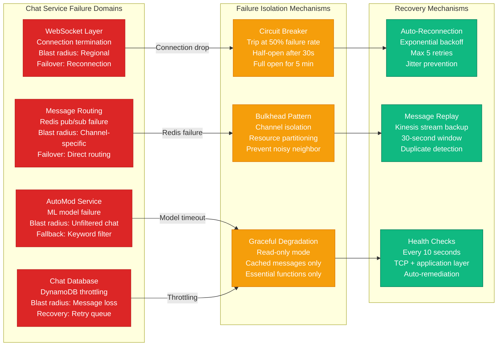
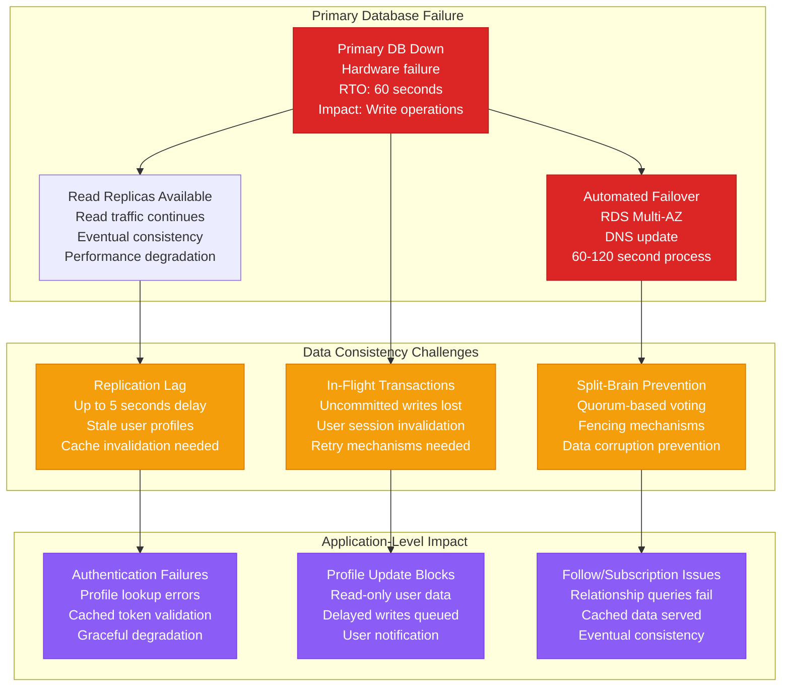
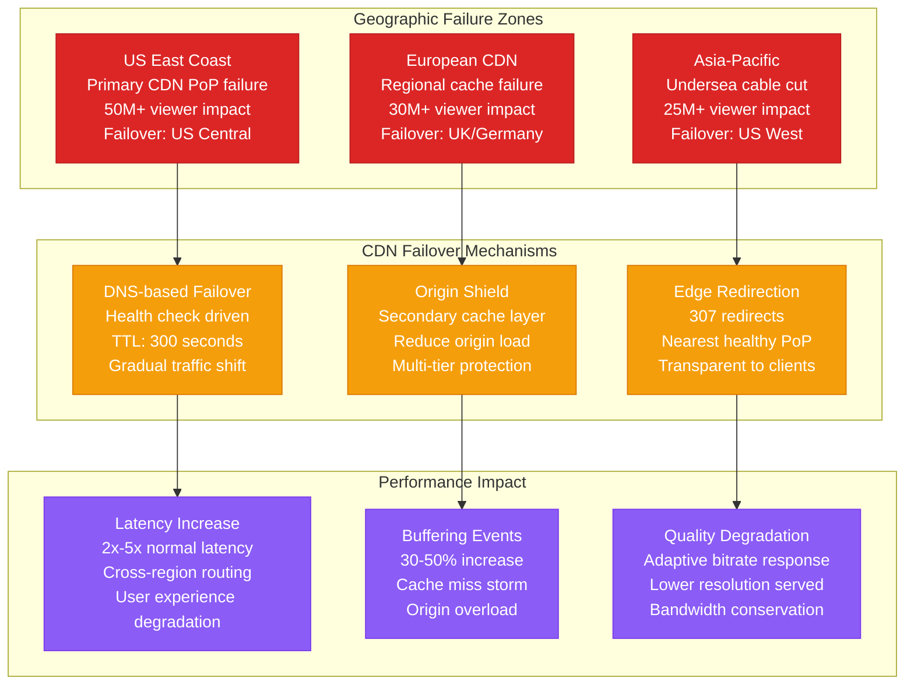

# Twitch Failure Domains - Stream Failures and Chat Outages

## Production Incident Map: Critical Failure Scenarios

Twitch's failure domain architecture protects against cascading failures that could impact **15M+ concurrent viewers** and **9M+ active streamers**. This diagram maps real failure scenarios and their blast radius.

### Historical Incident Context
- **Stream Ingestion Outage** (2019): 45 minutes, affected 2M+ streams
- **Chat Service Failure** (2020): 2 hours, global chat unavailable
- **CDN Edge Failures** (2021): Regional outages, 30% viewer impact
- **Database Overload** (2022): Authentication failures, login issues

## Complete Failure Domain Architecture

```mermaid
graph TB
    subgraph ExternalDependencies[External Dependencies - Highest Risk]
        ISP[ISP Connectivity<br/>Streamer internet failure<br/>Impact: Individual streams<br/>MTTR: User dependent]
        AWS[AWS Service Outages<br/>Regional failures<br/>Impact: Multi-region<br/>MTTR: 2-6 hours]
        CDNProvider[CDN Provider Issues<br/>Global delivery failure<br/>Impact: All viewers<br/>MTTR: 1-4 hours]
    end

    subgraph EdgePlane[Edge Plane Failures - Viewer Impact]
        CDNEdge[CDN Edge Servers<br/>Regional cache failure<br/>Blast radius: 5-10M viewers<br/>Fallback: Origin pull]
        VideoEdge[Video Edge Cache<br/>Local storage failure<br/>Blast radius: 100K-1M viewers<br/>Fallback: Upstream CDN]
        ChatEdge[Chat Edge Proxies<br/>WebSocket termination failure<br/>Blast radius: 500K-2M users<br/>Fallback: Direct connection]
        APIGW[API Gateway<br/>Rate limiting failure<br/>Blast radius: All API users<br/>Fallback: Direct service]
    end

    subgraph ServicePlane[Service Plane Failures - Core Services]
        StreamIngestion[Stream Ingestion<br/>RTMP server cluster failure<br/>Blast radius: 100K-500K streams<br/>Failover: 30 seconds]
        Transcoding[Transcoding Farm<br/>GPU cluster failure<br/>Blast radius: 50K-200K streams<br/>Failover: CPU backup]
        ChatService[Chat Service<br/>Message routing failure<br/>Blast radius: Channel-specific<br/>Failover: Read-only mode]
        UserService[User Service<br/>Authentication failure<br/>Blast radius: All logins<br/>Failover: Cached tokens]
        ModService[Moderation Service<br/>AutoMod failure<br/>Blast radius: Unfiltered chat<br/>Fallback: Manual moderation]
    end

    subgraph StatePlane[State Plane Failures - Data Loss Risk]
        LiveCache[Live Stream Cache<br/>Redis cluster failure<br/>Blast radius: Stream buffering<br/>Recovery: Rebuild cache]
        ChatDB[Chat Database<br/>DynamoDB overload<br/>Blast radius: Message loss<br/>Recovery: Throttling]
        UserDB[User Database<br/>PostgreSQL failure<br/>Blast radius: Profile access<br/>Recovery: Read replicas]
        VideoStorage[Video Storage<br/>S3 bucket failure<br/>Blast radius: VOD access<br/>Recovery: Multi-region]
        StreamMetadata[Stream Metadata<br/>Database corruption<br/>Blast radius: Stream discovery<br/>Recovery: Backup restore]
    end

    subgraph ControlPlane[Control Plane Failures - Operational Impact]
        Monitoring[Monitoring System<br/>Blind operation risk<br/>Blast radius: Detection delay<br/>Backup: Manual checks]
        Deployment[Deployment Pipeline<br/>Release blockage<br/>Blast radius: No updates<br/>Fallback: Manual deploy]
        ConfigMgmt[Config Management<br/>Feature flag failure<br/>Blast radius: Service behavior<br/>Recovery: Default configs]
        Alerting[Alerting System<br/>Notification failure<br/>Blast radius: Response delay<br/>Backup: Secondary system]
    end

    %% Failure propagation paths
    ISP -.->|Network partition| StreamIngestion
    AWS -.->|Service dependency| VideoStorage
    AWS -.->|Infrastructure failure| ChatDB
    CDNProvider -.->|Global delivery impact| CDNEdge

    %% Edge plane cascading failures
    CDNEdge -.->|Origin overload| VideoEdge
    VideoEdge -.->|Cache miss storm| LiveCache
    ChatEdge -.->|Connection surge| ChatService
    APIGW -.->|Rate limit bypass| UserService

    %% Service plane cascading failures
    StreamIngestion -.->|Processing backlog| Transcoding
    Transcoding -.->|Queue overflow| LiveCache
    ChatService -.->|Message flood| ChatDB
    UserService -.->|Auth bypass| ModService

    %% State plane cascading failures
    LiveCache -.->|Cache rebuild| VideoStorage
    ChatDB -.->|Read replica lag| UserDB
    UserDB -.->|Profile lookup failure| StreamMetadata

    %% Control plane blind spots
    Monitoring -.->|Alert delay| Alerting
    ConfigMgmt -.->|Bad config push| Deployment

    %% Circuit breakers and isolation
    StreamIngestion -->|Circuit breaker<br/>Trip threshold: 50% failure| TranscodingFallback[CPU Transcoding Fallback]
    ChatService -->|Graceful degradation<br/>Read-only mode| ChatReadOnly[Chat Read-Only Mode]
    UserService -->|Token cache<br/>Offline validation| AuthCache[Cached Authentication]
    CDNEdge -->|Origin fallback<br/>Direct pull| VideoOrigin[Video Origin Servers]

    %% Apply four-plane colors with failure indicators
    classDef edgeStyle fill:#3B82F6,stroke:#DC2626,color:#fff,stroke-width:4px,stroke-dasharray:5,5
    classDef serviceStyle fill:#10B981,stroke:#DC2626,color:#fff,stroke-width:4px,stroke-dasharray:5,5
    classDef stateStyle fill:#F59E0B,stroke:#DC2626,color:#fff,stroke-width:4px,stroke-dasharray:5,5
    classDef controlStyle fill:#8B5CF6,stroke:#DC2626,color:#fff,stroke-width:4px,stroke-dasharray:5,5
    classDef externalStyle fill:#6B7280,stroke:#DC2626,color:#fff,stroke-width:4px,stroke-dasharray:5,5
    classDef fallbackStyle fill:#059669,stroke:#047857,color:#fff,stroke-width:3px

    class CDNEdge,VideoEdge,ChatEdge,APIGW edgeStyle
    class StreamIngestion,Transcoding,ChatService,UserService,ModService serviceStyle
    class LiveCache,ChatDB,UserDB,VideoStorage,StreamMetadata stateStyle
    class Monitoring,Deployment,ConfigMgmt,Alerting controlStyle
    class ISP,AWS,CDNProvider externalStyle
    class TranscodingFallback,ChatReadOnly,AuthCache,VideoOrigin fallbackStyle
```



## Critical Failure Scenarios

### Stream Ingestion Failure Cascade
```mermaid
graph TB
    subgraph FailureScenario[Scenario: GPU Transcoding Farm Failure]
        TriggerEvent[Trigger: Data Center Power Loss<br/>Impact: 200 GPU instances offline<br/>Affected: 50K concurrent streams]

        ImmediateImpact[Immediate Impact (0-30 seconds)<br/>• Stream quality drops to source only<br/>• Viewers see buffering/errors<br/>• New streams cannot start transcoding]

        CascadingEffects[Cascading Effects (30s-5 min)<br/>• CPU transcoder overload<br/>• Stream ingestion queue backup<br/>• CDN cache miss storm<br/>• Origin server overload]

        SystemResponse[System Response (Automated)<br/>• Circuit breaker triggers<br/>• Route traffic to backup region<br/>• Scale CPU transcoders horizontally<br/>• Enable emergency source-only mode]

        Recovery[Recovery Process (5-30 min)<br/>• GPU instances come online<br/>• Queue processing resumes<br/>• Cache warming begins<br/>• Quality levels restored]
    end

    subgraph BlastRadius[Blast Radius Analysis]
        DirectImpact[Direct Impact<br/>50K streams affected<br/>500K-2M viewers<br/>Revenue loss: $50K/hour]

        IndirectImpact[Indirect Impact<br/>CPU overload affects all streams<br/>Reduced quality for 5M+ viewers<br/>Support ticket surge<br/>Social media backlash]

        BusinessImpact[Business Impact<br/>Creator dissatisfaction<br/>Viewer churn<br/>Ad revenue loss<br/>Platform reputation damage]
    end

    TriggerEvent --> ImmediateImpact
    ImmediateImpact --> CascadingEffects
    CascadingEffects --> SystemResponse
    SystemResponse --> Recovery

    ImmediateImpact --> DirectImpact
    CascadingEffects --> IndirectImpact
    IndirectImpact --> BusinessImpact

    classDef failureStyle fill:#DC2626,stroke:#B91C1C,color:#fff
    classDef impactStyle fill:#F59E0B,stroke:#D97706,color:#fff
    classDef responseStyle fill:#10B981,stroke:#047857,color:#fff
    classDef businessStyle fill:#8B5CF6,stroke:#7C3AED,color:#fff

    class TriggerEvent,ImmediateImpact,CascadingEffects failureStyle
    class DirectImpact,IndirectImpact impactStyle
    class SystemResponse,Recovery responseStyle
    class BusinessImpact businessStyle
```

### Chat Service Failure Analysis


## Database Failure Scenarios

### PostgreSQL User Database Failure


## CDN and Edge Failures

### Global CDN Failure Impact


## Incident Response Procedures

### Automated Response Systems
- **Circuit Breakers**: Automatic service isolation at 50% failure rate
- **Auto-Scaling**: Horizontal scaling triggers at 70% resource utilization
- **Health Checks**: Continuous monitoring with 10-second intervals
- **Failover Automation**: Multi-AZ database failover in 60-120 seconds
- **Cache Warming**: Predictive cache population during recovery

### Manual Response Procedures
- **Incident Commander**: Senior engineer leads response coordination
- **Communication**: Real-time updates via Slack and status page
- **Escalation**: Automatic paging for P0 incidents within 2 minutes
- **Post-Incident**: Blameless post-mortems within 48 hours
- **Prevention**: Action items tracked to prevent recurrence

## Blast Radius Containment

### Service Isolation Strategies
- **Microservice Architecture**: Independent failure domains
- **Resource Partitioning**: Dedicated infrastructure per service tier
- **Regional Isolation**: Multi-region deployment with failover
- **Customer Segmentation**: Premium users get isolated resources
- **Rate Limiting**: Per-user and per-service request throttling

### Data Protection Measures
- **Multi-Region Replication**: Critical data replicated across 3+ regions
- **Point-in-Time Recovery**: Database backups every 5 minutes
- **Immutable Storage**: S3 versioning and deletion protection
- **Backup Validation**: Automated restore testing weekly
- **Disaster Recovery**: RTO: 4 hours, RPO: 15 minutes

This failure domain architecture ensures Twitch can maintain service during major incidents while minimizing impact on creators and viewers.