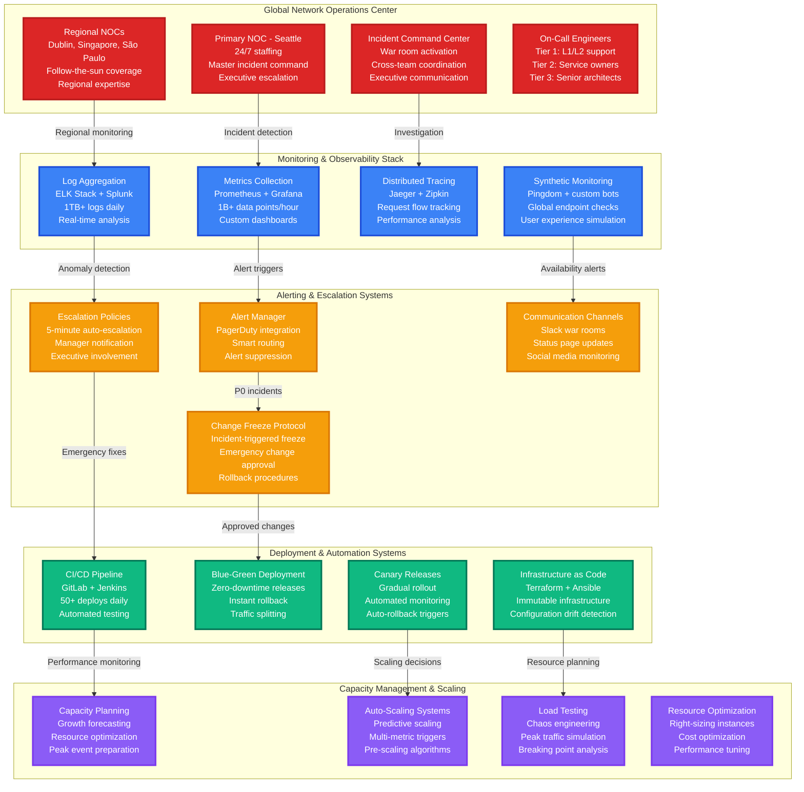
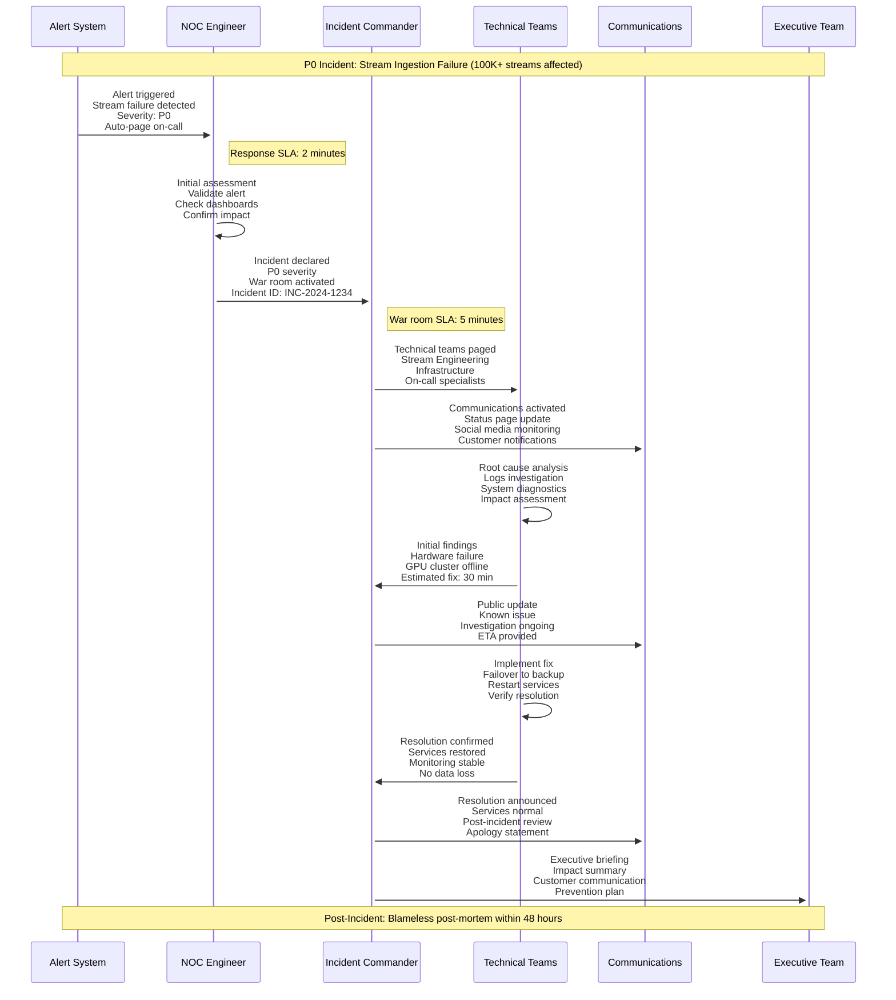
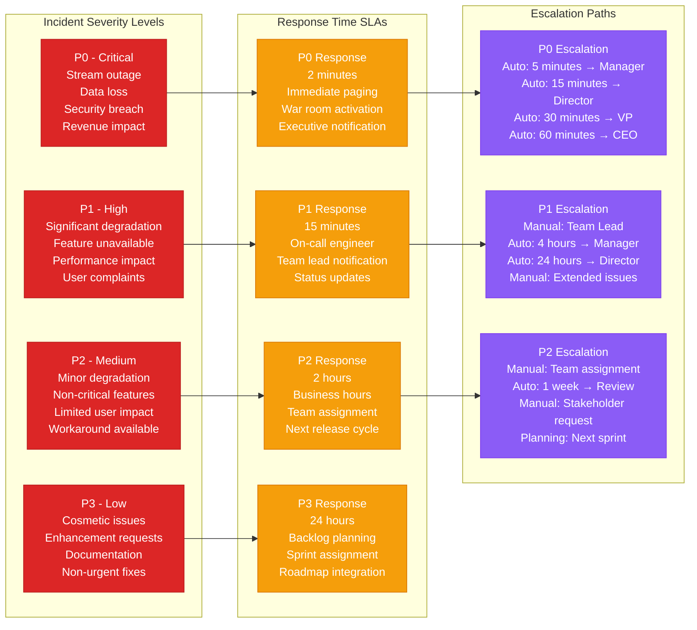
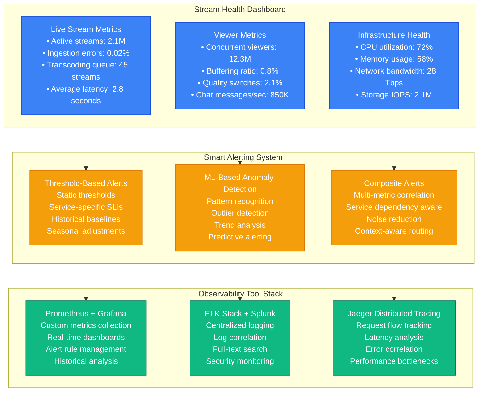
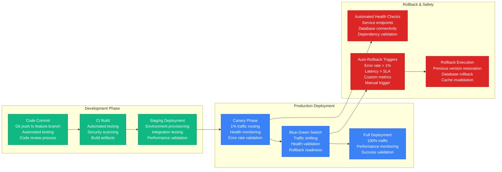
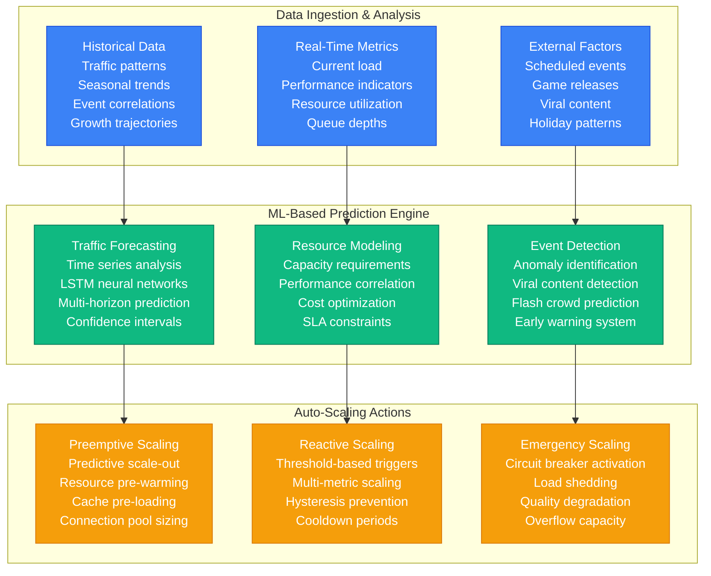

# Twitch Production Operations - 24/7 Live Streaming Operations

## The Operations Command Center: Never-Failing Live Streaming

Twitch operates one of the world's most complex real-time systems, requiring **24/7 operations** to support **15M+ concurrent viewers** and **9M+ active streamers** across global time zones with **99.9% uptime targets**.

### Operations Scale & Metrics
- **NOC Coverage**: Follow-the-sun model across 4 time zones
- **Incident Response**: <2 minutes for P0 incidents
- **Mean Time to Recovery (MTTR)**: <15 minutes for stream outages
- **Change Deployment**: 50+ deployments daily with zero-downtime
- **Monitoring Data Points**: 1B+ metrics per hour

## Complete Production Operations Architecture

## Incident Response & Management

### P0 Incident Response Flow

### Escalation Matrix & Response Times

## Monitoring & Observability Systems

### Real-time Monitoring Dashboard

## Deployment Operations & Automation

### Zero-Downtime Deployment Pipeline

## Capacity Management & Scaling

### Predictive Scaling System

## Production Operations Metrics & KPIs

### Service Level Objectives (SLOs)
- **Stream Availability**: 99.9% (8.7 hours downtime/year maximum)
- **Stream Latency**: 95% of streams <3 seconds end-to-end
- **Chat Delivery**: 99.5% of messages delivered <500ms
- **API Response Time**: 95% of requests <200ms
- **Page Load Time**: 95% of pages <2 seconds

### Operational Excellence Metrics
- **Mean Time to Detection (MTTD)**: 1.2 minutes average
- **Mean Time to Recovery (MTTR)**: 14.5 minutes average
- **Change Success Rate**: 99.2% (deployments without rollback)
- **Alert Accuracy**: 96.8% (true positive rate)
- **Incident Recurrence**: <5% (same root cause within 30 days)

### Team Performance Indicators
- **On-Call Response**: 97% within SLA
- **Escalation Rate**: 8% (incidents requiring escalation)
- **Post-Mortem Completion**: 100% within 48 hours
- **Action Item Closure**: 92% within committed timeline
- **Knowledge Base Updates**: 100% incident documentation

## Crisis Management & Business Continuity

### Disaster Recovery Procedures
- **RTO (Recovery Time Objective)**: 4 hours for full service restoration
- **RPO (Recovery Point Objective)**: 15 minutes maximum data loss
- **Backup Strategy**: Multi-region automated backups every 5 minutes
- **Failover Testing**: Monthly disaster recovery drills
- **Communication Plan**: Pre-drafted statements for major outages

### Major Event Preparation
- **Pre-Event Scaling**: 2x normal capacity for predicted viral events
- **War Room Activation**: Dedicated incident response for major launches
- **Vendor Coordination**: Direct lines to AWS, CDN providers
- **Media Relations**: Proactive communication for planned maintenance
- **Stakeholder Updates**: Real-time executive dashboard during events

This production operations framework ensures Twitch maintains its position as the world's most reliable live streaming platform while continuously improving operational excellence and user experience.