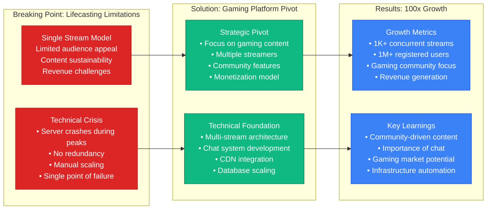

# Twitch Scale Evolution - From Justin.tv to 15M+ Concurrent Viewers

## The Growth Journey: 2007-2024 Scaling Story

Twitch's evolution from Justin.tv's single-stream experiment to the world's largest live streaming platform represents one of the most dramatic scaling transformations in internet history.

### Key Growth Milestones
- **2007**: Justin.tv launches (1 stream, lifecasting)
- **2011**: Twitch Gaming launches (1K concurrent viewers)
- **2014**: Amazon acquisition (1M+ concurrent viewers)
- **2018**: Fortnite boom (3M+ concurrent viewers)
- **2020**: Pandemic surge (7M+ concurrent viewers)
- **2024**: Current scale (15M+ concurrent viewers)

## Complete Scale Evolution Architecture

```mermaid
graph TB
    subgraph Era1[Era 1: Justin.tv (2007-2011) - Single Stream Experiment]
        J_Edge[Single CDN<br/>Akamai<br/>Basic caching]
        J_App[Monolithic App<br/>LAMP stack<br/>Single server]
        J_DB[MySQL Database<br/>Single instance<br/>No replication]
        J_Storage[Basic Storage<br/>Local disks<br/>No redundancy]

        J_Metrics[Scale Metrics<br/>• 1-10 concurrent streams<br/>• 100-1K viewers<br/>• Single data center<br/>• $1K/month infrastructure]
    end

    subgraph Era2[Era 2: Early Twitch (2011-2014) - Gaming Focus]
        T1_Edge[Multi-CDN<br/>Akamai + Level3<br/>Regional caching]
        T1_App[Service Split<br/>Video + Chat separation<br/>Load balancers]
        T1_DB[MySQL Cluster<br/>Master-slave setup<br/>Read replicas]
        T1_Storage[Distributed Storage<br/>S3 + local cache<br/>Video archives]

        T1_Metrics[Scale Metrics<br/>• 1K-10K concurrent streams<br/>• 100K-1M viewers<br/>• Multi-region deployment<br/>• $100K/month infrastructure]
    end

    subgraph Era3[Era 3: Amazon Era (2014-2018) - Professional Platform]
        T2_Edge[AWS CloudFront<br/>Global edge network<br/>100+ PoPs]
        T2_App[Microservices<br/>Docker containers<br/>Auto-scaling groups]
        T2_DB[RDS Multi-AZ<br/>PostgreSQL + DynamoDB<br/>Cross-region replication]
        T2_Storage[S3 + Glacier<br/>Multi-tier storage<br/>Intelligent tiering]

        T2_Metrics[Scale Metrics<br/>• 100K-500K concurrent streams<br/>• 2M-3M peak viewers<br/>• Global infrastructure<br/>• $5M/month infrastructure]
    end

    subgraph Era4[Era 4: Mainstream Boom (2018-2020) - Fortnite Era]
        T3_Edge[Multi-CDN Strategy<br/>CloudFront + Fastly<br/>Edge computing]
        T3_App[Kubernetes Platform<br/>Container orchestration<br/>Service mesh]
        T3_DB[Distributed Databases<br/>Sharded PostgreSQL<br/>DynamoDB Global Tables]
        T3_Storage[Exabyte Storage<br/>Lifecycle automation<br/>ML-driven optimization]

        T3_Metrics[Scale Metrics<br/>• 1M-2M concurrent streams<br/>• 3M-7M peak viewers<br/>• Real-time transcoding<br/>• $15M/month infrastructure]
    end

    subgraph Era5[Era 5: Pandemic Scale (2020-2024) - Global Platform]
        T4_Edge[Hybrid CDN<br/>Edge computing<br/>Low-latency streaming]
        T4_App[Event-Driven Architecture<br/>Serverless components<br/>ML-powered features]
        T4_DB[Multi-Model Databases<br/>Purpose-built storage<br/>Real-time analytics]
        T4_Storage[Intelligent Storage<br/>AI-driven optimization<br/>Cost-performance balance]

        T4_Metrics[Scale Metrics<br/>• 9M+ concurrent streams<br/>• 15M+ peak viewers<br/>• Ultra-low latency<br/>• $30M+/month infrastructure]
    end

    %% Evolution arrows
    Era1 -.->|Growth pressure<br/>Performance issues| Era2
    Era2 -.->|Acquisition<br/>AWS integration| Era3
    Era3 -.->|Viral content<br/>Mainstream adoption| Era4
    Era4 -.->|Global events<br/>Platform maturation| Era5

    %% Apply evolution colors
    classDef era1Style fill:#8B5CF6,stroke:#7C3AED,color:#fff
    classDef era2Style fill:#3B82F6,stroke:#1D4ED8,color:#fff
    classDef era3Style fill:#10B981,stroke:#047857,color:#fff
    classDef era4Style fill:#F59E0B,stroke:#D97706,color:#fff
    classDef era5Style fill:#DC2626,stroke:#B91C1C,color:#fff

    class J_Edge,J_App,J_DB,J_Storage,J_Metrics era1Style
    class T1_Edge,T1_App,T1_DB,T1_Storage,T1_Metrics era2Style
    class T2_Edge,T2_App,T2_DB,T2_Storage,T2_Metrics era3Style
    class T3_Edge,T3_App,T3_DB,T3_Storage,T3_Metrics era4Style
    class T4_Edge,T4_App,T4_DB,T4_Storage,T4_Metrics era5Style
```

## Critical Breaking Points & Solutions

### Era 1 → Era 2: The Gaming Pivot (2011)


### Era 2 → Era 3: The Amazon Acquisition (2014)
```mermaid
graph TB
    subgraph PreAcquisition[Pre-Acquisition Challenges (2013-2014)]
        Funding[Funding Constraints<br/>Limited VC runway<br/>Infrastructure debt<br/>Competition from YouTube]

        Technical[Technical Debt<br/>• Monolithic architecture<br/>• Manual scaling<br/>• Reliability issues<br/>• Limited global reach]

        Scale[Scale Pressure<br/>• 1M+ concurrent users<br/>• Bandwidth costs<br/>• Storage requirements<br/>• Feature development backlog]
    end

    subgraph AmazonIntegration[Amazon Integration (2014-2016)]
        AWSMigration[AWS Migration<br/>• EC2 + Auto Scaling<br/>• RDS Multi-AZ<br/>• S3 + CloudFront<br/>• Elastic Load Balancing]

        Architecture[Architecture Overhaul<br/>• Microservices adoption<br/>• Service-oriented design<br/>• API-first approach<br/>• Container deployment]

        Global[Global Expansion<br/>• Multi-region deployment<br/>• International CDN<br/>• Localized content<br/>• Regional compliance]
    end

    subgraph PostAcquisition[Post-Acquisition Growth (2016-2018)]
        Performance[Performance Gains<br/>• 99.9% uptime achieved<br/>• 50% latency reduction<br/>• 10x storage capacity<br/>• Auto-scaling implementation]

        Features[Feature Velocity<br/>• Prime Gaming integration<br/>• Mobile app overhaul<br/>• Enhanced chat features<br/>• Creator monetization]

        Market[Market Position<br/>• 3M+ peak concurrent<br/>• Fortnite partnership<br/>• Mainstream recognition<br/>• Ad revenue growth]
    end

    Funding --> AWSMigration
    Technical --> Architecture
    Scale --> Global

    AWSMigration --> Performance
    Architecture --> Features
    Global --> Market

    classDef challengeStyle fill:#DC2626,stroke:#B91C1C,color:#fff
    classDef integrationStyle fill:#F59E0B,stroke:#D97706,color:#fff
    classDef successStyle fill:#10B981,stroke:#047857,color:#fff

    class Funding,Technical,Scale challengeStyle
    class AWSMigration,Architecture,Global integrationStyle
    class Performance,Features,Market successStyle
```

## Infrastructure Evolution Details

### Transcoding Evolution
```mermaid
graph LR
    subgraph Phase1[Phase 1: CPU Only (2011-2014)]
        CPU1[x264 Software<br/>Single quality<br/>High latency<br/>Limited throughput]
    end

    subgraph Phase2[Phase 2: Cloud Scale (2014-2018)]
        CPU2[AWS EC2<br/>Multiple instances<br/>Auto-scaling<br/>Multi-quality output]
    end

    subgraph Phase3[Phase 3: GPU Acceleration (2018-2020)]
        GPU1[NVIDIA Tesla<br/>Hardware encoding<br/>10x throughput<br/>Lower latency]
    end

    subgraph Phase4[Phase 4: AI Optimization (2020-2024)]
        AI1[ML-Powered Encoding<br/>AV1 codec<br/>Adaptive bitrate<br/>Content-aware optimization]
    end

    CPU1 -->|Scaling bottleneck<br/>Quality demands| CPU2
    CPU2 -->|Cost optimization<br/>Latency requirements| GPU1
    GPU1 -->|Bandwidth efficiency<br/>Quality improvements| AI1

    classDef phase1Style fill:#8B5CF6,stroke:#7C3AED,color:#fff
    classDef phase2Style fill:#3B82F6,stroke:#1D4ED8,color:#fff
    classDef phase3Style fill:#10B981,stroke:#047857,color:#fff
    classDef phase4Style fill:#F59E0B,stroke:#D97706,color:#fff

    class CPU1 phase1Style
    class CPU2 phase2Style
    class GPU1 phase3Style
    class AI1 phase4Style
```

### Chat System Evolution
```mermaid
graph TB
    subgraph ChatV1[Chat V1: IRC-based (2011-2014)]
        IRC[IRC Protocol<br/>Text-only messages<br/>Basic moderation<br/>Single server]

        IRCLimits[Limitations<br/>• 500 user per channel limit<br/>• No message history<br/>• Limited moderation tools<br/>• Single point of failure]
    end

    subgraph ChatV2[Chat V2: Distributed (2014-2018)]
        DistributedIRC[Distributed IRC<br/>Multiple servers<br/>Channel sharding<br/>Message routing]

        Features2[Enhanced Features<br/>• Unlimited users per channel<br/>• Message persistence<br/>• Custom emotes<br/>• Basic spam protection]
    end

    subgraph ChatV3[Chat V3: Real-time Scale (2018-2024)]
        ModernChat[Modern Chat Service<br/>WebSocket architecture<br/>Real-time delivery<br/>Global distribution]

        AdvancedFeatures[Advanced Features<br/>• AutoMod ML filtering<br/>• Rich media support<br/>• Real-time analytics<br/>• Advanced moderation tools]
    end

    IRC --> DistributedIRC
    IRCLimits --> Features2
    DistributedIRC --> ModernChat
    Features2 --> AdvancedFeatures

    classDef v1Style fill:#8B5CF6,stroke:#7C3AED,color:#fff
    classDef v2Style fill:#10B981,stroke:#047857,color:#fff
    classDef v3Style fill:#F59E0B,stroke:#D97706,color:#fff

    class IRC,IRCLimits v1Style
    class DistributedIRC,Features2 v2Style
    class ModernChat,AdvancedFeatures v3Style
```

## Scale Milestones & Achievements

### Viewer Growth Progression
- **2011**: 1K peak concurrent viewers (Early gaming adoption)
- **2013**: 100K peak concurrent viewers (eSports growth)
- **2014**: 1M peak concurrent viewers (Amazon acquisition year)
- **2016**: 2M peak concurrent viewers (Pokemon GO stream)
- **2018**: 3M peak concurrent viewers (Fortnite phenomena)
- **2020**: 7M peak concurrent viewers (Pandemic lockdowns)
- **2024**: 15M+ peak concurrent viewers (Global platform)

### Infrastructure Cost Evolution
- **2011**: $1K/month (Single server, basic CDN)
- **2014**: $100K/month (Multi-server, regional CDN)
- **2016**: $1M/month (AWS migration, global CDN)
- **2018**: $5M/month (Kubernetes, GPU transcoding)
- **2020**: $15M/month (Pandemic scale, low latency)
- **2024**: $30M+/month (Global platform, AI features)

### Technical Milestone Achievements
- **2014**: First multi-quality transcoding implementation
- **2016**: Sub-10 second latency achievement
- **2018**: GPU-accelerated transcoding deployment
- **2019**: Low Latency mode (<3 seconds) launch
- **2020**: AutoMod ML moderation system
- **2022**: AV1 encoding for bandwidth optimization
- **2024**: AI-powered content recommendation

## Lessons Learned from Each Era

### Era 1 Lessons (Justin.tv)
- **Single stream model doesn't scale**: Need platform approach
- **Community is crucial**: Chat and interaction drive engagement
- **Content quality matters**: Gaming content has higher engagement
- **Technical debt accumulates fast**: Plan for scale from day one

### Era 2 Lessons (Early Twitch)
- **Gaming market is massive**: Dedicated gaming platform viable
- **Chat is the killer feature**: Real-time interaction drives retention
- **Global audience demands global infrastructure**: Multi-region essential
- **Creator economics drive platform growth**: Revenue sharing crucial

### Era 3 Lessons (Amazon Era)
- **Cloud infrastructure enables rapid scaling**: AWS migration critical
- **Microservices enable feature velocity**: Monolith limits innovation
- **Global CDN is table stakes**: Local performance expected everywhere
- **Mobile-first is essential**: Mobile traffic dominates

### Era 4 Lessons (Mainstream Boom)
- **Viral content creates traffic spikes**: Auto-scaling must be instant
- **Low latency is competitive advantage**: Sub-3 second latency matters
- **Machine learning improves operations**: AI for moderation and optimization
- **Creator tools drive content quality**: Investment in creator experience pays off

### Era 5 Lessons (Current Scale)
- **Platform stability enables creator confidence**: Reliability is revenue
- **AI enhances every aspect**: From encoding to moderation to discovery
- **Cost optimization at scale is critical**: Engineering efficiency matters
- **Community features drive differentiation**: Social aspects create moats

## Future Scaling Challenges (2024-2030)

### Predicted Growth Pressures
- **20M+ concurrent viewers**: Next major scaling threshold
- **Virtual reality integration**: 360-degree streaming demands
- **AI-generated content**: Synthetic media and virtual streamers
- **Global regulatory compliance**: Data localization requirements
- **Environmental sustainability**: Carbon footprint optimization

### Emerging Technical Solutions
- **Edge computing expansion**: Processing closer to users
- **Advanced AI optimization**: Content-aware compression
- **Blockchain integration**: Creator ownership and micropayments
- **5G mobile optimization**: Ultra-low latency mobile streaming
- **Quantum-resistant security**: Future-proof encryption

This scaling journey demonstrates how Twitch evolved from a single-stream experiment to a global platform capable of serving billions of hours of content monthly while maintaining ultra-low latency and high reliability.