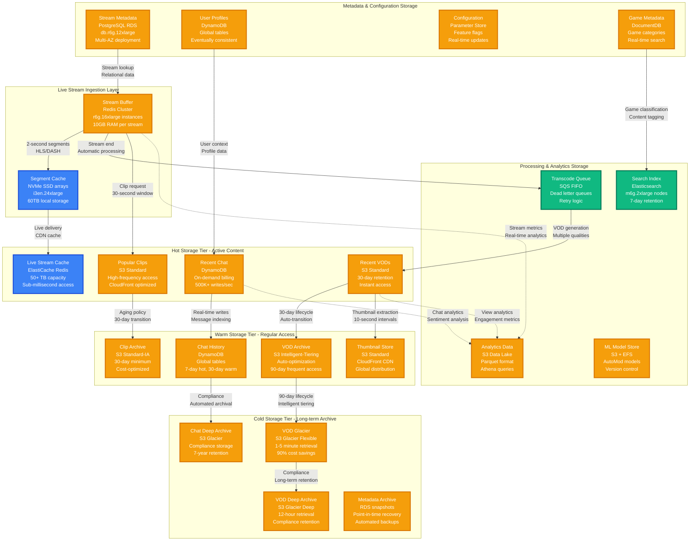
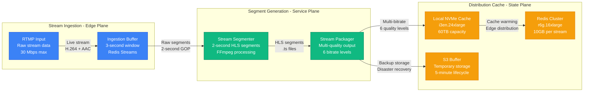
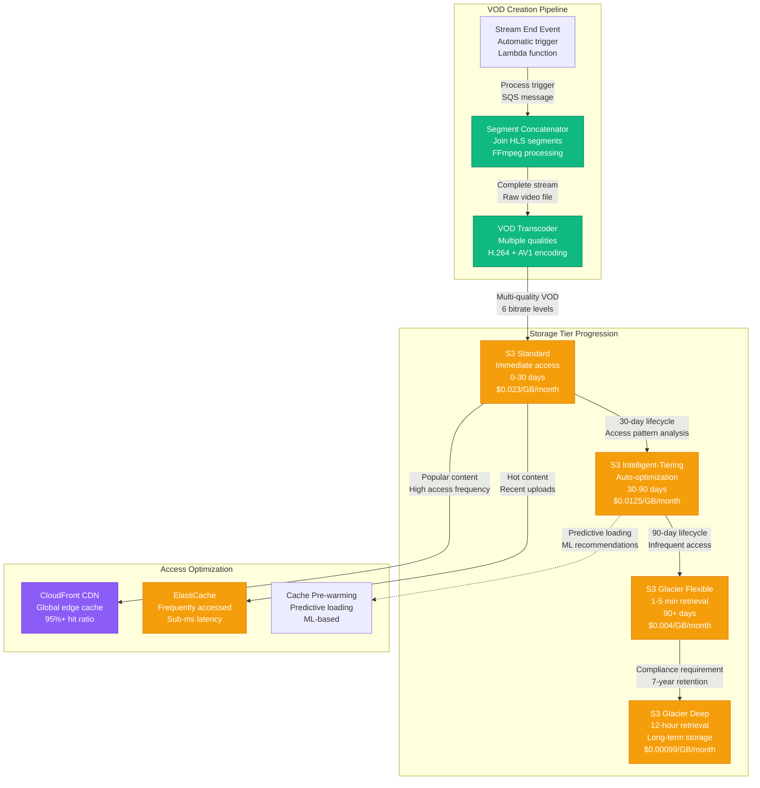
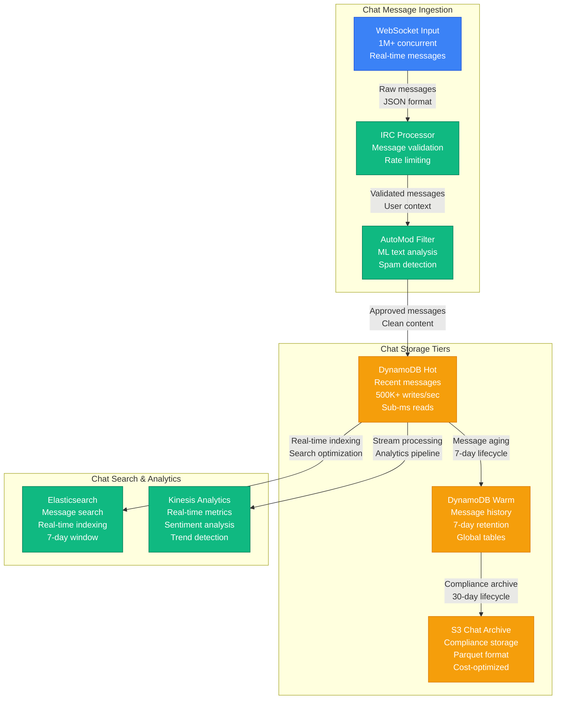
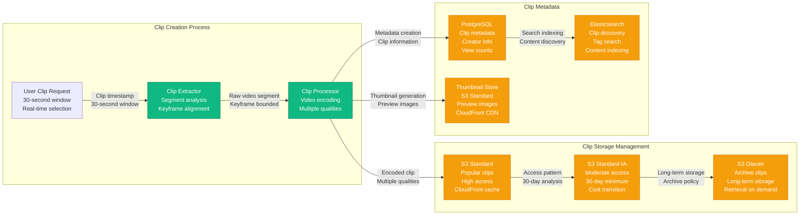

# Twitch Storage Architecture - Video, VODs, and Clips at Scale

## Data Journey: From Live Stream to Permanent Archive

Twitch's storage architecture manages **exabytes of video content** with **2.8B+ hours watched monthly**, handling everything from live stream buffering to permanent VOD storage and user-generated clips.

### Storage Scale Metrics
- **Total Storage**: 100+ exabytes across all tiers
- **Live Stream Cache**: 50+ petabytes (Redis + SSD)
- **VOD Storage**: 90+ exabytes (S3 Glacier + Intelligent Tiering)
- **Clip Generation**: 1M+ clips created daily
- **Thumbnail Storage**: 500+ TB of preview images
- **Chat Archives**: 10+ TB daily message storage

## Complete Storage Architecture

## Storage Tier Details

### Live Stream Storage Pipeline

### VOD Storage Lifecycle

## Chat Storage Architecture

### Real-time Chat Storage

## Clip Storage System

### User-Generated Clips

## Storage Performance Metrics

### Throughput Specifications
- **Live Stream Writes**: 100+ GB/second during peak
- **VOD Reads**: 40+ Tbps global CDN delivery
- **Chat Writes**: 500K+ messages/second to DynamoDB
- **Clip Creation**: 1M+ clips generated daily
- **Thumbnail Generation**: 10M+ images created daily

### Latency Requirements
- **Live Stream Access**: <50ms from cache
- **VOD Start Time**: <2 seconds (recent content)
- **Chat Message Retrieval**: <100ms for recent messages
- **Clip Access**: <500ms for popular clips
- **Search Results**: <200ms for content discovery

### Durability & Availability
- **Live Stream Buffer**: 99.9% availability (Redis Cluster)
- **VOD Storage**: 99.999999999% durability (S3)
- **Chat Storage**: 99.99% availability (DynamoDB)
- **CDN Delivery**: 99.9% global availability
- **Backup Strategy**: Multi-region replication

## Cost Optimization Strategies

### Storage Cost Breakdown
- **S3 Standard**: $8M+/month (hot content, recent VODs)
- **S3 Intelligent-Tiering**: $12M+/month (automatic optimization)
- **S3 Glacier**: $2M+/month (archive content)
- **DynamoDB**: $3M+/month (chat and metadata)
- **ElastiCache**: $1M+/month (live stream cache)
- **CloudFront**: $15M+/month (global CDN delivery)

### Optimization Techniques
- **Intelligent Tiering**: Automatic cost optimization saves 40%
- **Lifecycle Policies**: Automated transitions reduce storage costs
- **Compression**: AV1 encoding reduces storage by 30%
- **Deduplication**: Identical segment detection saves 15%
- **Predictive Caching**: ML-based pre-warming improves hit ratios

## Data Governance & Compliance

### Retention Policies
- **Live Stream Segments**: 5 minutes (disaster recovery only)
- **VODs**: 60 days (creator control), 7 years (compliance)
- **Chat Messages**: 30 days (active), 7 years (archive)
- **User Data**: Per GDPR requirements
- **Analytics Data**: 13 months (business intelligence)

### Security Measures
- **Encryption at Rest**: AES-256 for all storage tiers
- **Encryption in Transit**: TLS 1.3 for all data transfers
- **Access Control**: IAM policies with least privilege
- **Audit Logging**: CloudTrail for all storage operations
- **Data Classification**: Automated PII detection and protection

This storage architecture enables Twitch to handle massive scale while maintaining performance, cost efficiency, and regulatory compliance across its global platform.