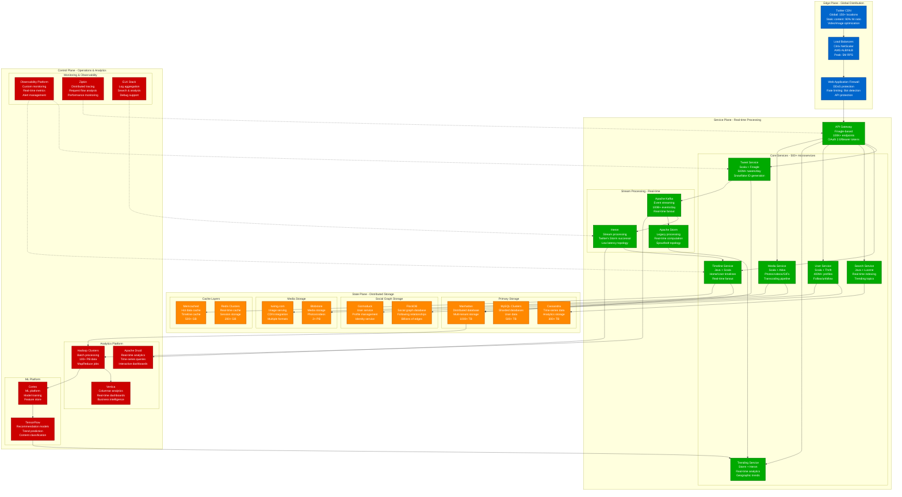
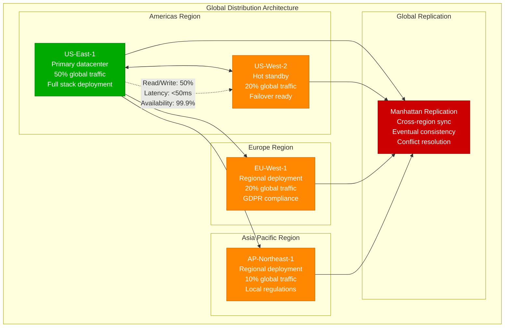
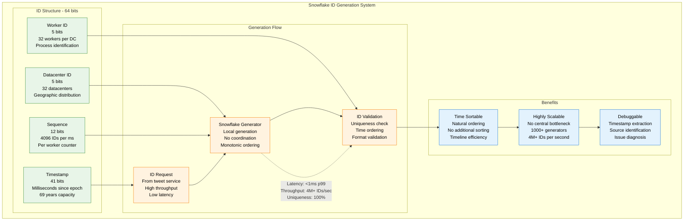
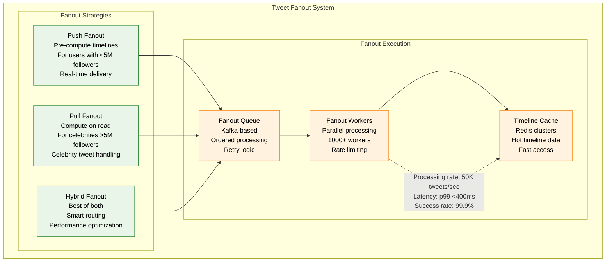

# Twitter/X Complete Architecture

## Overview
Twitter/X's architecture handles 500M+ tweets daily, serving 300B+ tweets annually to a global audience. The platform focuses on real-time information distribution with massive scale and low latency requirements.

## Complete System Architecture

## Production Scale Metrics

| Component | Scale | Technology | Instance Type |
|-----------|-------|------------|---------------|
| **API Gateway** | 5M RPS peak | Finagle (Scala) | AWS c6i.8xlarge |
| **Tweet Service** | 500M tweets/day | Scala + Finagle | AWS c6i.4xlarge |
| **Timeline Service** | 300B timelines/year | Java + Scala | AWS r6i.8xlarge |
| **Manhattan DB** | 1000+ TB | Custom distributed DB | AWS i4i.8xlarge |
| **Search Service** | 500M searches/day | Java + Lucene | AWS c6i.8xlarge |
| **Kafka Clusters** | 100B events/day | Apache Kafka | AWS i4i.4xlarge |

## Regional Architecture

## Cost Structure (Annual)

| Category | Cost | Percentage | Details |
|----------|------|------------|---------|
| **Compute** | $600M | 40% | EC2 instances, auto-scaling |
| **Storage** | $300M | 20% | Manhattan, Blobstore, backups |
| **Network** | $300M | 20% | CDN, data transfer, bandwidth |
| **Stream Processing** | $150M | 10% | Kafka, Heron, Storm clusters |
| **Analytics/ML** | $75M | 5% | Hadoop, ML training, Cortex |
| **Monitoring/Tools** | $75M | 5% | Observability, third-party tools |
| **Total** | **$1.5B** | **100%** | **Cost per MAU: $0.42/month** |

## Snowflake ID Generation

## Real-time Features

### Tweet Fanout Architecture

## SLA Guarantees

- **Tweet Publishing**: p99 < 300ms
- **Timeline Generation**: p99 < 400ms
- **Search Queries**: p95 < 100ms
- **Trending Topics**: Update frequency < 5 minutes
- **Overall Availability**: 99.9% (8.76 hours downtime/year)
- **Media Upload**: p99 < 2s (photos), p99 < 10s (videos)

## Key Innovations

1. **Snowflake ID Generation**: Globally unique, time-ordered IDs
2. **Finagle Framework**: Fault-tolerant RPC system
3. **Heron Stream Processing**: Low-latency successor to Storm
4. **Manhattan Database**: Multi-tenant distributed storage
5. **Real-time Fanout**: Hybrid push/pull timeline generation
6. **Pelikan Cache**: High-performance caching framework

## Performance Characteristics

| Feature | Latency Target | Throughput | Availability |
|---------|----------------|------------|--------------|
| **Tweet Publication** | p99 < 300ms | 6K tweets/sec | 99.95% |
| **Home Timeline** | p99 < 400ms | 300K loads/sec | 99.9% |
| **Search** | p95 < 100ms | 100K queries/sec | 99.95% |
| **User Profile** | p99 < 200ms | 500K loads/sec | 99.9% |
| **Trending Topics** | Updated < 5min | Real-time | 99.9% |
| **Media Serving** | p99 < 100ms | 1M requests/sec | 99.99% |

*Last updated: September 2024*
*Source: Twitter Engineering Blog, Public presentations, Performance reports*