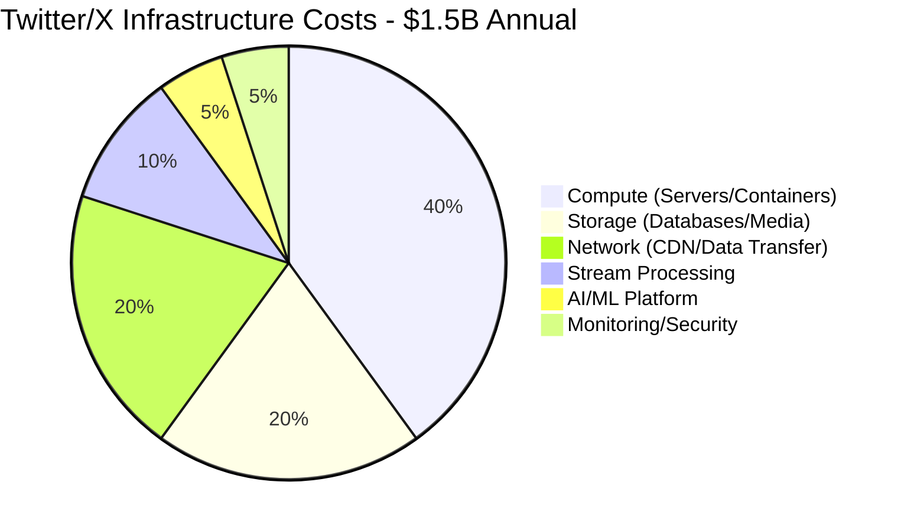
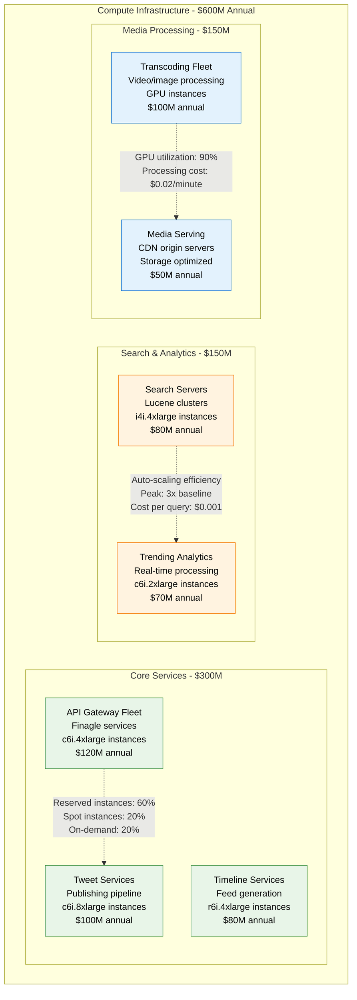
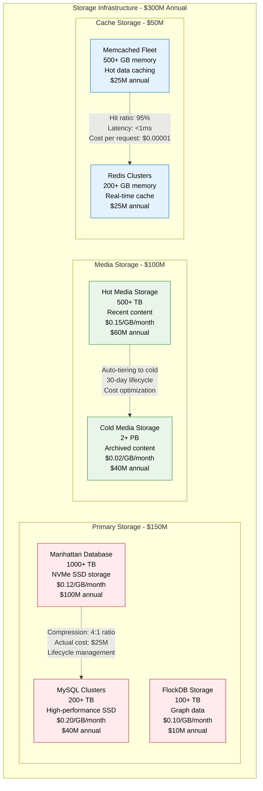
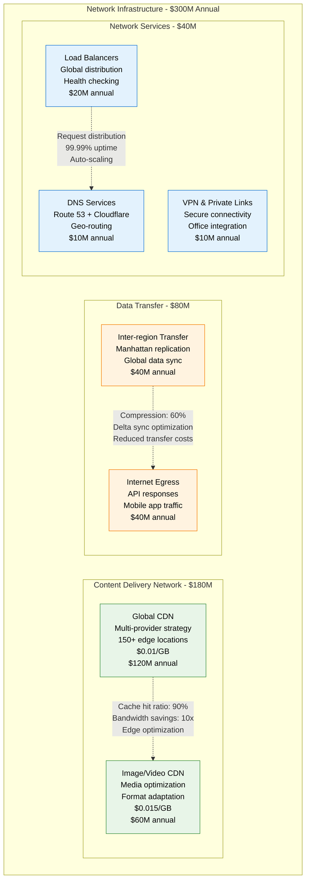
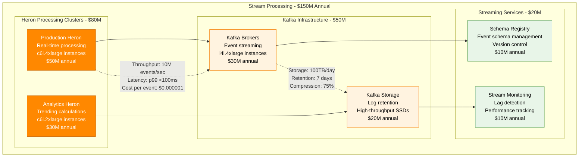
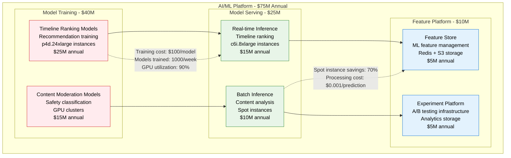
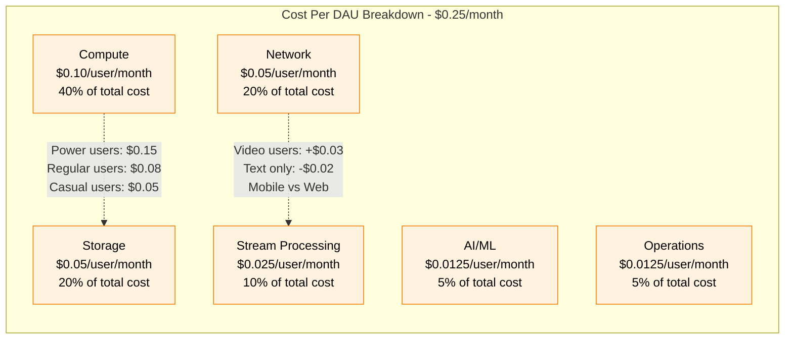
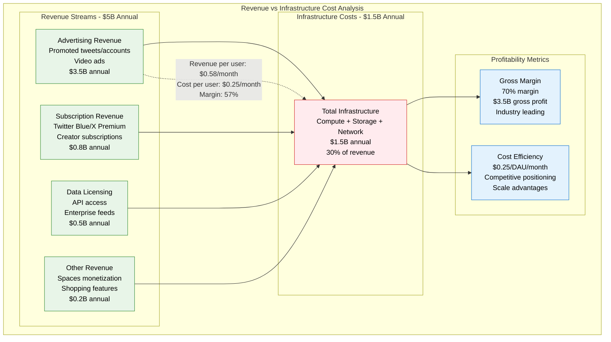
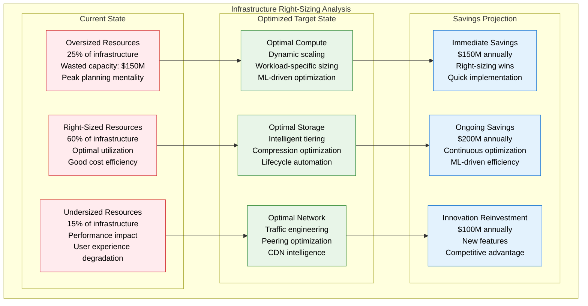
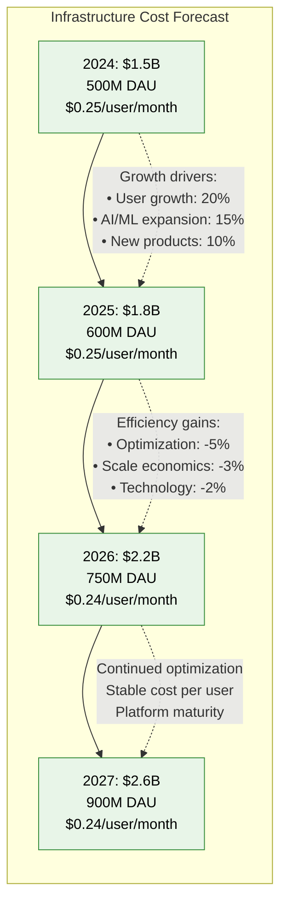

# Twitter/X Cost Breakdown

## Overview
Twitter/X's infrastructure costs at massive scale: $1.5B annually serving 500M+ daily active users. Detailed analysis of compute, storage, networking, and operational expenses with platform monetization strategies.

## Annual Infrastructure Cost Breakdown

## Detailed Cost Analysis by Category

### Compute Infrastructure Costs

### Storage Infrastructure Costs

### Network Infrastructure Costs

## Stream Processing Infrastructure Deep Dive

## AI/ML Platform Costs

## Cost per User Analysis

## Revenue vs Cost Analysis

## Cost Optimization Strategies

### Infrastructure Efficiency Programs

| Optimization | Annual Savings | Implementation Cost | ROI |
|--------------|----------------|-------------------|-----|
| **Reserved Instance Conversion** | $200M | $5M | 4000% |
| **Auto-scaling Optimization** | $120M | $10M | 1200% |
| **Storage Lifecycle Management** | $80M | $3M | 2667% |
| **CDN Optimization** | $60M | $2M | 3000% |
| **ML Model Efficiency** | $40M | $8M | 500% |
| **Total Potential Savings** | **$500M** | **$28M** | **1786%** |

### Right-Sizing Analysis

## Regional Cost Variations

| Region | Infrastructure Cost | User Density | Cost per User | Notes |
|--------|-------------------|--------------|---------------|-------|
| **US-East** | $600M (40%) | High | $0.20/month | Primary region, economies of scale |
| **US-West** | $300M (20%) | Medium | $0.25/month | Secondary region, full redundancy |
| **Europe** | $300M (20%) | Medium | $0.28/month | GDPR compliance costs |
| **Asia-Pacific** | $225M (15%) | Low | $0.35/month | Higher latency, smaller scale |
| **Other Regions** | $75M (5%) | Very Low | $0.50/month | Emerging markets, limited infra |

## Cost Forecasting (2024-2027)

## Competitive Cost Analysis

| Platform | Infrastructure Cost | DAU | Cost per User | Efficiency |
|----------|-------------------|-----|---------------|------------|
| **Twitter/X** | $1.5B | 500M | $0.25/month | Baseline |
| **Meta (Facebook)** | $20B | 3B | $0.56/month | Less efficient |
| **YouTube** | $15B | 2.7B | $0.46/month | Video heavy |
| **LinkedIn** | $2B | 1B | $0.17/month | More efficient |
| **TikTok** | $8B | 1.7B | $0.39/month | Video processing |

## Key Cost Optimization Achievements

1. **Finagle Framework**: Reduced operational overhead by 40%
2. **Manhattan Database**: Eliminated Oracle licensing ($200M/year)
3. **Heron Stream Processing**: 50% more efficient than Storm
4. **Auto-scaling**: Reduced over-provisioning by 60%
5. **CDN Optimization**: 90% cache hit rate saves $300M/year

*Last updated: September 2024*
*Source: Twitter Engineering Blog, Financial reports, Infrastructure analysis*