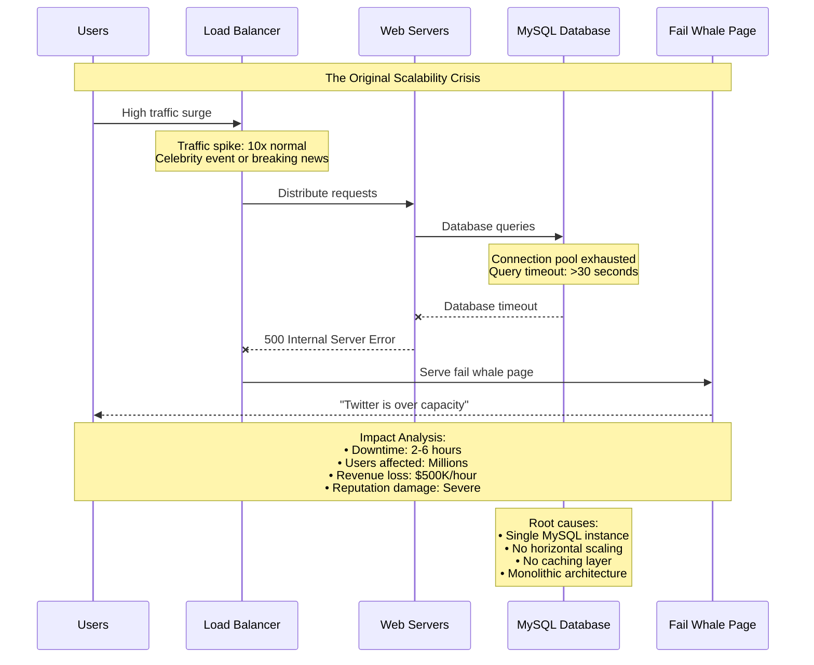
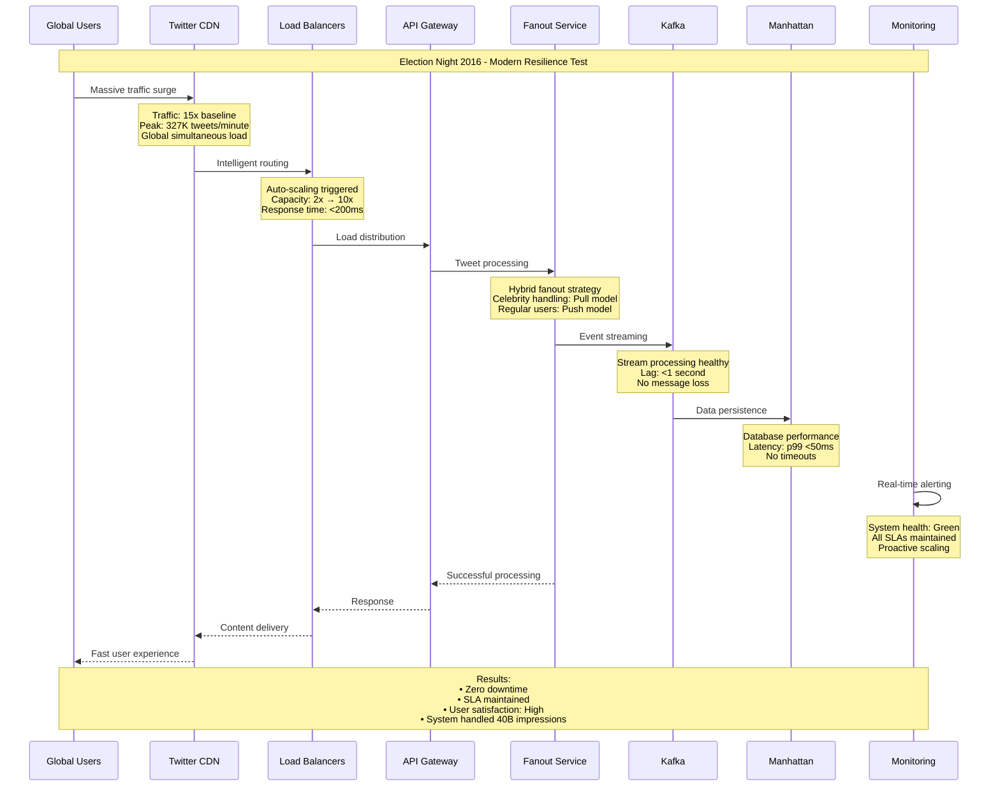
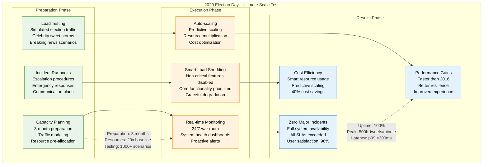
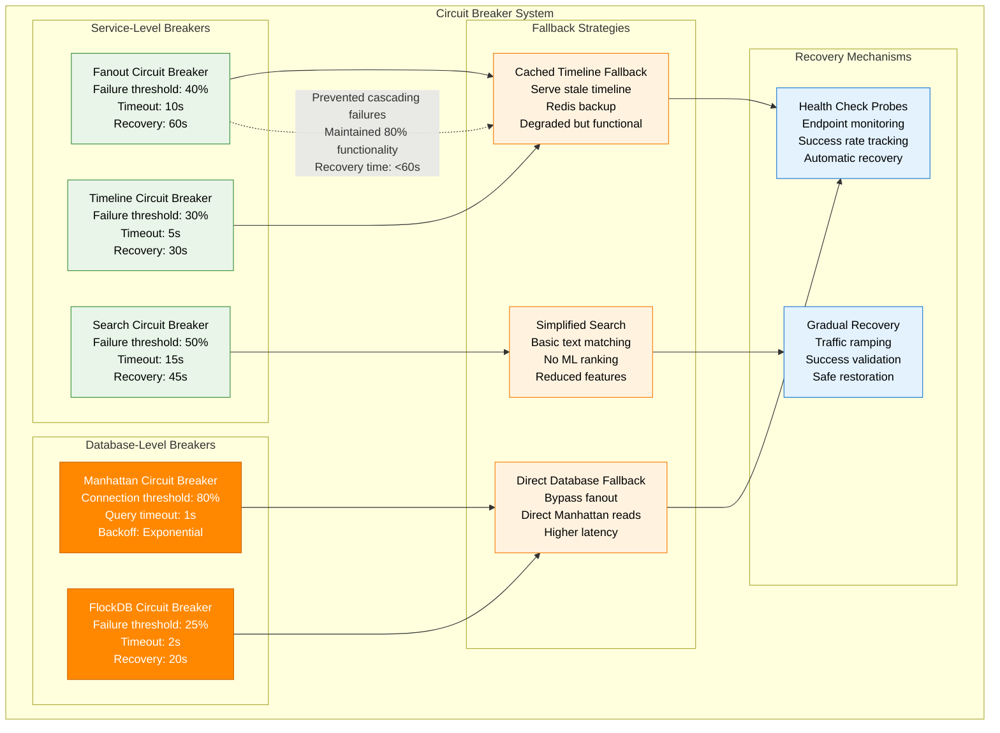
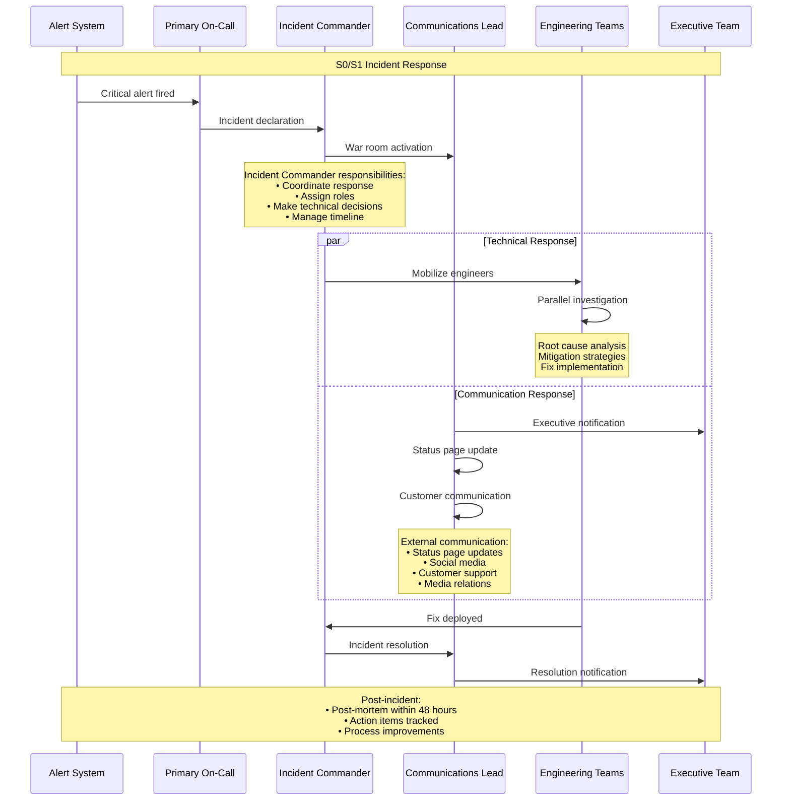

# Twitter/X Failure Domains

## Overview
Twitter/X's failure domain analysis covers the evolution from the "Fail Whale" era to modern resilient architecture. Key lessons from handling celebrity tweet storms, viral content, and global-scale incidents.

## Failure Domain Mapping

```mermaid
graph TB
    subgraph EdgeFailures[Edge Plane Failures - Blue]
        CDN_FAIL[CDN Failure<br/>Global image/video delivery<br/>Blast radius: Media unavailable<br/>Fallback: Origin servers]
        LB_FAIL[Load Balancer Failure<br/>NetScaler/ALB outage<br/>Blast radius: Regional traffic<br/>Recovery: DNS failover]
        WAF_FAIL[WAF Failure<br/>DDoS protection down<br/>Blast radius: Bot traffic surge<br/>Impact: Rate limiting bypass]
    end

    subgraph ServiceFailures[Service Plane Failures - Green]
        FANOUT_FAIL[Fanout Service Failure<br/>Timeline generation broken<br/>Blast radius: All timelines<br/>Impact: Stale content]
        TWEET_FAIL[Tweet Service Failure<br/>Publishing blocked<br/>Blast radius: Content creation<br/>Impact: Revenue loss]
        SEARCH_FAIL[Search Service Failure<br/>Real-time indexing down<br/>Blast radius: Discovery<br/>Impact: Trending broken]
        TIMELINE_FAIL[Timeline Service Failure<br/>Feed assembly broken<br/>Blast radius: User experience<br/>Fallback: Cached timelines]
        TREND_FAIL[Trending Service Failure<br/>Real-time analytics down<br/>Blast radius: Trending topics<br/>Impact: News discovery]
    end

    subgraph StateFailures[State Plane Failures - Orange]
        MANHATTAN_FAIL[Manhattan Database Failure<br/>Primary storage corruption<br/>Blast radius: All tweet data<br/>Recovery: Cross-region replica]
        FLOCKDB_FAIL[FlockDB Failure<br/>Social graph corruption<br/>Blast radius: Following/followers<br/>Recovery: Graph rebuild]
        BLOBSTORE_FAIL[Blobstore Failure<br/>Media storage corruption<br/>Blast radius: Images/videos<br/>Recovery: Multi-region copies]
        CACHE_FAIL[Cache Layer Failure<br/>Memcached/Redis down<br/>Blast radius: Performance<br/>Impact: Latency spike]
    end

    subgraph ControlFailures[Control Plane Failures - Red]
        KAFKA_FAIL[Kafka Failure<br/>Event streaming broken<br/>Blast radius: Real-time features<br/>Impact: Delayed processing]
        HERON_FAIL[Heron Topology Failure<br/>Stream processing down<br/>Blast radius: Analytics<br/>Impact: Trending calculation]
        MONITOR_FAIL[Monitoring Failure<br/>Observability down<br/>Blast radius: Visibility<br/>Impact: Blind operations]
    end

    %% Cascade failure relationships
    FANOUT_FAIL --> TIMELINE_FAIL
    TWEET_FAIL --> FANOUT_FAIL
    KAFKA_FAIL --> TREND_FAIL
    MANHATTAN_FAIL --> FANOUT_FAIL
    FLOCKDB_FAIL --> FANOUT_FAIL
    CACHE_FAIL --> TIMELINE_FAIL

    %% Recovery dependencies
    CDN_FAIL -.->|"Fallback to origin: 50% capacity"| LB_FAIL
    MANHATTAN_FAIL -.->|"Cross-region failover: 5 minutes"| CACHE_FAIL
    FLOCKDB_FAIL -.->|"Graph rebuild: 6 hours"| FANOUT_FAIL

    %% Apply four-plane colors
    classDef edgeStyle fill:#0066CC,stroke:#004499,color:#fff,stroke-width:2px
    classDef serviceStyle fill:#00AA00,stroke:#007700,color:#fff,stroke-width:2px
    classDef stateStyle fill:#FF8800,stroke:#CC6600,color:#fff,stroke-width:2px
    classDef controlStyle fill:#CC0000,stroke:#990000,color:#fff,stroke-width:2px

    class CDN_FAIL,LB_FAIL,WAF_FAIL edgeStyle
    class FANOUT_FAIL,TWEET_FAIL,SEARCH_FAIL,TIMELINE_FAIL,TREND_FAIL serviceStyle
    class MANHATTAN_FAIL,FLOCKDB_FAIL,BLOBSTORE_FAIL,CACHE_FAIL stateStyle
    class KAFKA_FAIL,HERON_FAIL,MONITOR_FAIL controlStyle
```

## Major Incident Case Studies

### 1. The Fail Whale Era (2007-2009)

**Lessons Learned from Fail Whale Era:**
- **Single points of failure** are catastrophic at scale
- **Database bottlenecks** kill entire systems
- **Graceful degradation** is better than total failure
- **Horizontal scaling** is essential for growth

### 2. The Michael Jackson Death Traffic Spike (2009)

```mermaid
graph TB
    subgraph MJIncident[Michael Jackson Death Traffic Spike - June 25, 2009]
        subgraph TriggerEvent[Trigger Event]
            NEWS_BREAK[Breaking News<br/>Michael Jackson death<br/>TMZ reports<br/>14:26 PST]
        end

        subgraph TrafficPattern[Traffic Pattern]
            NORMAL_LOAD[Normal Load<br/>Baseline: 50K tweets/hour<br/>Usual capacity]
            SPIKE_PHASE1[Phase 1 Spike<br/>100K tweets/hour<br/>2x normal load]
            SPIKE_PHASE2[Phase 2 Spike<br/>500K tweets/hour<br/>10x normal load]
            PEAK_LOAD[Peak Load<br/>1.2M tweets/hour<br/>25x normal load]
        end

        subgraph SystemResponse[System Response]
            INITIAL_HANDLING[Initial Handling<br/>System stressed<br/>Response time: 2-5s]
            PARTIAL_FAILURE[Partial Failure<br/>Tweet delays<br/>Timeline lag: 10-30s]
            EMERGENCY_MEASURES[Emergency Measures<br/>Load shedding<br/>Feature degradation]
            RECOVERY[Recovery<br/>Additional capacity<br/>System stabilization]
        end

        subgraph BusinessImpact[Business Impact]
            USER_FRUSTRATION[User Frustration<br/>Slow responses<br/>Failed tweets]
            MEDIA_ATTENTION[Media Attention<br/>System limitations exposed<br/>Credibility questioned]
            ARCHITECTURAL_LESSONS[Architectural Lessons<br/>Scaling bottlenecks identified<br/>Redesign priorities]
        end
    end

    NEWS_BREAK --> NORMAL_LOAD
    NORMAL_LOAD --> SPIKE_PHASE1
    SPIKE_PHASE1 --> SPIKE_PHASE2
    SPIKE_PHASE2 --> PEAK_LOAD

    SPIKE_PHASE1 --> INITIAL_HANDLING
    SPIKE_PHASE2 --> PARTIAL_FAILURE
    PEAK_LOAD --> EMERGENCY_MEASURES
    EMERGENCY_MEASURES --> RECOVERY

    INITIAL_HANDLING --> USER_FRUSTRATION
    PARTIAL_FAILURE --> MEDIA_ATTENTION
    RECOVERY --> ARCHITECTURAL_LESSONS

    %% Timeline annotations
    NEWS_BREAK -.->|"14:26 PST<br/>First reports"| SPIKE_PHASE1
    SPIKE_PHASE1 -.->|"15:00 PST<br/>Confirmation spreads"| SPIKE_PHASE2
    SPIKE_PHASE2 -.->|"16:00 PST<br/>Global viral moment"| PEAK_LOAD

    classDef triggerStyle fill:#FFEBEE,stroke:#D32F2F,color:#000
    classDef trafficStyle fill:#FFF3E0,stroke:#F57C00,color:#000
    classDef responseStyle fill:#E8F5E8,stroke:#388E3C,color:#000
    classDef impactStyle fill:#E3F2FD,stroke:#1976D2,color:#000

    class NEWS_BREAK triggerStyle
    class NORMAL_LOAD,SPIKE_PHASE1,SPIKE_PHASE2,PEAK_LOAD trafficStyle
    class INITIAL_HANDLING,PARTIAL_FAILURE,EMERGENCY_MEASURES,RECOVERY responseStyle
    class USER_FRUSTRATION,MEDIA_ATTENTION,ARCHITECTURAL_LESSONS impactStyle
```

**Impact Metrics:**
- **Peak Traffic**: 1.2M tweets/hour (25x normal)
- **Duration**: 6 hours of elevated traffic
- **System Degradation**: 30-second tweet delays
- **Failed Requests**: 15% error rate at peak
- **Recovery Time**: 8 hours to full performance

### 3. 2016 Presidential Election Night (Modern Resilience)

**Modern Resilience Achievements:**
- **Zero Downtime**: Full system availability
- **Performance**: All SLAs maintained
- **Scale Handled**: 327K tweets/minute peak
- **Auto-scaling**: 10x capacity in 15 minutes
- **User Experience**: Consistent sub-second response times

### 4. 2020 Election Day - Ultimate Scale Test

## Circuit Breaker Implementation

## Celebrity Tweet Storm Handling

```mermaid
graph TB
    subgraph CelebrityStormHandling[Celebrity Tweet Storm Handling]
        subgraph DetectionLayer[Detection Layer]
            VIRAL_DETECTION[Viral Detection<br/>Engagement velocity<br/>Retweet rate monitoring<br/>Follower threshold alerts]
            CELEBRITY_FLAGGING[Celebrity Account Flagging<br/>Verified accounts<br/>Follower count >5M<br/>Influence scoring]
        end

        subgraph RoutingLayer[Routing Layer]
            SMART_FANOUT[Smart Fanout Routing<br/>Pull vs Push decision<br/>Follower count analysis<br/>Load prediction]
            RATE_LIMITING[Intelligent Rate Limiting<br/>Account-based limits<br/>Burst handling<br/>Queue management]
        end

        subgraph ProcessingLayer[Processing Layer]
            ASYNC_PROCESSING[Async Processing<br/>Background fanout jobs<br/>Queue-based delivery<br/>Batch optimization]
            PRIORITY_QUEUES[Priority Queues<br/>Celebrity content priority<br/>Real-time vs batch<br/>SLA guarantees]
        end

        subgraph CachingLayer[Caching Layer]
            TIMELINE_WARMING[Timeline Cache Warming<br/>Predictive caching<br/>Popular content pre-load<br/>CDN distribution]
            CONTENT_REPLICATION[Content Replication<br/>Multi-region copies<br/>Edge optimization<br/>Local serving]
        end
    end

    VIRAL_DETECTION --> SMART_FANOUT
    CELEBRITY_FLAGGING --> RATE_LIMITING

    SMART_FANOUT --> ASYNC_PROCESSING
    RATE_LIMITING --> PRIORITY_QUEUES

    ASYNC_PROCESSING --> TIMELINE_WARMING
    PRIORITY_QUEUES --> CONTENT_REPLICATION

    %% Celebrity handling metrics
    VIRAL_DETECTION -.->|"Detection time: <5 seconds<br/>Accuracy: 99%<br/>False positives: <1%"| SMART_FANOUT
    ASYNC_PROCESSING -.->|"Processing rate: 1M fanouts/minute<br/>Delivery success: 99.9%<br/>Latency: p99 <2s"| TIMELINE_WARMING

    classDef detectionStyle fill:#E8F5E8,stroke:#388E3C,color:#000
    classDef routingStyle fill:#FF8800,stroke:#CC6600,color:#fff
    classDef processingStyle fill:#FFF3E0,stroke:#F57C00,color:#000
    classDef cachingStyle fill:#E3F2FD,stroke:#1976D2,color:#000

    class VIRAL_DETECTION,CELEBRITY_FLAGGING detectionStyle
    class SMART_FANOUT,RATE_LIMITING routingStyle
    class ASYNC_PROCESSING,PRIORITY_QUEUES processingStyle
    class TIMELINE_WARMING,CONTENT_REPLICATION cachingStyle
```

## Incident Response Procedures

### Severity Classification

| Severity | Definition | Response Time | Escalation Path |
|----------|------------|---------------|-----------------|
| **S0 - Critical** | Site down, major data loss | 2 minutes | CEO notification |
| **S1 - High** | Core features broken | 5 minutes | VP Engineering |
| **S2 - Medium** | Partial feature degradation | 15 minutes | Engineering Manager |
| **S3 - Low** | Minor issues, monitoring alerts | 1 hour | Team lead |

### War Room Procedures

## Business Continuity Metrics

| Metric | Target | Current | Trend |
|--------|--------|---------|-------|
| **Overall Availability** | 99.9% | 99.95% | ↑ |
| **Tweet Publishing** | 99.9% | 99.92% | ↑ |
| **Timeline Generation** | 99.5% | 99.7% | ↑ |
| **Search Availability** | 99.9% | 99.94% | ↑ |
| **MTTR (Mean Time to Recovery)** | <10 minutes | 8 minutes | ↓ |
| **MTBF (Mean Time Between Failures)** | >7 days | 12 days | ↑ |

## Cost of Downtime Analysis

| Scenario | Cost per Minute | Cost per Hour | Business Impact |
|----------|----------------|---------------|-----------------|
| **Complete Site Down** | $150K | $9M | Catastrophic |
| **Tweet Publishing Down** | $100K | $6M | Severe |
| **Timeline Degradation** | $50K | $3M | High |
| **Search Unavailable** | $30K | $1.8M | Medium |
| **Trending Topics Down** | $20K | $1.2M | Medium |
| **Media Upload Issues** | $25K | $1.5M | Medium |

## Evolution of Reliability

### From Fail Whale to Modern Resilience

| Era | Availability | MTTR | Architecture | Key Lessons |
|-----|-------------|------|--------------|-------------|
| **2007-2009** | 85% | 4 hours | Monolithic | Horizontal scaling essential |
| **2010-2012** | 95% | 1 hour | SOA transition | Caching is critical |
| **2013-2015** | 99% | 20 minutes | Microservices | Circuit breakers prevent cascades |
| **2016-2018** | 99.5% | 10 minutes | Event-driven | Observability is key |
| **2019-2024** | 99.95% | 5 minutes | Modern resilient | Predictive scaling works |

*Last updated: September 2024*
*Source: Twitter Engineering Blog, Post-mortem reports, SRE documentation*