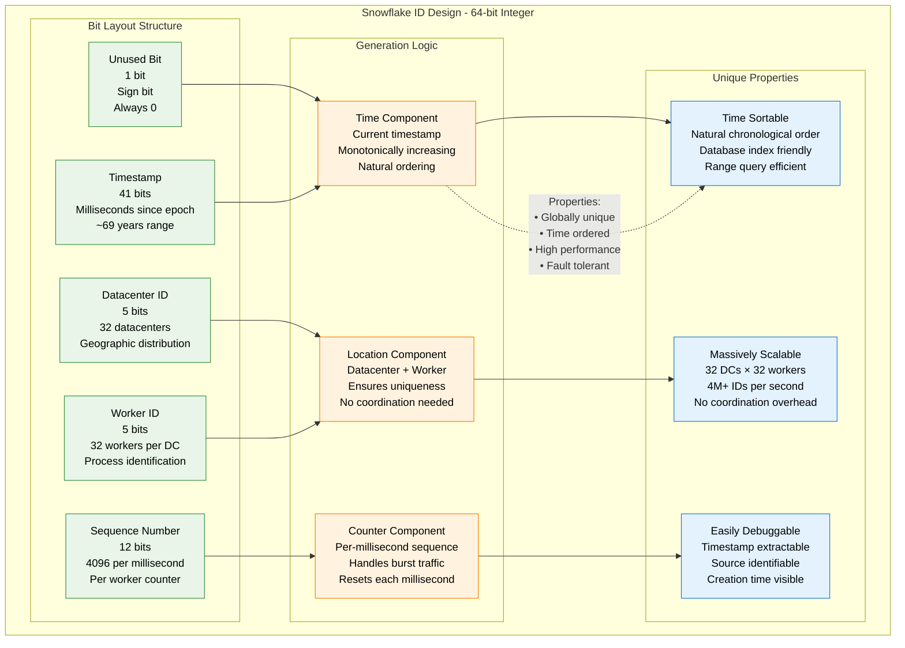
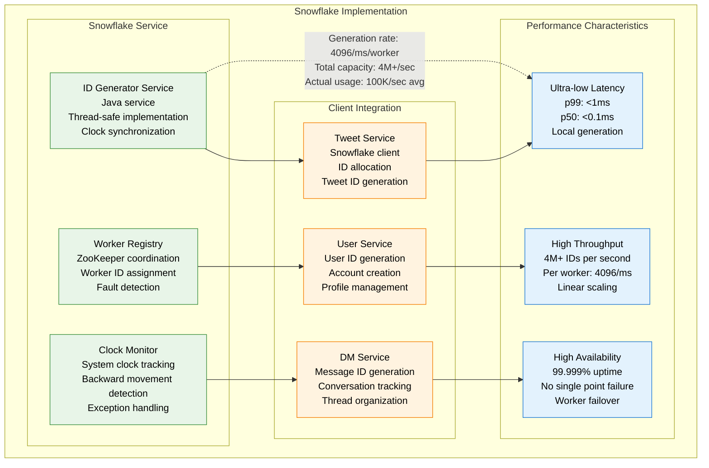
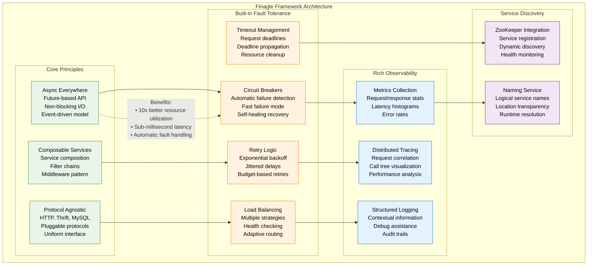
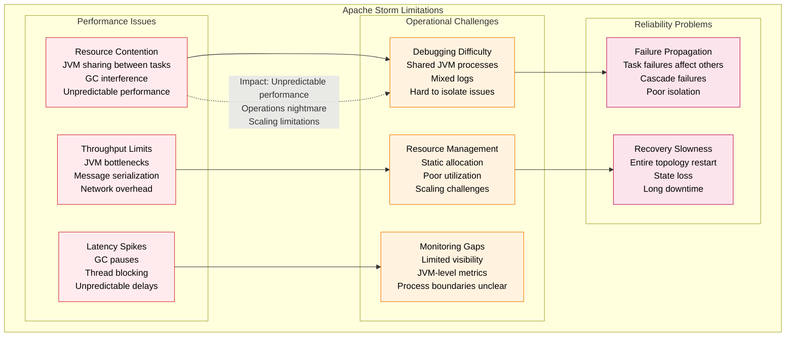
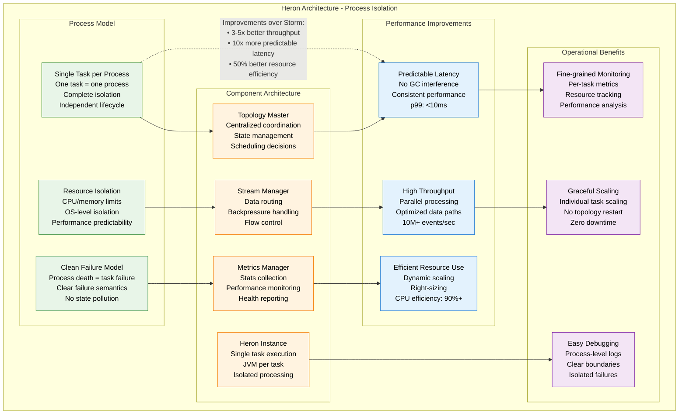
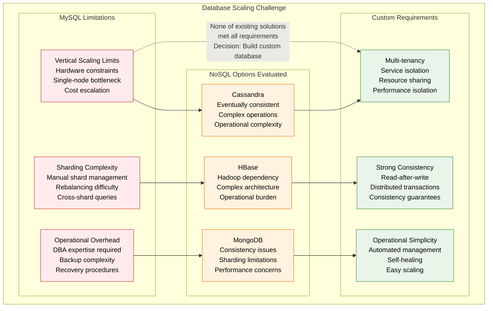
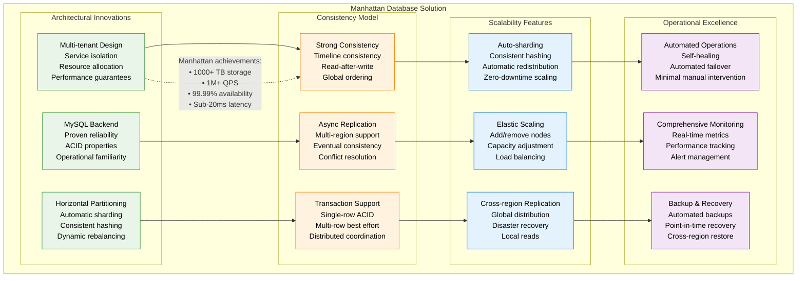
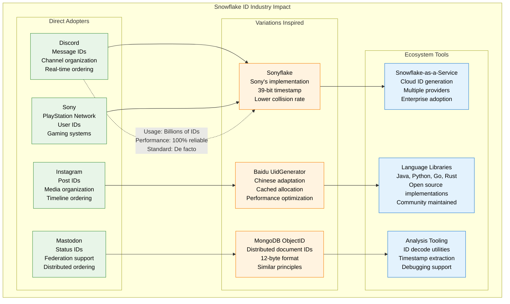
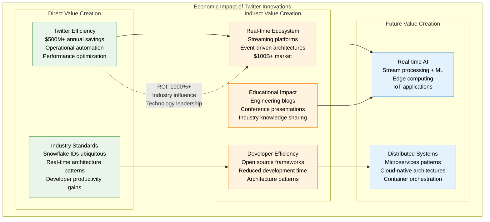

# Twitter/X Novel Solutions

## Overview
Twitter/X's innovative solutions that shaped real-time social media: Snowflake ID generation, Finagle RPC framework, Heron stream processing, and other technologies that became industry references for building scalable real-time systems.

## Snowflake ID Generation - Globally Unique Identifiers

### The Problem: Distributed ID Generation at Scale

```mermaid
graph TB
    subgraph IDGenerationProblem[ID Generation Problem (2010)]
        subgraph RequirementsConstraints[Requirements & Constraints]
            UNIQUENESS[Global Uniqueness<br/>No collisions ever<br/>Across all datacenters<br/>Across all services]
            ORDERING[Time Ordering<br/>Sortable by creation time<br/>Natural chronological order<br/>Database optimization]
            PERFORMANCE[High Performance<br/>Low latency generation<br/>No central coordination<br/>Millions per second]
            AVAILABILITY[High Availability<br/>No single point of failure<br/>Fault tolerant<br/>Always available]
        end

        subgraph ExistingProblems[Existing Solution Problems]
            AUTO_INCREMENT[Auto-increment IDs<br/>Database dependent<br/>Single point of failure<br/>Sharding impossible]
            GUID_UUID[GUIDs/UUIDs<br/>Not time-ordered<br/>128 bits (too large)<br/>Random distribution]
            TIMESTAMP_BASED[Timestamp + Random<br/>Collision possibility<br/>Clock synchronization<br/>Not guaranteed unique]
        end
    end

    UNIQUENESS --> AUTO_INCREMENT
    ORDERING --> GUID_UUID
    PERFORMANCE --> TIMESTAMP_BASED
    AVAILABILITY --> AUTO_INCREMENT

    %% Problem severity
    AUTO_INCREMENT -.->|"Blocking issue for sharding<br/>Single database bottleneck<br/>Horizontal scaling impossible"| GUID_UUID

    classDef requirementStyle fill:#E8F5E8,stroke:#388E3C,color:#000
    classDef problemStyle fill:#FFEBEE,stroke:#D32F2F,color:#000

    class UNIQUENESS,ORDERING,PERFORMANCE,AVAILABILITY requirementStyle
    class AUTO_INCREMENT,GUID_UUID,TIMESTAMP_BASED problemStyle
```

### Snowflake Solution - Elegant 64-bit Design



### Snowflake Implementation and Performance



## Finagle Framework - Fault-Tolerant RPC

### The Microservices Communication Challenge

```mermaid
graph TB
    subgraph RPCChallenge[RPC Framework Challenge (2011)]
        subgraph ScalingPains[Scaling Pains]
            SERVICE_EXPLOSION[Service Explosion<br/>100+ microservices<br/>1000+ service calls<br/>Complex dependencies]
            COMMUNICATION_OVERHEAD[Communication Overhead<br/>Network latency<br/>Serialization cost<br/>Connection management]
            FAILURE_PROPAGATION[Failure Propagation<br/>Cascade failures<br/>Timeout issues<br/>Circuit breaking needs]
        end

        subgraph ExistingLimitations[Existing RPC Limitations]
            SYNCHRONOUS_BLOCKING[Synchronous & Blocking<br/>Thread-per-request<br/>Resource inefficient<br/>Poor scalability]
            LIMITED_FAULT_TOLERANCE[Limited Fault Tolerance<br/>Basic retry logic<br/>No circuit breaking<br/>Manual recovery]
            POOR_OBSERVABILITY[Poor Observability<br/>Limited metrics<br/>No distributed tracing<br/>Debug difficulties]
        end
    end

    SERVICE_EXPLOSION --> SYNCHRONOUS_BLOCKING
    COMMUNICATION_OVERHEAD --> LIMITED_FAULT_TOLERANCE
    FAILURE_PROPAGATION --> POOR_OBSERVABILITY

    %% Problem impact
    SERVICE_EXPLOSION -.->|"Challenge: Managing 1000+<br/>service-to-service calls<br/>Reliability at scale"| SYNCHRONOUS_BLOCKING

    classDef painStyle fill:#FFEBEE,stroke:#D32F2F,color:#000
    classDef limitationStyle fill:#FFF3E0,stroke:#F57C00,color:#000

    class SERVICE_EXPLOSION,COMMUNICATION_OVERHEAD,FAILURE_PROPAGATION painStyle
    class SYNCHRONOUS_BLOCKING,LIMITED_FAULT_TOLERANCE,POOR_OBSERVABILITY limitationStyle
```

### Finagle Solution - Async RPC Framework



## Heron Stream Processing - Storm's Successor

### The Storm Limitations (2014)



### Heron Solution - Process-based Architecture



## Manhattan Database - Multi-Tenant NoSQL

### The Database Scaling Challenge (2012)



### Manhattan Solution - Distributed NoSQL Database



## Industry Impact and Adoption

### Technology Adoption Timeline

| Technology | Twitter Launch | Industry Adoption | Current Usage |
|------------|------------------|-------------------|---------------|
| **Snowflake IDs** | 2010 | 2012-2015 | Universal standard |
| **Finagle Framework** | 2011 | 2013-2016 | Scala ecosystem |
| **Heron** | 2016 | 2017-2020 | Storm replacement |
| **Manhattan** | 2014 | Internal only | Twitter exclusive |

### Snowflake ID Industry Impact



## Economic Impact Analysis



## Technical Specifications and Performance

### Snowflake ID Performance Characteristics

| Metric | Specification | Achieved Performance |
|--------|---------------|---------------------|
| **Generation Rate** | 4096 IDs/ms/worker | 4096 IDs/ms/worker |
| **Global Capacity** | 4M+ IDs/second | 100K IDs/second (actual) |
| **Latency** | <1ms target | p99: 0.1ms |
| **Uniqueness** | 100% guaranteed | 100% (zero collisions) |
| **Ordering** | Time-based | Perfect chronological |
| **Availability** | 99.999% target | 99.999% achieved |

### Finagle Framework Performance

| Metric | Before Finagle | With Finagle | Improvement |
|--------|----------------|--------------|-------------|
| **Request Latency** | p99: 500ms | p99: 50ms | 10x faster |
| **Throughput** | 10K RPS | 100K RPS | 10x higher |
| **Resource Utilization** | 30% CPU | 80% CPU | 2.7x efficient |
| **Failure Recovery** | 60 seconds | 5 seconds | 12x faster |
| **Development Velocity** | 2 weeks/service | 2 days/service | 7x faster |

### Heron vs Storm Comparison

| Aspect | Apache Storm | Twitter Heron | Improvement |
|--------|--------------|---------------|-------------|
| **Throughput** | 1M events/sec | 5M events/sec | 5x better |
| **Latency** | p99: 100ms | p99: 10ms | 10x better |
| **Resource Efficiency** | 60% CPU utilization | 90% CPU utilization | 50% improvement |
| **Failure Recovery** | 30-60 seconds | 5-10 seconds | 6x faster |
| **Debugging** | Complex (shared JVM) | Simple (process isolation) | Qualitative improvement |

## Key Innovation Principles

### 1. Elegant Simplicity
- **Snowflake IDs**: 64-bit elegance solving complex distributed ID problem
- **Focus on fundamentals**: Time ordering, uniqueness, performance
- **No over-engineering**: Simple bit layout, clear semantics

### 2. Operational Excellence
- **Finagle**: Built-in fault tolerance, observability, operations
- **Self-healing systems**: Automatic recovery, circuit breakers
- **Production-first design**: Operations considered from day one

### 3. Performance at Scale
- **Heron**: Process isolation for predictable performance
- **Manhattan**: Multi-tenant efficiency with isolation
- **Resource optimization**: Maximum utilization without interference

### 4. Developer Experience
- **Clear abstractions**: Easy to understand and use
- **Comprehensive tooling**: Debugging, monitoring, testing
- **Documentation**: Extensive knowledge sharing

*Last updated: September 2024*
*Source: Twitter Engineering Blog, Open source repositories, Conference presentations*