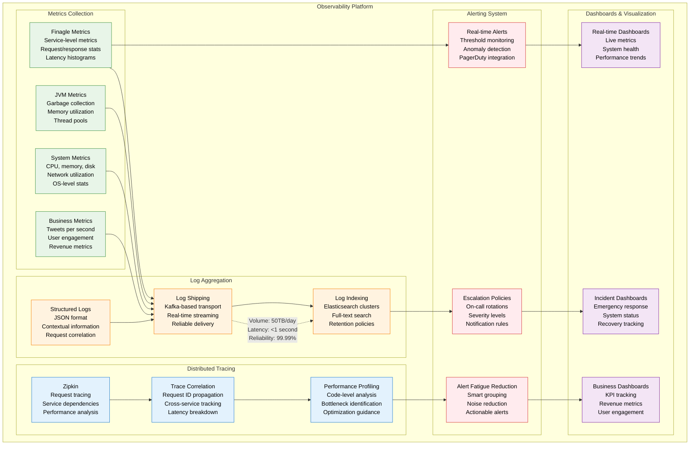
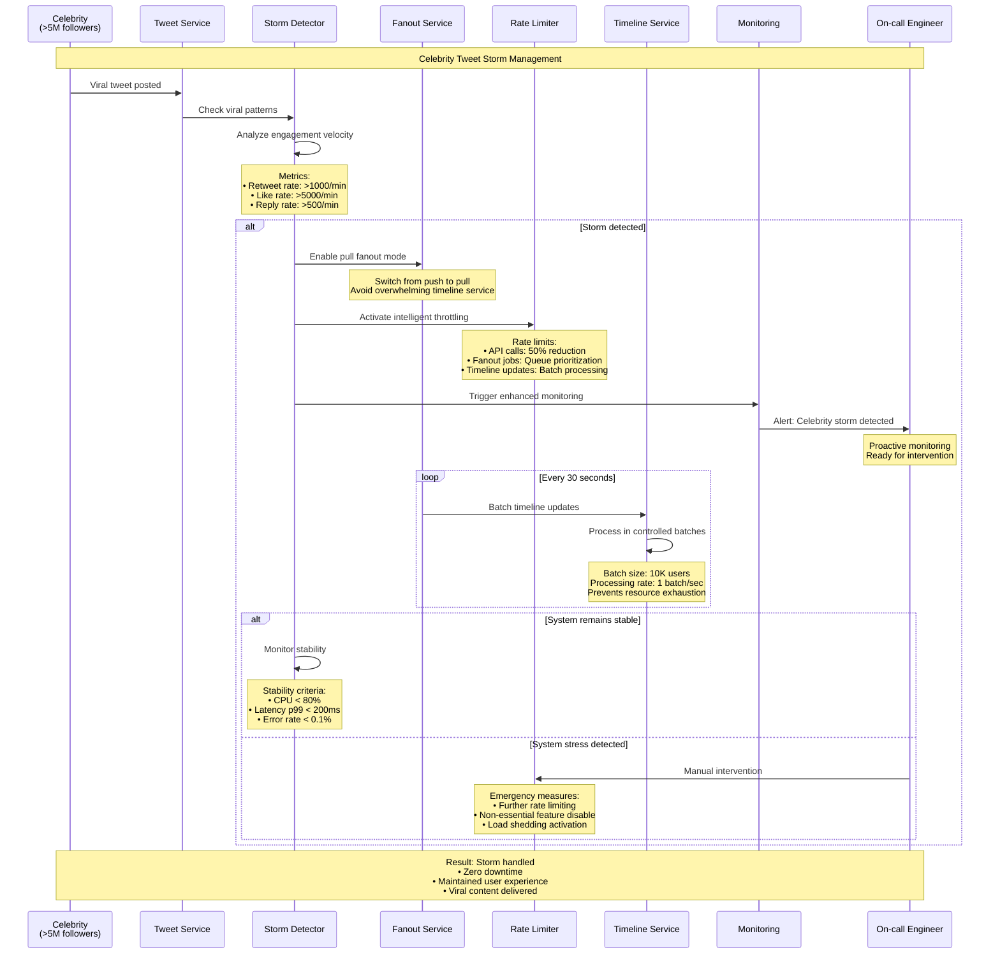
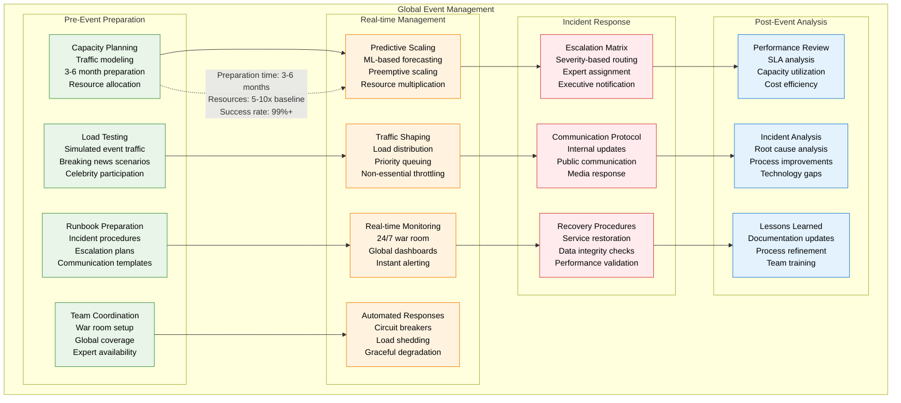
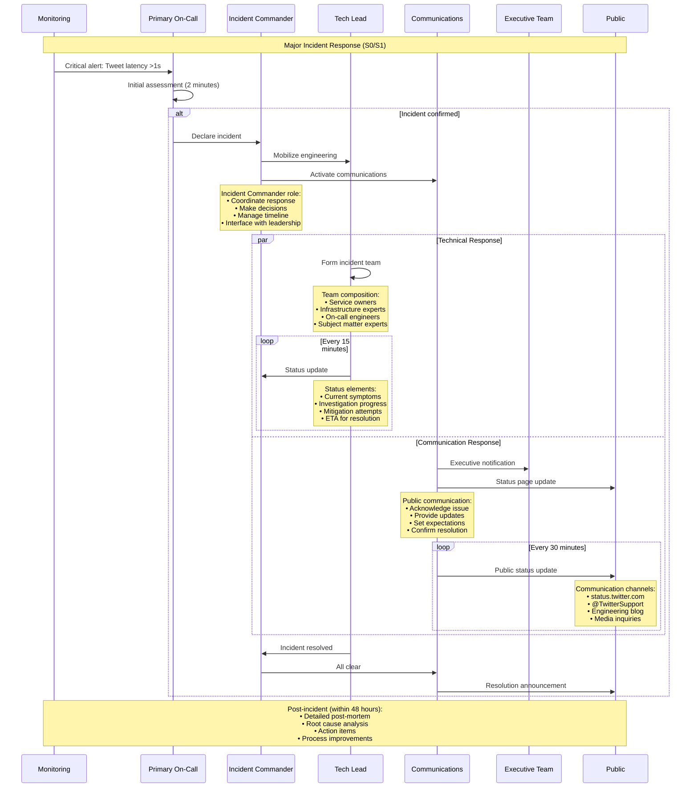
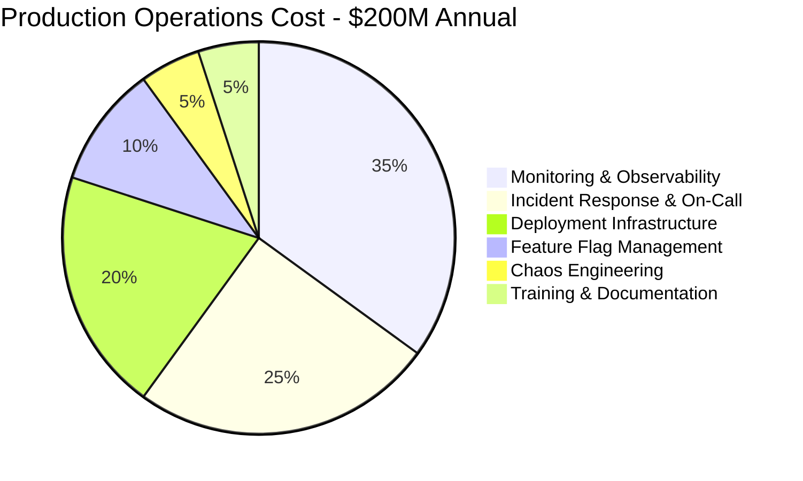

# Twitter/X Production Operations

## Overview
Twitter/X's production operations at massive scale: serving 500M+ daily active users with advanced deployment, monitoring, and incident response. Focus on real-time reliability, celebrity tweet storm handling, and global event management.

## Deployment Pipeline Architecture

```mermaid
graph TB
    subgraph DeploymentPipeline[Production Deployment Pipeline]
        subgraph SourceControl[Source Control & Build]
            GIT_REPOS[Git Repositories<br/>Distributed source control<br/>Feature branching<br/>Code review process]
            BUILD_SYSTEM[Build System<br/>Bazel build tool<br/>Hermetic builds<br/>Dependency management]
            ARTIFACT_REGISTRY[Artifact Registry<br/>Compiled artifacts<br/>Docker images<br/>Version management]
        end

        subgraph TestingPipeline[Testing Pipeline]
            UNIT_TESTS[Unit Tests<br/>Component testing<br/>Mock dependencies<br/>Fast feedback]
            INTEGRATION_TESTS[Integration Tests<br/>Service interaction<br/>Database integration<br/>End-to-end flows]
            LOAD_TESTS[Load Tests<br/>Performance validation<br/>Capacity testing<br/>Stress scenarios]
            CHAOS_TESTS[Chaos Tests<br/>Failure injection<br/>Resilience validation<br/>Recovery testing]
        end

        subgraph DeploymentStages[Deployment Stages]
            DEV_DEPLOY[Development<br/>Feature testing<br/>Developer validation<br/>Rapid iteration]
            STAGING_DEPLOY[Staging<br/>Production mirror<br/>Integration validation<br/>Performance testing]
            CANARY_DEPLOY[Canary<br/>1% production traffic<br/>Risk mitigation<br/>Real user validation]
            PROD_DEPLOY[Production<br/>Full traffic<br/>Monitoring enabled<br/>Rollback ready]
        end

        subgraph DeploymentTools[Deployment Tools]
            AURORA[Aurora Scheduler<br/>Mesos-based<br/>Resource management<br/>Service orchestration]
            CONFIG_MANAGEMENT[Config Management<br/>Feature flags<br/>Environment configs<br/>Runtime parameters]
            BLUE_GREEN[Blue-Green Deployment<br/>Zero downtime<br/>Instant rollback<br/>Traffic switching]
            MONITORING_HOOKS[Monitoring Hooks<br/>Health checks<br/>Performance monitoring<br/>Automated rollback]
        end
    end

    GIT_REPOS --> BUILD_SYSTEM
    BUILD_SYSTEM --> ARTIFACT_REGISTRY

    ARTIFACT_REGISTRY --> UNIT_TESTS
    UNIT_TESTS --> INTEGRATION_TESTS
    INTEGRATION_TESTS --> LOAD_TESTS
    LOAD_TESTS --> CHAOS_TESTS

    CHAOS_TESTS --> DEV_DEPLOY
    DEV_DEPLOY --> STAGING_DEPLOY
    STAGING_DEPLOY --> CANARY_DEPLOY
    CANARY_DEPLOY --> PROD_DEPLOY

    PROD_DEPLOY --> AURORA
    AURORA --> CONFIG_MANAGEMENT
    CONFIG_MANAGEMENT --> BLUE_GREEN
    BLUE_GREEN --> MONITORING_HOOKS

    %% Deployment gates
    STAGING_DEPLOY -.->|"Gate: All tests pass<br/>Performance within 5%<br/>Security scan clean"| CANARY_DEPLOY
    CANARY_DEPLOY -.->|"Gate: Error rate <0.01%<br/>Latency p99 <baseline<br/>Key metrics stable"| PROD_DEPLOY

    classDef sourceStyle fill:#E8F5E8,stroke:#388E3C,color:#000
    classDef testStyle fill:#FFF3E0,stroke:#F57C00,color:#000
    classDef stageStyle fill:#E3F2FD,stroke:#1976D2,color:#000
    classDef toolStyle fill:#F3E5F5,stroke:#7B1FA2,color:#000

    class GIT_REPOS,BUILD_SYSTEM,ARTIFACT_REGISTRY sourceStyle
    class UNIT_TESTS,INTEGRATION_TESTS,LOAD_TESTS,CHAOS_TESTS testStyle
    class DEV_DEPLOY,STAGING_DEPLOY,CANARY_DEPLOY,PROD_DEPLOY stageStyle
    class AURORA,CONFIG_MANAGEMENT,BLUE_GREEN,MONITORING_HOOKS toolStyle
```



## Real-time Monitoring and Observability



## Feature Flag System (Decider)

```mermaid
graph TB
    subgraph FeatureFlagSystem[Feature Flag System - Decider]
        subgraph ConfigurationLayer[Configuration Layer]
            DECIDER_CONFIG[Decider Config<br/>Feature definitions<br/>Rollout percentages<br/>User targeting]
            CONFIG_VALIDATION[Config Validation<br/>Schema validation<br/>Conflict detection<br/>Safety checks]
            CONFIG_DEPLOYMENT[Config Deployment<br/>Real-time updates<br/>Atomic changes<br/>Rollback capability]
        end

        subgraph EvaluationEngine[Evaluation Engine]
            USER_BUCKETING[User Bucketing<br/>Consistent hashing<br/>User ID based<br/>Deterministic assignment]
            RULE_EVALUATION[Rule Evaluation<br/>Complex targeting<br/>User attributes<br/>Context-aware]
            FEATURE_TOGGLES[Feature Toggles<br/>Runtime decisions<br/>Service integration<br/>Performance optimized]
        end

        subgraph MonitoringAnalytics[Monitoring & Analytics]
            FEATURE_METRICS[Feature Metrics<br/>Usage tracking<br/>Performance impact<br/>User behavior]
            AB_TESTING[A/B Testing<br/>Statistical analysis<br/>Conversion tracking<br/>Business metrics]
            ROLLOUT_MONITORING[Rollout Monitoring<br/>Error rate tracking<br/>Performance monitoring<br/>Automated rollback]
        end

        subgraph SafetyMechanisms[Safety Mechanisms]
            KILL_SWITCHES[Kill Switches<br/>Emergency disable<br/>Global overrides<br/>Instant rollback]
            GRADUAL_ROLLOUT[Gradual Rollout<br/>Progressive delivery<br/>Risk mitigation<br/>Controlled exposure]
            CIRCUIT_BREAKERS[Circuit Breakers<br/>Feature-level protection<br/>Failure isolation<br/>Automatic recovery]
        end
    end

    DECIDER_CONFIG --> CONFIG_VALIDATION
    CONFIG_VALIDATION --> CONFIG_DEPLOYMENT

    CONFIG_DEPLOYMENT --> USER_BUCKETING
    USER_BUCKETING --> RULE_EVALUATION
    RULE_EVALUATION --> FEATURE_TOGGLES

    FEATURE_TOGGLES --> FEATURE_METRICS
    FEATURE_METRICS --> AB_TESTING
    AB_TESTING --> ROLLOUT_MONITORING

    ROLLOUT_MONITORING --> KILL_SWITCHES
    KILL_SWITCHES --> GRADUAL_ROLLOUT
    GRADUAL_ROLLOUT --> CIRCUIT_BREAKERS

    %% Feature flag scale
    USER_BUCKETING -.->|"Decisions: 10B+/day<br/>Latency: <1ms<br/>Features: 10K+ active"| RULE_EVALUATION

    classDef configStyle fill:#E8F5E8,stroke:#388E3C,color:#000
    classDef evalStyle fill:#FFF3E0,stroke:#F57C00,color:#000
    classDef analyticsStyle fill:#E3F2FD,stroke:#1976D2,color:#000
    classDef safetyStyle fill:#FFEBEE,stroke:#D32F2F,color:#000

    class DECIDER_CONFIG,CONFIG_VALIDATION,CONFIG_DEPLOYMENT configStyle
    class USER_BUCKETING,RULE_EVALUATION,FEATURE_TOGGLES evalStyle
    class FEATURE_METRICS,AB_TESTING,ROLLOUT_MONITORING analyticsStyle
    class KILL_SWITCHES,GRADUAL_ROLLOUT,CIRCUIT_BREAKERS safetyStyle
```



## Celebrity Tweet Storm Management



## Global Event Management (Elections, World Cup, etc.)



## Incident Response and War Room Operations



## Production Operations Metrics

| Metric Category | Target | Current Performance | Industry Benchmark |
|-----------------|--------|-------------------|-------------------|
| **Deployment Success Rate** | 99% | 99.5% | 95% |
| **Deployment Frequency** | 100/day | 150/day | 50/day |
| **Lead Time** | <2 hours | 90 minutes | 4 hours |
| **MTTR (Mean Time to Recovery)** | <10 minutes | 8 minutes | 15 minutes |
| **MTBF (Mean Time Between Failures)** | >24 hours | 48 hours | 12 hours |
| **Change Failure Rate** | <2% | 1.5% | 5% |

## Operational Cost Breakdown



## Chaos Engineering at Scale

### Chaos Experiment Categories

| Experiment Type | Frequency | Scope | Learning Objectives |
|-----------------|-----------|-------|-------------------|
| **Service Failure** | Daily | Single service | Service resilience, circuit breakers |
| **Database Failure** | Weekly | Database clusters | Data consistency, failover |
| **Network Partition** | Monthly | Cross-region | Split-brain, conflict resolution |
| **Celebrity Storm** | Quarterly | Full system | Load handling, rate limiting |
| **Datacenter Outage** | Annually | Regional failure | Disaster recovery, business continuity |

### Chaos Engineering Results

```mermaid
graph TB
    subgraph ChaosResults[Chaos Engineering Results (2020-2024)]
        subgraph DiscoveredIssues[Issues Discovered]
            CIRCUIT_BREAKER_GAPS[Circuit Breaker Gaps<br/>12 services missing<br/>Added protection<br/>Cascade prevention]
            TIMEOUT_MISCONFIG[Timeout Misconfigurations<br/>8 services affected<br/>Corrected settings<br/>Improved reliability]
            MONITORING_GAPS[Monitoring Gaps<br/>5 blind spots found<br/>Added instrumentation<br/>Better visibility]
        end

        subgraph ProcessImprovements[Process Improvements]
            INCIDENT_RESPONSE[Incident Response<br/>40% faster MTTR<br/>Improved procedures<br/>Better coordination]
            AUTOMATION[Automation<br/>60% more automated<br/>Self-healing systems<br/>Reduced manual work]
            DOCUMENTATION[Documentation<br/>Complete runbooks<br/>Decision trees<br/>Knowledge sharing]
        end

        subgraph SystemResilience[System Resilience]
            FAULT_TOLERANCE[Fault Tolerance<br/>99.95% → 99.99%<br/>Better availability<br/>User experience]
            PERFORMANCE[Performance<br/>Reduced latency spikes<br/>More predictable<br/>Consistent experience]
            CONFIDENCE[Team Confidence<br/>Higher reliability<br/>Proactive culture<br/>Continuous improvement]
        end
    end

    CIRCUIT_BREAKER_GAPS --> INCIDENT_RESPONSE
    TIMEOUT_MISCONFIG --> AUTOMATION
    MONITORING_GAPS --> DOCUMENTATION

    INCIDENT_RESPONSE --> FAULT_TOLERANCE
    AUTOMATION --> PERFORMANCE
    DOCUMENTATION --> CONFIDENCE

    classDef issueStyle fill:#FFEBEE,stroke:#D32F2F,color:#000
    classDef processStyle fill:#FFF3E0,stroke:#F57C00,color:#000
    classDef resilienceStyle fill:#E8F5E8,stroke:#388E3C,color:#000

    class CIRCUIT_BREAKER_GAPS,TIMEOUT_MISCONFIG,MONITORING_GAPS issueStyle
    class INCIDENT_RESPONSE,AUTOMATION,DOCUMENTATION processStyle
    class FAULT_TOLERANCE,PERFORMANCE,CONFIDENCE resilienceStyle
```

## Key Operational Achievements

### 1. Celebrity Tweet Storm Resilience
- **Handled**: Taylor Swift album announcements, political events
- **Performance**: Zero downtime during viral moments
- **Innovation**: Pull fanout strategy for high-follower accounts

### 2. Global Event Management
- **Elections**: 2020 US Election - zero incidents
- **Sports**: World Cup, Olympics - sustained high traffic
- **Breaking News**: Real-time information dissemination

### 3. Deployment Excellence
- **Frequency**: 150+ deploys per day
- **Safety**: 99.5% success rate
- **Speed**: 90-minute lead time
- **Rollback**: 30-second capability

### 4. Observability Leadership
- **Scale**: 50TB/day log processing
- **Latency**: <1 second observability
- **Coverage**: 100% service instrumentation
- **Alerting**: Smart noise reduction

### 5. Incident Response Maturity
- **MTTR**: 8 minutes average
- **Communication**: Transparent public updates
- **Learning**: Comprehensive post-mortems
- **Prevention**: Proactive chaos engineering

*Last updated: September 2024*
*Source: Twitter Engineering Blog, SRE reports, Incident post-mortems*