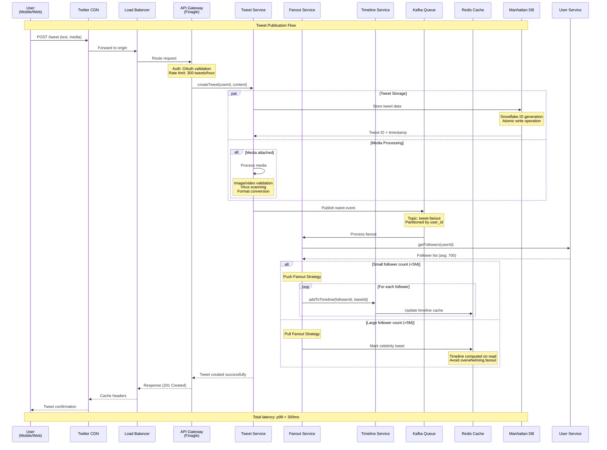
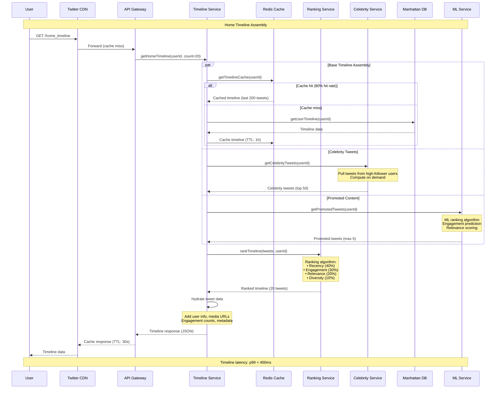
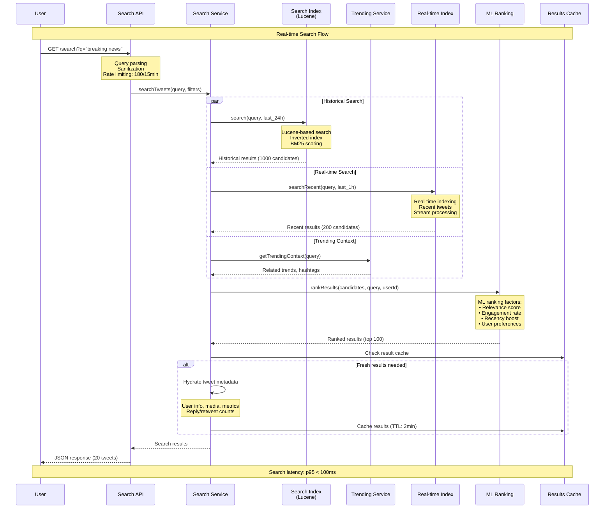
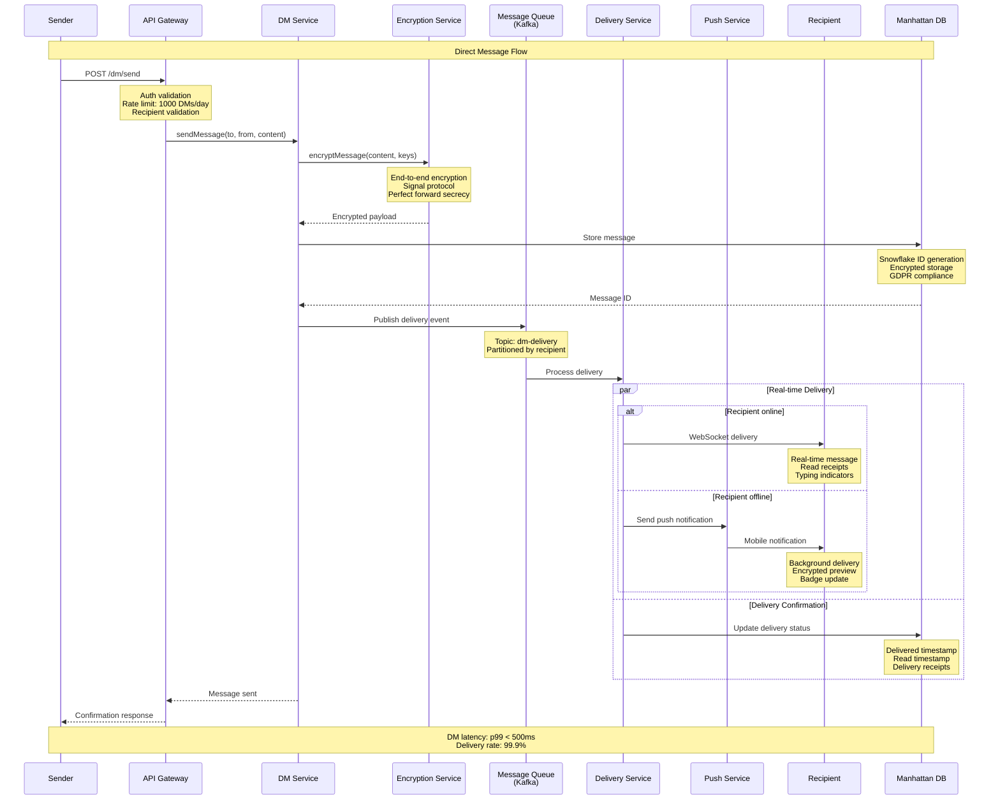
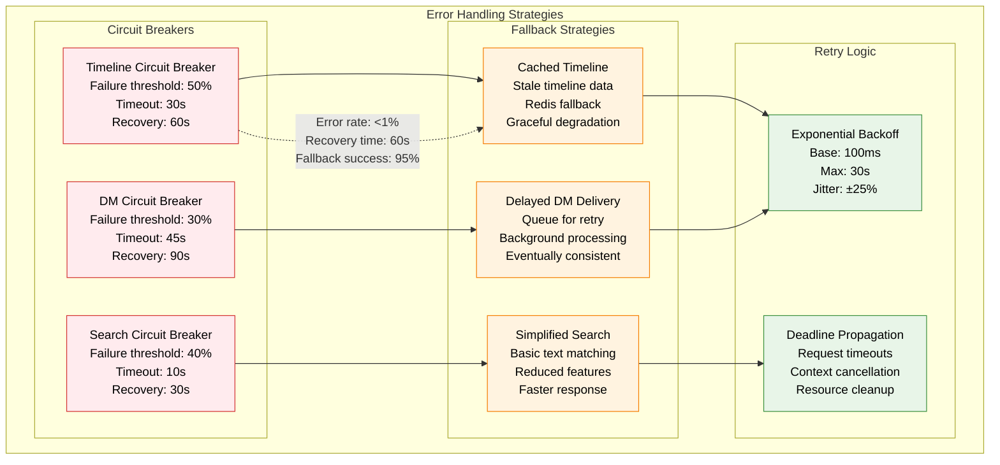

# Twitter/X Request Flow

## Overview
Twitter/X's request flow handles massive real-time traffic with tweet fanout, timeline assembly, trending topics, and search. The system processes 500M+ tweets daily with <400ms timeline generation.

## Tweet Publication and Fanout Flow

## Timeline Assembly Flow

## Real-time Search Flow

## Trending Topics Calculation

```mermaid
graph TB
    subgraph TrendingCalculation[Trending Topics Real-time Calculation]
        subgraph InputStreams[Input Streams]
            TWEET_STREAM[Tweet Stream<br/>500M tweets/day<br/>Real-time ingestion<br/>Text extraction]
            ENGAGEMENT_STREAM[Engagement Stream<br/>Likes, retweets, replies<br/>100B+ events/day<br/>User interactions]
            SEARCH_STREAM[Search Stream<br/>Search queries<br/>500M searches/day<br/>Query patterns]
        end

        subgraph ProcessingPipeline[Processing Pipeline]
            HERON_TOPOLOGY[Heron Topology<br/>Stream processing<br/>Real-time computation<br/>Low-latency spouts]

            subgraph ProcessingSteps[Processing Steps]
                TEXT_EXTRACTION[Text Extraction<br/>Hashtag parsing<br/>Entity recognition<br/>Language detection]
                TREND_DETECTION[Trend Detection<br/>Velocity calculation<br/>Volume analysis<br/>Spike detection]
                GEOGRAPHIC_FILTERING[Geographic Filtering<br/>Location-based trends<br/>Regional variations<br/>Cultural context]
                CONTENT_FILTERING[Content Filtering<br/>Spam detection<br/>Bot filtering<br/>Quality signals]
            end
        end

        subgraph TrendingStorage[Trending Storage]
            TREND_CACHE[Trend Cache<br/>Redis cluster<br/>Hot trending data<br/>1-minute refresh]
            TREND_DB[Trend Database<br/>Cassandra<br/>Historical trends<br/>Analytics storage]
            GEOGRAPHIC_TRENDS[Geographic Trends<br/>Location-specific<br/>Country/city level<br/>Personalized trends]
        end

        subgraph OutputServices[Output Services]
            TREND_API[Trending API<br/>REST endpoints<br/>Real-time updates<br/>Rate limiting]
            PUSH_NOTIFICATIONS[Push Notifications<br/>Breaking news alerts<br/>Personalized trends<br/>Mobile delivery]
            WEB_UPDATES[Web Updates<br/>WebSocket connections<br/>Live trend updates<br/>Browser notifications]
        end
    end

    TWEET_STREAM --> HERON_TOPOLOGY
    ENGAGEMENT_STREAM --> HERON_TOPOLOGY
    SEARCH_STREAM --> HERON_TOPOLOGY

    HERON_TOPOLOGY --> TEXT_EXTRACTION
    TEXT_EXTRACTION --> TREND_DETECTION
    TREND_DETECTION --> GEOGRAPHIC_FILTERING
    GEOGRAPHIC_FILTERING --> CONTENT_FILTERING

    CONTENT_FILTERING --> TREND_CACHE
    CONTENT_FILTERING --> TREND_DB
    CONTENT_FILTERING --> GEOGRAPHIC_TRENDS

    TREND_CACHE --> TREND_API
    GEOGRAPHIC_TRENDS --> PUSH_NOTIFICATIONS
    TREND_CACHE --> WEB_UPDATES

    %% Performance annotations
    HERON_TOPOLOGY -.->|"Processing rate: 1M events/sec<br/>Latency: p99 <100ms<br/>Update frequency: 1 minute"| TEXT_EXTRACTION
    TREND_CACHE -.->|"Refresh rate: Every minute<br/>Global trends: Top 10<br/>Geographic: Top 5 per region"| TREND_API

    classDef inputStyle fill:#E8F5E8,stroke:#388E3C,color:#000
    classDef processStyle fill:#FF8800,stroke:#CC6600,color:#fff
    classDef storageStyle fill:#FFF3E0,stroke:#F57C00,color:#000
    classDef outputStyle fill:#E3F2FD,stroke:#1976D2,color:#000

    class TWEET_STREAM,ENGAGEMENT_STREAM,SEARCH_STREAM inputStyle
    class HERON_TOPOLOGY,TEXT_EXTRACTION,TREND_DETECTION,GEOGRAPHIC_FILTERING,CONTENT_FILTERING processStyle
    class TREND_CACHE,TREND_DB,GEOGRAPHIC_TRENDS storageStyle
    class TREND_API,PUSH_NOTIFICATIONS,WEB_UPDATES outputStyle
```

## Direct Message Flow

## Performance Characteristics by Request Type

| Request Type | p50 Latency | p99 Latency | Throughput | Cache Hit Rate |
|--------------|-------------|-------------|------------|----------------|
| **Tweet Publication** | 150ms | 300ms | 6K RPS | N/A |
| **Home Timeline** | 180ms | 400ms | 300K RPS | 80% |
| **Search Queries** | 45ms | 100ms | 100K RPS | 70% |
| **User Profile** | 80ms | 200ms | 500K RPS | 95% |
| **Trending Topics** | 25ms | 75ms | 50K RPS | 98% |
| **Direct Messages** | 200ms | 500ms | 20K RPS | 85% |
| **Media Upload** | 800ms | 2000ms | 10K RPS | N/A |

## Error Handling and Fallbacks

## Rate Limiting and API Protection

| API Endpoint | Rate Limit | Window | Burst Allowance |
|--------------|------------|--------|-----------------|
| **Tweet Creation** | 300 tweets | 15 minutes | 50 |
| **Timeline Requests** | 75 requests | 15 minutes | 15 |
| **Search API** | 180 requests | 15 minutes | 30 |
| **Direct Messages** | 1000 messages | 24 hours | 100 |
| **Follow/Unfollow** | 400 actions | 24 hours | 50 |
| **Media Upload** | 25 uploads | 15 minutes | 5 |

## Key Optimizations

1. **Hybrid Fanout**: Smart routing based on follower count
2. **Timeline Caching**: Redis-based hot data caching
3. **Real-time Indexing**: Immediate search availability
4. **Geographic Optimization**: Region-specific trending topics
5. **Predictive Prefetching**: Pre-load likely content
6. **Connection Pooling**: Efficient resource utilization

*Last updated: September 2024*
*Source: Twitter Engineering Blog, Performance analysis, API documentation*