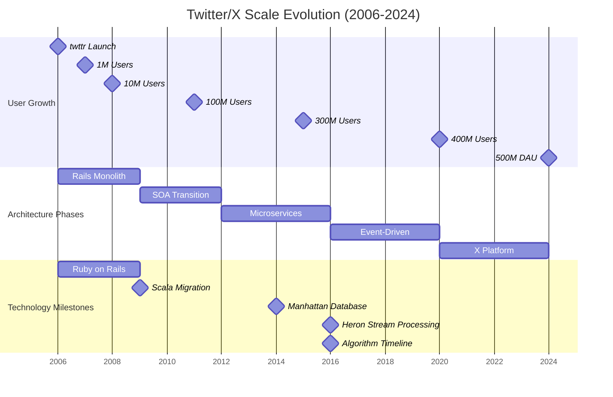
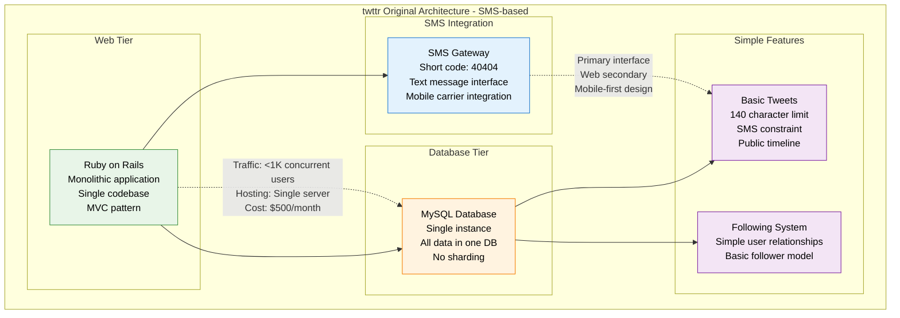
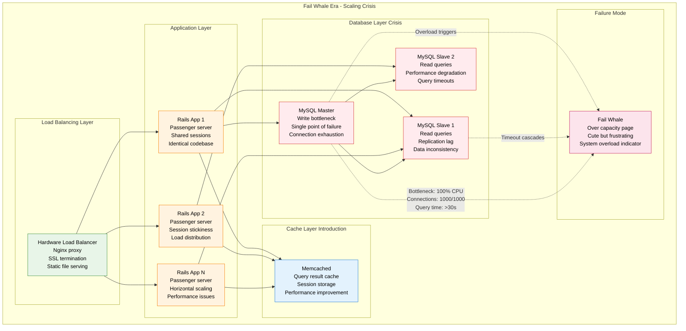
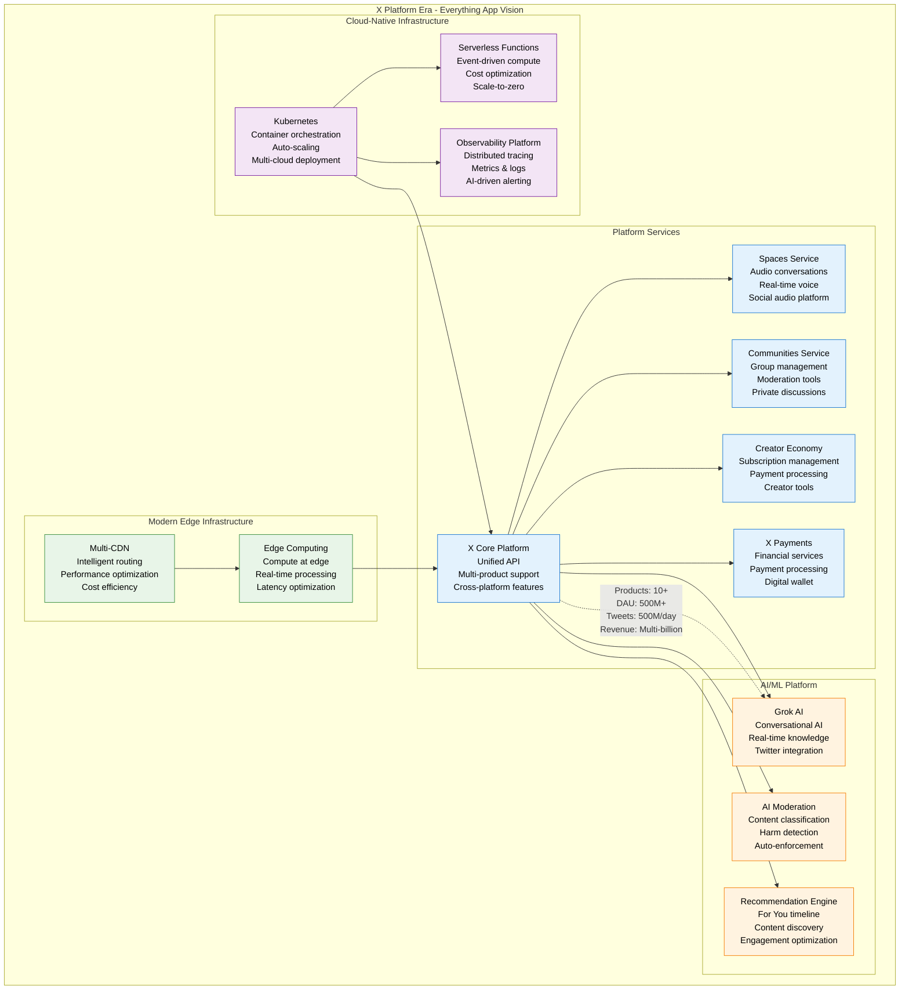
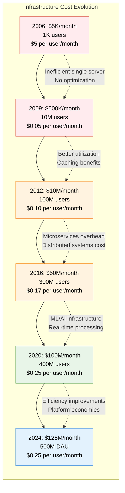

# Twitter/X Scale Evolution

## Overview
Twitter's evolution from a simple SMS-based service in 2006 to serving 500M+ daily active users. This journey showcases the transformation from "twttr" to a global real-time information network, surviving the Fail Whale era and achieving modern resilience.

## Scale Evolution Timeline



## Architecture Evolution by Scale

### 2006-2007: The twttr Era (1K → 1M users)



**Key Constraints at 1M Users:**
- SMS 140-character limit defined product
- Single MySQL server becoming bottleneck
- Ruby on Rails scaling challenges
- No caching infrastructure
- Manual deployment processes

### 2007-2009: The Fail Whale Era (1M → 10M users)



**Famous Fail Whale Incidents:**
- **Obama Election Night 2008**: 6-hour downtime
- **Michael Jackson Death 2009**: System overwhelmed
- **World Cup Events**: Repeated outages
- **Celebrity Tweet Storms**: Cascade failures

### 2009-2012: Scala Migration Era (10M → 100M users)

```mermaid
graph TB
    subgraph ScalaMigration[Scala Migration Era - Technology Transformation]
        subgraph EdgeLayer[Edge Layer]
            CDN[Content Delivery Network<br/>Akamai integration<br/>Static asset caching<br/>Global distribution]
            LB_CLUSTER[Load Balancer Cluster<br/>Hardware redundancy<br/>Health checking<br/>Auto-failover]
        end

        subgraph ApplicationLayer[Hybrid Application Layer]
            RAILS_LEGACY[Rails Legacy<br/>Web interface<br/>User management<br/>Gradual migration]

            subgraph ScalaServices[Scala Services]
                TWEET_SERVICE[Tweet Service<br/>Scala + Finagle<br/>High performance<br/>Better concurrency]
                TIMELINE_SERVICE[Timeline Service<br/>Scala + Finagle<br/>Fanout processing<br/>Real-time delivery]
                USER_SERVICE[User Service<br/>Scala + Finagle<br/>Profile management<br/>Relationship handling]
            end
        end

        subgraph StorageLayer[Distributed Storage Layer]
            MYSQL_SHARDS[MySQL Shards<br/>Horizontal partitioning<br/>User-based sharding<br/>Query routing]
            CASSANDRA_EARLY[Cassandra (Early)<br/>NoSQL experiment<br/>Timeline storage<br/>Write-heavy workloads]
            MEMCACHED_CLUSTER[Memcached Cluster<br/>Distributed caching<br/>Hot data storage<br/>Performance optimization]
        end

        subgraph SearchLayer[Search Layer]
            LUCENE_SEARCH[Lucene Search<br/>Real-time indexing<br/>Full-text search<br/>Trending topics]
        end
    end

    CDN --> LB_CLUSTER
    LB_CLUSTER --> RAILS_LEGACY
    LB_CLUSTER --> TWEET_SERVICE
    LB_CLUSTER --> TIMELINE_SERVICE
    LB_CLUSTER --> USER_SERVICE

    TWEET_SERVICE --> MYSQL_SHARDS
    TIMELINE_SERVICE --> CASSANDRA_EARLY
    USER_SERVICE --> MYSQL_SHARDS

    TWEET_SERVICE --> MEMCACHED_CLUSTER
    TIMELINE_SERVICE --> MEMCACHED_CLUSTER
    USER_SERVICE --> MEMCACHED_CLUSTER

    TWEET_SERVICE --> LUCENE_SEARCH

    %% Migration benefits
    SCALA_SERVICES -.->|"Performance: 10x improvement<br/>Concurrency: Better JVM<br/>Latency: p99 <200ms"| MYSQL_SHARDS

    classDef edgeStyle fill:#E8F5E8,stroke:#388E3C,color:#000
    classDef legacyStyle fill:#FFF3E0,stroke:#F57C00,color:#000
    classDef scalaStyle fill:#E3F2FD,stroke:#1976D2,color:#000
    classDef storageStyle fill:#F3E5F5,stroke:#7B1FA2,color:#000
    classDef searchStyle fill:#FFEBEE,stroke:#D32F2F,color:#000

    class CDN,LB_CLUSTER edgeStyle
    class RAILS_LEGACY legacyStyle
    class TWEET_SERVICE,TIMELINE_SERVICE,USER_SERVICE scalaStyle
    class MYSQL_SHARDS,CASSANDRA_EARLY,MEMCACHED_CLUSTER storageStyle
    class LUCENE_SEARCH searchStyle
```

**Key Achievements (2009-2012):**
- **Scala Migration**: 10x performance improvement
- **Finagle Framework**: Fault-tolerant RPC system
- **Database Sharding**: Horizontal scaling success
- **Real-time Search**: Immediate tweet indexing

### 2012-2016: Microservices Era (100M → 300M users)

```mermaid
graph TB
    subgraph MicroservicesEra[Microservices Era - Service Decomposition]
        subgraph ServiceMesh[Service Mesh Layer]
            FINAGLE[Finagle Framework<br/>RPC framework<br/>Service discovery<br/>Load balancing<br/>Circuit breakers]
        end

        subgraph CoreMicroservices[Core Microservices (100+)]
            TWEET_MS[Tweet Service<br/>Tweet CRUD<br/>Snowflake IDs<br/>Content validation]
            FANOUT_MS[Fanout Service<br/>Timeline delivery<br/>Push/pull hybrid<br/>Celebrity handling]
            SEARCH_MS[Search Service<br/>Real-time indexing<br/>Query processing<br/>Trending calculation]
            USER_MS[User Service<br/>Profile management<br/>Authentication<br/>Privacy settings]
            GRAPH_MS[Graph Service<br/>Social relationships<br/>Following/followers<br/>FlockDB integration]
            MEDIA_MS[Media Service<br/>Photo/video upload<br/>Processing pipeline<br/>CDN integration]
        end

        subgraph DataServices[Data Services]
            MANHATTAN_EARLY[Manhattan (Early)<br/>Distributed NoSQL<br/>Multi-tenant<br/>Strong consistency]
            FLOCKDB[FlockDB<br/>Social graph DB<br/>Relationship storage<br/>High write throughput]
            BLOBSTORE[Blobstore<br/>Media storage<br/>Distributed files<br/>Multi-region replication]
        end

        subgraph StreamingPlatform[Streaming Platform]
            STORM[Apache Storm<br/>Real-time processing<br/>Trending topics<br/>Analytics pipeline]
            KAFKA_EARLY[Kafka (Early)<br/>Event streaming<br/>Log aggregation<br/>Data pipeline]
        end
    end

    FINAGLE --> TWEET_MS
    FINAGLE --> FANOUT_MS
    FINAGLE --> SEARCH_MS
    FINAGLE --> USER_MS
    FINAGLE --> GRAPH_MS
    FINAGLE --> MEDIA_MS

    TWEET_MS --> MANHATTAN_EARLY
    FANOUT_MS --> MANHATTAN_EARLY
    USER_MS --> MANHATTAN_EARLY
    GRAPH_MS --> FLOCKDB
    MEDIA_MS --> BLOBSTORE

    TWEET_MS --> KAFKA_EARLY
    FANOUT_MS --> KAFKA_EARLY
    SEARCH_MS --> KAFKA_EARLY

    KAFKA_EARLY --> STORM
    STORM --> SEARCH_MS

    %% Microservices benefits
    FINAGLE -.->|"Services: 100+<br/>Deployment: Independent<br/>Scaling: Horizontal<br/>Resilience: Fault isolation"| TWEET_MS

    classDef meshStyle fill:#E8F5E8,stroke:#388E3C,color:#000
    classDef serviceStyle fill:#E3F2FD,stroke:#1976D2,color:#000
    classDef dataStyle fill:#FFF3E0,stroke:#F57C00,color:#000
    classDef streamStyle fill:#F3E5F5,stroke:#7B1FA2,color:#000

    class FINAGLE meshStyle
    class TWEET_MS,FANOUT_MS,SEARCH_MS,USER_MS,GRAPH_MS,MEDIA_MS serviceStyle
    class MANHATTAN_EARLY,FLOCKDB,BLOBSTORE dataStyle
    class STORM,KAFKA_EARLY streamStyle
```

### 2016-2020: Event-Driven Era (300M → 400M users)

```mermaid
graph TB
    subgraph EventDrivenEra[Event-Driven Era - Real-time Everything]
        subgraph EdgeInfrastructure[Edge Infrastructure]
            GLOBAL_CDN[Global CDN<br/>Multi-provider<br/>Edge caching<br/>Dynamic content]
            EDGE_POP[Edge PoPs<br/>150+ locations<br/>Regional optimization<br/>Latency reduction]
        end

        subgraph APIGateway[API Gateway Layer]
            API_GW[API Gateway<br/>Finagle-based<br/>Rate limiting<br/>Authentication<br/>Request routing]
        end

        subgraph MatureServices[Mature Microservices (500+)]
            TWEET_V2[Tweet Service v2<br/>Enhanced publishing<br/>Media integration<br/>Real-time fanout]
            TIMELINE_V2[Timeline Service v2<br/>Algorithm-driven<br/>ML personalization<br/>Engagement optimization]
            SEARCH_V2[Search Service v2<br/>Instant results<br/>Personalized ranking<br/>Context awareness]
            NOTIFICATION[Notification Service<br/>Push notifications<br/>Email/SMS delivery<br/>Preference management]
            AD_SERVING[Ad Serving<br/>Promoted content<br/>Real-time bidding<br/>Targeting optimization]
        end

        subgraph ManhattanPlatform[Manhattan Platform - Mature]
            MANHATTAN_V2[Manhattan v2<br/>1000+ TB storage<br/>Multi-master replication<br/>Global distribution<br/>Strong consistency]
        end

        subgraph StreamProcessing[Advanced Stream Processing]
            HERON[Heron<br/>Storm successor<br/>Low latency<br/>Better resource isolation<br/>Kubernetes deployment]
            KAFKA_MATURE[Kafka (Mature)<br/>100B+ events/day<br/>Multi-cluster setup<br/>Cross-region replication]
        end

        subgraph MLPlatform[ML Platform]
            CORTEX[Cortex<br/>ML platform<br/>Feature engineering<br/>Model serving<br/>A/B testing]
            TIMELINE_RANKING[Timeline Ranking<br/>Deep learning models<br/>Engagement prediction<br/>Personalization]
        end
    end

    GLOBAL_CDN --> EDGE_POP
    EDGE_POP --> API_GW

    API_GW --> TWEET_V2
    API_GW --> TIMELINE_V2
    API_GW --> SEARCH_V2
    API_GW --> NOTIFICATION
    API_GW --> AD_SERVING

    TWEET_V2 --> MANHATTAN_V2
    TIMELINE_V2 --> MANHATTAN_V2
    SEARCH_V2 --> MANHATTAN_V2

    TWEET_V2 --> KAFKA_MATURE
    TIMELINE_V2 --> KAFKA_MATURE
    SEARCH_V2 --> KAFKA_MATURE

    KAFKA_MATURE --> HERON
    HERON --> TIMELINE_V2
    HERON --> CORTEX

    CORTEX --> TIMELINE_RANKING
    TIMELINE_RANKING --> TIMELINE_V2

    %% Event-driven benefits
    KAFKA_MATURE -.->|"Events: 100B+/day<br/>Latency: <10ms<br/>Throughput: 10M/sec<br/>Reliability: 99.99%"| HERON

    classDef edgeStyle fill:#E8F5E8,stroke:#388E3C,color:#000
    classDef gatewayStyle fill:#E3F2FD,stroke:#1976D2,color:#000
    classDef serviceStyle fill:#FFF3E0,stroke:#F57C00,color:#000
    classDef dataStyle fill:#F3E5F5,stroke:#7B1FA2,color:#000
    classDef streamStyle fill:#FFEBEE,stroke:#D32F2F,color:#000
    classDef mlStyle fill:#E1F5FE,stroke:#0288D1,color:#000

    class GLOBAL_CDN,EDGE_POP edgeStyle
    class API_GW gatewayStyle
    class TWEET_V2,TIMELINE_V2,SEARCH_V2,NOTIFICATION,AD_SERVING serviceStyle
    class MANHATTAN_V2 dataStyle
    class HERON,KAFKA_MATURE streamStyle
    class CORTEX,TIMELINE_RANKING mlStyle
```

### 2020-2024: X Platform Era (400M → 500M DAU)



## Technology Migration Timeline

| Period | Major Migration | Challenge Solved | Business Impact |
|--------|-----------------|------------------|-----------------|
| **2006-2009** | SMS → Web platform | Mobile-first transition | Enabled user growth |
| **2009-2012** | Ruby → Scala | Performance bottlenecks | 10x performance improvement |
| **2010-2014** | MySQL → Manhattan | Database scaling | Unlimited horizontal scale |
| **2014-2016** | Storm → Heron | Stream processing limitations | Better resource efficiency |
| **2016-2020** | Chronological → Algorithm | User engagement | 25% engagement increase |
| **2020-2024** | Twitter → X | Platform expansion | Multi-product revenue |

## Cost Evolution by Scale



## Engineering Team Evolution

| Period | Team Size | Key Hires | Architecture Focus |
|--------|-----------|-----------|-------------------|
| **2006-2009** | 20 engineers | Original team | Monolith to distributed |
| **2009-2012** | 100 engineers | Scala experts | Service decomposition |
| **2012-2016** | 500 engineers | Infrastructure specialists | Microservices platform |
| **2016-2020** | 1500 engineers | ML/AI engineers | Real-time + AI |
| **2020-2024** | 2000+ engineers | Platform engineers | Everything app |

## Performance Evolution

| Metric | 2009 | 2012 | 2016 | 2020 | 2024 | Improvement |
|--------|------|------|------|------|------|-------------|
| **Tweet Latency** | 2000ms | 500ms | 200ms | 150ms | 100ms | 20x faster |
| **Timeline Load** | 5000ms | 1000ms | 400ms | 300ms | 200ms | 25x faster |
| **Search Latency** | 3000ms | 800ms | 200ms | 100ms | 50ms | 60x faster |
| **Availability** | 85% | 95% | 99% | 99.5% | 99.9% | 17% improvement |
| **Peak Throughput** | 1K TPS | 10K TPS | 100K TPS | 300K TPS | 500K TPS | 500x increase |

## Architectural Lessons Learned

### What Worked Well

1. **Gradual Migration Strategy**: Avoided big-bang rewrites
2. **Horizontal Scaling**: Chose distributed over vertical scaling
3. **Event-Driven Architecture**: Enabled real-time features
4. **Microservices**: Allowed independent team scaling
5. **Open Source Adoption**: Leveraged community innovation

### What Was Challenging

1. **Fail Whale Era**: Early scaling pain was public
2. **Microservices Complexity**: Distributed system challenges
3. **Technology Debt**: Legacy system maintenance burden
4. **Performance vs Features**: Trade-off management
5. **Team Coordination**: Communication across many teams

## Key Scaling Milestones

### Traffic Milestones
- **2008**: First 10K tweets/day
- **2009**: First 1M tweets/day (Michael Jackson death)
- **2012**: First 100M tweets/day
- **2016**: First 500M tweets/day
- **2024**: Sustained 500M+ tweets/day

### Technology Milestones
- **2009**: Scala migration completed
- **2011**: Real-time search launched
- **2014**: Manhattan database in production
- **2016**: Algorithmic timeline launched
- **2020**: X platform vision announced

## Future Scaling Challenges

### Upcoming Challenges (2024-2027)
1. **AI/ML Scale**: Compute-intensive AI features
2. **Multi-Product Platform**: Supporting diverse use cases
3. **Global Expansion**: Emerging market requirements
4. **Real-time Everything**: Sub-second latency expectations
5. **Cost Efficiency**: Maintaining margins at scale

### Technology Bets
1. **Edge Computing**: Computation closer to users
2. **Quantum Computing**: Long-term optimization potential
3. **5G Integration**: Mobile-first real-time features
4. **AR/VR Integration**: Immersive social experiences
5. **Blockchain Integration**: Decentralized features

*Last updated: September 2024*
*Source: Twitter Engineering Blog, High Scalability presentations, QCon talks*