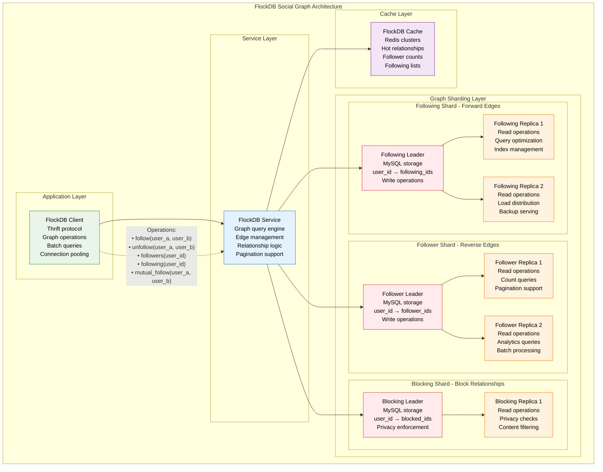
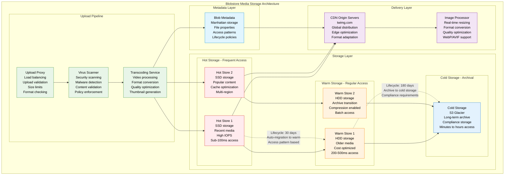
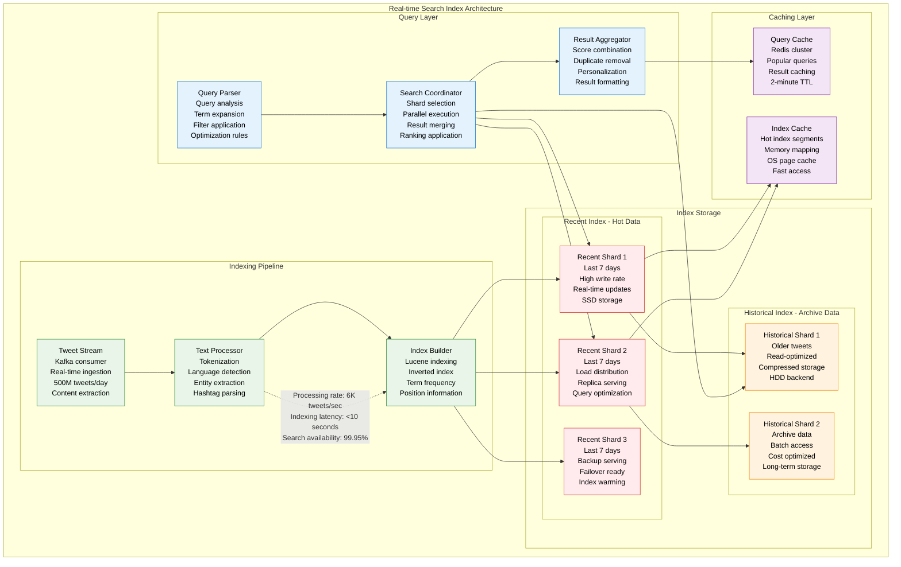
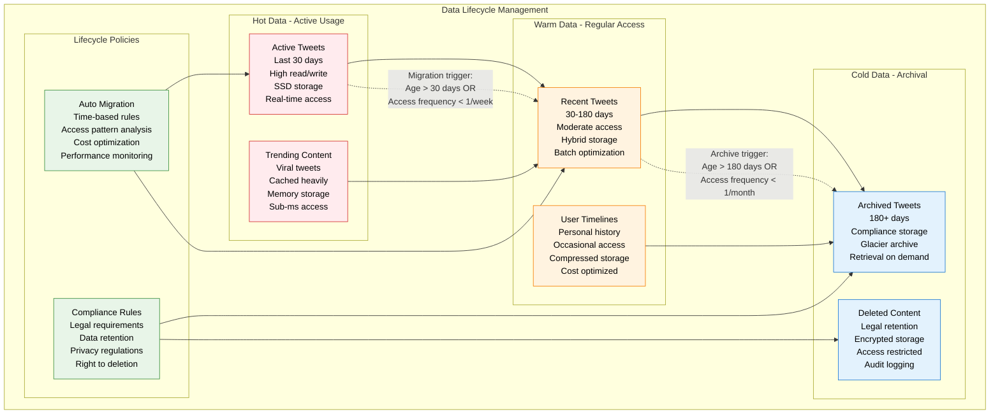

# Twitter/X Storage Architecture

## Overview
Twitter/X's storage architecture handles 500M+ tweets daily, billions of social connections, and petabytes of media content. The system uses Manhattan (distributed database), FlockDB (social graph), and specialized storage systems for different data patterns.

## Complete Storage Architecture

```mermaid
graph TB
    subgraph EdgePlane[Edge Plane - Data Access Layer]
        API[API Gateway<br/>Finagle framework<br/>Request routing<br/>Authentication]
        CACHE_PROXY[Cache Proxy<br/>Intelligent caching<br/>Hot data routing<br/>Cache warming]
    end

    subgraph ServicePlane[Service Plane - Data Services]
        subgraph ReadServices[Read Services]
            TIMELINE_READ[Timeline Read Service<br/>Manhattan client<br/>Cache-first reads<br/>Fanout optimization]
            TWEET_READ[Tweet Read Service<br/>Manhattan client<br/>Content hydration<br/>Media resolution]
            GRAPH_READ[Graph Read Service<br/>FlockDB client<br/>Social relationships<br/>Following/follower queries]
            SEARCH_READ[Search Read Service<br/>Lucene client<br/>Real-time indexing<br/>Full-text search]
        end

        subgraph WriteServices[Write Services]
            TWEET_WRITE[Tweet Write Service<br/>Manhattan client<br/>Snowflake ID generation<br/>Atomic operations]
            GRAPH_WRITE[Graph Write Service<br/>FlockDB client<br/>Relationship updates<br/>Bi-directional edges]
            MEDIA_WRITE[Media Write Service<br/>Blobstore client<br/>Upload processing<br/>Format conversion]
        end
    end

    subgraph StatePlane[State Plane - Storage Systems]
        subgraph PrimaryStorage[Primary Storage - Source of Truth]
            MANHATTAN[Manhattan Database<br/>Distributed NoSQL<br/>Multi-tenant storage<br/>1000+ TB<br/>Strong consistency]
            MYSQL[MySQL Clusters<br/>Relational data<br/>User accounts<br/>Financial data<br/>ACID compliance]
        end

        subgraph GraphStorage[Social Graph Storage]
            FLOCKDB[FlockDB<br/>Distributed graph database<br/>Social relationships<br/>Billions of edges<br/>High write throughput]
            GIZMODUCK[Gizmoduck<br/>User identity service<br/>Profile management<br/>Authentication data<br/>Privacy settings]
        end

        subgraph MediaStorage[Media Storage]
            BLOBSTORE[Blobstore<br/>Distributed object storage<br/>Photos, videos, GIFs<br/>2+ PB capacity<br/>Multi-region replication]
            TWIMG[twimg.com CDN<br/>Global media delivery<br/>Image optimization<br/>Video transcoding<br/>Format adaptation]
        end

        subgraph SearchStorage[Search & Analytics Storage]
            LUCENE[Lucene Indexes<br/>Real-time search<br/>Tweet content indexing<br/>150+ TB<br/>Distributed shards]
            CASSANDRA[Cassandra<br/>Time-series data<br/>Analytics storage<br/>Trending calculations<br/>300+ TB]
            DRUID[Apache Druid<br/>Real-time analytics<br/>OLAP queries<br/>Dashboard data<br/>Sub-second response]
        end

        subgraph CacheLayers[Cache Layers]
            MEMCACHED[Memcached<br/>Hot data cache<br/>Timeline fragments<br/>User sessions<br/>500+ GB]
            REDIS[Redis Clusters<br/>Real-time cache<br/>Trending data<br/>Counters & sets<br/>200+ GB]
        end
    end

    subgraph ControlPlane[Control Plane - Data Management]
        subgraph ReplicationLayer[Replication Layer]
            REPLICATOR[Manhattan Replicator<br/>Cross-region sync<br/>Async replication<br/>Conflict resolution]
            BACKUP_SERVICE[Backup Service<br/>Automated backups<br/>Point-in-time recovery<br/>S3 archival]
        end

        subgraph StreamingLayer[Streaming Layer]
            KAFKA[Apache Kafka<br/>Change data capture<br/>Event streaming<br/>100B+ events/day<br/>Real-time processing]
            HERON[Heron Topology<br/>Stream processing<br/>Real-time aggregations<br/>Low-latency computation]
        end

        subgraph BatchProcessing[Batch Processing]
            HADOOP[Hadoop Clusters<br/>Batch analytics<br/>100+ PB storage<br/>MapReduce jobs<br/>Historical processing]
            VERTICA[Vertica<br/>Columnar analytics<br/>Business intelligence<br/>Reporting queries<br/>Data warehouse]
        end
    end

    %% Edge to Service connections
    API --> TIMELINE_READ
    API --> TWEET_READ
    API --> GRAPH_READ
    API --> SEARCH_READ
    API --> TWEET_WRITE
    API --> GRAPH_WRITE
    API --> MEDIA_WRITE

    CACHE_PROXY --> TIMELINE_READ
    CACHE_PROXY --> MEMCACHED
    CACHE_PROXY --> REDIS

    %% Read service connections
    TIMELINE_READ --> MANHATTAN
    TIMELINE_READ --> MEMCACHED
    TWEET_READ --> MANHATTAN
    TWEET_READ --> BLOBSTORE
    GRAPH_READ --> FLOCKDB
    GRAPH_READ --> GIZMODUCK
    SEARCH_READ --> LUCENE

    %% Write service connections
    TWEET_WRITE --> MANHATTAN
    TWEET_WRITE --> KAFKA
    GRAPH_WRITE --> FLOCKDB
    MEDIA_WRITE --> BLOBSTORE
    MEDIA_WRITE --> TWIMG

    %% Replication and streaming
    MANHATTAN --> REPLICATOR
    MYSQL --> BACKUP_SERVICE
    FLOCKDB --> KAFKA
    MANHATTAN --> KAFKA

    KAFKA --> HERON
    HERON --> CASSANDRA
    HERON --> DRUID
    HERON --> REDIS

    %% Batch processing
    MANHATTAN --> HADOOP
    KAFKA --> HADOOP
    HADOOP --> VERTICA

    %% Apply four-plane colors
    classDef edgeStyle fill:#3B82F6,stroke:#2563EB,color:#fff,stroke-width:2px
    classDef serviceStyle fill:#10B981,stroke:#059669,color:#fff,stroke-width:2px
    classDef stateStyle fill:#F59E0B,stroke:#D97706,color:#fff,stroke-width:2px
    classDef controlStyle fill:#8B5CF6,stroke:#7C3AED,color:#fff,stroke-width:2px

    class API,CACHE_PROXY edgeStyle
    class TIMELINE_READ,TWEET_READ,GRAPH_READ,SEARCH_READ,TWEET_WRITE,GRAPH_WRITE,MEDIA_WRITE serviceStyle
    class MANHATTAN,MYSQL,FLOCKDB,GIZMODUCK,BLOBSTORE,TWIMG,LUCENE,CASSANDRA,DRUID,MEMCACHED,REDIS stateStyle
    class REPLICATOR,BACKUP_SERVICE,KAFKA,HERON,HADOOP,VERTICA controlStyle
```



## Manhattan Database - Twitter's Crown Jewel

```mermaid
graph TB
    subgraph ManhattanArchitecture[Manhattan Database Architecture]
        subgraph ClientLayer[Client Layer]
            MANHATTAN_CLIENT[Manhattan Client<br/>Java/Scala library<br/>Connection pooling<br/>Retry mechanisms<br/>Load balancing]
        end

        subgraph ProxyLayer[Proxy Layer]
            MANHATTAN_PROXY[Manhattan Proxy<br/>Request routing<br/>Query optimization<br/>Connection multiplexing<br/>Protocol translation]
        end

        subgraph ShardingLayer[Sharding Layer]
            subgraph Shard1[Shard 1 - Range: 0-100M]
                LEADER1[Leader Node<br/>MySQL backend<br/>Write operations<br/>Read replicas: 3]
                REPLICA1A[Read Replica 1A<br/>Async replication<br/>Read operations<br/>Local SSD storage]
                REPLICA1B[Read Replica 1B<br/>Async replication<br/>Read operations<br/>Local SSD storage]
                REPLICA1C[Read Replica 1C<br/>Async replication<br/>Read operations<br/>Local SSD storage]
            end

            subgraph Shard2[Shard 2 - Range: 100M-200M]
                LEADER2[Leader Node<br/>MySQL backend<br/>Write operations<br/>Read replicas: 3]
                REPLICA2A[Read Replica 2A<br/>Async replication<br/>Read operations<br/>Local SSD storage]
                REPLICA2B[Read Replica 2B<br/>Async replication<br/>Read operations<br/>Local SSD storage]
                REPLICA2C[Read Replica 2C<br/>Async replication<br/>Read operations<br/>Local SSD storage]
            end

            subgraph ShardN[Shard N - Range: NM-(N+1)M]
                LEADERN[Leader Node<br/>MySQL backend<br/>Write operations<br/>Read replicas: 3]
                REPLICANA[Read Replica NA<br/>Async replication<br/>Read operations<br/>Local SSD storage]
                REPLICANB[Read Replica NB<br/>Async replication<br/>Read operations<br/>Local SSD storage]
                REPLICANC[Read Replica NC<br/>Async replication<br/>Read operations<br/>Local SSD storage]
            end
        end

        subgraph ConsistencyLayer[Consistency Layer]
            CDC[Change Data Capture<br/>Binlog streaming<br/>Event publishing<br/>Kafka integration]
        end
    end

    MANHATTAN_CLIENT --> MANHATTAN_PROXY
    MANHATTAN_PROXY --> LEADER1
    MANHATTAN_PROXY --> LEADER2
    MANHATTAN_PROXY --> LEADERN

    LEADER1 --> REPLICA1A
    LEADER1 --> REPLICA1B
    LEADER1 --> REPLICA1C
    LEADER2 --> REPLICA2A
    LEADER2 --> REPLICA2B
    LEADER2 --> REPLICA2C
    LEADERN --> REPLICANA
    LEADERN --> REPLICANB
    LEADERN --> REPLICANC

    LEADER1 --> CDC
    LEADER2 --> CDC
    LEADERN --> CDC

    %% Sharding strategy
    MANHATTAN_PROXY -.->|"Sharding by tweet_id<br/>Consistent hashing<br/>Auto-rebalancing"| LEADER1

    classDef clientStyle fill:#E8F5E8,stroke:#388E3C,color:#000
    classDef proxyStyle fill:#E3F2FD,stroke:#1976D2,color:#000
    classDef leaderStyle fill:#FFEBEE,stroke:#D32F2F,color:#000
    classDef replicaStyle fill:#FFF3E0,stroke:#F57C00,color:#000
    classDef consistencyStyle fill:#F3E5F5,stroke:#7B1FA2,color:#000

    class MANHATTAN_CLIENT clientStyle
    class MANHATTAN_PROXY proxyStyle
    class LEADER1,LEADER2,LEADERN leaderStyle
    class REPLICA1A,REPLICA1B,REPLICA1C,REPLICA2A,REPLICA2B,REPLICA2C,REPLICANA,REPLICANB,REPLICANC replicaStyle
    class CDC consistencyStyle
```

## FlockDB - Social Graph Database



## Blobstore - Media Storage System



## Real-time Search Index



## Storage Performance Metrics

| Storage System | Read Latency (p99) | Write Latency (p99) | Throughput | Consistency Model |
|----------------|---------------------|---------------------|------------|-------------------|
| **Manhattan** | 20ms | 50ms | 1M QPS | Eventually consistent |
| **FlockDB** | 15ms | 30ms | 500K QPS | Eventually consistent |
| **MySQL** | 10ms | 25ms | 200K QPS | ACID consistent |
| **Blobstore** | 100ms | 200ms | 100K QPS | Eventually consistent |
| **Memcached** | 1ms | 1ms | 10M QPS | No persistence |
| **Lucene Search** | 50ms | N/A (read-only) | 100K QPS | Eventually consistent |

## Data Lifecycle Management



## Disaster Recovery & Backup Strategy

| System | Backup Frequency | RTO | RPO | Backup Size |
|--------|------------------|-----|-----|-------------|
| **Manhattan** | Continuous replication + 6hr snapshots | 30 minutes | 10 minutes | 200TB/day |
| **FlockDB** | Daily full + hourly incremental | 1 hour | 30 minutes | 50TB/day |
| **MySQL** | Continuous binlog + daily snapshots | 15 minutes | 5 minutes | 20TB/day |
| **Blobstore** | 3x replication + weekly archive | 2 hours | 0 (replicated) | 500TB/week |
| **Search Index** | Rebuild from source | 4 hours | 0 (derived data) | N/A |

## Key Storage Innovations

1. **Manhattan Database**: Multi-tenant distributed NoSQL at massive scale
2. **FlockDB**: Purpose-built social graph database
3. **Snowflake IDs**: Globally unique, time-ordered identifiers
4. **Hybrid Storage Tiers**: Hot/warm/cold data lifecycle management
5. **Real-time Search**: Immediate indexing of new content
6. **Blobstore Optimization**: Intelligent media storage and delivery

*Last updated: September 2024*
*Source: Twitter Engineering Blog, High Scalability presentations*