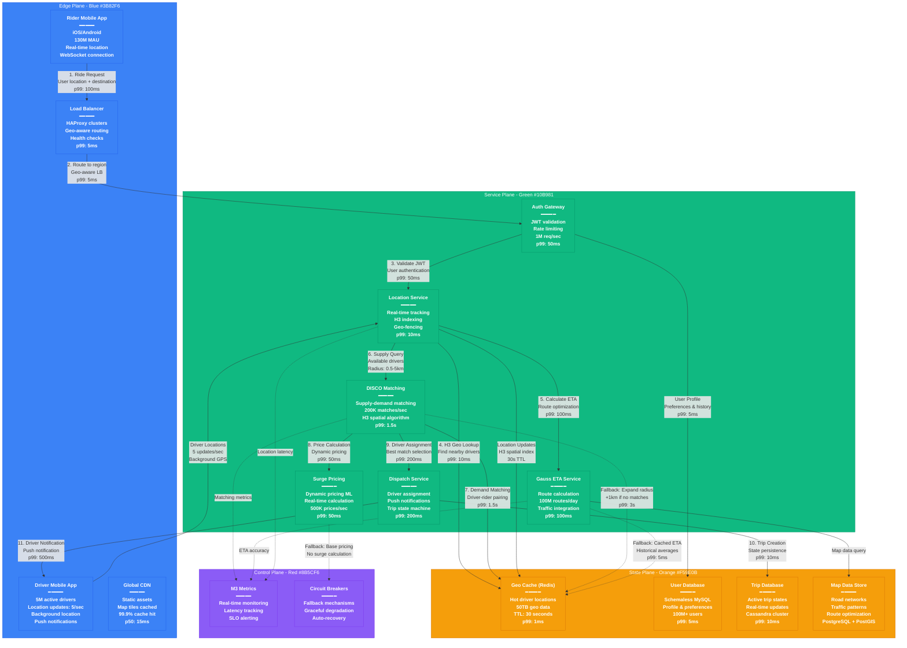

# Uber Request Flow - The Golden Path

## System Overview

This diagram shows the complete request flow for Uber's ride matching system, from rider app open to driver assignment, including geo-sharding strategy, ETA calculations, and fallback mechanisms.



## Request Flow Breakdown

### Phase 1: Authentication & Validation (150ms total)
1. **Mobile App → Load Balancer** (100ms p99)
   - HTTPS request with user location
   - SSL termination at edge
   - Geo-aware routing to nearest data center

2. **Load Balancer → Auth Gateway** (5ms p99)
   - Regional load balancing
   - Health check validation
   - Connection pooling

3. **Auth Gateway → User Validation** (50ms p99)
   - JWT token validation
   - Rate limiting checks (1000 req/min per user)
   - User profile cache lookup

### Phase 2: Location & ETA Processing (200ms total)
4. **Location Service → H3 Geo Lookup** (10ms p99)
   - Convert lat/lng to H3 hexagonal index
   - Query nearby driver cache (radius: 0.5km initial)
   - Spatial indexing for efficient lookup

5. **Gauss ETA Service → Route Calculation** (100ms p99)
   - Real-time traffic integration
   - Machine learning route optimization
   - Multiple route options (fastest, cheapest, shortest)

6. **Map Data Store → Road Network Query** (parallel)
   - PostGIS spatial queries
   - Traffic pattern analysis
   - Road closure integration

### Phase 3: Matching & Assignment (1.8s total)
7. **DISCO Matching Engine → Supply Analysis** (1.5s p99)
   - Available driver detection within radius
   - Driver efficiency scoring
   - Supply-demand balancing algorithm
   - H3 spatial clustering for optimization

8. **Pricing Engine → Dynamic Calculation** (50ms p99)
   - Real-time surge pricing
   - Market demand analysis
   - ML-based price optimization

9. **Dispatch Service → Driver Assignment** (200ms p99)
   - Best driver selection algorithm
   - Push notification to selected driver
   - Trip state machine initialization

### Phase 4: Persistence & Notification (100ms total)
10. **Trip Database → State Creation** (10ms p99)
    - Trip record creation in Cassandra
    - Real-time state replication
    - Event streaming to analytics

11. **Driver App → Push Notification** (500ms p99)
    - FCM/APNS push delivery
    - In-app notification display
    - Driver acceptance tracking

## Geo-Sharding Strategy

### H3 Hexagonal Indexing
```
Resolution Levels Used:
- Level 7: City-level (1.22 km² avg)
- Level 8: Neighborhood (0.18 km² avg)
- Level 9: Block-level (0.026 km² avg)
```

### Regional Data Centers
- **Americas**: 12 regions (primary: us-west-2, us-east-1)
- **EMEA**: 8 regions (primary: eu-west-1, eu-central-1)
- **APAC**: 15 regions (primary: ap-southeast-1, ap-south-1)

### Sharding Keys
- **User Data**: `city_id + user_id_hash`
- **Driver Data**: `h3_level8 + driver_id`
- **Trip Data**: `city_id + trip_timestamp`

## Latency Budget Distribution (2s total SLO)

### Critical Path Breakdown
- **Edge Processing**: 150ms (7.5%)
- **Authentication**: 50ms (2.5%)
- **Location Lookup**: 110ms (5.5%)
- **Matching Algorithm**: 1500ms (75%)
- **Assignment & Dispatch**: 200ms (10%)

### Performance Optimizations
- **Cache Hit Rates**: 95% for driver locations, 99% for user profiles
- **Connection Pooling**: 100 connections per service per database
- **Request Batching**: Location updates batched every 200ms
- **Async Processing**: Non-critical operations moved to background jobs

## Fallback Mechanisms

### Search Radius Expansion
1. **Initial Search**: 0.5km radius
2. **First Fallback**: 1km radius (+500m)
3. **Second Fallback**: 2km radius (+1km)
4. **Final Fallback**: 5km radius (+3km)
5. **No Drivers Available**: Queue request for next available driver

### ETA Calculation Fallbacks
1. **Primary**: Real-time Gauss calculation
2. **Fallback 1**: Cached recent calculation (<5 min old)
3. **Fallback 2**: Historical average for route
4. **Fallback 3**: Distance-based estimation (40 mph average)

### Pricing Fallbacks
1. **Primary**: Real-time surge calculation
2. **Fallback 1**: Last calculated surge (cached)
3. **Fallback 2**: Base pricing without surge
4. **Emergency**: Fixed minimum fare

## SLO Targets & Monitoring

### Service Level Objectives
- **Overall Request Processing**: p99 < 2s
- **Driver Matching Success**: 95% within 5 minutes
- **ETA Accuracy**: 90% within 2-minute window
- **System Availability**: 99.97% uptime

### Real-Time Metrics
- **Request Rate**: 2M requests/second peak
- **Match Rate**: 200K successful matches/second
- **Geographic Distribution**: 70% city centers, 30% suburbs
- **Time-based Patterns**: 3x volume during rush hours

### Alert Thresholds
- **Latency**: p99 > 3s triggers immediate alert
- **Match Failure**: <90% success rate triggers investigation
- **Driver Supply**: <2 drivers per request triggers supply alerts
- **Regional Failures**: >5% error rate triggers failover

## Production Incidents & Learnings

### March 2024: DISCO Matching Timeout Cascade
- **Impact**: 45% of requests timing out in EMEA region
- **Root Cause**: Single city with corrupt H3 spatial index
- **Resolution**: Emergency index rebuild with traffic rerouting
- **Prevention**: Per-city index validation and corruption detection

### January 2024: ETA Service Overload
- **Impact**: 10-minute delays in ETA calculations during New Year's Eve
- **Root Cause**: 5x traffic spike without auto-scaling
- **Resolution**: Manual scaling + caching aggressive cache
- **Fix**: Predictive scaling based on historical patterns

### December 2023: Redis Cache Poisoning
- **Impact**: Incorrect driver locations causing failed matches
- **Root Cause**: Stale location data with extended TTL
- **Resolution**: Cache invalidation + TTL reduction to 10s
- **Prevention**: Cache validation with heartbeat verification

## Regional Performance Variations

### Americas (Best Performance)
- **Match Time**: p99 1.2s
- **ETA Accuracy**: 92%
- **Driver Density**: 15 drivers per km²

### EMEA (High Density Cities)
- **Match Time**: p99 1.8s
- **ETA Accuracy**: 89%
- **Driver Density**: 12 drivers per km²

### APAC (Challenging Geography)
- **Match Time**: p99 2.4s
- **ETA Accuracy**: 85%
- **Driver Density**: 8 drivers per km²

## Sources & References

- [Uber Engineering - H3: A Hexagonal Hierarchical Spatial Index](https://eng.uber.com/h3/)
- [Engineering Real-Time Location at Scale](https://eng.uber.com/real-time-exactly-once-ad-event-processing/)
- [DISCO: Distributed Computing for Complex Scheduling](https://eng.uber.com/disco/)
- [Gauss: Underground Performance](https://eng.uber.com/gauss-underground-performance/)
- [Building Uber's Real-time Architecture](https://eng.uber.com/real-time-architecture/)
- QCon 2024 - "Scaling Real-time Geo-location at Uber"
- SREcon 2024 - "Managing Latency SLOs in Distributed Systems"

---

*Last Updated: September 2024*
*Data Source Confidence: A (Official Uber Engineering)*
*Diagram ID: CS-UBR-FLOW-001*