# Zoom Production Operations - The Ops View

## System Overview

This diagram shows Zoom's deployment pipeline, monitoring and alerting setup, on-call procedures, and chaos engineering practices that enable 99.99% availability for 300+ million daily participants with 1,000+ deployments/day and 24/7 global operations across 18 data centers.

```mermaid
graph TB
    subgraph DeploymentPipeline[Deployment Pipeline - 1,000+ Deploys/Day]
        style DeploymentPipeline fill:#10B981,stroke:#059669,color:#fff

        subgraph CICD[CI/CD Infrastructure]
            GitLabCI[GitLab CI/CD<br/>━━━━━<br/>10,000+ repositories<br/>100,000+ builds/day<br/>Auto-testing: 95% coverage<br/>Build time: p99 <10 minutes<br/>Multi-region deployment]

            JenkinsOrchestration[Jenkins Orchestration<br/>━━━━━<br/>5,000+ build agents<br/>Parallel execution<br/>Cross-platform builds<br/>Integration testing<br/>Artifact management]

            GitOpsDeployment[GitOps Deployment<br/>━━━━━<br/>ArgoCD + Flux<br/>Declarative config<br/>Automatic reconciliation<br/>Rollback capability<br/>Multi-cluster deployment]

            ArtifactRepository[Artifact Repository<br/>━━━━━<br/>Container registry<br/>Binary artifacts<br/>Security scanning<br/>Vulnerability detection<br/>Version management]
        end

        subgraph DeploymentStrategy[Deployment Strategies]
            CanaryDeployment[Canary Deployment<br/>━━━━━<br/>1% → 10% → 50% → 100%<br/>Automated progression<br/>Metric-based decisions<br/>Automatic rollback<br/>Zero-downtime deployment]

            BlueGreenDeployment[Blue-Green Deployment<br/>━━━━━<br/>Parallel environment<br/>Traffic switching<br/>Instant rollback<br/>Database migrations<br/>State synchronization]

            FeatureFlags[Feature Flag System<br/>━━━━━<br/>LaunchDarkly integration<br/>A/B testing framework<br/>Gradual rollout<br/>User segmentation<br/>Emergency kill switch]

            MultiRegionRollout[Multi-Region Rollout<br/>━━━━━<br/>Regional staging<br/>Time zone awareness<br/>Risk mitigation<br/>Global coordination<br/>Compliance validation]
        end
    end

    subgraph MonitoringAlerting[Monitoring & Alerting - 24/7 Operations]
        style MonitoringAlerting fill:#3B82F6,stroke:#2563EB,color:#fff

        subgraph ObservabilityStack[Observability Infrastructure]
            PrometheusMonitoring[Prometheus Stack<br/>━━━━━<br/>10M+ metrics/minute<br/>1,000+ alert rules<br/>Multi-cluster federation<br/>Long-term storage<br/>High availability setup]

            GrafanaDashboards[Grafana Dashboards<br/>━━━━━<br/>5,000+ dashboards<br/>Real-time visualization<br/>Executive reporting<br/>SLA monitoring<br/>Custom alerting]

            DistributedTracing[Distributed Tracing<br/>━━━━━<br/>Jaeger + Zipkin<br/>Request flow tracking<br/>Performance analysis<br/>Error correlation<br/>Service dependencies]

            LogAggregation[ELK Log Aggregation<br/>━━━━━<br/>5TB+ daily logs<br/>Real-time processing<br/>Search and analysis<br/>Anomaly detection<br/>Compliance retention]
        end

        subgraph AlertingSystem[Intelligent Alerting]
            PagerDutyIntegration[PagerDuty Integration<br/>━━━━━<br/>Escalation policies<br/>On-call scheduling<br/>Alert suppression<br/>War room coordination<br/>Post-incident analysis]

            SmartAlerting[Smart Alerting Engine<br/>━━━━━<br/>ML-based anomaly detection<br/>Alert correlation<br/>Noise reduction<br/>Priority scoring<br/>Context enrichment]

            BusinessMetrics[Business Metrics<br/>━━━━━<br/>Meeting success rate<br/>User experience metrics<br/>Revenue impact tracking<br/>SLA monitoring<br/>Executive dashboards]

            CapacityAlerting[Capacity Alerting<br/>━━━━━<br/>Predictive scaling alerts<br/>Resource exhaustion<br/>Cost optimization<br/>Growth planning<br/>Emergency capacity]
        end
    end

    subgraph OnCallOperations[On-Call Operations - Global 24/7]
        style OnCallOperations fill:#F59E0B,stroke:#D97706,color:#fff

        subgraph FollowTheSun[Follow-the-Sun Coverage]
            USOnCall[US On-Call Team<br/>━━━━━<br/>Coverage: 6 PM - 6 AM PT<br/>Engineers: 50+ SREs<br/>Response: <5 minutes<br/>Escalation: L1 → L2 → L3<br/>Weekend coverage]

            EuropeOnCall[Europe On-Call Team<br/>━━━━━<br/>Coverage: 6 AM - 6 PM GMT<br/>Engineers: 30+ SREs<br/>Handoff: Seamless<br/>Language: Multi-lingual<br/>Regional expertise]

            APACOnCall[APAC On-Call Team<br/>━━━━━<br/>Coverage: 6 AM - 6 PM JST<br/>Engineers: 25+ SREs<br/>Regional focus: Asia-Pacific<br/>Growth support<br/>24/7 coordination]

            ExecutiveEscalation[Executive Escalation<br/>━━━━━<br/>P0 incidents: CTO alert<br/>Customer impact: CEO alert<br/>Media attention: PR team<br/>Board notification<br/>Crisis management]
        end

        subgraph IncidentResponse[Incident Response Procedures]
            IncidentClassification[Incident Classification<br/>━━━━━<br/>P0: Complete outage<br/>P1: Major degradation<br/>P2: Minor issues<br/>P3: Planned maintenance<br/>SLA impact assessment]

            WarRoomProtocol[War Room Protocol<br/>━━━━━<br/>Zoom room: Always available<br/>Incident commander<br/>Subject matter experts<br/>Customer communication<br/>Executive updates]

            PostIncidentReview[Post-Incident Review<br/>━━━━━<br/>Blameless postmortem<br/>Root cause analysis<br/>Action item tracking<br/>Process improvement<br/>Knowledge sharing]

            CustomerCommunication[Customer Communication<br/>━━━━━<br/>Status page updates<br/>Proactive notifications<br/>Support ticket priority<br/>Enterprise escalation<br/>Media coordination]
        end
    end

    subgraph ChaosEngineering[Chaos Engineering - Resilience Testing]
        style ChaosEngineering fill:#8B5CF6,stroke:#7C3AED,color:#fff

        subgraph ChaosSchedule[Automated Chaos Testing]
            DailyChaosTests[Daily Chaos Tests<br/>━━━━━<br/>Pod termination: 10%<br/>Network latency injection<br/>CPU stress testing<br/>Memory exhaustion<br/>Disk space filling]

            WeeklyChaosTests[Weekly Chaos Tests<br/>━━━━━<br/>Service dependency failures<br/>Database connection loss<br/>Cache invalidation<br/>Load balancer failures<br/>Cross-region partitions]

            MonthlyChaosTests[Monthly Chaos Tests<br/>━━━━━<br/>Availability zone failures<br/>Regional data center loss<br/>Multi-service cascades<br/>Security incident simulation<br/>Disaster recovery drills]

            QuarterlyChaosTests[Quarterly Chaos Tests<br/>━━━━━<br/>Full region failures<br/>Multi-cloud scenarios<br/>Business continuity<br/>Customer communication<br/>Executive response]
        end

        subgraph ChaosTooling[Chaos Engineering Tools]
            ChaosMesh[Chaos Mesh<br/>━━━━━<br/>Kubernetes-native chaos<br/>Network faults<br/>IO delays<br/>Stress testing<br/>Timeline management]

            ChaosMonkey[Chaos Monkey<br/>━━━━━<br/>Instance termination<br/>Auto-scaling testing<br/>Service resilience<br/>Recovery validation<br/>Failure injection]

            LitmusChaos[Litmus Chaos<br/>━━━━━<br/>Cloud-native chaos<br/>Operator-based testing<br/>GitOps integration<br/>Experiment templates<br/>Result analysis]

            CustomChaosTools[Custom Chaos Tools<br/>━━━━━<br/>Meeting-specific tests<br/>Media quality degradation<br/>User experience impact<br/>Business metric tracking<br/>Safe failure injection]
        end
    end

    subgraph OperationalMetrics[Operational Excellence Metrics]
        style OperationalMetrics fill:#EF4444,stroke:#DC2626,color:#fff

        subgraph DeploymentMetrics[Deployment Performance]
            DeploymentFrequency[Deployment Frequency<br/>━━━━━<br/>Current: 1,000+ per day<br/>Target: 2,000+ per day<br/>Success rate: 99.5%<br/>Rollback rate: 0.5%<br/>Time to production: 4 hours]

            LeadTime[Lead Time Metrics<br/>━━━━━<br/>Code commit → production<br/>Median: 4 hours<br/>P95: 12 hours<br/>Emergency: 30 minutes<br/>Feature flags: Instant]

            MTTR[Mean Time To Recovery<br/>━━━━━<br/>P0 incidents: 15 minutes<br/>P1 incidents: 1 hour<br/>P2 incidents: 4 hours<br/>Deployment issues: 5 minutes<br/>Database recovery: 30 minutes]

            ChangeFailureRate[Change Failure Rate<br/>━━━━━<br/>Current: 0.5%<br/>Target: <1%<br/>Rollback rate: 0.5%<br/>Hotfix rate: 2%<br/>Emergency patches: 0.1%]
        end

        subgraph QualityMetrics[Service Quality Metrics]
            AvailabilityMetrics[Availability Metrics<br/>━━━━━<br/>Overall SLA: 99.99%<br/>Meeting join: 99.95%<br/>Video quality: 99.9%<br/>Audio quality: 99.99%<br/>API availability: 99.95%]

            PerformanceMetrics[Performance Metrics<br/>━━━━━<br/>Meeting join: <3 seconds<br/>API response: <100ms<br/>Video latency: <200ms<br/>Audio latency: <150ms<br/>Page load: <2 seconds]

            ErrorRateMetrics[Error Rate Metrics<br/>━━━━━<br/>API errors: <0.1%<br/>Meeting failures: <0.05%<br/>Connection drops: <1%<br/>Quality degradation: <5%<br/>Authentication: <0.01%]

            CustomerSatisfaction[Customer Satisfaction<br/>━━━━━<br/>NPS Score: 61<br/>Support tickets: -25% YoY<br/>Resolution time: <2 hours<br/>First call resolution: 85%<br/>Enterprise satisfaction: 95%]
        end
    end

    subgraph SecurityOperations[Security Operations Center - 24/7 SOC]
        style SecurityOperations fill:#DC2626,stroke:#B91C1C,color:#fff

        subgraph ThreatDetection[Threat Detection & Response]
            SIEM[SIEM Platform<br/>━━━━━<br/>Splunk + Elastic Security<br/>Real-time threat detection<br/>Behavioral analytics<br/>Threat intelligence<br/>Incident correlation]

            ThreatHunting[Threat Hunting<br/>━━━━━<br/>Proactive threat search<br/>IOC investigation<br/>Advanced persistent threats<br/>Insider threat detection<br/>Forensic analysis]

            IncidentResponse[Security Incident Response<br/>━━━━━<br/>24/7 SOC monitoring<br/>Automated response<br/>Threat containment<br/>Digital forensics<br/>Recovery procedures]

            ComplianceMonitoring[Compliance Monitoring<br/>━━━━━<br/>SOC 2 Type II<br/>HIPAA compliance<br/>GDPR monitoring<br/>FedRAMP controls<br/>Audit trail maintenance]
        end

        subgraph SecurityAutomation[Security Automation]
            VulnerabilityScanning[Vulnerability Scanning<br/>━━━━━<br/>Container image scanning<br/>Dependency checking<br/>Infrastructure assessment<br/>Penetration testing<br/>Security patching]

            AccessManagement[Access Management<br/>━━━━━<br/>Zero-trust architecture<br/>Identity verification<br/>Privileged access<br/>Session monitoring<br/>Automated deprovisioning]

            SecurityOrchestration[Security Orchestration<br/>━━━━━<br/>SOAR platform<br/>Playbook automation<br/>Response coordination<br/>Threat intelligence<br/>Incident management]
        end
    end

    %% Operational flow connections
    GitLabCI -->|"Code → Build → Test<br/>100K builds/day<br/>10 minute cycle"| CanaryDeployment
    CanaryDeployment -->|"Deployment monitoring<br/>Real-time metrics<br/>Automatic rollback"| PrometheusMonitoring
    PrometheusMonitoring -->|"Alert generation<br/>SLA monitoring<br/>Capacity planning"| PagerDutyIntegration
    PagerDutyIntegration -->|"On-call escalation<br/>Follow-the-sun<br/>Global coverage"| USOnCall

    %% Chaos engineering integration
    ChaosSchedule -.->|"Resilience testing<br/>Failure simulation<br/>Recovery validation"| IncidentResponse
    ChaosMesh -.->|"Kubernetes chaos<br/>Service disruption<br/>Automated testing"| MonitoringAlerting

    %% Security integration
    SIEM -.->|"Security monitoring<br/>Threat detection<br/>Incident correlation"| WarRoomProtocol
    VulnerabilityScanning -.->|"Security gates<br/>Vulnerability blocking<br/>Compliance validation"| GitLabCI

    %% Metrics feedback loops
    DeploymentMetrics -.->|"Performance optimization<br/>Process improvement<br/>Automation enhancement"| DeploymentPipeline
    QualityMetrics -.->|"SLA monitoring<br/>Quality improvement<br/>Customer satisfaction"| BusinessMetrics

    %% Apply operational colors
    classDef deploymentStyle fill:#10B981,stroke:#059669,color:#fff,font-weight:bold
    classDef monitoringStyle fill:#3B82F6,stroke:#2563EB,color:#fff,font-weight:bold
    classDef onCallStyle fill:#F59E0B,stroke:#D97706,color:#fff,font-weight:bold
    classDef chaosStyle fill:#8B5CF6,stroke:#7C3AED,color:#fff,font-weight:bold
    classDef metricsStyle fill:#EF4444,stroke:#DC2626,color:#fff,font-weight:bold
    classDef securityStyle fill:#DC2626,stroke:#B91C1C,color:#fff,font-weight:bold

    class GitLabCI,JenkinsOrchestration,GitOpsDeployment,ArtifactRepository,CanaryDeployment,BlueGreenDeployment,FeatureFlags,MultiRegionRollout deploymentStyle
    class PrometheusMonitoring,GrafanaDashboards,DistributedTracing,LogAggregation,PagerDutyIntegration,SmartAlerting,BusinessMetrics,CapacityAlerting monitoringStyle
    class USOnCall,EuropeOnCall,APACOnCall,ExecutiveEscalation,IncidentClassification,WarRoomProtocol,PostIncidentReview,CustomerCommunication onCallStyle
    class DailyChaosTests,WeeklyChaosTests,MonthlyChaosTests,QuarterlyChaosTests,ChaosMesh,ChaosMonkey,LitmusChaos,CustomChaosTools chaosStyle
    class DeploymentFrequency,LeadTime,MTTR,ChangeFailureRate,AvailabilityMetrics,PerformanceMetrics,ErrorRateMetrics,CustomerSatisfaction metricsStyle
    class SIEM,ThreatHunting,IncidentResponse,ComplianceMonitoring,VulnerabilityScanning,AccessManagement,SecurityOrchestration securityStyle
```



## Deployment Pipeline Excellence

### CI/CD Infrastructure at Scale

#### GitLab CI/CD Operations
```yaml
Scale Metrics:
  - Repositories: 10,000+ active repositories
  - Daily Builds: 100,000+ build executions
  - Build Agents: 5,000+ concurrent runners
  - Test Coverage: 95% automated test coverage
  - Build Success Rate: 99.2%

Pipeline Architecture:
  - Multi-stage Pipelines: Build → Test → Security → Deploy
  - Parallel Execution: 20+ concurrent jobs per pipeline
  - Cross-platform Builds: Linux, Windows, macOS support
  - Container-based: Docker and Kubernetes native
  - Artifact Management: Automated promotion and versioning

Performance Optimization:
  - Build Time: p99 < 10 minutes for full pipeline
  - Cache Strategy: 80% cache hit rate for dependencies
  - Test Parallelization: 10x faster test execution
  - Resource Optimization: Dynamic runner allocation
  - Cost Management: Spot instance utilization for builds
```

#### Deployment Strategies
```yaml
Canary Deployment Process:
  - Traffic Progression: 1% → 5% → 25% → 50% → 100%
  - Automated Gates: Metric-based progression decisions
  - Monitoring Period: 30 minutes per stage minimum
  - Rollback Triggers: Error rate >0.1%, latency >+20%
  - Success Criteria: SLA maintenance + business metrics

Blue-Green Deployment:
  - Parallel Environments: Complete infrastructure duplication
  - Traffic Switching: DNS-based instant cutover
  - Database Migrations: Zero-downtime schema changes
  - State Synchronization: Session and cache state transfer
  - Rollback Time: <2 minutes to previous version

Feature Flag Management:
  - LaunchDarkly Integration: Enterprise feature flag platform
  - User Segmentation: Gradual rollout by user cohorts
  - Kill Switch: Instant feature disabling capability
  - A/B Testing: Automated experiment management
  - Compliance: Audit trail for all flag changes
```

### Monitoring & Observability

#### Prometheus Monitoring Infrastructure
```yaml
Metrics Collection:
  - Ingestion Rate: 10,000,000+ metrics per minute
  - Retention Period: 2 years of detailed metrics
  - Alert Rules: 1,000+ active alerting rules
  - Query Performance: p99 < 100ms for dashboard queries
  - Storage: 500TB+ of time-series data

Federation Architecture:
  - Regional Clusters: 18 Prometheus clusters globally
  - Cross-cluster Queries: Federated query engine
  - High Availability: Multi-master setup per region
  - Disaster Recovery: Cross-region metric replication
  - Scaling: Automatic shard management

Custom Metrics:
  - Business KPIs: Meeting success rate, user satisfaction
  - Infrastructure: CPU, memory, network, disk utilization
  - Application: Request latency, error rates, throughput
  - Security: Authentication failures, suspicious activity
  - Cost: Resource utilization and spend tracking
```

#### Intelligent Alerting System
```yaml
Alert Intelligence:
  - Machine Learning: Anomaly detection using historical data
  - Alert Correlation: Related alerts grouped automatically
  - Noise Reduction: 70% reduction in false positive alerts
  - Priority Scoring: Business impact-based alert prioritization
  - Context Enrichment: Automatic runbook and dashboard links

Escalation Policies:
  - L1 Response: 5 minutes for P0, 15 minutes for P1
  - L2 Escalation: Subject matter expert engagement
  - L3 Escalation: Engineering team lead involvement
  - Executive Alerts: P0 incidents with customer impact
  - Customer Communication: Proactive status page updates

Alert Categories:
  - Infrastructure: System health and capacity alerts
  - Application: Service performance and error alerts
  - Business: SLA breach and revenue impact alerts
  - Security: Threat detection and compliance alerts
  - Capacity: Resource exhaustion and scaling alerts
```

### On-Call Operations Excellence

#### Follow-the-Sun Coverage Model
```yaml
Global Coverage:
  - US Team: 50+ Site Reliability Engineers
    Coverage: 6 PM PT - 6 AM PT (business hours APAC/Europe)
    Specialization: Infrastructure, security, customer escalation

  - Europe Team: 30+ Site Reliability Engineers
    Coverage: 6 AM GMT - 6 PM GMT (business hours US East)
    Specialization: Regional compliance, multi-language support

  - APAC Team: 25+ Site Reliability Engineers
    Coverage: 6 AM JST - 6 PM JST (business hours US West)
    Specialization: High growth markets, mobile optimization

Handoff Procedures:
  - Shift Overlap: 30-minute overlap between teams
  - Status Transfer: Detailed incident and context sharing
  - Escalation Continuity: Seamless on-call escalation
  - Knowledge Sharing: Real-time documentation updates
  - Cultural Awareness: Local holiday and business hour coverage
```

#### Incident Response Procedures
```yaml
Incident Classification:
  P0 (Critical): Complete service outage or major security breach
    - Response Time: <5 minutes
    - Escalation: Immediate CTO and CEO notification
    - War Room: Mandatory incident commander and SMEs
    - Communication: Proactive customer and media outreach
    - SLA Impact: Immediate SLA credit calculation

  P1 (Major): Significant service degradation affecting >10% users
    - Response Time: <15 minutes
    - Escalation: Engineering leadership notification
    - War Room: Incident commander with relevant experts
    - Communication: Status page and customer notifications
    - SLA Impact: Potential SLA breach monitoring

  P2 (Minor): Service issues affecting <10% users
    - Response Time: <1 hour
    - Escalation: Team lead notification
    - War Room: Optional, based on complexity
    - Communication: Internal stakeholder updates
    - SLA Impact: Generally within SLA bounds

War Room Protocol:
  - Dedicated Zoom Room: Always available for incident response
  - Incident Commander: Trained IC rotation among senior engineers
  - SME Engagement: Automatic paging of relevant experts
  - Communication Lead: Dedicated role for customer updates
  - Executive Updates: Scheduled briefings for major incidents
```

#### Post-Incident Excellence
```yaml
Blameless Postmortem Process:
  - Timeline: Postmortem completed within 48 hours
  - Participation: All involved engineers and stakeholders
  - Root Cause: Technical and process failure analysis
  - Action Items: Specific, measurable prevention tasks
  - Follow-up: 30-day and 90-day effectiveness review

Knowledge Management:
  - Incident Database: Searchable incident history and patterns
  - Runbook Updates: Automatic runbook improvement after incidents
  - Training Material: Incident-based training scenario development
  - Cross-team Sharing: Monthly incident review meetings
  - Pattern Recognition: ML-driven incident pattern analysis
```

### Chaos Engineering Program

#### Systematic Chaos Testing
```yaml
Daily Chaos Tests (Automated):
  - Pod Termination: 10% of non-critical pods randomly terminated
  - Network Latency: 100-500ms latency injection on random connections
  - CPU Stress: 80% CPU utilization on random nodes
  - Memory Exhaustion: Gradual memory pressure testing
  - Disk Space: Disk space filling to 90% capacity

Weekly Chaos Tests (Supervised):
  - Service Dependencies: Database connection failures
  - Cache Invalidation: Redis cluster failures
  - Load Balancer Failures: Regional load balancer outages
  - Cross-region Network: Inter-region connectivity issues
  - Message Queue Failures: Kafka cluster disruptions

Monthly Chaos Tests (Planned):
  - Availability Zone Failures: Complete AZ outage simulation
  - Regional Data Center: Primary region failure scenarios
  - Multi-service Cascades: Complex failure chain testing
  - Security Incidents: Breach response procedure testing
  - Business Continuity: Customer communication testing

Safety Controls:
  - Business Hours: Testing restricted to off-peak hours
  - Blast Radius: <1% of production traffic affected
  - Abort Mechanisms: 30-second emergency stop capability
  - Monitoring: Real-time impact measurement and alerts
  - Rollback: Immediate service restoration procedures
```

#### Chaos Engineering Tools
```yaml
Chaos Mesh (Kubernetes):
  - Network Faults: Latency, packet loss, bandwidth limits
  - IO Delays: Disk and network IO disruption
  - Stress Testing: CPU, memory, and disk stress
  - Timeline Management: Scheduled and time-based testing
  - Experiment Templates: Reusable chaos scenarios

Custom Chaos Tools:
  - Meeting-specific Tests: Video quality degradation simulation
  - User Experience Impact: Login and join failure injection
  - Database Chaos: Query timeout and connection failures
  - API Chaos: Rate limiting and authentication failures
  - Mobile Network: Cellular network condition simulation

Results Analysis:
  - Recovery Time: Automated measurement of service restoration
  - Blast Radius: Actual vs expected impact assessment
  - Alerting Effectiveness: Alert timing and accuracy validation
  - Documentation: Runbook accuracy and completeness testing
  - Team Response: On-call response time and effectiveness
```

## Operational Excellence Metrics

### Deployment Performance
```yaml
Elite Performer Metrics (DORA):
  Deployment Frequency: 1,000+ deploys per day
    - Target: 2,000+ deploys per day by 2025
    - Current Success Rate: 99.5%
    - Rollback Rate: 0.5%
    - Emergency Deployment Capability: <30 minutes

  Lead Time: Commit to Production
    - Median: 4 hours (feature development complete)
    - P95: 12 hours (complex features with dependencies)
    - Emergency Hotfix: 30 minutes (critical security/availability)
    - Feature Flag Deployment: Instant (configuration change)

  Mean Time to Recovery (MTTR):
    - P0 Incidents: 15 minutes average
    - P1 Incidents: 1 hour average
    - Deployment Failures: 5 minutes (automated rollback)
    - Database Issues: 30 minutes (failover procedures)

  Change Failure Rate: 0.5%
    - Industry Elite: <15% (Zoom significantly below)
    - Rollback Required: 0.5% of deployments
    - Hotfix Required: 2% of deployments
    - Emergency Patches: 0.1% of deployments
```

### Service Quality Excellence
```yaml
Availability Metrics:
  Overall Platform SLA: 99.99% (8.77 hours downtime/year max)
    - Actual Achievement: 99.995% (4.38 hours/year)
    - Meeting Join Success: 99.95%
    - Video Quality Maintenance: 99.9%
    - Audio Quality Maintenance: 99.99%
    - API Availability: 99.95%

Performance Benchmarks:
  - Meeting Join Time: p99 < 3 seconds globally
  - API Response Time: p99 < 100ms for critical endpoints
  - Video Latency: p99 < 200ms end-to-end
  - Audio Latency: p99 < 150ms end-to-end
  - Web Page Load: p99 < 2 seconds global

Error Rate Monitoring:
  - API Error Rate: <0.1% across all endpoints
  - Meeting Connection Failures: <0.05%
  - Video Quality Degradation: <5% of sessions
  - Authentication Failures: <0.01%
  - WebRTC Connection Drops: <1% of connections

Customer Experience Metrics:
  - Net Promoter Score: 61 (Industry: 31)
  - Support Ticket Volume: -25% year-over-year
  - First Call Resolution: 85%
  - Enterprise Customer Satisfaction: 95%
  - Time to Resolution: <2 hours average
```

### Security Operations Center (SOC)

#### 24/7 Security Monitoring
```yaml
SIEM Platform Operations:
  - Log Ingestion: 5TB+ daily across all systems
  - Real-time Analysis: <1 minute detection for known threats
  - Threat Intelligence: Integration with 20+ threat feeds
  - Incident Correlation: ML-based pattern recognition
  - Compliance Monitoring: Continuous SOC 2, HIPAA, GDPR

Threat Detection Capabilities:
  - Behavioral Analytics: User and entity behavior analysis
  - Anomaly Detection: Statistical and ML-based detection
  - Insider Threat: Privileged user activity monitoring
  - Advanced Persistent Threats: Long-term attack detection
  - Zero-day Protection: Signature-less malware detection

Security Incident Response:
  - Detection Time: <5 minutes for automated threats
  - Response Time: <15 minutes for security incidents
  - Containment Time: <30 minutes for confirmed threats
  - Recovery Time: <2 hours for security-related outages
  - Forensic Analysis: Complete within 24-48 hours
```

#### Compliance & Audit Operations
```yaml
Continuous Compliance Monitoring:
  - SOC 2 Type II: Quarterly audits with continuous monitoring
  - HIPAA Compliance: Healthcare customer requirements
  - GDPR Compliance: European data protection regulations
  - FedRAMP: Government customer security requirements
  - ISO 27001: International security standard certification

Automated Security Controls:
  - Vulnerability Scanning: Daily automated scans
  - Penetration Testing: Monthly third-party testing
  - Security Patching: 24-hour SLA for critical patches
  - Access Reviews: Quarterly access certification
  - Security Training: Mandatory annual security training

Audit Trail Management:
  - Complete Activity Logging: All user and system actions
  - Immutable Logs: Tamper-proof audit trail storage
  - Real-time Monitoring: Suspicious activity detection
  - Compliance Reporting: Automated compliance report generation
  - Data Retention: 7-year audit trail retention policy
```

## Innovation in Operations

### AI-Powered Operations
```yaml
Predictive Analytics:
  - Capacity Planning: 95% accuracy in resource prediction
  - Failure Prediction: Early warning 30 minutes before issues
  - Performance Optimization: ML-driven auto-tuning
  - Cost Optimization: Predictive scaling for cost savings
  - Quality Prediction: User experience quality forecasting

Automated Remediation:
  - Self-healing Systems: 80% of issues auto-resolved
  - Intelligent Scaling: ML-driven capacity management
  - Performance Tuning: Automatic configuration optimization
  - Security Response: Automated threat containment
  - Quality Adaptation: Real-time user experience optimization

Operations Intelligence:
  - Pattern Recognition: Historical incident pattern analysis
  - Root Cause Analysis: AI-assisted problem diagnosis
  - Optimization Recommendations: Data-driven improvement suggestions
  - Risk Assessment: Predictive risk scoring for changes
  - Capacity Forecasting: Long-term infrastructure planning
```

### Future Operations Roadmap
```yaml
Next-Generation Automation:
  - Full GitOps: 100% declarative infrastructure management
  - AI Incident Response: Automated incident resolution
  - Predictive Security: Proactive threat prevention
  - Zero-Touch Deployments: Fully automated release pipeline
  - Intelligent Monitoring: Self-configuring observability

Platform Evolution:
  - Service Mesh: Complete Istio deployment for microservices
  - Serverless: Function-based architecture for event handling
  - Edge Computing: Distributed operations at edge locations
  - Multi-Cloud Native: Cloud-agnostic operations platform
  - Quantum-Safe: Post-quantum cryptography preparation
```

## Sources & References

- [Zoom Engineering Blog - Production Operations](https://medium.com/zoom-developer-blog)
- [Site Reliability Engineering - Google SRE Book](https://sre.google/sre-book/table-of-contents/)
- [DORA State of DevOps Report 2024](https://cloud.google.com/devops/state-of-devops/)
- [Chaos Engineering Principles](https://principlesofchaos.org/)
- [Prometheus Best Practices](https://prometheus.io/docs/practices/)
- [GitLab CI/CD Documentation](https://docs.gitlab.com/ee/ci/)
- [Kubernetes Production Best Practices](https://kubernetes.io/docs/setup/best-practices/)
- [PagerDuty Incident Response Guide](https://response.pagerduty.com/)
- [SOC 2 Compliance Framework](https://www.aicpa.org/interestareas/frc/assuranceadvisoryservices/socrrelatedservices.html)
- QCon 2024 - Zoom's Production Operations at Scale
- SREcon 2024 - 99.99% Availability for 300M Users

---

*Last Updated: September 2024*
*Data Source Confidence: B+ (Engineering Blog + Industry Best Practices + Conference Presentations)*
*Diagram ID: CS-ZOM-OPS-001*