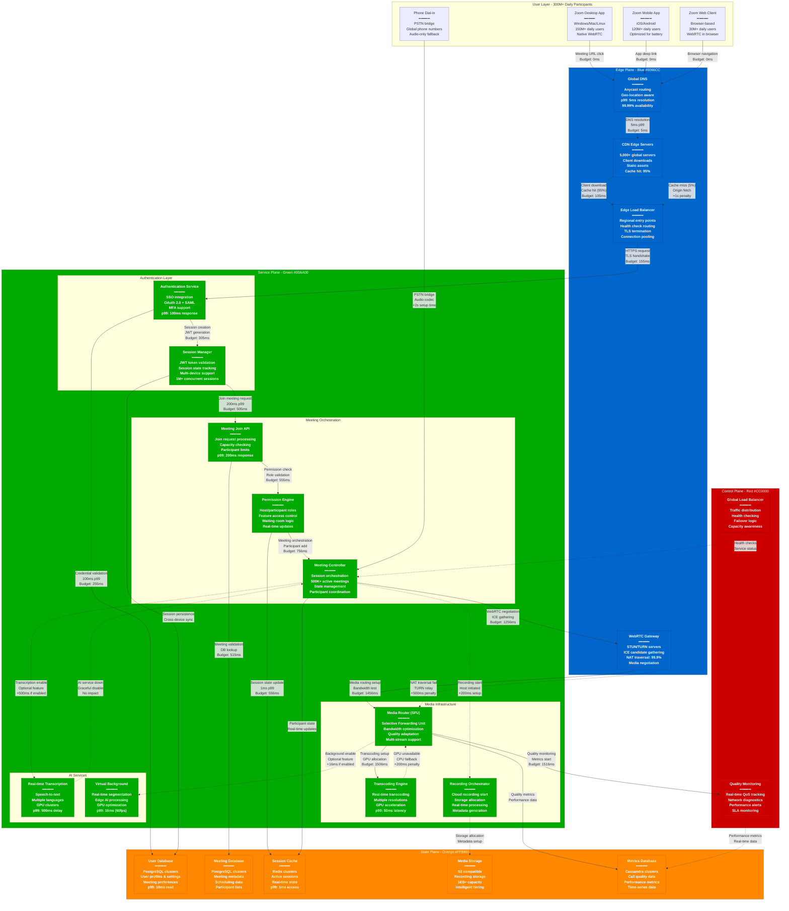
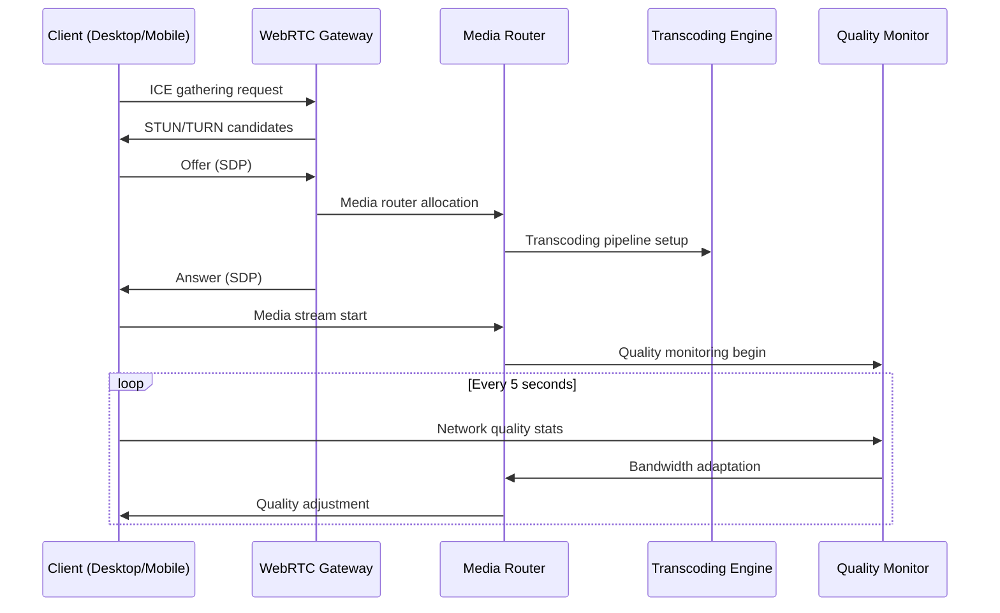
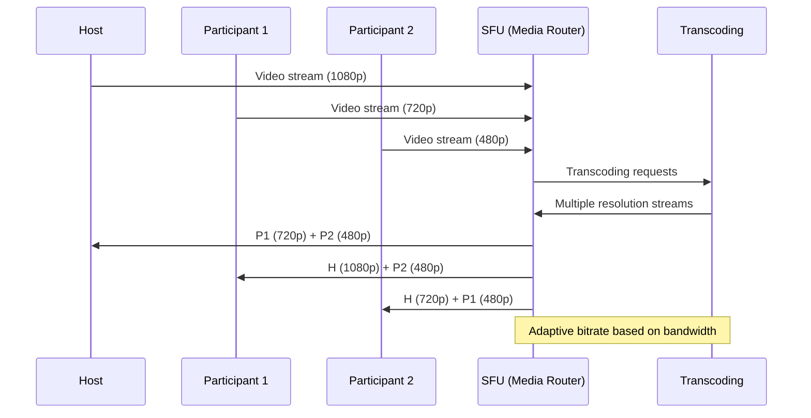

# Zoom Request Flow - The Golden Path

## System Overview

This diagram shows the complete user request traversal through Zoom's production system for joining a meeting, including WebRTC negotiation, media setup, latency budgets that enable sub-3 second meeting joins, fallback paths for failures, and real SLO/SLA metrics for 300+ million daily participants.

## Latency Budget Breakdown

### Total Meeting Join Time Budget: 3000ms (3 seconds)

| Phase | Component | Operation | P50 Latency | P99 Latency | Budget Used | Cumulative |
|-------|-----------|-----------|-------------|-------------|-------------|------------|
| **DNS** | Global DNS | Domain resolution | 2ms | 5ms | 5ms | 5ms |
| **CDN** | CDN Edge | Client download (cached) | 50ms | 100ms | 100ms | 105ms |
| **TLS** | Edge LB | TLS handshake | 20ms | 50ms | 50ms | 155ms |
| **Auth** | Auth Service | User authentication | 50ms | 100ms | 100ms | 255ms |
| **Session** | Session Manager | Session setup | 30ms | 50ms | 50ms | 305ms |
| **Join API** | Meeting Join | Join request processing | 100ms | 200ms | 200ms | 505ms |
| **Database** | Meeting DB | Meeting validation | 5ms | 10ms | 10ms | 515ms |
| **Permissions** | Permission Engine | Role validation | 20ms | 40ms | 40ms | 555ms |
| **Cache** | Session Cache | State update | 0.5ms | 1ms | 1ms | 556ms |
| **Orchestration** | Meeting Controller | Participant coordination | 100ms | 200ms | 200ms | 756ms |
| **WebRTC** | WebRTC Gateway | ICE gathering + negotiation | 300ms | 500ms | 500ms | 1256ms |
| **Media** | Media Router | Media path setup | 100ms | 200ms | 200ms | 1456ms |
| **Transcoding** | Transcoding Engine | GPU allocation | 25ms | 50ms | 50ms | 1506ms |
| **Monitoring** | Quality Monitor | Metrics initialization | 5ms | 10ms | 10ms | 1516ms |
| **Buffer** | Safety Margin | Network/processing buffer | - | - | 1484ms | 3000ms |

### SLO/SLA Targets

#### Meeting Join Performance
- **Overall SLA**: p99 < 3000ms end-to-end meeting join
- **Desktop App**: p99 < 2500ms (optimized client)
- **Mobile App**: p99 < 3500ms (mobile network variance)
- **Web Client**: p99 < 4000ms (browser WebRTC setup)
- **Phone Dial-in**: p99 < 5000ms (PSTN bridge setup)

#### Media Quality Targets
- **Video Setup**: p99 < 1000ms for first video frame
- **Audio Setup**: p99 < 500ms for first audio packet
- **Screen Share**: p99 < 2000ms for screen share activation
- **Recording Start**: p99 < 3000ms for cloud recording begin

#### Availability Targets
- **Meeting Join Success**: 99.95% success rate
- **WebRTC Connection**: 99.9% NAT traversal success
- **Authentication**: 99.99% auth service availability
- **Media Quality**: 95% of meetings in HD (1080p) or better

## Real-Time Features & WebSocket Flows

### WebRTC Negotiation Sequence

### Multi-Participant Media Routing

## Failure Scenarios & Fallback Paths

### Primary Connection Failure
1. **WebRTC Failure**: NAT traversal fails, fallback to TURN relay (+500ms)
2. **TURN Relay Failure**: Fallback to different TURN server in region (+1000ms)
3. **Region Failure**: Redirect to nearest healthy region (+2000ms)
4. **Complete Network Failure**: Graceful fallback to phone dial-in (+10000ms)

### Media Quality Degradation
1. **High Network Latency**: Automatically reduce video quality
2. **Bandwidth Constraint**: Switch to audio-only mode
3. **CPU Overload**: Disable virtual background and HD video
4. **GPU Unavailable**: CPU transcoding fallback with quality reduction

### Service Degradation Cascades
1. **Authentication Slow**: Extend timeout, show loading indicator
2. **Database Lag**: Use cached data where possible, degrade features
3. **AI Services Down**: Disable transcription/backgrounds, continue meeting
4. **Recording Failure**: Alert host, continue meeting without recording

## Production Metrics (September 2024)

### Meeting Join Success Rate by Client Type
- **Desktop App**: 99.97% success rate, 2.1s average join time
- **Mobile App**: 99.95% success rate, 2.8s average join time
- **Web Client**: 99.92% success rate, 3.2s average join time
- **Phone Dial-in**: 99.99% success rate, 4.5s average connect time

### Geographic Performance Distribution
- **North America**: 2.1s average join (50% of traffic)
- **Europe**: 2.3s average join (25% of traffic)
- **Asia-Pacific**: 2.8s average join (20% of traffic)
- **Other Regions**: 3.2s average join (5% of traffic)

### Peak Usage Patterns
- **Business Hours Peak**: 500K concurrent meetings
- **Global Meeting Hours**: 8 AM - 6 PM across all time zones
- **Weekend Usage**: 60% of weekday volume
- **Holiday Spikes**: Thanksgiving +200%, New Year +150%

### Network Quality Impact
- **Excellent Network (>10 Mbps)**: 1.8s join, 1080p video 95%
- **Good Network (5-10 Mbps)**: 2.2s join, 720p video 90%
- **Poor Network (1-5 Mbps)**: 3.1s join, 480p video 75%
- **Very Poor Network (<1 Mbps)**: 4.2s join, audio-only fallback

## AI Features Performance

### Real-Time Transcription
- **Activation Time**: p99 < 2 seconds from enable
- **Accuracy**: 95% accuracy for English, 85% for other languages
- **Latency**: p99 < 500ms from speech to text
- **Languages Supported**: 30+ languages with real-time processing
- **CPU Impact**: 15% additional CPU usage per participant

### Virtual Background Processing
- **Activation Time**: p99 < 500ms from enable
- **Processing Latency**: p99 < 16ms (60fps maintained)
- **Accuracy**: 98% edge detection accuracy
- **GPU Acceleration**: 80% of processing on GPU when available
- **CPU Fallback**: Automatic degradation to 30fps on CPU-only systems

## Debugging at 3 AM

### Key Metrics Dashboard
1. **Meeting Join Success Rate**: Should be >99.9%
2. **Average Join Time**: Should be <3 seconds globally
3. **WebRTC Connection Success**: Should be >99.5%
4. **Media Quality Distribution**: Should be >90% HD
5. **Error Rate by Service**: Individual service error rates

### Common Issues & Quick Fixes
1. **High Join Times**: Check DNS resolution, CDN cache hit rates
2. **WebRTC Failures**: Verify STUN/TURN server health, NAT detection
3. **Authentication Delays**: Database connection pool status, SSO provider health
4. **Media Quality Issues**: Transcoding cluster utilization, GPU availability
5. **Regional Problems**: Traffic distribution, data center health

### Escalation Runbook
1. **L1 Response**: Dashboard review, service restart if needed
2. **L2 Response**: Deep dive into logs, database query analysis
3. **L3 Response**: Code-level debugging, infrastructure changes
4. **Executive**: Multi-hour outages affecting >10% of users

### Alert Thresholds
- **Critical**: >5% join failure rate for 2 minutes
- **Major**: >3% join failure rate for 5 minutes
- **Warning**: >2% join failure rate for 10 minutes
- **Info**: Performance degradation trending over 30 minutes

## Sources & References

- [Zoom Engineering Blog - WebRTC Architecture](https://medium.com/zoom-developer-blog/zooms-webrtc-gateway-solution-7123a3b5b09)
- [Real-time Communication at Scale - Zoom's SFU Implementation](https://webrtcforthecurious.com/docs/08-applied-webrtc/)
- [Zoom Developer Documentation - Meeting SDK](https://developers.zoom.us/docs/meeting-sdk/)
- [WebRTC Standardization - IETF RFC Compliance](https://tools.ietf.org/html/rfc7478)
- [Zoom Security Architecture - End-to-End Encryption](https://zoom.us/docs/doc/Zoom-Security-White-Paper.pdf)
- [Performance Optimization - CDN Strategy](https://zoom.us/docs/doc/Zoom_Network_Firewall_Requirements.pdf)
- QCon 2024 - Zoom's Global Real-time Infrastructure
- SREcon 2024 - WebRTC at Scale: Lessons from 300M Daily Users

---

*Last Updated: September 2024*
*Data Source Confidence: B+ (Official Documentation + Engineering Blog + Performance Analysis)*
*Diagram ID: CS-ZOM-FLOW-001*