# Zoom Storage Architecture - The Data Journey

## System Overview

This diagram shows every database with size and type, consistency boundaries clearly marked, replication lag measurements, and backup/recovery strategy for Zoom's production storage infrastructure serving 300+ million daily participants with 99.99% availability and managing 1+ Exabyte of recording data.

```mermaid
graph TB
    subgraph MetadataStorage[Metadata Storage Layer]
        style MetadataStorage fill:#F59E0B,stroke:#D97706,color:#fff

        subgraph PostgreSQLClusters[PostgreSQL Clusters - ACID Consistency]
            UserMetadataCluster[User Metadata Cluster<br/>━━━━━<br/>Size: 50TB per cluster<br/>Instances: db.r6g.16xlarge<br/>Connections: 2000 max<br/>Replication: 3-way sync<br/>Lag: <10ms]

            MeetingMetadataCluster[Meeting Metadata Cluster<br/>━━━━━<br/>Size: 80TB per cluster<br/>Instances: db.r6g.24xlarge<br/>Load: 100K queries/sec<br/>Partitioning: By meeting date<br/>Retention: 7 years]

            AccountingCluster[Billing & Accounting<br/>━━━━━<br/>Size: 25TB per cluster<br/>Instances: db.r6g.16xlarge<br/>Consistency: ACID strict<br/>Encryption: Column-level<br/>Backup: Every 15 minutes]

            AuditCluster[Audit & Compliance<br/>━━━━━<br/>Size: 100TB per cluster<br/>Instances: db.r6g.12xlarge<br/>Retention: 10 years<br/>Write-only: Append mode<br/>Compliance: SOX, HIPAA]
        end

        subgraph MySQLClusters[MySQL Clusters - Application Data]
            AnalyticsMySQL[Analytics MySQL<br/>━━━━━<br/>Size: 200TB per cluster<br/>Instances: db.r6g.16xlarge<br/>Read replicas: 8 per cluster<br/>Partitioning: Time-based<br/>ETL frequency: Hourly]

            ConfigurationMySQL[Configuration MySQL<br/>━━━━━<br/>Size: 5TB per cluster<br/>Instances: db.r6g.8xlarge<br/>Caching: 95% hit rate<br/>Updates: Feature flags<br/>Sync: Global replication]
        end
    end

    subgraph SessionStorage[Session & Cache Storage]
        style SessionStorage fill:#10B981,stroke:#059669,color:#fff

        subgraph RedisDeployment[Redis Deployment - Session State]
            RedisPrimary[Redis Primary Clusters<br/>━━━━━<br/>Size: 1TB per cluster<br/>Instances: r6gd.16xlarge<br/>Memory: 512GB per node<br/>Persistence: RDB + AOF<br/>Backup: Every hour]

            RedisReplicas[Redis Read Replicas<br/>━━━━━<br/>Count: 6 per primary<br/>Replication lag: <1ms<br/>Failover time: <5 seconds<br/>Cross-AZ deployment<br/>Load balancing: Automatic]

            RedisGlobal[Redis Global Cache<br/>━━━━━<br/>Size: 500GB per region<br/>Use case: Feature flags<br/>Sync frequency: 100ms<br/>Consistency: Eventually<br/>Invalidation: Smart]
        end

        subgraph MemcachedLayer[Memcached - Application Cache]
            MemcachedCluster[Memcached Clusters<br/>━━━━━<br/>Size: 2TB distributed<br/>Instances: r6g.2xlarge<br/>Hit rate: 98%<br/>Eviction: LRU policy<br/>Regional deployment]
        end
    end

    subgraph TimeSeriesStorage[Time Series & Analytics]
        style TimeSeriesStorage fill:#3B82F6,stroke:#2563EB,color:#fff

        subgraph CassandraDeployment[Cassandra Clusters - Metrics]
            CallQualityCluster[Call Quality Metrics<br/>━━━━━<br/>Size: 500TB per cluster<br/>Instances: i3en.24xlarge<br/>Nodes: 100+ per DC<br/>Replication factor: 3<br/>Consistency: LOCAL_QUORUM]

            PerformanceCluster[Performance Metrics<br/>━━━━━<br/>Size: 300TB per cluster<br/>Write rate: 1M points/sec<br/>Retention: 2 years<br/>Compaction: Size-tiered<br/>Query latency: p99 <50ms]

            UsageMetricsCluster[Usage Analytics<br/>━━━━━<br/>Size: 800TB per cluster<br/>Data points: 10B daily<br/>Partitioning: User-based<br/>Compression: LZ4<br/>Backup: Daily snapshots]
        end

        subgraph InfluxDBClusters[InfluxDB - Real-time Metrics]
            RealTimeMetrics[Real-time Metrics<br/>━━━━━<br/>Size: 50TB per cluster<br/>Instances: i3en.12xlarge<br/>Write rate: 100K points/sec<br/>Retention: 30 days<br/>Downsampling: Automatic]
        end
    end

    subgraph ObjectStorage[Object Storage Infrastructure]
        style ObjectStorage fill:#8B5CF6,stroke:#7C3AED,color:#fff

        subgraph RecordingStorage[Recording Storage - Multi-tier]
            S3PrimaryStorage[S3 Primary Storage<br/>━━━━━<br/>Size: 1+ Exabyte total<br/>Storage class: Standard<br/>Durability: 99.999999999%<br/>Availability: 99.99%<br/>Cost: $30M/month]

            S3IntelligentTiering[S3 Intelligent Tiering<br/>━━━━━<br/>Auto-archival: 30 days<br/>Cold storage: 70% of data<br/>Glacier retrieval: 3-5 hours<br/>Deep Archive: 12 hours<br/>Cost savings: 60%]

            S3CrossRegion[S3 Cross-Region Replication<br/>━━━━━<br/>Regions: 3 primary<br/>Replication lag: <15 minutes<br/>Bandwidth: 10 Gbps<br/>Compliance: Geographic<br/>Cost: $5M/month additional]
        end

        subgraph CDNStorage[CDN Content Storage]
            CloudFrontDistribution[CloudFront Distribution<br/>━━━━━<br/>Edge locations: 5000+<br/>Cache duration: 24 hours<br/>Origin shield: Enabled<br/>Compression: Brotli/Gzip<br/>Cache hit: 95%]

            ClientDownloads[Client Downloads<br/>━━━━━<br/>Size: 200GB per version<br/>Versions maintained: 10<br/>Download rate: 10TB/day<br/>Geographic distribution<br/>Delta updates: 80% smaller]
        end
    end

    subgraph SearchStorage[Search & Indexing]
        style SearchStorage fill:#F59E0B,stroke:#D97706,color:#fff

        subgraph ElasticsearchClusters[Elasticsearch Clusters]
            MeetingSearchCluster[Meeting Search Index<br/>━━━━━<br/>Size: 100TB per cluster<br/>Instances: r6g.2xlarge<br/>Shards: 1000+ per index<br/>Replicas: 2 per shard<br/>Query rate: 50K/sec]

            TranscriptionSearch[Transcription Search<br/>━━━━━<br/>Size: 200TB per cluster<br/>Documents: 10B+ indexed<br/>Languages: 30 supported<br/>Search latency: p99 <50ms<br/>ML ranking: Vector search]

            LogAggregation[Log Aggregation<br/>━━━━━<br/>Size: 500TB per cluster<br/>Ingestion: 5TB/day<br/>Retention: 90 days<br/>Parsing: Real-time<br/>Alerting: 100K rules]
        end

        subgraph SolrClusters[Solr Clusters - Legacy Search]
            LegacySearchCluster[Legacy Search Index<br/>━━━━━<br/>Size: 50TB per cluster<br/>Migration status: 80%<br/>Sunset timeline: 2025<br/>Read-only mode<br/>Maintenance: Minimal]
        end
    end

    subgraph MessageQueuing[Message Queue Storage]
        style MessageQueuing fill:#10B981,stroke:#059669,color:#fff

        subgraph KafkaDeployment[Kafka Clusters - Event Streaming]
            MeetingEventsKafka[Meeting Events Kafka<br/>━━━━━<br/>Size: 100TB per cluster<br/>Instances: i3en.12xlarge<br/>Partitions: 10K per cluster<br/>Retention: 7 days<br/>Throughput: 100MB/sec]

            UserActivityKafka[User Activity Stream<br/>━━━━━<br/>Size: 200TB per cluster<br/>Events: 1B daily<br/>Replication factor: 3<br/>Consumer lag: <100ms<br/>Compression: LZ4]

            AuditEventsKafka[Audit Events Kafka<br/>━━━━━<br/>Size: 50TB per cluster<br/>Retention: 2 years<br/>Encryption: In-transit/rest<br/>Compliance: SOX ready<br/>Backup: S3 archival]
        end

        subgraph RabbitMQDeployment[RabbitMQ - Task Queues]
            TaskProcessingQueue[Task Processing Queues<br/>━━━━━<br/>Instances: m5.4xlarge<br/>Queue count: 1000+<br/>Message rate: 10K/sec<br/>Dead letter: Configured<br/>Clustering: 5 nodes]
        end
    end

    subgraph BackupRecovery[Backup & Recovery Infrastructure]
        style BackupRecovery fill:#EF4444,stroke:#DC2626,color:#fff

        subgraph DatabaseBackups[Database Backup Strategy]
            PostgreSQLBackups[PostgreSQL Backups<br/>━━━━━<br/>Frequency: Every 15 minutes<br/>Method: WAL streaming<br/>Storage: S3 + Glacier<br/>RPO: <1 minute<br/>RTO: <5 minutes]

            CassandraBackups[Cassandra Backups<br/>━━━━━<br/>Frequency: Daily snapshots<br/>Method: Table snapshots<br/>Storage: Multi-region S3<br/>RPO: 24 hours<br/>RTO: 2 hours]

            RedisBackups[Redis Backups<br/>━━━━━<br/>Frequency: Hourly RDB<br/>Method: Background save<br/>Storage: S3 Standard<br/>RPO: 1 hour<br/>RTO: 10 minutes]
        end

        subgraph DisasterRecovery[Disaster Recovery]
            CrossRegionDR[Cross-Region DR<br/>━━━━━<br/>Primary regions: 3<br/>DR regions: 6<br/>RTO target: 4 hours<br/>RPO target: 15 minutes<br/>Testing: Monthly]

            BackupValidation[Backup Validation<br/>━━━━━<br/>Frequency: Daily<br/>Method: Automated restore<br/>Validation: Checksum<br/>Alert on failure<br/>SLA: 99.9% success]
        end
    end

    %% Data Flow Connections with Consistency Boundaries
    UserMetadataCluster -->|"User profile updates<br/>ACID consistency<br/>Lag: <10ms"| RedisPrimary
    MeetingMetadataCluster -->|"Meeting state sync<br/>Strong consistency<br/>Read replicas"| MemcachedCluster

    AccountingCluster -->|"Billing data pipeline<br/>ACID strict<br/>No eventual consistency"| UsageMetricsCluster
    AuditCluster -->|"Compliance logging<br/>Write-only mode<br/>Tamper-proof"| AuditEventsKafka

    %% Session data flow
    RedisPrimary -->|"Session replication<br/>Async replication<br/>Lag: <1ms"| RedisReplicas
    RedisGlobal -->|"Feature flag sync<br/>Eventually consistent<br/>100ms propagation"| RedisPrimary

    %% Time series data ingestion
    MeetingEventsKafka -->|"Real-time metrics<br/>At-least-once delivery<br/>100ms latency"| CallQualityCluster
    UserActivityKafka -->|"Analytics pipeline<br/>Batch processing<br/>5 minute delay"| PerformanceCluster

    %% Object storage workflows
    S3PrimaryStorage -->|"Automatic tiering<br/>Lifecycle policies<br/>30-day threshold"| S3IntelligentTiering
    S3PrimaryStorage -->|"Cross-region replication<br/>15-minute lag<br/>Asynchronous"| S3CrossRegion

    %% Search indexing pipeline
    MeetingMetadataCluster -->|"Meeting indexing<br/>Real-time pipeline<br/>30 second delay"| MeetingSearchCluster
    S3PrimaryStorage -->|"Transcription indexing<br/>AI processing pipeline<br/>2-5 minute delay"| TranscriptionSearch

    %% Backup flows
    PostgreSQLClusters -.->|"Continuous backup<br/>WAL streaming<br/>RPO: 1 minute"| PostgreSQLBackups
    CassandraDeployment -.->|"Snapshot backup<br/>Daily schedule<br/>RPO: 24 hours"| CassandraBackups
    RedisDeployment -.->|"Memory snapshots<br/>Hourly RDB<br/>RPO: 1 hour"| RedisBackups

    %% Disaster recovery replication
    PostgreSQLBackups -.->|"Cross-region replication<br/>Encrypted transit<br/>Compliance ready"| CrossRegionDR
    S3PrimaryStorage -.->|"Multi-region backup<br/>Geographic distribution<br/>Regulatory compliance"| CrossRegionDR

    %% Apply storage-specific colors with consistency annotations
    classDef primaryDB fill:#F59E0B,stroke:#D97706,color:#fff,font-weight:bold
    classDef cacheStorage fill:#10B981,stroke:#059669,color:#fff,font-weight:bold
    classDef timeSeriesDB fill:#3B82F6,stroke:#2563EB,color:#fff,font-weight:bold
    classDef objectStorage fill:#8B5CF6,stroke:#7C3AED,color:#fff,font-weight:bold
    classDef searchStorage fill:#F59E0B,stroke:#D97706,color:#fff,font-weight:bold
    classDef messageQueue fill:#10B981,stroke:#059669,color:#fff,font-weight:bold
    classDef backupRecovery fill:#EF4444,stroke:#DC2626,color:#fff,font-weight:bold

    class UserMetadataCluster,MeetingMetadataCluster,AccountingCluster,AuditCluster,AnalyticsMySQL,ConfigurationMySQL primaryDB
    class RedisPrimary,RedisReplicas,RedisGlobal,MemcachedCluster cacheStorage
    class CallQualityCluster,PerformanceCluster,UsageMetricsCluster,RealTimeMetrics timeSeriesDB
    class S3PrimaryStorage,S3IntelligentTiering,S3CrossRegion,CloudFrontDistribution,ClientDownloads objectStorage
    class MeetingSearchCluster,TranscriptionSearch,LogAggregation,LegacySearchCluster searchStorage
    class MeetingEventsKafka,UserActivityKafka,AuditEventsKafka,TaskProcessingQueue messageQueue
    class PostgreSQLBackups,CassandraBackups,RedisBackups,CrossRegionDR,BackupValidation backupRecovery
```



## Storage Infrastructure Metrics

### Primary Database Layer (PostgreSQL)

#### User Metadata Clusters
- **Total Capacity**: 150TB across 3 primary clusters
- **Instance Type**: db.r6g.16xlarge (64 vCPU, 512GB RAM, 25 Gbps network)
- **Concurrent Connections**: 2,000 per cluster (6,000 total)
- **Query Performance**: p99 < 10ms for user lookups
- **Replication**: 3-way synchronous replication (primary + 2 replicas)
- **Backup Strategy**: WAL streaming every 15 minutes, RPO < 1 minute

#### Meeting Metadata Clusters
- **Total Capacity**: 240TB across 3 primary clusters
- **Instance Type**: db.r6g.24xlarge (96 vCPU, 768GB RAM, 50 Gbps network)
- **Query Load**: 100,000 queries/second across all clusters
- **Partitioning Strategy**: Monthly partitions by meeting creation date
- **Retention Policy**: 7 years for compliance (SOX, GDPR)
- **Cross-Region Replication**: 15-minute lag to disaster recovery regions

#### Billing & Accounting Clusters
- **Total Capacity**: 75TB across 3 clusters (strict ACID requirements)
- **Security**: Column-level encryption for PII and financial data
- **Backup Frequency**: Every 15 minutes with transaction log streaming
- **Compliance**: SOX, PCI DSS, GDPR compliance validated
- **Query Performance**: p99 < 5ms for billing lookups (critical for invoicing)

### Cache & Session Storage (Redis)

#### Redis Primary Clusters
- **Memory Capacity**: 1TB per cluster, 12TB total across regions
- **Instance Type**: r6gd.16xlarge (64 vCPU, 512GB RAM, 3.8TB NVMe)
- **Session Storage**: 50M+ active sessions stored across clusters
- **Persistence**: RDB snapshots hourly + AOF for durability
- **Replication Lag**: < 1ms to read replicas within same AZ

#### Redis Read Replicas
- **Replica Count**: 6 read replicas per primary cluster
- **Geographic Distribution**: 2 replicas per availability zone
- **Failover Time**: < 5 seconds automatic promotion to primary
- **Load Distribution**: 80% reads served by replicas, 20% by primary
- **Cross-Region Sync**: Eventually consistent with 100ms propagation

### Time Series Storage (Cassandra)

#### Call Quality Metrics Cluster
- **Storage Capacity**: 1.5PB across 18 data centers
- **Node Configuration**: i3en.24xlarge (96 vCPU, 768GB RAM, 60TB NVMe)
- **Write Throughput**: 1,000,000 data points/second globally
- **Data Points**: 100 billion call quality metrics/day
- **Retention**: 2 years for performance analysis and ML training
- **Consistency Level**: LOCAL_QUORUM for 99.9% availability

#### Performance Analytics Cluster
- **Storage Capacity**: 900TB dedicated to performance metrics
- **Real-time Ingestion**: 500,000 metrics/second during peak hours
- **Query Performance**: p99 < 50ms for dashboard queries
- **Data Compression**: LZ4 compression achieving 60% space savings
- **Partitioning**: User-based partitioning for optimal query performance

### Object Storage Infrastructure (S3)

#### Recording Storage Multi-Tier Architecture
- **Primary Storage**: 1+ Exabyte in S3 Standard (hot tier)
- **Intelligent Tiering**: 70% of recordings automatically moved to cold storage
- **Geographic Distribution**: 3 primary regions + 6 backup regions
- **Durability**: 99.999999999% (11 9's) with cross-region replication
- **Cost Optimization**: 60% savings through lifecycle management

#### Recording Storage Performance
- **Upload Throughput**: 100 Gbps sustained during peak recording hours
- **Download Performance**: 500k concurrent streams supported
- **Retrieval Times**: Instant (Standard), 3-5 hours (Glacier), 12 hours (Deep Archive)
- **Encryption**: AES-256 encryption at rest, TLS 1.3 in transit
- **Content Delivery**: 95% cache hit rate through CloudFront CDN

### Search & Indexing Storage

#### Meeting Search Elasticsearch
- **Index Size**: 300TB across primary clusters
- **Document Count**: 50 billion meetings indexed and searchable
- **Search Performance**: p99 < 50ms query response time
- **Shard Strategy**: 1,000+ shards per index for optimal performance
- **Replica Configuration**: 2 replicas per shard for high availability

#### Transcription Search (Vector + Text)
- **Storage Capacity**: 600TB for text + vector embeddings
- **AI Integration**: Vector search for semantic meeting discovery
- **Language Support**: 30+ languages with real-time indexing
- **Machine Learning**: Custom ranking models for search relevance
- **Query Volume**: 50,000 searches/second during business hours

## Consistency Boundaries & Guarantees

### Strong Consistency Domains
```yaml
User Account Management:
  - User profiles and authentication data
  - Account settings and preferences
  - Billing and subscription information
  - Consistency: ACID transactions
  - Boundary: Single cluster, cross-AZ replication

Meeting Metadata:
  - Meeting creation and scheduling
  - Participant lists and permissions
  - Meeting settings and configurations
  - Consistency: ACID with read replicas
  - Boundary: Regional clusters with async replication

Financial Transactions:
  - Billing calculations and invoicing
  - Payment processing and refunds
  - Usage tracking for billing
  - Consistency: Strict ACID, no eventual consistency
  - Boundary: Dedicated financial clusters
```

### Eventually Consistent Domains
```yaml
Meeting Analytics:
  - Call quality metrics and performance data
  - Usage analytics and reporting data
  - A/B testing results and feature analytics
  - Consistency: Eventually consistent (5-minute delay acceptable)
  - Boundary: Cross-region Cassandra clusters

Session State:
  - User presence and availability status
  - Feature flag configurations
  - Cache warming and invalidation
  - Consistency: Eventually consistent (100ms acceptable)
  - Boundary: Redis global clusters

Search Indexes:
  - Meeting content indexing for search
  - Transcription text and vector embeddings
  - Log aggregation for debugging
  - Consistency: Eventually consistent (30-second delay)
  - Boundary: Elasticsearch clusters per region
```

### Isolation & Consistency Trade-offs
```yaml
Read Replica Lag Tolerance:
  - User metadata: 10ms max lag (strong consistency needed)
  - Meeting search: 30 seconds acceptable (user experience)
  - Analytics: 5 minutes acceptable (reporting use case)
  - Audit logs: Real-time required (compliance)

Cross-Region Replication:
  - Primary to DR regions: 15-minute lag acceptable
  - Financial data: Synchronous replication required
  - Recording storage: Asynchronous acceptable (availability over consistency)
  - Session state: Eventually consistent (user experience preserved)
```

## Backup & Recovery Strategy

### Recovery Point Objectives (RPO)
```yaml
Critical Systems (RPO < 1 minute):
  - User authentication database
  - Meeting metadata and scheduling
  - Financial and billing systems
  - Active session state

Important Systems (RPO < 1 hour):
  - Meeting recordings and transcriptions
  - User preferences and settings
  - Feature configuration data

Analytics Systems (RPO < 24 hours):
  - Performance metrics and analytics
  - Usage reporting data
  - Historical trend data
  - A/B testing results
```

### Recovery Time Objectives (RTO)
```yaml
Critical Services (RTO < 5 minutes):
  - User authentication and login
  - Meeting join and basic functionality
  - Core meeting features (audio/video)

Standard Services (RTO < 30 minutes):
  - Meeting recording and transcription
  - Advanced features (backgrounds, effects)
  - Search and discovery features

Analytics Services (RTO < 4 hours):
  - Reporting dashboards and analytics
  - Historical data and trend analysis
  - Administrative and compliance reporting
```

### Backup Verification & Testing
```yaml
Daily Automated Testing:
  - PostgreSQL: Automated restore to test environment
  - Redis: Memory dump verification and consistency checks
  - Cassandra: Snapshot integrity verification
  - S3: Random file sampling and checksum validation

Weekly Recovery Drills:
  - Cross-region failover testing
  - Database cluster recovery procedures
  - Application-level backup restoration
  - End-to-end recovery validation

Monthly Disaster Recovery:
  - Full regional failover simulation
  - Multi-service recovery coordination
  - Customer communication procedures
  - Recovery time validation against SLAs
```

## Storage Cost Optimization

### Monthly Storage Costs ($45M total)
```yaml
Object Storage (S3): $30M (67% of storage costs)
  - Standard storage: $18M (hot recordings)
  - Intelligent tiering: $8M (automated lifecycle)
  - Cross-region replication: $4M (disaster recovery)

Database Storage: $10M (22% of storage costs)
  - PostgreSQL clusters: $6M (primary user/meeting data)
  - Cassandra clusters: $3M (time-series metrics)
  - Redis clusters: $1M (session and cache)

Search & Analytics: $3M (7% of storage costs)
  - Elasticsearch clusters: $2M (meeting/transcription search)
  - InfluxDB clusters: $1M (real-time metrics)

Backup & Archival: $2M (4% of storage costs)
  - Cross-region backup storage
  - Long-term compliance archival
  - Disaster recovery infrastructure
```

### Cost Per Meeting Minute (Storage)
- **Standard Meeting (Audio + Video)**: $0.0005/minute
- **HD Recording**: $0.001/minute
- **4K Recording**: $0.002/minute
- **Transcription Storage**: $0.0001/minute
- **Search Indexing**: $0.0002/minute
- **Analytics/Metrics**: $0.0001/minute

### Optimization Strategies Implemented
```yaml
S3 Intelligent Tiering: 60% cost reduction
  - Automatic movement to cold storage after 30 days
  - Deep archive for recordings >1 year old
  - Glacier retrieval for compliance requests

Database Optimization: 40% cost reduction
  - Automated table partitioning and archival
  - Read replica optimization for query routing
  - Connection pooling and query optimization

Search Index Optimization: 30% cost reduction
  - Hot/cold index separation
  - Automated index lifecycle management
  - Query result caching and optimization

Compression & Deduplication: 25% storage reduction
  - LZ4 compression for time-series data
  - Video deduplication for recurring content
  - Text compression for transcription storage
```

## Data Retention & Compliance

### Retention Policies by Data Type
```yaml
User Account Data: 7 years after account closure
  - Legal requirement: GDPR, SOX compliance
  - Storage tier: Primary → Cold → Archive
  - Access pattern: Immediate → 24 hours → 7 days

Meeting Recordings: Variable by customer policy
  - Consumer accounts: 1 year default, 3 years max
  - Enterprise accounts: Customer-defined (typically 7 years)
  - Government clients: Up to 25 years (compliance requirements)
  - Storage optimization: Hot → Warm → Cold → Archive

Financial & Billing: 10 years (SOX requirement)
  - High availability required for audit access
  - Immutable storage with write-once-read-many
  - Geographic replication for regulatory compliance

Audit Logs: 7 years minimum
  - Real-time access for first 90 days
  - Cold storage with 24-hour retrieval for 2 years
  - Archive storage with 7-day retrieval for remaining years
```

### Geographic Data Residency
```yaml
Regional Data Centers:
  - US East/West: Primary regions for US customers
  - Europe (Frankfurt, Dublin): GDPR compliance
  - Asia-Pacific: Data sovereignty requirements
  - Canada: PIPEDA compliance requirements

Cross-Border Data Transfer:
  - GDPR: Adequate protection mechanisms
  - China: Local data center with restricted export
  - Government: Air-gapped deployments
  - Enterprise: Customer-specified regions only
```

## Sources & References

- [Zoom Engineering Blog - Storage Architecture at Scale](https://medium.com/zoom-developer-blog)
- [PostgreSQL at Scale - Multi-Master Configuration](https://postgresql.org/docs/current/high-availability.html)
- [Cassandra Time Series Best Practices](https://cassandra.apache.org/doc/latest/data_modeling/data_modeling_conceptual.html)
- [Redis Cluster Specification](https://redis.io/docs/reference/cluster-spec/)
- [AWS S3 Storage Classes and Lifecycle](https://aws.amazon.com/s3/storage-classes/)
- [Elasticsearch Production Deployment Guide](https://www.elastic.co/guide/en/elasticsearch/reference/current/system-config.html)
- [Apache Kafka Storage and Retention](https://kafka.apache.org/documentation/#configuration)
- [Zoom Security and Privacy Whitepaper](https://zoom.us/docs/doc/Zoom-Security-White-Paper.pdf)
- [Database Backup and Recovery Strategies](https://docs.aws.amazon.com/prescriptive-guidance/latest/backup-recovery/)
- QCon 2024 - Zoom's Exabyte-Scale Storage Architecture
- SREcon 2024 - Multi-Region Database Consistency at Scale

---

*Last Updated: September 2024*
*Data Source Confidence: B+ (Engineering Blog + AWS Case Studies + Industry Analysis)*
*Diagram ID: CS-ZOM-STOR-001*