# Interactive Mermaid Diagram Templates

## Overview

This file contains production-ready Mermaid diagram templates with all interactive features enabled. Every template follows our 4-plane architecture with Tailwind-inspired colors and includes emojis for quick visual recognition.

## Color Scheme Reference

```css
/* Tailwind-Inspired Palette (Beautiful & Accessible) */
--edge-plane: #3B82F6;      /* Blue-500 */
--edge-stroke: #2563EB;     /* Blue-600 */

--service-plane: #10B981;   /* Emerald-500 */
--service-stroke: #059669;  /* Emerald-600 */

--state-plane: #F59E0B;     /* Amber-500 */
--state-stroke: #D97706;    /* Amber-600 */

--control-plane: #8B5CF6;   /* Violet-500 */
--control-stroke: #7C3AED;  /* Violet-600 */
```

## Template 1: Complete Production Architecture

```mermaid
%%{init: {'theme':'base', 'themeVariables': { 'fontSize': '16px'}}}%%
graph TB
    subgraph EdgePlane[🌐 Edge Plane]
        CDN[🚀 CloudFront CDN<br/>_____<br/>500 Tbps capacity<br/>410 PoPs globally<br/>Cost: $45K/month]
        WAF[🛡️ WAF<br/>_____<br/>10M req/s<br/>DDoS protection<br/>Cost: $8K/month]
        LB[⚖️ ALB<br/>_____<br/>Cross-zone enabled<br/>100K concurrent<br/>Cost: $3K/month]
    end

    subgraph ServicePlane[⚙️ Service Plane]
        APIGW[🔌 API Gateway<br/>_____<br/>Kong 3.4<br/>10K req/s per node<br/>20 nodes]
        AUTH[🔐 Auth Service<br/>_____<br/>JWT validation<br/>Redis session store<br/>p99: 5ms]
        ORDERS[📦 Order Service<br/>_____<br/>Java 17 / Spring<br/>c5.2xlarge x50<br/>Cost: $12K/month]
        INVENTORY[📊 Inventory Service<br/>_____<br/>Go 1.21<br/>c5.xlarge x30<br/>Cost: $6K/month]
    end

    subgraph StatePlane[💾 State Plane]
        RDS[(🗄️ RDS Aurora<br/>_____<br/>PostgreSQL 15<br/>db.r6g.8xlarge<br/>100K IOPS<br/>Cost: $18K/month)]
        REDIS[(⚡ ElastiCache<br/>_____<br/>Redis 7.0<br/>cache.r6g.2xlarge x6<br/>Cost: $8K/month)]
        S3[(☁️ S3 Storage<br/>_____<br/>500TB stored<br/>1B req/month<br/>Cost: $15K/month)]
        DDB[(📱 DynamoDB<br/>_____<br/>On-demand<br/>10M WCU peak<br/>Cost: $25K/month)]
    end

    subgraph ControlPlane[🎛️ Control Plane]
        MONITOR[📈 Datadog<br/>_____<br/>500K metrics/min<br/>30-day retention<br/>Cost: $15K/month]
        LOGS[📝 CloudWatch<br/>_____<br/>100TB/month<br/>7-day retention<br/>Cost: $5K/month]
        TRACE[🔍 X-Ray<br/>_____<br/>100M traces/month<br/>p99 sampling<br/>Cost: $2K/month]
    end

    %% Traffic flow with latencies
    CDN -->|p50: 2ms<br/>p99: 10ms| WAF
    WAF -->|p50: 1ms<br/>p99: 3ms| LB
    LB -->|p50: 5ms<br/>p99: 15ms| APIGW
    APIGW -->|p50: 1ms<br/>p99: 2ms| AUTH
    APIGW -->|p50: 10ms<br/>p99: 50ms| ORDERS
    APIGW -->|p50: 8ms<br/>p99: 30ms| INVENTORY

    %% Data connections
    AUTH --> REDIS
    ORDERS --> RDS
    ORDERS --> DDB
    INVENTORY --> RDS
    INVENTORY --> S3

    %% Monitoring connections
    APIGW -.->|metrics| MONITOR
    ORDERS -.->|logs| LOGS
    INVENTORY -.->|traces| TRACE

    %% Apply Tailwind colors
    classDef edgeStyle fill:#3B82F6,stroke:#2563EB,color:#fff
    classDef serviceStyle fill:#10B981,stroke:#059669,color:#fff
    classDef stateStyle fill:#F59E0B,stroke:#D97706,color:#fff
    classDef controlStyle fill:#8B5CF6,stroke:#7C3AED,color:#fff

    class CDN,WAF,LB edgeStyle
    class APIGW,AUTH,ORDERS,INVENTORY serviceStyle
    class RDS,REDIS,S3,DDB stateStyle
    class MONITOR,LOGS,TRACE controlStyle
```



## Template 2: Request Flow Diagram

```mermaid
%%{init: {'theme':'base', 'themeVariables': { 'fontSize': '16px'}}}%%
sequenceDiagram
    participant U as 👤 User
    participant CDN as 🚀 CDN<br/>(Edge)
    participant LB as ⚖️ Load Balancer<br/>(Edge)
    participant API as 🔌 API Gateway<br/>(Service)
    participant AUTH as 🔐 Auth Service<br/>(Service)
    participant APP as 📦 Application<br/>(Service)
    participant DB as 🗄️ Database<br/>(State)
    participant CACHE as ⚡ Cache<br/>(State)
    participant MON as 📈 Monitoring<br/>(Control)

    U->>+CDN: HTTPS Request<br/>p50: 2ms
    CDN->>+LB: Forward (if miss)<br/>p50: 5ms
    LB->>+API: Route Request<br/>p50: 1ms

    API->>+AUTH: Validate Token<br/>p50: 3ms
    AUTH->>+CACHE: Check Session<br/>p50: 1ms
    CACHE-->>-AUTH: Session Data
    AUTH-->>-API: Token Valid ✓

    API->>+APP: Process Request<br/>p50: 10ms
    APP->>+DB: Query Data<br/>p50: 15ms
    DB-->>-APP: Result Set

    APP->>+CACHE: Update Cache<br/>p50: 2ms
    CACHE-->>-APP: ACK

    APP-->>-API: Response Data
    API-->>-LB: HTTP 200 OK
    LB-->>-CDN: Response
    CDN-->>-U: Final Response<br/>Total p50: 44ms

    API-)MON: Emit Metrics<br/>Async

    Note over U,MON: Total Latency Budget: 100ms (p99)
    Note over CACHE,DB: Cache Hit Rate: 95%
    Note over API,AUTH: Auth Cache: 99.9%
```



## Template 3: Failure Domain Diagram

```mermaid
%%{init: {'theme':'base', 'themeVariables': { 'fontSize': '16px'}}}%%
graph TB
    subgraph Region1[🌍 Region: us-east-1]
        subgraph AZ1[⚡ AZ-1a - Primary]
            E1_LB[⚖️ ALB-1<br/>Health: ✅]
            E1_APP[📦 App Instances<br/>10 x c5.xlarge<br/>CPU: 45%]
            E1_DB[(🗄️ RDS Primary<br/>db.r6g.4xlarge<br/>Connections: 450/500)]
        end

        subgraph AZ2[⚡ AZ-1b - Secondary]
            E2_LB[⚖️ ALB-2<br/>Health: ✅]
            E2_APP[📦 App Instances<br/>10 x c5.xlarge<br/>CPU: 42%]
            E2_DB[(🗄️ RDS Standby<br/>db.r6g.4xlarge<br/>Lag: 50ms)]
        end

        subgraph AZ3[⚡ AZ-1c - Backup]
            E3_LB[⚖️ ALB-3<br/>Health: ✅]
            E3_APP[📦 App Instances<br/>5 x c5.xlarge<br/>CPU: 38%]
            E3_DB[(🗄️ Read Replica<br/>db.r6g.2xlarge<br/>Lag: 100ms)]
        end
    end

    subgraph FailureScenarios[💥 Failure Scenarios]
        F1[🔴 AZ Failure<br/>Impact: 33% capacity<br/>Recovery: 2 min<br/>Auto-failover]
        F2[🟠 DB Primary Failure<br/>Impact: Write unavailable<br/>Recovery: 30-60s<br/>Automatic promotion]
        F3[🟡 Network Partition<br/>Impact: Split brain risk<br/>Recovery: Manual<br/>Requires intervention]
    end

    E1_LB --> E1_APP
    E2_LB --> E2_APP
    E3_LB --> E3_APP

    E1_APP --> E1_DB
    E2_APP --> E2_DB
    E3_APP --> E3_DB

    E1_DB -.->|Sync Replication| E2_DB
    E2_DB -.->|Async Replication| E3_DB

    %% Apply colors
    classDef healthy fill:#10B981,stroke:#059669,color:#fff
    classDef warning fill:#F59E0B,stroke:#D97706,color:#fff
    classDef critical fill:#EF4444,stroke:#DC2626,color:#fff
    classDef info fill:#3B82F6,stroke:#2563EB,color:#fff

    class E1_LB,E2_LB,E3_LB,E1_APP,E2_APP,E3_APP healthy
    class E1_DB,E2_DB warning
    class F1,F2,F3 critical
    class E3_DB info
```



## Template 4: Scale Evolution Diagram

```mermaid
%%{init: {'theme':'base', 'themeVariables': { 'fontSize': '16px'}}}%%
graph LR
    subgraph Stage1[📱 Startup - 1K Users]
        S1_MONO[🏗️ Monolith<br/>_____<br/>1 x t3.medium<br/>Cost: $30/mo<br/>Simple deployment]
        S1_DB[(🗄️ PostgreSQL<br/>_____<br/>db.t3.small<br/>Cost: $25/mo<br/>100GB storage)]
    end

    subgraph Stage2[🚀 Growth - 10K Users]
        S2_LB[⚖️ ALB<br/>$20/mo]
        S2_APP[📦 App Servers<br/>_____<br/>3 x t3.large<br/>Cost: $200/mo<br/>Auto-scaling]
        S2_CACHE[⚡ Redis<br/>_____<br/>cache.t3.micro<br/>Cost: $15/mo]
        S2_DB[(🗄️ RDS<br/>_____<br/>db.t3.large<br/>Cost: $150/mo<br/>Multi-AZ)]
    end

    subgraph Stage3[🌟 Scale - 100K Users]
        S3_CDN[🚀 CloudFront<br/>$500/mo]
        S3_MS[⚙️ Microservices<br/>_____<br/>20 x c5.large<br/>Cost: $1,500/mo<br/>Kubernetes]
        S3_QUEUE[📬 SQS/Kinesis<br/>$200/mo]
        S3_DDB[(📱 DynamoDB<br/>_____<br/>On-demand<br/>Cost: $2,000/mo<br/>Auto-scale)]
    end

    subgraph Stage4[🏢 Enterprise - 1M Users]
        S4_GLOBAL[🌍 Multi-Region<br/>_____<br/>3 regions<br/>Cost: $50K/mo<br/>Global load balancing]
        S4_MESH[🕸️ Service Mesh<br/>_____<br/>Istio/Linkerd<br/>200 services<br/>Cost: $15K/mo]
        S4_DATA[💾 Data Platform<br/>_____<br/>Kafka + Spark<br/>100TB/day<br/>Cost: $30K/mo]
    end

    S1_MONO --> S1_DB
    S2_LB --> S2_APP --> S2_CACHE --> S2_DB
    S3_CDN --> S3_MS --> S3_QUEUE --> S3_DDB
    S4_GLOBAL --> S4_MESH --> S4_DATA

    Stage1 ==>|Growing Pains<br/>Response time >1s| Stage2
    Stage2 ==>|Need to Scale<br/>DB at 80% CPU| Stage3
    Stage3 ==>|Global Expansion<br/>Compliance needs| Stage4

    %% Apply evolutionary colors
    classDef startup fill:#10B981,stroke:#059669,color:#fff
    classDef growth fill:#3B82F6,stroke:#2563EB,color:#fff
    classDef scale fill:#F59E0B,stroke:#D97706,color:#fff
    classDef enterprise fill:#8B5CF6,stroke:#7C3AED,color:#fff

    class S1_MONO,S1_DB startup
    class S2_LB,S2_APP,S2_CACHE,S2_DB growth
    class S3_CDN,S3_MS,S3_QUEUE,S3_DDB scale
    class S4_GLOBAL,S4_MESH,S4_DATA enterprise
```



## Template 5: Cost Breakdown Diagram


## Template 6: Incident Timeline Diagram

```mermaid
%%{init: {'theme':'base', 'themeVariables': { 'fontSize': '16px'}}}%%
timeline
    title Production Incident - Database Overload - 2024-01-15

    02:30 : 🟢 Normal Operations
            : 5K req/s, p99: 50ms
            : All systems healthy

    02:45 : 🟡 First Alerts
            : p99 latency spike to 200ms
            : Database CPU at 85%

    03:00 : 🟠 Degradation
            : p99 exceeds 500ms
            : Connection pool exhausted
            : PagerDuty escalation

    03:15 : 🔴 Partial Outage
            : 30% requests failing
            : Database CPU at 100%
            : Incident commander assigned

    03:30 : 🔧 Mitigation Started
            : Enabled read replicas
            : Increased connection pool
            : Scaled compute tier

    03:45 : 🟡 Recovery Beginning
            : Error rate dropping
            : p99 down to 300ms
            : Cache warming initiated

    04:00 : 🟢 Service Restored
            : All metrics normal
            : Post-incident review scheduled
            : Customer notification sent
```

## Template 7: Deployment Pipeline

```mermaid
%%{init: {'theme':'base', 'themeVariables': { 'fontSize': '16px'}}}%%
graph TB
    subgraph Dev[👨‍💻 Development]
        CODE[📝 Code Commit<br/>Feature branch]
        PR[🔍 Pull Request<br/>Code review required]
        TEST[🧪 Unit Tests<br/>Coverage >80%]
    end

    subgraph CI[🔄 Continuous Integration]
        BUILD[🔨 Build<br/>Docker image<br/>2 min avg]
        SCAN[🔒 Security Scan<br/>Snyk/Trivy<br/>CVE check]
        INTEG[🔗 Integration Tests<br/>API contracts<br/>5 min avg]
    end

    subgraph CD[📦 Continuous Deployment]
        STAGE[🎭 Staging Deploy<br/>Canary 10%<br/>15 min bake]
        SMOKE[💨 Smoke Tests<br/>Critical paths<br/>2 min]
        PROD[🚀 Production Deploy<br/>Blue-Green<br/>Progressive 25/50/100%]
    end

    subgraph Monitor[📊 Monitoring]
        METRICS[📈 Metrics Check<br/>Error rate <0.1%<br/>p99 <100ms]
        ROLLBACK[⏮️ Auto Rollback<br/>If SLA breach<br/>30 sec trigger]
    end

    CODE --> PR --> TEST
    TEST --> BUILD --> SCAN --> INTEG
    INTEG --> STAGE --> SMOKE
    SMOKE --> PROD --> METRICS
    METRICS -.->|SLA Breach| ROLLBACK
    ROLLBACK -.->|Revert| STAGE

    %% Apply CI/CD colors
    classDef dev fill:#10B981,stroke:#059669,color:#fff
    classDef ci fill:#3B82F6,stroke:#2563EB,color:#fff
    classDef cd fill:#F59E0B,stroke:#D97706,color:#fff
    classDef monitor fill:#8B5CF6,stroke:#7C3AED,color:#fff

    class CODE,PR,TEST dev
    class BUILD,SCAN,INTEG ci
    class STAGE,SMOKE,PROD cd
    class METRICS,ROLLBACK monitor
```



## Usage Guidelines

### When Creating New Diagrams

1. **Always start with init theme**:
   ```mermaid
   %%{init: {'theme':'base', 'themeVariables': { 'fontSize': '16px'}}}%%
   ```

2. **Use consistent colors**:
   - Edge Plane: `#3B82F6` (fill) / `#2563EB` (stroke)
   - Service Plane: `#10B981` (fill) / `#059669` (stroke)
   - State Plane: `#F59E0B` (fill) / `#D97706` (stroke)
   - Control Plane: `#8B5CF6` (fill) / `#7C3AED` (stroke)

3. **Include emojis** for visual recognition:
   - 🌐 Edge Plane
   - ⚙️ Service Plane
   - 💾 State Plane
   - 🎛️ Control Plane

4. **Add production metrics**:
   - Always include p50/p99 latencies
   - Show actual resource specifications
   - Include cost information
   - Reference real instance types

5. **Test interactive features**:
   - Verify zoom works smoothly
   - Check pan functionality
   - Ensure fullscreen mode displays correctly
   - Test on both light and dark themes

## Validation Checklist

Before committing any diagram:

- [ ] Uses new Tailwind color palette
- [ ] Includes init theme configuration
- [ ] Has emojis for major components
- [ ] Shows real production metrics
- [ ] Includes cost information
- [ ] Specifies instance types/sizes
- [ ] Has proper color class definitions
- [ ] Minimum 500px height
- [ ] Tests pass with zoom/pan/fullscreen
- [ ] Readable in both light and dark modes