# Comprehensive Diagram Creation Strategy for Distributed Systems Atlas
## Deep Analysis and Implementation Plan

### Executive Summary

Based on thorough analysis of readonly-spec requirements, we need to create production-quality diagrams manually. See `/site/data/CENTRAL_METRICS.json` for current targets and progress. This document provides a practical, achievable strategy that balances quality with scale.

---

## 1. Current State Analysis

### Specifications Status (100% Complete)
- ✅ 18 Guarantees fully specified
- ✅ 20 Mechanisms documented with production examples
- ✅ 21 Patterns with real implementations
- ✅ 120+ Case studies identified
- ✅ Production metrics and incidents documented

### Gaps to Fill
- See `/site/data/CENTRAL_METRICS.json` for current progress
- ❌ No diagram tracking system
- ❌ No consistent creation workflow
- ❌ No data source pipeline for real metrics
- ❌ No quality validation process

---

## 2. Diagram Requirements Analysis

### Total Diagram Breakdown
> See `/site/data/CENTRAL_METRICS.json` for targets

| Category | Count | Priority | Effort/Diagram | Total Effort |
|----------|-------|----------|----------------|--------------|
| **Guarantees** | 108 (18×6) | P0 | 2 hours | 216 hours |
| **Mechanisms** | 120 (20×6) | P0 | 2 hours | 240 hours |
| **Patterns** | 105 (21×5) | P0 | 3 hours | 315 hours |
| **Case Studies** | 600 (75×8) | P1 | 4 hours | 2,400 hours |
| **Incidents** | 100 | P1 | 2 hours | 200 hours |
| **Performance** | 80 | P2 | 1 hour | 80 hours |
| **Migrations** | 60 | P2 | 3 hours | 180 hours |
| **Cost Analysis** | 60 | P2 | 1 hour | 60 hours |
| **TOTAL** | **1,233** | - | **2.9 avg** | **3,691 hours** |

**Reality Check**: 3,691 hours = 462 days @ 8hrs/day = **92 weeks for one person**

---

## 3. Practical Creation Strategy

### A. Prioritized Phasing (Make It Achievable)

#### Phase 1: Core Foundation (Week 1-4)
**Target: 60 diagrams (15/week)**
- Start with guarantees/mechanisms that appear most in case studies
- Focus on universal patterns (Consensus, Replication, Partitioning)
- Create reusable components

```yaml
Week 1: Linearizability (6) + Consensus Mechanism (6) = 12
Week 2: Eventual Consistency (6) + Replication (6) = 12
Week 3: Exactly Once (6) + Partitioning (6) = 12
Week 4: CQRS Pattern (5) + Event Sourcing (5) + Saga (5) = 15
```

#### Phase 2: High-Impact Case Studies (Week 5-12)
**Target: 160 diagrams (20/week)**
- Focus on 20 most-referenced systems
- 8 mandatory diagrams per system

```yaml
Priority Systems (used as examples throughout specs):
1. Netflix (Streaming, Chaos Engineering)
2. Uber (Geo-indexing, Real-time matching)
3. Stripe (Payment processing, Idempotency)
4. Discord (WebSocket scale, Elixir/Rust)
5. Kafka@LinkedIn (Stream processing)
```

#### Phase 3: Incidents & Lessons (Week 13-16)
**Target: 100 diagrams (25/week)**
- Real outages with timelines
- Recovery procedures
- Architecture improvements

```yaml
Must-Document Incidents:
- AWS S3 2017 (cascade failure)
- GitHub 2018 (24hr outage)
- Cloudflare 2020 (config overwhelm)
- Slack 2022 (5hr outage)
- Fastly 2021 (global CDN failure)
```

#### Phase 4: Expand Coverage (Week 17-24)
**Target: 200 diagrams (25/week)**
- Additional case studies
- Performance comparisons
- Migration paths

---

## 4. Critical Changes Needed to readonly-spec

### A. Add Diagram Tracking System

**Create: `../../readonly-spec/17-DIAGRAM-TRACKING.md`**
```yaml
diagram_registry:
  guarantees:
    linearizability:
      G-LIN-FL: {status: pending, assignee: null, pr: null}
      G-LIN-SQ: {status: pending, assignee: null, pr: null}

  mechanisms:
    consensus:
      M5-RAFT-FLOW: {status: complete, pr: #123, date: 2024-09-20}
      M5-RAFT-STATE: {status: in-progress, assignee: john}

  case_studies:
    netflix:
      CS-NFX-L0: {status: complete, verified: true, source: "Netflix Blog 2024"}
```

### B. Create Data Source Registry

**Create: `../../readonly-spec/18-PRODUCTION-DATA-SOURCES.md`**
```yaml
verified_metrics:
  netflix:
    users: 260M (Q2 2024)
    bandwidth: 200Tbps peak
    instances: 100K+ EC2
    cost_monthly: $30M (estimated)
    source_urls:
      - https://about.netflix.com/en/news/q2-2024
      - https://netflixtechblog.com/scaling-2024

  uber:
    trips_day: 25M (2024)
    requests_sec: 100M peak
    services: 4000+ microservices
    incidents:
      - 2023-Q2: Gossip storm at 10M req/s
    source_urls:
      - https://eng.uber.com/scaling-uber-2024
```

### C. Simplify Diagram Specifications with Interactive Features

**Update: `../../readonly-spec/02-DIAGRAM-SPECIFICATIONS-V3.md`**

Add practical templates with interactive features and new Tailwind-inspired colors:

```mermaid
%%{init: {'theme':'base', 'themeVariables': { 'fontSize': '16px'}}}%%
%% TEMPLATE: Production Architecture with Interactive Features
%% Note: Zoom, pan, and fullscreen enabled automatically
graph TB
    %% Edge Plane (Tailwind Blue-500)
    subgraph Edge["🌐 Edge Plane"]
        CDN["🚀 CDN<br/>_____<br/>REPLACE: Provider<br/>REPLACE: Capacity<br/>REPLACE: Cost"]
        LB["⚖️ Load Balancer<br/>_____<br/>REPLACE: Type<br/>REPLACE: Config<br/>REPLACE: Limits"]
    end

    %% Service Plane (Tailwind Emerald-500)
    subgraph Service["⚙️ Service Plane"]
        API["🔌 API Gateway<br/>_____<br/>REPLACE: Tech<br/>REPLACE: Throughput<br/>REPLACE: Latency"]
    end

    %% State Plane (Tailwind Amber-500)
    subgraph State["💾 State Plane"]
        DB[("🗄️ Database<br/>_____<br/>REPLACE: Type<br/>REPLACE: Instance<br/>REPLACE: IOPS")]
    end

    %% Control Plane (Tailwind Violet-500)
    subgraph Control["🎛️ Control Plane"]
        MON["📊 Monitoring<br/>_____<br/>REPLACE: Tool<br/>REPLACE: Metrics/sec<br/>REPLACE: Retention"]
    end

    %% Add actual metrics on edges
    CDN -->|REPLACE: p50 latency| LB
    LB -->|REPLACE: p99 latency| API
    API -->|REPLACE: queries/sec| DB
    DB -.->|metrics| MON

    %% Apply new Tailwind-inspired colors
    classDef edgeStyle fill:#3B82F6,stroke:#2563EB,color:#fff
    classDef serviceStyle fill:#10B981,stroke:#059669,color:#fff
    classDef stateStyle fill:#F59E0B,stroke:#D97706,color:#fff
    classDef controlStyle fill:#8B5CF6,stroke:#7C3AED,color:#fff

    class CDN,LB edgeStyle
    class API serviceStyle
    class DB stateStyle
    class MON controlStyle
```



---

## 5. Site Structure Changes Needed

### A. Create Diagram Organization Structure

```bash
site/docs/
├── diagrams/
│   ├── guarantees/
│   │   ├── linearizability/
│   │   │   ├── concept.md      # G-LIN-FL
│   │   │   ├── implementation.md # G-LIN-IM
│   │   │   └── failure.md      # G-LIN-FA
│   │   └── ...
│   ├── mechanisms/
│   │   ├── consensus/
│   │   │   ├── raft-flow.md    # M5-RAFT-FL
│   │   │   ├── raft-state.md   # M5-RAFT-ST
│   │   │   └── raft-deploy.md  # M5-RAFT-DP
│   │   └── ...
│   ├── case-studies/
│   │   ├── netflix/
│   │   │   ├── architecture.md  # CS-NFX-L0
│   │   │   ├── streaming.md     # CS-NFX-ST
│   │   │   ├── chaos.md         # CS-NFX-CH
│   │   │   └── incidents.md     # CS-NFX-IN
│   │   └── ...
│   └── incidents/
│       ├── aws-s3-2017.md
│       ├── github-2018.md
│       └── cloudflare-2020.md
```

### B. Update mkdocs.yml Navigation

```yaml
nav:
  - Home: index.md

  - Diagrams:
    - Overview: diagrams/index.md
    - Guarantees:
      - Linearizability: diagrams/guarantees/linearizability/index.md
      - Eventual Consistency: diagrams/guarantees/eventual/index.md
    - Mechanisms:
      - Consensus: diagrams/mechanisms/consensus/index.md
      - Replication: diagrams/mechanisms/replication/index.md
    - Case Studies:
      - Netflix: diagrams/case-studies/netflix/index.md
      - Uber: diagrams/case-studies/uber/index.md
    - Incidents:
      - AWS S3 2017: diagrams/incidents/aws-s3-2017.md
      - GitHub 2018: diagrams/incidents/github-2018.md
```

### C. Create Diagram Index Pages

**Create: `/site/docs/diagrams/index.md`**
```markdown
# Production Diagrams Atlas

## Navigation by Purpose

### "I have a production issue" → [Incidents](incidents/)
Real outages, timelines, and recovery procedures

### "I need to understand a concept" → [Guarantees](guarantees/)
Consistency models, availability patterns, durability

### "I need to implement something" → [Mechanisms](mechanisms/)
Consensus, replication, partitioning, caching

### "I need architecture examples" → [Case Studies](case-studies/)
Netflix, Uber, Stripe, Discord, and 70+ more

## Progress Tracker

| Category | Complete | Total | Progress |
|----------|----------|-------|----------|
| Guarantees | 0 | 108 | ⬜⬜⬜⬜⬜ 0% |
| Mechanisms | 0 | 120 | ⬜⬜⬜⬜⬜ 0% |
| Patterns | 0 | 105 | ⬜⬜⬜⬜⬜ 0% |
| Case Studies | 0 | 600 | ⬜⬜⬜⬜⬜ 0% |
| **TOTAL** | **0** | **933** | **0%** |
```

---

## 6. Data Collection Strategy

### A. Primary Sources (Verified 2024 Data)

```yaml
engineering_blogs:
  tier_1_required:  # Must mine these
    - Netflix Tech Blog
    - Uber Engineering
    - Stripe Engineering
    - Discord Engineering
    - LinkedIn Engineering

  tier_2_valuable:  # High quality sources
    - AWS Architecture Blog
    - Google Cloud Blog
    - Cloudflare Blog
    - GitHub Engineering
    - Slack Engineering

conferences_2024:
  - QCon London/SF/NY
  - KubeCon NA/EU
  - AWS re:Invent
  - Google Cloud Next
  - Kafka Summit

papers_2024:
  - USENIX ATC
  - SOSP
  - OSDI
  - NSDI
```

### B. Metrics Validation

Each production metric must have:
1. **Source URL** (engineering blog, conference talk)
2. **Date** (must be 2020 or later)
3. **Context** (peak vs average, region, conditions)

Example:
```yaml
netflix_bandwidth:
  value: 200Tbps
  context: Peak during "The Night Agent" release
  date: 2023-03-23
  source: https://about.netflix.com/en/news/the-night-agent
  verification: Cross-referenced with ISP reports
```

---

## 7. Quality Validation Checklist

### Every Diagram Must Pass

- [ ] **3 AM Test**: Would this help during an incident?
- [ ] **Real Data**: All metrics from verified sources
- [ ] **Proper Colors**: 4-plane Tailwind scheme (#3B82F6, #10B981, #F59E0B, #8B5CF6)
- [ ] **Interactive Features**: Zoom, pan, fullscreen tested
- [ ] **Visual Enhancements**: Emojis for quick recognition
- [ ] **Minimum Height**: At least 500px for readability
- [ ] **Cost Included**: $ amounts or resource counts
- [ ] **Latency Budgets**: p50, p99 on critical paths
- [ ] **Failure Modes**: What breaks and how
- [ ] **Instance Types**: Specific (r5.24xlarge not "large")
- [ ] **Timestamps**: When was this architecture current
- [ ] **Scale Metrics**: Users, RPS, data volume
- [ ] **Source Attribution**: Link to engineering blog/talk

---

## 8. Tooling Recommendations

### A. Mermaid Development

```bash
# Local preview setup
npm install -g @mermaid-js/mermaid-cli

# VS Code extensions
- Mermaid Preview
- Markdown Mermaid

# Online editors for quick iteration
- https://mermaid.live/
- https://mermaid-js.github.io/mermaid-live-editor/
```

### B. Diagram Validation Script

```python
# /site/scripts/validate_diagrams.py
def validate_diagram(content):
    # Updated with new Tailwind colors and interactive requirements
    checks = {
        'has_colors': all(c in content for c in ['#3B82F6', '#10B981', '#F59E0B', '#8B5CF6']),
        'has_stroke_colors': any(c in content for c in ['#2563EB', '#059669', '#D97706', '#7C3AED']),
        'has_emojis': any(e in content for e in ['🌐', '⚙️', '💾', '🎛️', '🚀', '📊']),
        'has_init_theme': '%%{init:' in content,  # Interactive features
        'has_metrics': any(m in content for m in ['req/s', 'ms', 'GB', 'TB']),
        'has_costs': '$' in content or 'Cost:' in content,
        'has_instances': any(i in content for i in ['xlarge', 'nodes', 'pods']),
        'has_source': 'Source:' in content or 'Reference:' in content,
        'uses_classDef': 'classDef' in content and 'Style' in content  # New style classes
    }
    return all(checks.values()), checks
```

---

## 9. Collaboration Model

### A. Diagram Assignment

```yaml
assignment_matrix:
  guarantees:
    owner: senior_engineer_1
    reviewers: [architect_1, sre_lead]

  mechanisms:
    owner: senior_engineer_2
    reviewers: [architect_1, platform_lead]

  case_studies:
    netflix: {owner: streaming_expert, reviewer: architect_1}
    uber: {owner: geo_expert, reviewer: architect_2}
    stripe: {owner: payments_expert, reviewer: security_lead}
```

### B. Review Process

1. **Self-check**: Validation checklist
2. **Peer review**: Technical accuracy
3. **Architect review**: Patterns and consistency
4. **SRE review**: Operational accuracy
5. **Final approval**: Matches production reality

---

## 10. MVP Approach (Realistic 30-Day Plan)

### Week 1-2: Foundation (30 diagrams)
- 3 key guarantees (Linearizability, Eventual, Exactly-Once)
- 3 key mechanisms (Consensus, Replication, Partitioning)
- 3 key patterns (CQRS, Event Sourcing, Saga)

### Week 3-4: Case Studies (40 diagrams)
- 5 systems × 8 diagrams
- Netflix, Uber, Stripe, Kafka, Discord

### Week 5-6: Incidents (30 diagrams)
- 10 major incidents × 3 diagrams each
- Focus on 2020-2024 outages

### Total MVP: 100 diagrams (enough to demonstrate value)

---

## 11. Long-term Sustainability

### A. Maintenance Model

```yaml
update_frequency:
  case_studies: Quarterly (architecture evolves)
  incidents: As they happen
  mechanisms: Annual (new techniques)
  guarantees: Stable (theory doesn't change)

verification:
  quarterly_review:
    - Check all source URLs still valid
    - Update metrics with latest data
    - Add new incidents
    - Refresh cost data
```

### B. Community Contribution

Enable external contributions:
1. Clear templates
2. Validation scripts
3. Source requirements
4. Review process
5. Attribution model

---

## 12. Critical Success Factors

### Must Have
1. **Real production data** (not theoretical)
2. **Consistent visual language** (4-plane colors)
3. **Incident focus** (learn from failures)
4. **Cost awareness** ($ amounts matter)
5. **Source attribution** (verifiable claims)

### Must Avoid
1. **Generic examples** (Service A → Database B)
2. **Outdated architectures** (pre-2020)
3. **Theoretical scenarios** (never run in production)
4. **Missing failure modes** (happy path only)
5. **Unverified metrics** (rumors and guesses)

---

## Conclusion

Creating 900+ production-quality diagrams is a massive undertaking. This strategy makes it achievable through:

1. **Ruthless prioritization** (MVP first, expand later)
2. **Practical templates** (copy-paste-modify workflow)
3. **Verified data sources** (engineering blogs, conferences)
4. **Quality gates** (validation checklists)
5. **Collaborative approach** (divide and conquer)

**Recommendation**: Start with 100-diagram MVP to prove value, then scale based on usage and feedback.

**Time to MVP**: 6 weeks with 2 people full-time
**Time to 900 diagrams**: 6 months with 4 people at 50% allocation