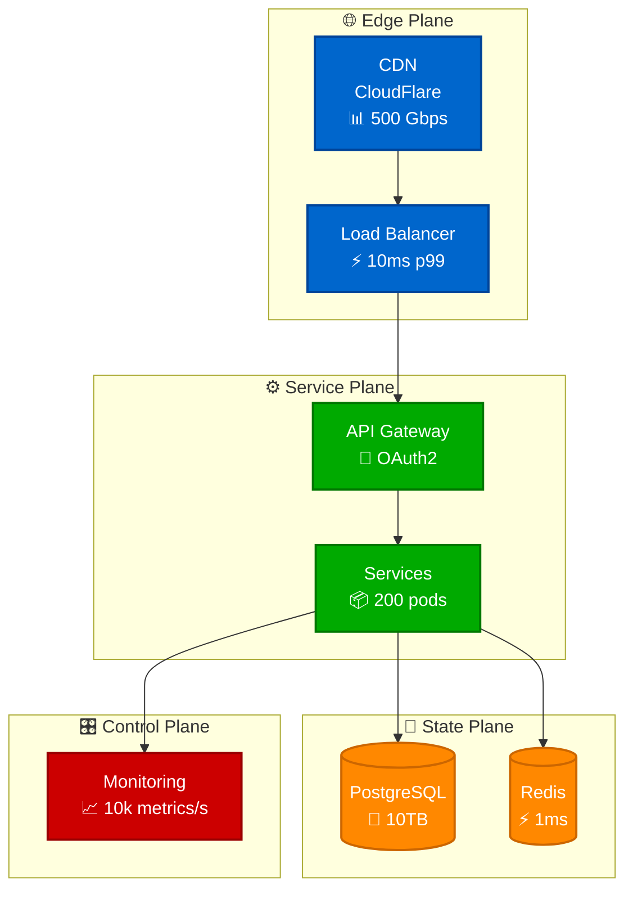

# Atlas Execution Guide

## 🎯 Mission: Generate Production-Quality Diagrams

This guide provides the practical execution workflow for the Atlas Distributed Systems Architecture Framework. We're building a comprehensive library of production-focused diagrams that help engineers debug issues at 3 AM.

## 📊 Current Status

> **📈 Live Metrics**: See `/site/data/CENTRAL_METRICS.json` for current status
>
> All metrics are centrally tracked. Run `python scripts/unified_status_tracker.py --dashboard` for latest.

> **⚠️ Important**: Due to significant spec changes (Stream Plane removal, visual-first approach), existing diagrams require review and updates. See [REVIEW_UPDATE_WORKFLOW.md](REVIEW_UPDATE_WORKFLOW.md) for the complete review process.

## 🚀 Quick Start

### 1. Check Unified Status
```bash
cd site
# Comprehensive dashboard with creation AND review status
python scripts/unified_status_tracker.py --dashboard

# Scan and update all diagram statuses
python scripts/unified_status_tracker.py --scan
```

### 2. Generate Weekly Checklist
```bash
python scripts/manual_source_discovery.py
# Creates: weekly-checklist.md
```

### 3. Create Diagrams Manually
```markdown
# Create diagrams directly in markdown files
# Add to appropriate docs/ subdirectory
# Use 4-plane architecture and real metrics
```

## 🔄 Dual-Track Workflow

We now operate a dual-track system to handle both updates and new creation:

### Track 1: Review & Update (40% effort)
- Review existing diagrams against new specs
- Fix Stream Plane references (4-plane architecture only)
- Convert to visual-first approach
- Add real production metrics

### Track 2: New Creation (60% effort)
- Continue toward 900 diagram target
- Follow latest specifications
- Ensure compliance from the start

## 📋 Weekly Workflow (2-3 Hours Total)

### Monday: Status Check & Planning (30 min)
1. Run unified status dashboard
2. Identify review priorities
3. Plan week's updates and creation
4. Generate source discovery checklist
5. **NEW**: Test interactive features on existing diagrams

### Wednesday: Dual-Track Execution (1 hour)
1. Create 10-15 diagrams from templates
2. Focus on one category (guarantees/mechanisms/patterns)
3. Validate against 4-plane architecture (NOT 5-plane)
4. Ensure all have SLO labels
5. **NEW**: Apply interactive design system:
   - Use standard color scheme (#0066CC, #00AA00, #FF8800, #CC0000)
   - Add clickable nodes where applicable
   - Include emojis for visual clarity (🌐, ⚙️, 💾, 🎛️)
   - Ensure minimum 400px height for zoom/pan

### Friday: Review & Commit (30 min)
1. Run unified status tracker
2. Validate all diagrams render correctly
3. **NEW**: Test interactive features:
   - Verify zoom/pan works (Ctrl+scroll, drag)
   - Check dark mode appearance
   - Test on mobile if applicable
4. Check file sizes (< 500KB)
5. Update review status for completed items
6. Commit and push changes

```bash
# Track both creation and review progress
python scripts/unified_status_tracker.py --dashboard

# Mark reviewed diagrams
python scripts/unified_status_tracker.py --mark-reviewed docs/systems/netflix/architecture.md
```

## 🗂️ File Organization

```
site/
├── docs/
│   ├── foundation/
│   │   ├── guarantees.md      # 18 guarantees × 10 diagrams = 180
│   │   ├── mechanisms.md      # 20 mechanisms × 10 diagrams = 200
│   │   └── primitives.md      # Core concepts
│   ├── patterns/
│   │   ├── system-patterns.md # 21 patterns × 10 diagrams = 210
│   │   ├── micro-patterns.md  # Implementation details
│   │   └── decision-engine.md # Decision trees
│   ├── examples/
│   │   ├── case-studies/      # 50+ case studies × 12 diagrams = 600+
│   │   ├── implementation/    # Real code examples
│   │   └── pitfalls/         # Anti-patterns
│   └── production/
│       ├── incidents/         # Real incident analyses
│       ├── migrations/        # Migration strategies
│       └── best-practices/    # Production wisdom
├── scripts/
│   ├── manual_source_discovery.py  # Find high-value content
│   ├── diagram_generator.py        # Generate Mermaid diagrams
│   └── progress_tracker.py         # Track progress
└── data/
    ├── sources/               # Source registry
    ├── case-studies/         # Case study YAML
    └── progress.json         # Progress tracking
```

## 🎨 Diagram Types & Templates (With Interactive Features)

### 1. Guarantee Flow Diagrams (180 total)
- Linearizability, Sequential Consistency, Eventual Consistency, etc.
- Show data flow through **4 planes** (Edge, Service, State, Control)
- Include SLO labels (p50, p99, p999)
- **Interactive**: Make critical paths clickable for details

### 2. Mechanism Detail Diagrams (200 total)
- Consistent Hashing, Gossip Protocol, Raft, etc.
- Implementation specifics
- Production metrics and configurations
- **Interactive**: Zoom in to see implementation details

### 3. Pattern Architecture Diagrams (210 total)
- CQRS, Event Sourcing, Saga, etc.
- Complete system views
- Scale indicators and trade-offs
- **Interactive**: Click nodes to navigate to related patterns

### 4. Case Study Diagrams (600+ total)
- Netflix, Uber, Discord, GitHub, etc.
- Real architectures with actual metrics
- Incident timelines and recovery
- **Interactive**: Pan across large architectures, fullscreen for presentations

### Interactive Diagram Template


## 📈 Progress Milestones

| Week | Target | Focus Area | Deliverables |
|------|--------|------------|--------------|
| 1-2 | 100 diagrams | Foundation | All guarantees, core mechanisms |
| 3-4 | 250 diagrams | Mechanisms | Complete mechanism library |
| 5-6 | 400 diagrams | Patterns | Core patterns documented |
| 7-8 | 600 diagrams | Case Studies | 10+ major case studies |
| 9-10 | 800 diagrams | Production | Incidents, migrations |
| 11-12 | 900-1200 | Polish | Fill gaps, optimize |

## 🔧 Manual Execution Scripts

### Source Discovery
```python
# Weekly checklist generation
python scripts/manual_source_discovery.py

# Evaluate a candidate
from scripts.manual_source_discovery import ManualSourceDiscovery
discovery = ManualSourceDiscovery()
result = discovery.evaluate_candidate(title, url, summary)
```

### Diagram Generation
```python
# Generate diagram batch
from scripts.diagram_generator import DiagramGenerator
gen = DiagramGenerator()

# Generate guarantee diagrams
guarantees = gen.generate_batch("guarantees", count=10)

# Generate case study
case_study = gen.generate_case_study_diagram(
    "Netflix",
    "Global Streaming",
    {"users": "238M", "rps": "10M", ...}
)
```

### Unified Status Tracking
```python
# Track both creation and review status
from scripts.unified_status_tracker import UnifiedStatusTracker
tracker = UnifiedStatusTracker()

# Scan all diagrams
results = tracker.scan_all_diagrams()

# Generate comprehensive dashboard
dashboard = tracker.generate_unified_dashboard()
print(dashboard)

# Export status report
tracker.export_status_report("json")
```

## 🏆 Quality Standards (Updated for Interactive Diagrams)

Every diagram MUST:
- ✅ Follow **4-plane architecture** (Edge, Service, State, Control - NO Stream Plane)
- ✅ Use correct color scheme:
  - Edge: #0066CC (Blue)
  - Service: #00AA00 (Green)
  - State: #FF8800 (Orange)
  - Control: #CC0000 (Red)
- ✅ Include SLO labels on edges (p50, p99, p999)
- ✅ Show real metrics from production
- ✅ Be under 500KB uncompressed
- ✅ Help debug production issues at 3 AM
- ✅ **NEW**: Support interactive features:
  - Zoomable (Ctrl+scroll)
  - Pannable (click & drag)
  - Clickable nodes for navigation
  - Mobile-friendly (pinch to zoom)
  - Dark mode compatible
- ✅ **NEW**: Include visual enhancements:
  - Emojis for clarity (🌐, ⚙️, 💾, 🎛️, 📊, ⚡, 💰)
  - Minimum 400px height
  - Rounded corners (rx:8)

## 📚 High-Value Sources

Priority sources for case studies (check weekly):

1. **Cloudflare Blog** - Edge computing, Workers, Durable Objects
2. **Discord Engineering** - Real-time messaging at scale
3. **Netflix Tech Blog** - Streaming, chaos engineering
4. **Shopify Engineering** - E-commerce flash sales
5. **GitHub Engineering** - Git at scale, incidents
6. **Anthropic Research** - AI infrastructure
7. **Stripe Engineering** - Payment processing
8. **Notion Blog** - Collaborative editing

## 🎯 Success Criteria

- **Quantity**: 900-1500 total diagrams
- **Quality**: All production-focused with real metrics
- **Coverage**: All guarantees, mechanisms, patterns documented
- **Case Studies**: 50+ real-world systems analyzed
- **Incidents**: 20+ production incidents documented
- **Timeline**: Complete in 12 weeks

## 🚦 Getting Started Today

1. **Hour 1**: Run all three scripts, review output
2. **Hour 2**: Create your first 5 diagrams using templates
3. **Hour 3**: Document one case study from weekly sources
4. **End of Day**: Commit 10+ new diagrams

## 📝 Notes

- **Frozen Reference**: All specs in `../../readonly-spec/` are frozen references
- **Direct Creation**: We create diagrams directly in markdown, no YAML pipelines
- **Manual Focus**: 2-3 hours/week manual effort is more effective than complex automation
- **Production First**: Every diagram must have production value

## 🔄 Continuous Improvement

Weekly retrospective questions:
1. Did we hit 20-30 diagrams this week?
2. Are diagrams helping with real debugging?
3. What patterns are we missing?
4. Which case studies have highest value?

---

*Remember: We're not building academic documentation. We're building production debugging tools that save engineers at 3 AM.*