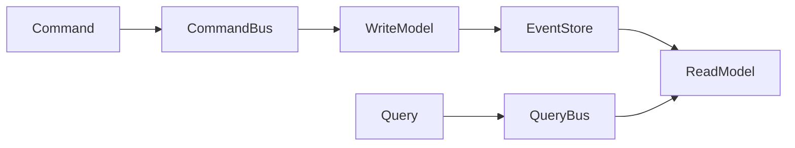

# Manual Workflow Guide - Atlas Project

## Overview

This guide adapts the automation concepts from `../../readonly-spec/` for manual execution. The focus is on **2-3 hours per week** of focused manual effort rather than complex automation.

## Key Adaptations from readonly-spec

### 1. Source Discovery (from 13-SOURCE-DISCOVERY-AUTOMATION.md)

**Original**: Complex RSS feed parsing, GitHub Actions, automated filtering
**Manual Adaptation**:
- Weekly checklist of 15-20 curated sources
- 30-minute manual review session
- Simple Python script for checklist generation
- Focus on quality over quantity (2-3 candidates/week)

### 2. Parallel Execution (from 10-PARALLEL-EXECUTION-PLAN.md)

**Original**: 15-20 agents working in parallel
**Manual Adaptation**:
- Single person can handle multiple diagram types
- Batch creation using templates
- Focus on one category per session
- 10-15 diagrams per hour using templates

### 3. Immediate Actions (from 11-IMMEDIATE-ACTION-PLANS.md)

**Original**: Agent-based task distribution
**Manual Adaptation**:
- Direct Mermaid in markdown (no YAML pipelines)
- Copy-paste templates for rapid creation
- Immediate preview in MkDocs serve

## Weekly Manual Workflow

### Monday Morning (30 minutes)
```bash
# 1. Check high-value sources
python scripts/manual_source_discovery.py
# Review: weekly-checklist.md

# 2. Pick 2-3 candidates
# Visit: Cloudflare, Discord, Netflix blogs
# Look for: Scale metrics, architecture details
```

### Wednesday Afternoon (1 hour)
```bash
# 1. Create diagrams manually
# Open relevant markdown files in docs/
# Add Mermaid diagrams directly

# 2. Create 10-15 diagrams
# Write directly in markdown files
# Use 4-plane architecture
# Include real production metrics
```

### Friday Evening (30 minutes)
```bash
# 1. Track progress
python scripts/progress_tracker.py

# 2. Review dashboard
# Check: velocity, coverage, quality

# 3. Commit changes
git add docs/
git commit -m "Add 20 production diagrams"
git push
```

## Source Discovery Without Automation

### High-Value Sources to Check Weekly

1. **Engineering Blogs** (10 minutes)
   - Cloudflare: Edge computing, Workers
   - Discord: Real-time messaging
   - Netflix: Streaming, chaos
   - Shopify: E-commerce scale

2. **Evaluation Criteria** (5 minutes per source)
   - Scale: 10M+ users, 100K+ RPS, 1TB+ data
   - Architecture: System diagrams present
   - Production: Real metrics, incidents
   - Diagram potential: 10-15 diagrams possible

3. **Quick Assessment**
   ```python
   # Manual evaluation
   - Title: "How Discord Stores Billions of Messages"
   - Scale: ✅ Billions of messages
   - Architecture: ✅ Cassandra, ScyllaDB details
   - Production: ✅ Real migration story
   - Priority: HIGH - Create case study
   ```

## Diagram Creation Without Complex Tools

### Direct Mermaid in Markdown

Instead of:
```yaml
# Complex YAML → Template → Mermaid pipeline
diagram:
  type: flow
  data: ...
  template: ...
```

We use:
```markdown
# Direct Mermaid in docs/patterns/cqrs.md
## CQRS Pattern


```

### Template-Based Generation

1. **Copy template** from `diagram_generator.py`
2. **Paste** into markdown file
3. **Customize** with real metrics
4. **Preview** with `mkdocs serve`
5. **Commit** when satisfied

## Progress Tracking Without Dashboards

### Simple Text-Based Tracking

```bash
# Run weekly
python scripts/progress_tracker.py

# Output:
╔══════════════════════════════════════════════════════════╗
║               ATLAS PROJECT DASHBOARD                     ║
╠══════════════════════════════════════════════════════════╣
║  Progress: [████████████        ] 60.0%
║  Diagrams:  720 / 1200 (Target: 900-1500)
║  Files:      72 with diagrams
╠══════════════════════════════════════════════════════════╣
║  Guarantees:    180 diagrams ✅
║  Mechanisms:    200 diagrams ✅
║  Patterns:      140 diagrams 🔵
║  Case Studies:  200 diagrams 🟡
╚══════════════════════════════════════════════════════════╝
```

### Manual Milestone Tracking

| Week | Target | Actual | Status |
|------|--------|--------|--------|
| 1 | 50 | 45 | 🟡 Close |
| 2 | 100 | 110 | ✅ Ahead |
| 3 | 150 | 155 | ✅ On track |
| 4 | 200 | - | ⏳ Upcoming |

## Case Study Creation Without Forms

### Manual Template Process

1. **Find high-value content** (10 min)
   - Check weekly sources
   - Look for scale indicators

2. **Create YAML manually** (5 min)
   ```yaml
   id: CS-DISCORD
   name: Discord
   scale:
     users: 140M
     messages: 4B+
   ```

3. **Generate diagrams** (15 min)
   - System overview
   - Data flow
   - Failure scenarios
   - 10-15 total per case

## Benefits of Manual Approach

### Simplicity
- No complex automation to maintain
- No CI/CD pipeline issues
- Direct control over quality

### Flexibility
- Adapt templates on the fly
- Focus on high-value areas
- Skip low-priority content

### Speed
- 10-15 diagrams per hour
- No waiting for builds
- Immediate preview

### Quality
- Human judgment on sources
- Curated content only
- Production focus maintained

## Frozen Reference Structure

The `../../readonly-spec/` folder remains as a frozen reference:

```
readonly-spec/
├── 00-MASTER-SPECIFICATION-V4-FINAL.md  # Philosophy
├── 02-DIAGRAM-SPECIFICATIONS-V3.md      # Requirements
├── 03-GUARANTEES-SPECIFICATIONS.md      # What to diagram
├── 04-MECHANISM-SPECIFICATIONS.md       # How to diagram
├── 05-PATTERN-SPECIFICATIONS.md         # Pattern library
├── 09-IMPLEMENTATION-ROADMAP.md         # Timeline
├── 10-PARALLEL-EXECUTION-PLAN.md        # Original automation
├── 11-IMMEDIATE-ACTION-PLANS.md         # Task templates
└── 13-SOURCE-DISCOVERY-AUTOMATION.md    # Source strategy
```

These files are **reference only** - all execution happens in `/site/`.

## Summary

- **Time**: 2-3 hours per week
- **Output**: 20-30 diagrams per week
- **Tools**: Simple Python scripts
- **Process**: Manual but systematic
- **Quality**: Production-focused
- **Goal**: 900-1500 diagrams in 12 weeks

The manual approach is **more effective** than complex automation for this project scale.