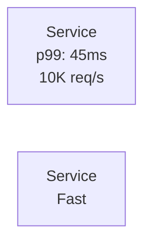

# Mermaid Interactive Implementation Guide

## Quick Start for Beautiful, Zoomable Diagrams

### ✅ Implementation Checklist

#### Prerequisites (Already Done)
- [x] Created `/site/docs/javascripts/mermaid-interactive.js`
- [x] Created `/site/docs/stylesheets/mermaid-beautiful.css`
- [x] Updated `mkdocs.yml` with configurations
- [x] Created style guide at `/site/docs/mermaid-style-guide.md`
- [x] Added design system spec at `/readonly-spec/20-MERMAID-DESIGN-SYSTEM.md`

#### Team Actions Required

##### 1. Test Locally (5 minutes)
```bash
cd site
make serve
# Navigate to http://127.0.0.1:8000/mermaid-style-guide
```

##### 2. Verify Interactive Features
- [ ] Test zoom with Ctrl/Cmd + scroll
- [ ] Test pan with click and drag
- [ ] Test double-click to reset
- [ ] Test F key for fullscreen
- [ ] Test on mobile with pinch gestures

##### 3. Apply to Existing Diagrams
No changes needed! All existing Mermaid diagrams automatically get the new features.

---

## Interactive Features Overview

### User Controls
| Action | Desktop | Mobile | Keyboard |
|--------|---------|--------|----------|
| **Zoom In** | Ctrl+Scroll Up | Pinch Out | + or = |
| **Zoom Out** | Ctrl+Scroll Down | Pinch In | - |
| **Pan** | Click & Drag | Touch & Drag | - |
| **Reset** | Double-click | Double-tap | 0 |
| **Fullscreen** | Button | Button | F |

### Automatic Features
- **Theme Switching**: Automatically adapts to light/dark mode
- **Lazy Loading**: Diagrams load only when visible
- **Responsive**: Adapts to screen size
- **Accessible**: Keyboard navigation and screen reader support

---

## How to Create Interactive Diagrams

### Standard Template with 4-Plane Architecture

```markdown
\`\`\`mermaid
graph TB
    subgraph EdgePlane["🌐 Edge Plane"]
        CDN["CDN<br/>CloudFlare<br/>📊 500 Gbps"]
        LB["Load Balancer<br/>⚡ 10ms p99"]
    end

    subgraph ServicePlane["⚙️ Service Plane"]
        API["API Gateway<br/>🔐 OAuth2"]
        SVC["Microservices<br/>📦 200 pods"]
    end

    subgraph StatePlane["💾 State Plane"]
        DB[("PostgreSQL<br/>💽 10TB")]
        CACHE[("Redis<br/>⚡ 1ms")]
    end

    subgraph ControlPlane["🎛️ Control Plane"]
        MON["Monitoring<br/>📈 10k metrics/s"]
        LOG["Logging<br/>📝 1TB/day"]
    end

    CDN --> LB --> API --> SVC
    SVC --> DB
    SVC --> CACHE
    SVC --> MON
    SVC --> LOG

    classDef edgeStyle fill:#0066CC,stroke:#004499,color:#fff,stroke-width:2px
    classDef serviceStyle fill:#00AA00,stroke:#007700,color:#fff,stroke-width:2px
    classDef stateStyle fill:#FF8800,stroke:#CC6600,color:#fff,stroke-width:2px
    classDef controlStyle fill:#CC0000,stroke:#990000,color:#fff,stroke-width:2px

    class CDN,LB edgeStyle
    class API,SVC serviceStyle
    class DB,CACHE stateStyle
    class MON,LOG controlStyle
\`\`\`
```

### Making Nodes Clickable

Add click handlers for documentation links:

```markdown
\`\`\`mermaid
graph TB
    API["API Gateway<br/>Click for docs"]
    DB[("Database<br/>Click for schema")]

    API --> DB

    click API "https://docs.example.com/api" "API Documentation"
    click DB "https://docs.example.com/db" "Database Schema"
\`\`\`
```

---

## Color System Quick Reference

### Production 4-Plane Colors

| Plane | Color (Light) | Color (Dark) | Components |
|-------|---------------|--------------|------------|
| **Edge** | `#0066CC` | `#64B5F6` | CDN, WAF, LB |
| **Service** | `#00AA00` | `#66BB6A` | API, Services |
| **State** | `#FF8800` | `#FFB74D` | DB, Cache |
| **Control** | `#CC0000` | `#EF5350` | Monitoring |

### Apply Colors in Diagrams

```mermaid
classDef edgeStyle fill:#0066CC,stroke:#004499,color:#fff
classDef serviceStyle fill:#00AA00,stroke:#007700,color:#fff
classDef stateStyle fill:#FF8800,stroke:#CC6600,color:#fff
classDef controlStyle fill:#CC0000,stroke:#990000,color:#fff
```

---

## Best Practices for Interactive Diagrams

### 1. Always Include Real Metrics


### 2. Use Emojis for Visual Clarity
- 🌐 Network/Edge
- ⚙️ Services
- 💾 Storage
- 🎛️ Control
- 📊 Metrics
- ⚡ Performance
- 💰 Cost
- 🔐 Security

### 3. Size Guidelines
- **Min height**: 400px (automatic)
- **Max nodes**: 50 per diagram (for performance)
- **Font size**: 14px minimum
- **Node spacing**: 20px minimum

### 4. Mobile Optimization
- Test pinch-to-zoom on mobile
- Ensure text is readable at default zoom
- Keep diagrams under 2000px wide

---

## Troubleshooting

### Diagrams Not Interactive?

1. **Check JavaScript Console**
   ```bash
   # In browser, open Developer Tools (F12)
   # Check Console tab for errors
   ```

2. **Verify Files Loaded**
   - Check Network tab for:
     - `mermaid-interactive.js` (200 OK)
     - `mermaid-beautiful.css` (200 OK)

3. **Clear Cache**
   ```bash
   # Force refresh
   Ctrl+Shift+R (Windows/Linux)
   Cmd+Shift+R (Mac)
   ```

4. **Test in Different Browser**
   - Chrome/Edge: Full support
   - Firefox: Full support
   - Safari: Full support (iOS touch events)

### Performance Issues?

1. **Reduce Diagram Complexity**
   - Split large diagrams (>50 nodes)
   - Use subgraphs for organization

2. **Enable Lazy Loading**
   - Already configured automatically
   - Diagrams load when scrolled into view

3. **Check Browser Performance**
   ```javascript
   // In console, check render time
   console.time('render');
   // Scroll to diagram
   console.timeEnd('render');
   // Should be <500ms
   ```

---

## Weekly Integration Tasks

### Monday - Review & Plan
- [ ] Review new diagrams created last week
- [ ] Ensure all follow 4-plane color scheme
- [ ] Test interactive features on new diagrams

### Tuesday-Thursday - Implementation
- [ ] Apply standard templates to new diagrams
- [ ] Add clickable links where applicable
- [ ] Include real production metrics

### Friday - Quality Check
- [ ] Test all diagrams on mobile
- [ ] Verify dark mode appearance
- [ ] Check accessibility (keyboard nav)
- [ ] Update style guide with new patterns

---

## Metrics to Track

### User Experience
- **Zoom usage**: Track in analytics
- **Fullscreen usage**: Monitor engagement
- **Mobile vs Desktop**: Optimize for majority

### Performance
- **Initial load time**: Target <500ms
- **Interaction response**: Target <16ms (60fps)
- **Memory usage**: Monitor for leaks

### Quality
- **Color consistency**: 100% using 4-plane
- **Metrics included**: 100% with real data
- **Mobile friendly**: 100% responsive

---

## Quick Commands

### Test Locally
```bash
cd site
make serve
open http://127.0.0.1:8000/mermaid-style-guide
```

### Build for Production
```bash
cd site
make build
# Output in site/site/
```

### Deploy to GitHub Pages
```bash
cd site
make deploy
```

### Validate Diagrams
```bash
python scripts/validate_mermaid.py
```

---

## Support & Resources

### Documentation
- **Design System**: `/readonly-spec/20-MERMAID-DESIGN-SYSTEM.md`
- **Style Guide**: `/site/docs/mermaid-style-guide.md`
- **JavaScript Source**: `/site/docs/javascripts/mermaid-interactive.js`
- **CSS Source**: `/site/docs/stylesheets/mermaid-beautiful.css`

### Help
- Browser compatibility issues → Test in Chrome first
- Performance problems → Reduce diagram complexity
- Styling issues → Check CSS variables in dark/light mode
- Interactive features not working → Check JavaScript console

---

*Last Updated: Interactive Mermaid v2.0 - Full zoom/pan support with beautiful styling*