# Quality Gates Framework
## Ensuring Every Diagram is Production-Ready

### 🎯 The Four-Gate System

Every diagram must pass through four quality gates before publication:


---

## 🔍 Gate 1: Technical Review

### Purpose
Ensure diagram is syntactically correct and renders properly.

### Automated Checks
```python
def technical_review(diagram):
    """Gate 1: Technical validation"""
    checks = {
        'syntax_valid': validate_mermaid_syntax(diagram),
        'renders_quickly': render_time < 2000,  # ms
        'file_size_ok': file_size < 500,  # KB
        'colors_correct': uses_five_plane_colors(diagram),
        'no_placeholders': not contains_lorem_ipsum(diagram)
    }
    return all(checks.values()), checks
```

### Checklist
- [ ] **Mermaid Syntax**: Valid and renders without errors
- [ ] **Performance**: Renders in <2 seconds
- [ ] **Size**: File <500KB uncompressed
- [ ] **Colors**: Uses correct 5-plane architecture colors
- [ ] **Formatting**: Proper indentation and structure

### Common Failures
```yaml
failures:
  - issue: "Syntax error in Mermaid"
    fix: "Validate at mermaid.live before submitting"

  - issue: "Wrong color codes"
    fix: "Use exactly: #0066CC, #00AA00, #AA00AA, #FF8800, #CC0000"

  - issue: "File too large"
    fix: "Simplify diagram or split into multiple"
```

---

## 📊 Gate 2: Production Review

### Purpose
Verify all data is real, current, and properly attributed.

### Validation Requirements
```yaml
production_requirements:
  metrics:
    - has_real_values: true  # No placeholders
    - includes_units: true   # ms, req/s, GB
    - specifies_percentiles: true  # p50, p99
    - dated_within: 24  # months

  sources:
    - has_attribution: true
    - includes_url: true
    - specifies_access_date: true
    - from_credible_source: true

  configuration:
    - specific_instances: true  # r5.4xlarge, not "large"
    - actual_settings: true  # pool_size: 100, not "many"
    - real_limits: true  # 10,000 connections max
```

### Checklist
- [ ] **Real Metrics**: All numbers from production systems
- [ ] **Current Data**: Sources <24 months old
- [ ] **Attribution**: Every metric has source URL
- [ ] **Specific Configs**: Instance types, settings specified
- [ ] **No Examples**: Zero placeholder/example data

### Verification Script
```python
def production_review(diagram):
    """Gate 2: Production data validation"""

    # Extract all metrics
    metrics = extract_metrics(diagram)

    for metric in metrics:
        # Check for placeholder patterns
        if any(word in metric for word in ['example', 'placeholder', 'TODO']):
            return False, f"Placeholder found: {metric}"

        # Verify source attribution
        if not has_source_url(metric):
            return False, f"No source for: {metric}"

        # Check data freshness
        if is_older_than_months(metric.source_date, 24):
            return False, f"Stale data: {metric}"

    return True, "All production data verified"
```

---

## 🚨 Gate 3: Operational Review (The 3 AM Test)

### Purpose
Ensure diagram helps with actual production debugging.

### The 3 AM Test Questions
```yaml
must_answer_one:
  emergency:
    - "Where do I look when service is down?"
    - "What metrics indicate the problem?"
    - "How do I trace this error?"

  diagnosis:
    - "Is this a known failure pattern?"
    - "What's the dependency chain?"
    - "Where's the bottleneck?"

  recovery:
    - "What's the recovery sequence?"
    - "How do I safely roll back?"
    - "What's the blast radius?"
```

### Checklist
- [ ] **Debugging Value**: Helps diagnose production issues
- [ ] **Failure Modes**: Shows what breaks and how
- [ ] **Recovery Paths**: Indicates fix procedures
- [ ] **Monitoring Links**: References dashboards/alerts
- [ ] **Runbook Integration**: Links to operational procedures

### Operational Scoring
```python
def operational_review(diagram):
    """Gate 3: Operational utility validation"""

    score = 0
    max_score = 100

    # Debugging value (40 points)
    if shows_error_paths(diagram):
        score += 20
    if includes_debug_commands(diagram):
        score += 20

    # Failure modes (30 points)
    if documents_failure_modes(diagram):
        score += 15
    if shows_recovery_procedures(diagram):
        score += 15

    # Monitoring (30 points)
    if references_metrics(diagram):
        score += 15
    if links_to_dashboards(diagram):
        score += 15

    passed = score >= 70  # 70% minimum
    return passed, f"Operational score: {score}/{max_score}"
```

---

## 🏗️ Gate 4: Architectural Review

### Purpose
Ensure consistency with overall system architecture and patterns.

### Review Criteria
```yaml
architectural_requirements:
  consistency:
    - follows_established_patterns: true
    - uses_standard_terminology: true
    - aligns_with_other_diagrams: true

  completeness:
    - shows_all_dependencies: true
    - includes_scale_limits: true
    - documents_constraints: true

  accuracy:
    - technically_correct: true
    - reflects_current_architecture: true
    - validated_by_domain_expert: true
```

### Checklist
- [ ] **Pattern Compliance**: Follows documented patterns
- [ ] **Dependency Accuracy**: All dependencies shown
- [ ] **Scale Limits**: Capacity boundaries identified
- [ ] **Cost Awareness**: Infrastructure costs included
- [ ] **Expert Validated**: Reviewed by domain expert

### Architectural Validation
```python
def architectural_review(diagram, context):
    """Gate 4: Architectural consistency validation"""

    issues = []

    # Check pattern compliance
    if not follows_pattern(diagram, context.pattern_library):
        issues.append("Doesn't follow standard patterns")

    # Verify dependencies
    missing_deps = find_missing_dependencies(diagram, context.system_map)
    if missing_deps:
        issues.append(f"Missing dependencies: {missing_deps}")

    # Check terminology
    non_standard = find_non_standard_terms(diagram, context.glossary)
    if non_standard:
        issues.append(f"Non-standard terms: {non_standard}")

    passed = len(issues) == 0
    return passed, issues
```

---

## 📋 Gate Review Process

### Submission Workflow

```mermaid
sequenceDiagram
    participant Author
    participant System
    participant Reviewer
    participant Expert

    Author->>System: Submit diagram + metadata
    System->>System: Gate 1: Technical validation
    System-->>Author: Technical issues (if any)

    System->>Reviewer: Gate 2: Production review
    Reviewer->>Reviewer: Verify sources & data
    Reviewer-->>System: Production approval

    System->>Reviewer: Gate 3: Operational review
    Reviewer->>Reviewer: Apply 3 AM test
    Reviewer-->>System: Operational approval

    System->>Expert: Gate 4: Architecture review
    Expert->>Expert: Validate patterns & accuracy
    Expert-->>System: Architecture approval

    System->>System: All gates passed
    System-->>Author: ✅ Approved for publication
```


### Review SLA
```yaml
review_timeline:
  gate_1_technical:
    automated: immediate

  gate_2_production:
    target: 4 hours
    max: 24 hours

  gate_3_operational:
    target: 8 hours
    max: 48 hours

  gate_4_architectural:
    target: 24 hours
    max: 72 hours

  total_review_time:
    target: 2 days
    max: 5 days
```

---

## 🚫 Automatic Rejection Criteria

Diagrams are automatically rejected for:

### Critical Failures
1. **Placeholder data** (example.com, localhost, TODO)
2. **No source attribution** for metrics
3. **Wrong color scheme** for architecture planes
4. **Syntax errors** preventing rendering
5. **File size** >500KB

### Quality Failures
1. **No debugging value** (fails 3 AM test completely)
2. **Outdated information** (>24 months old)
3. **Incorrect architecture** (wrong patterns/dependencies)
4. **Missing failure modes** (only happy path)
5. **No operational context** (no metrics/monitoring)

---

## 📊 Quality Metrics Dashboard

### Track Quality Over Time
```yaml
quality_metrics:
  weekly:
    - first_pass_rate: "% passing all gates first try"
    - revision_count: "Average revisions per diagram"
    - review_time: "Average time through gates"

  monthly:
    - gate_failure_distribution:
        gate_1: "15%"  # Technical issues
        gate_2: "35%"  # Production data issues
        gate_3: "40%"  # Operational value issues
        gate_4: "10%"  # Architectural issues

  quarterly:
    - quality_trend: "Improving/stable/declining"
    - reviewer_feedback: "Common issues"
    - process_improvements: "Gate adjustments"
```

---

## 🏆 Quality Excellence

### Gold Standard Examples
Diagrams that score 95%+ on all gates:
- Clear debugging paths
- Real production metrics with sources
- Failure modes and recovery
- Consistent architecture
- Helps at 3 AM

### Hall of Shame
Common quality failures to avoid:
- "Example Service A → Database B"
- Metrics without sources
- Happy path only
- Academic architecture without operational context
- Beautiful but useless

---

## ✅ Final Quality Checklist

Before submitting any diagram:

### Must Have
- [ ] Passes Mermaid syntax validation
- [ ] Uses correct 5-plane colors
- [ ] All metrics have sources
- [ ] Helps debug production issues
- [ ] Shows failure modes
- [ ] Follows established patterns

### Should Have
- [ ] References monitoring dashboards
- [ ] Includes recovery procedures
- [ ] Links to runbooks
- [ ] Cost information
- [ ] Scale limits

### Nice to Have
- [ ] Multiple verification sources
- [ ] Historical context
- [ ] Performance trends
- [ ] Alternative approaches

---

**Remember: Quality > Quantity**

Better to have 100 excellent diagrams that actually help in production than 900 mediocre ones that look nice but don't reduce MTTR.

Every diagram must earn its place by passing all four gates.