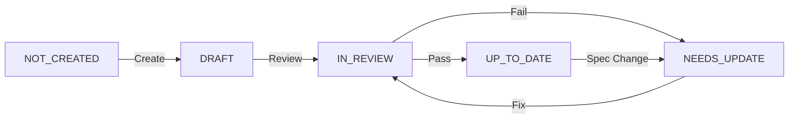

# Review-Update Workflow for Atlas Project

## 🔄 Overview

With significant changes to `readonly-spec/` and 887 existing diagrams, this document provides a comprehensive workflow for reviewing and updating existing diagrams while maintaining creation momentum.

## 📊 Current Situation

### Spec Changes That Require Updates
1. **Stream Plane Removal** - Changed from 5-plane to 4-plane architecture
2. **Visual-First Approach** - Reduced text, more diagrams
3. **Production Metrics** - Real numbers, not placeholders
4. **Failure Scenarios** - Required for all diagrams
5. **Cost Information** - Infrastructure economics mandatory

### Impact Analysis
- **887 diagrams** already created (98.6% of 900 target)
- **~300-400 diagrams** likely need updates based on spec changes
- **~100 diagrams** have Stream Plane references
- **~200 diagrams** need visual-first conversion

## 🚀 Dual-Track Execution Model

### Track 1: Review & Update (40% effort)
```bash
# Review existing diagrams against new specs
make status     # Check unified status
make review     # Run batch compliance review
```

### Track 2: New Creation (60% effort)
```bash
# Continue creating remaining diagrams
python scripts/manual_source_discovery.py
# Create new diagrams following latest specs
```

## 📋 Weekly Review-Update Workflow

### Monday: Status Assessment (2 hours)
```bash
# 1. Scan all diagrams and update tracking
python scripts/unified_status_tracker.py --scan

# 2. Generate unified dashboard
python scripts/unified_status_tracker.py --dashboard

# 3. Run compliance review for priority categories
python scripts/batch_diagram_reviewer.py --category systems --report

# 4. Identify this week's update targets
python scripts/batch_diagram_reviewer.py --report > weekly_review.txt
```

### Tuesday-Thursday: Updates & Creation (12-15 hours)

#### Morning: Review & Update Existing
```bash
# Review specific category
python scripts/batch_diagram_reviewer.py --category incidents --fix-suggestions

# Update individual files based on suggestions
# Edit files to address issues

# Mark as reviewed after updates (supports multiple path formats)
python scripts/unified_status_tracker.py --mark-reviewed docs/incidents/aws-s3-2017.md
# Also works with: incidents/aws-s3-2017.md, aws-s3-2017.md, incidents/aws-s3-2017

# Update status for tracking
python scripts/unified_status_tracker.py --update-status docs/incidents/aws-s3-2017.md --status up_to_date
# Status options: not_created | draft | needs_update | in_review | up_to_date | deprecated
```

#### Afternoon: Create New Diagrams
- Follow existing creation workflow
- Use latest specs and templates
- Ensure compliance from the start

### Friday: Validation & Tracking (4 hours)
```bash
# Validate all updated diagrams
python scripts/validate_mermaid.py

# Check compliance of updates
python scripts/batch_diagram_reviewer.py --pattern "**/*.md" --report

# Export status report for records
python scripts/unified_status_tracker.py --export status_report.json

# Generate progress report
python scripts/progress_tracker.py
```

## 🎯 Priority Matrix for Updates

### 🔴 HIGH Priority (Update Immediately)
| Issue | Detection | Fix |
|-------|-----------|-----|
| Stream Plane References | Contains "Stream Plane" or "StreamPlane" | Remove Stream Plane, use 4-plane only |
| No Mermaid Diagrams | File has 0 diagrams | Add production diagrams |
| Placeholder Data | Contains "XXX", "TODO", "REPLACE" | Add real metrics with sources |

### 🟡 MEDIUM Priority (Update This Sprint)
| Issue | Detection | Fix |
|-------|-----------|-----|
| Excessive Text | >10 lines between diagrams | Reduce to 3-4 context lines |
| Code Blocks | Contains ```python, ```java, etc. | Convert to tables |
| Missing SLO Labels | No p50, p99 on edges | Add latency budgets |
| Generic Terms | "Database", "Cache", "Queue" | Specify technologies |

### 🟢 LOW Priority (Update When Touched)
| Issue | Detection | Fix |
|-------|-----------|-----|
| Missing Costs | No $ amounts or resource specs | Add infrastructure costs |
| Old Metrics | Data from before 2023 | Update to 2024 data |
| Color Inconsistency | Wrong hex colors for planes | Fix to standard colors |

## 🔍 Compliance Checking

### Automated Compliance Checks
```python
# Review criteria implemented in batch_diagram_reviewer.py:
1. visual_first         # Minimal text, maximum diagrams
2. four_plane          # No Stream Plane, correct colors
3. production_metrics  # Real data, not placeholders
4. failure_scenarios   # Recovery procedures included
5. cost_information    # Infrastructure economics
6. slo_labels         # Performance budgets on edges
7. specific_technologies # No generic terms
```

### Manual Review Checklist
- [ ] **3 AM Test**: Does this help during an incident?
- [ ] **New Hire Test**: Are all terms explained?
- [ ] **CFO Test**: Are costs and ROI clear?
- [ ] **Incident Test**: Are failure modes documented?

## 📈 Status Tracking

### Unified Status Dashboard Fields
```json
{
  "status": "up_to_date | needs_update | in_review | draft | not_created",
  "compliance_score": 0-100,
  "last_reviewed": "ISO timestamp",
  "issues": ["List of compliance issues"],
  "content_hash": "MD5 for change detection"
}
```

### Status Transitions


## 🛠️ Update Templates

### Template: Remove Stream Plane
```mermaid
%% BEFORE (5-plane)
graph TB
    EdgePlane[Edge Plane]
    ServicePlane[Service Plane]
    StreamPlane[Stream Plane]  %% DELETE THIS
    StatePlane[State Plane]
    ControlPlane[Control Plane]

%% AFTER (4-plane)
graph TB
    subgraph Edge["Edge Plane #0066CC"]
        CDN[CDN]
    end
    subgraph Service["Service Plane #00AA00"]
        API[API Gateway]
    end
    subgraph State["State Plane #FF8800"]
        DB[(Database)]
    end
    subgraph Control["Control Plane #CC0000"]
        Monitor[Monitoring]
    end
```

### Template: Visual-First Conversion
```markdown
<!-- BEFORE: Text-heavy -->
## System Architecture

The system uses a microservices architecture with multiple layers...
[200 lines of text]

<!-- AFTER: Visual-first -->
## System Architecture

```mermaid
graph TB
    %% Complete architecture diagram
```

| Component | Technology | Scale | Cost |
|-----------|------------|-------|------|
| API Gateway | Kong 3.4 | 10M RPS | $5K/mo |
| Database | PostgreSQL 15 | 50TB | $20K/mo |
```

## 📊 Progress Metrics

### Review KPIs
- **Compliance Rate**: % of diagrams scoring 80%+
- **Update Velocity**: Diagrams updated per week
- **Quality Score**: Average compliance score
- **Stream Plane Removal**: % complete

### Weekly Targets
- **Review**: 50-75 diagrams
- **Update**: 30-40 diagrams
- **Create New**: 10-15 diagrams
- **Total Progress**: 40-55 diagram improvements

## 🚨 Common Issues & Quick Fixes

### Issue: Stream Plane References
```bash
# Find all files with Stream Plane
grep -r "Stream Plane" docs/ --include="*.md"

# Batch fix suggestion
sed -i 's/Stream Plane/State Plane/g' file.md  # IF appropriate
# Manual review recommended for context
```

### Issue: Missing Production Metrics
```markdown
<!-- Add real metrics with sources -->
- **Scale**: 260M users (Netflix Q2 2024)
- **Throughput**: 10M RPS peak
- **Latency**: p50: 10ms, p99: 50ms
- **Cost**: $125M/month infrastructure
- **Source**: [Netflix Tech Blog 2024]
```

### Issue: Excessive Text
```markdown
<!-- Convert verbose descriptions to tables -->
| Aspect | Details |
|--------|---------|
| Pattern | CQRS |
| Scale | 100K events/sec |
| Storage | 50TB PostgreSQL |
```

## 🔄 Continuous Improvement

### Weekly Review Meeting Agenda
1. **Metrics Review** (10 min)
   - Compliance scores
   - Update progress
   - Quality trends

2. **Issue Patterns** (15 min)
   - Common problems found
   - Systemic fixes needed
   - Spec clarifications

3. **Process Improvements** (10 min)
   - Tool enhancements
   - Workflow optimizations
   - Team feedback

4. **Next Week Planning** (15 min)
   - Priority targets
   - Resource allocation
   - Milestone check

## 📝 Commands Reference

### Daily Commands
```bash
# Start your day
make status                    # See unified dashboard

# Review work
make review                    # Run batch compliance check

# Track updates (flexible path formats)
python scripts/unified_status_tracker.py --mark-reviewed docs/patterns/micro-patterns.md
# Works with: patterns/micro-patterns.md, micro-patterns.md, patterns/micro-patterns

# Validate changes
python scripts/validate_mermaid.py
```

### Weekly Commands
```bash
# Monday planning
python scripts/unified_status_tracker.py --scan
python scripts/batch_diagram_reviewer.py --report

# Friday wrap-up
python scripts/unified_status_tracker.py --export weekly_report.json
python scripts/progress_tracker.py
```

### Special Operations
```bash
# Review specific category
python scripts/batch_diagram_reviewer.py --category systems

# Get fix suggestions
python scripts/batch_diagram_reviewer.py --fix-suggestions

# Update diagram status
python scripts/unified_status_tracker.py --update-status <file> --status needs_update
```

## ✅ Success Criteria

### Short-term (This Sprint)
- [ ] All Stream Plane references removed
- [ ] 100% of HIGH priority issues addressed
- [ ] Average compliance score > 80%

### Medium-term (This Month)
- [ ] All diagrams reviewed at least once
- [ ] Visual-first conversion complete
- [ ] Production metrics added to all diagrams

### Long-term (Quarter)
- [ ] 100% compliance with latest specs
- [ ] Automated update detection
- [ ] Quarterly review cycle established

---

*Last Updated: Generated from current spec analysis*
*Review Cycle: Weekly for active updates, Monthly for stable content*