# Visual Execution Framework: The New Way

## Execution Metrics Dashboard


## Daily Execution Matrix

| Time | Task | Input | Output | Metrics | Validation |
|------|------|-------|--------|---------|------------|
| **9:00 AM** | Source Discovery | 5 blog posts | 15 metrics extracted | 3 metrics/post | ✅ Real numbers |
| **10:00 AM** | Diagram Creation | 15 metrics | 5 architecture diagrams | 1 diagram/20min | ✅ 4-plane colors |
| **11:00 AM** | Table Generation | System data | 3 comparison tables | 10 systems/table | ✅ Cost included |
| **12:00 PM** | Review & Validate | 5 diagrams | 5 validated diagrams | 100% pass rate | ✅ 3AM test |
| **2:00 PM** | Incident Analysis | 2 postmortems | 2 timeline diagrams | 30min/incident | ✅ Recovery steps |
| **3:00 PM** | Cost Analysis | Infra data | 1 cost breakdown | $100K+ systems | ✅ ROI calculated |
| **4:00 PM** | Failure Mapping | Architecture | 3 failure scenarios | 5min MTTR each | ✅ Blast radius |
| **5:00 PM** | Commit & Track | 15 artifacts | Git commit | 15 files/day | ✅ Quality gates |

## Source to Diagram Pipeline


## Weekly Sprint Structure

### Sprint Output Requirements

| Day | Diagrams | Tables | Incidents | Cost Analysis | Quality Score |
|-----|----------|--------|-----------|---------------|---------------|
| **Monday** | 15 architecture | 5 metrics | 2 timelines | 3 systems | 95%+ |
| **Tuesday** | 15 data flow | 5 comparison | 2 analyses | 3 systems | 95%+ |
| **Wednesday** | 15 failure mode | 5 capacity | 2 postmortems | 3 systems | 95%+ |
| **Thursday** | 15 scale evolution | 5 migration | 2 recoveries | 3 systems | 95%+ |
| **Friday** | 15 validation | 5 summary | 2 reviews | 3 systems | 100% |
| **TOTAL** | **75** | **25** | **10** | **15** | **97%** |

## Quality Gate Validation Matrix

```mermaid
graph TD
    subgraph Input["Document Input"]
        I[New Content]
    end

    subgraph Gates["Quality Gates"]
        G1{Visual > 80%?}
        G2{Metrics Present?}
        G3{4-Plane Colors?}
        G4{Real Example?}
        G5{3AM Test Pass?}
    end

    subgraph Output["Result"]
        Pass[✅ Commit]
        Fail[❌ Revise]
    end

    I --> G1
    G1 -->|Yes| G2
    G1 -->|No| Fail
    G2 -->|Yes| G3
    G2 -->|No| Fail
    G3 -->|Yes| G4
    G3 -->|No| Fail
    G4 -->|Yes| G5
    G4 -->|No| Fail
    G5 -->|Yes| Pass
    G5 -->|No| Fail

    style Pass fill:#90EE90
    style Fail fill:#FF6B6B
```



## Pattern Library for Rapid Creation

### Pattern 1: System Architecture
```yaml
Time: 20 minutes
Inputs: [scale_metrics, tech_stack, costs]
Output: 4-plane diagram + metrics table
Reusable: 100+ systems
```

### Pattern 2: Incident Timeline
```yaml
Time: 30 minutes
Inputs: [postmortem, timestamps, impact]
Output: Gantt chart + recovery table
Reusable: 50+ incidents
```

### Pattern 3: Cost Breakdown
```yaml
Time: 15 minutes
Inputs: [infrastructure_costs, user_count]
Output: Pie chart + optimization table
Reusable: 30+ companies
```

## Parallel Agent Task Distribution

| Agent | Focus | Daily Output | Weekly Total | Quality Target |
|-------|-------|--------------|--------------|----------------|
| **Agent 1** | Netflix, Uber, Amazon | 5 diagrams | 25 diagrams | 100% metrics |
| **Agent 2** | Google, Meta, Microsoft | 5 diagrams | 25 diagrams | 100% costs |
| **Agent 3** | Incidents & Failures | 3 timelines | 15 timelines | 100% recovery |
| **Agent 4** | Capacity & Performance | 10 tables | 50 tables | 100% formulas |
| **Agent 5** | Migration & Evolution | 5 guides | 25 guides | 100% examples |

## The 3-Hour Documentation Sprint


## Success Metrics

| Metric | Target | Current | Trend | Action |
|--------|--------|---------|-------|--------|
| **Diagrams/Day** | 15 | 12 | 📈 | Increase velocity |
| **Visual:Text Ratio** | 80:20 | 75:25 | 📈 | Reduce text |
| **Metrics Accuracy** | 100% | 98% | ➡️ | Verify sources |
| **3AM Test Pass** | 100% | 95% | 📈 | Add runbooks |
| **Cost Data Coverage** | 100% | 90% | 📈 | Get financials |
| **Real Examples** | 100% | 100% | ✅ | Maintain |

## Execution Commandments

### 1. Never Write, Always Show
```mermaid
graph LR
    Wrong[❌ "The system is highly scalable"]
    Right[✅ "Scales to 10M users at $0.03/user"]
```

### 2. Never Estimate, Always Measure
| ❌ Estimates | ✅ Measurements |
|--------------|-----------------|
| "About 100K RPS" | "97,432 RPS peak at 3:45 PM" |
| "Low latency" | "p50: 8ms, p99: 45ms" |
| "Expensive" | "$127,000/month" |

### 3. Never Theorize, Always Example
| ❌ Theory | ✅ Real Example |
|-----------|-----------------|
| "Circuit breakers prevent cascading failures" | "Netflix Hystrix opened after 50% errors, saved $2M" |
| "Caching improves performance" | "Redis reduced Uber's p99 from 200ms to 10ms" |

### 4. Never Generic, Always Specific
| ❌ Generic | ✅ Specific |
|------------|-------------|
| "Database" | "PostgreSQL 14 on db.r6g.16xlarge" |
| "Message Queue" | "Kafka 3.5, 30 brokers, 100K msg/sec" |
| "High Available" | "99.95% uptime, 26 min/year downtime" |

### 5. Never Features, Always Failures


## Daily Tracking Dashboard

| Date | Diagrams | Tables | Incidents | Quality | Status |
|------|----------|--------|-----------|---------|--------|
| Mon | 15 ✅ | 5 ✅ | 2 ✅ | 98% | 🟢 |
| Tue | 14 🟡 | 5 ✅ | 2 ✅ | 95% | 🟡 |
| Wed | 16 ✅ | 6 ✅ | 3 ✅ | 100% | 🟢 |
| Thu | 15 ✅ | 5 ✅ | 2 ✅ | 97% | 🟢 |
| Fri | 15 ✅ | 5 ✅ | 2 ✅ | 100% | 🟢 |
| **Total** | **75** | **26** | **11** | **98%** | **🟢** |

## Resource Allocation


## The Future State

By following this framework:
- **Week 1**: 75 diagrams, 25 tables, 10 incidents
- **Week 2**: 150 diagrams, 50 tables, 20 incidents
- **Week 4**: 300 diagrams, 100 tables, 40 incidents
- **Week 8**: 600 diagrams, 200 tables, 80 incidents
- **Week 12**: 900+ diagrams, 300+ tables, 120+ incidents

---

*"Execute visually. Deliver metrics. Solve problems."*

**Visual Execution Framework - No More Walls of Text**